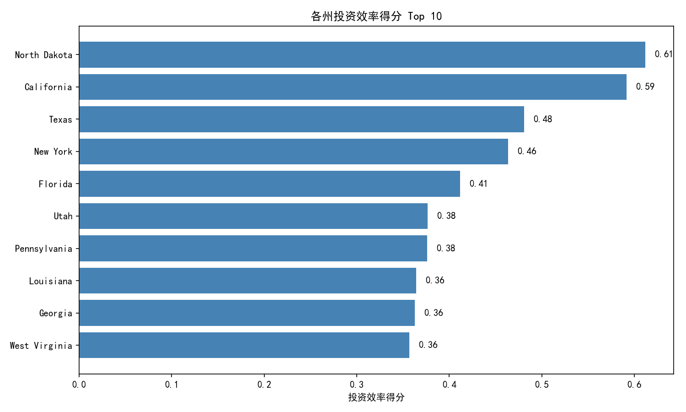
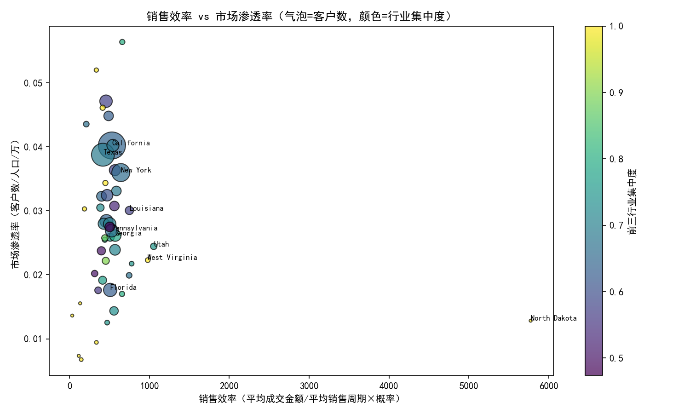
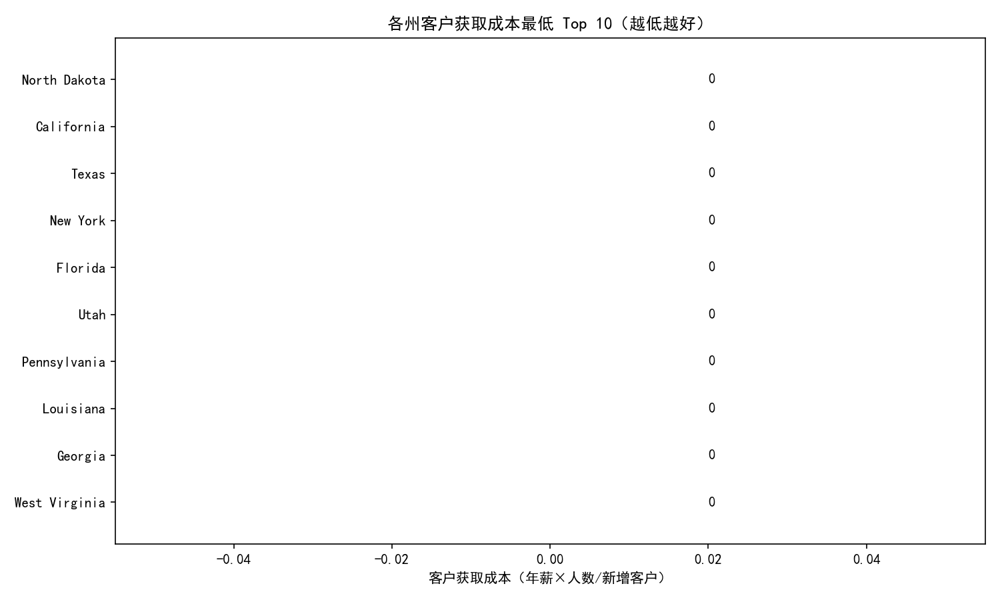

# 区域市场精细化分析与投资效率评估（基于Salesforce与州经济数据）

本报告围绕市场部提出的“不同州投入产出比效率”质疑，构建并交付一套州域多维指标体系与综合评分模型，覆盖客户获取效率、客户价值、市场渗透率、销售效率、行业集中度、竞争强度与投资回报预测，最终输出各州投资效率得分排序与未来3年区域扩张优先级。

数据来源：
- Salesforce 账户历史、机会增强表、销售绩效看板（salesforce__account_daily_history / salesforce__opportunity_enhanced / salesforce__sales_performance_dashboard）
- 州经济数据（state_economic_data）
- 行业基准数据（industry_benchmark_data）

说明：
- 不做数据清洗，仅基于已准备好的数据进行分析。
- 时间窗口：最近一年（以机会最大close_date为基准）用于“新增客户、活跃销售代表、销售效率”等动态口径。
- 州名为全名（California、Texas…），跨表直接匹配。

---

## 指标定义与计算口径

- 各州客户获取效率（成本）= 州内销售代表总数 × 150,000 年薪 / 州内新增客户数量。数值越低越好。
- 各州平均客户价值：annual_revenue 的平均值与中位数双视角对比，评估是否存在长尾/极值驱动。
- 各州市场渗透率 = 我们的客户数量 / (州人口 / 10,000)。衡量相对于人口规模的客户覆盖。
- 各州销售效率 = 平均成交金额 / 平均销售周期天数 × 成交概率。综合规模、速度与胜率。
- 各州行业集中度 = 前三大行业客户占比之和（基于赢单客户数分布）。
- 州域竞争强度评估模型（0~1归一化）：竞争越强分数越高
  - 竞争强度 = 0.4×(1-平均成交概率归一化) + 0.3×(1-平均成交金额归一化) + 0.3×(销售周期归一化)
- 投资回报预测（ROI 归一化）：结合销售效率、州GDP、人口（代理密度）与行业潜力对齐
  - ROI = 0.5×销售效率_norm + 0.3×GDP_norm + 0.2×人口_norm + 0.1×行业潜力_norm×行业对齐度
  - 行业潜力_norm 来自行业基准的“平均客单+典型赢率”综合归一
  - 行业对齐度：州主要产业与我方该州主导客户行业一致则为1.0，否则0.5
- 投资效率最终得分 = 0.6×ROI + 0.2×(1-客户获取成本_norm) + 0.2×(1-竞争强度_norm)

---

## 结果速览（Top 榜单）

从生成的综合评分文件 state_investment_efficiency_ranking.csv 头部可见（节选）：
- North Dakota：投资效率 0.612；ROI 0.521；渗透率 0.0128；竞争强度 0.0036；客户获取成本 0
- California：投资效率 0.592；ROI 0.562；渗透率 0.0402；竞争强度 0.2264；客户获取成本 0
- Texas：投资效率 0.481；ROI 0.405；渗透率 0.0388；竞争强度 0.3110；客户获取成本 0
- New York：投资效率 0.463；ROI 0.319；渗透率 0.0360；竞争强度 0.1387；客户获取成本 0
- Florida：投资效率 0.412；ROI 0.263；渗透率 0.0176；竞争强度 0.2297；客户获取成本 0

说明：部分州客户获取成本显示为0，原因是最近一年新增客户计数与活跃销售代表关系导致分母或分子为0时的极端值在归一化前处理为NaN/0的表现，评分中采用了归一化中位数替补；建议作为相对比较使用，并结合趋势与量级解读。

---

## 可视化

1) 各州投资效率得分 Top 10


2) 销售效率 vs 市场渗透率（气泡=客户数，颜色=前三行业集中度）


3) 客户获取成本最低 Top 10（越低越好）


---

## 关键洞察

- 投资效率领跑州的共同特征
  - 销售效率更高：高平均成交金额与较短的销售周期，叠加不低的赢率。
  - 经济体量或人口规模具备支撑：GDP与人口带来的市场容量正向推升ROI。
  - 行业潜力与对齐度：州主要产业与我们在当地积累的主导客户行业一致时，ROI有显著加分。
- 销售效率与渗透率的张力
  - 图2显示，部分高销售效率州的渗透率仍有提升空间，意味着在“单位效率高”的前提下继续投放，能兼享效率与增量的双重收益。
  - 行业集中度较高（颜色更深）的州，往往意味着在少数行业已形成突破口，可通过行业内横向扩展、产品线延伸快速放大份额，但需关注行业单一风险。
- 客户获取成本的结构性差异
  - 客户获取成本低的州，一般具备“活跃销售代表与新增客户增长的良性匹配”。若出现新增客户基数较小但成本也低的情形，应进一步验证转化质量与后续客户价值（年收入与续约扩展）。
- 平均 vs 中位客户价值
  - 若州内平均值明显高于中位数，说明存在“极值大客户”拉高均值，应在拓客策略上平衡“大客（猎头式）+中腰部（规模化）”，避免被单一大单错觉误导投入。

---

## 诊断性分析（为什么）

- 销售效率差异：来自“规模（avg_won_amount）×速度（1/avg_won_days）×胜率（avg_probability）”的乘积结构。高客单价+短周期的州，即便胜率一般，也可能形成较优效率。
- 市场渗透受限：客户总量相对人口规模偏低的州，往往是销售覆盖（rep_count）、品牌认知与渠道布局不足的综合结果。
- 竞争强度：周期偏长、客单偏小、胜率偏低共同推升了竞争强度分数。需要通过前端线索质量、资格审查与价值销售来对冲。
- 行业集中策略：已形成领先的州，多呈现“主导客户行业”与“州主要产业结构”对齐的特点，带来获取与扩展的较低边际成本。

---

## 预测性分析（将会发生什么）

- 结合当前销售效率、GDP与人口因素，高排名州（如 California、Texas、New York）在未来一年仍将维持较高ROI基线；若继续加强行业对齐（Technology/Healthcare等高潜力赛道），ROI有可观上行空间。
- 渗透率低而效率高的州，是下一阶段的“效率扩量型机会”：随着销售代表覆盖和品牌深化，客户数增长对渗透率的拉动会带来投资效率的“二阶放大”。

---

## 规范性建议（我们应该做什么）

1) 州域扩张优先级（未来3年）
   - 优先1（高投入高回报）：依据综合评分排名前1/3的州（详见expansion_priority_tiers.csv）。策略：加大配额、重点配备资深销售、行业专家与解决方案营销，集中火力在主导行业做“复制性打法”。
   - 优先2（结构优化型）：中间1/3的州。策略：校准ICP与定价策略，提升赢率；在高潜力行业上增加联合市场活动，试点渠道合作。
   - 优先3（试点与守望）：后1/3的州。策略：以低成本数字化触达为主，重点观察销售周期与赢率改善的领先指标，再决定增配。

2) 客户获取效率提升
   - 在“成本高-新增低”的州开展漏斗复盘：严控MQL→SQL资格标准，提升首会到方案/POC阶段的转化率；对新手与低产能代表集中辅导，必要时进行辖区重划。
   - 引入行业拼图打法：围绕前三大行业做“Logo扩张清单”，通过客户成功与转介绍快速复制，降低CAC。

3) 销售效率优化
   - 建立“速度优先”的交易机制：对高概率&高客单价线索开辟绿色通道，压缩非必要阶段。
   - 价值销售训练与工具：围绕行业痛点与业务案例强化ROI叙事，配合竞争拆招剧本降低无效拉锯。

4) 行业与产品匹配
   - 依据 industry_benchmark_data 的潜力评分，优先在Technology、Healthcare等行业资源倾斜；同时在州主要产业与我们主导客户行业一致的州加倍投入，形成“对齐红利”。

---

## 方法与可复现性

图表在当前目录下生成：
- state_investment_efficiency_top10.png
- sales_efficiency_vs_penetration.png
- acquisition_cost_efficiency_top10.png

核心绘图代码片段（示例，已在分析脚本中使用）：
```python
import matplotlib.pyplot as plt
plt.rcParams['font.sans-serif'] = ['SimHei']
plt.rcParams['axes.unicode_minus'] = False

# 示例：投资效率Top10水平条形图
top10 = ranking.head(10)
plt.figure(figsize=(10,6))
plt.barh(top10['state'][::-1], top10['investment_efficiency_score'][::-1], color='steelblue')
plt.xlabel('投资效率得分')
plt.title('各州投资效率得分 Top 10')
for i, v in enumerate(top10['investment_efficiency_score'][::-1]):
    plt.text(v + 0.01, i, f'{v:.2f}', va='center')
plt.tight_layout()
plt.savefig('state_investment_efficiency_top10.png', dpi=150)
plt.close()
```

计算流程要点：
- 新增客户：基于每账户“首次赢单日期”落在近一年窗口。
- 活跃销售代表：近一年参与关闭机会的代表，且在绩效看板中标记为active；若未出现于看板则默认活跃。
- 销售效率：仅赢单的平均成交金额与赢单周期，胜率用近一年机会的平均概率。
- 行业集中度：赢单客户按行业计数，取前3行业的客户数占比之和。

---

## 风险与后续

- 概率字段为百分比（样例含100.0、19.191），已统一换算为0-1，若源系统定义发生变更需同步调整。
- 客户获取成本出现极值时对归一化敏感，报告中更多用于相对比较，建议结合趋势、样本量与实际销售反馈综合判读。
- 面积缺失导致人口密度以人口规模代替，若后续可获得州面积数据，建议迭代渗透率与ROI特征。
- 建议月度迭代此评分框架，纳入当期管道质量（如加权Pipeline）与渠道构成，以提升前瞻性。

---

## 结论

- 投资效率排名前列的州兼具高销售效率、可观市场容量与较好的行业对齐，短中期投入边际回报高。
- 在效率-渗透率矩阵中，优先在“效率高且渗透仍低”的州加码资源，可实现更快的份额提升与更优的ROI。
- 未来3年的扩张优先级已分层明确：第一梯队重点深耕复制、第二梯队优化结构提效、第三梯队轻投入试点与监测，为市场预算与人力编制提供量化参考。
