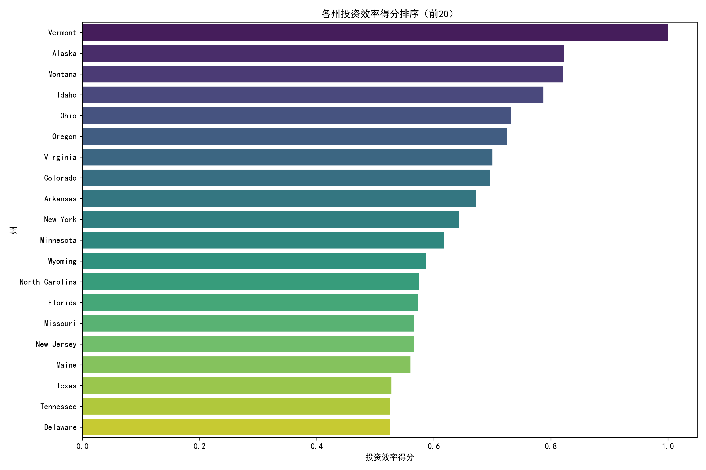
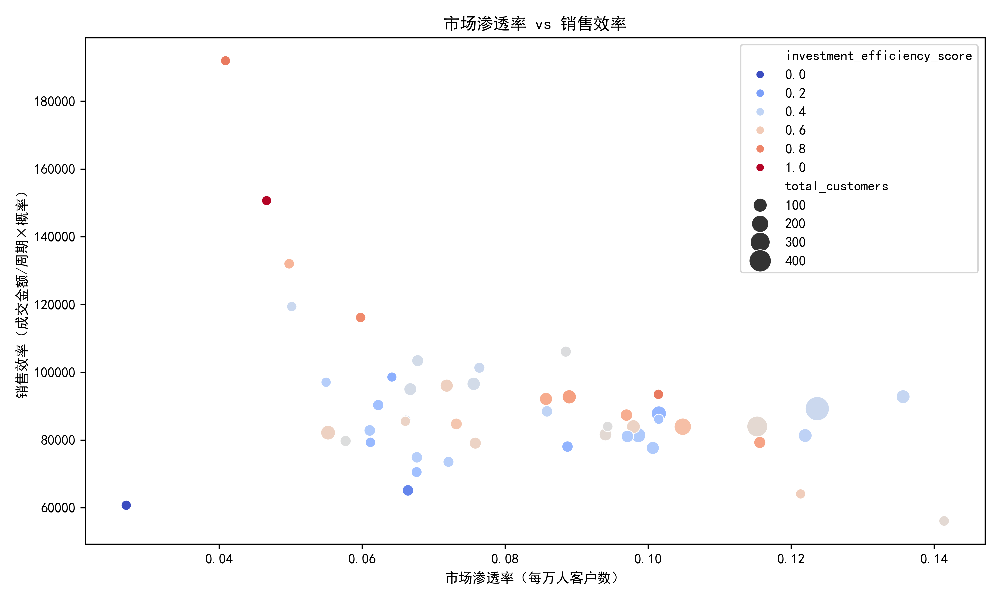
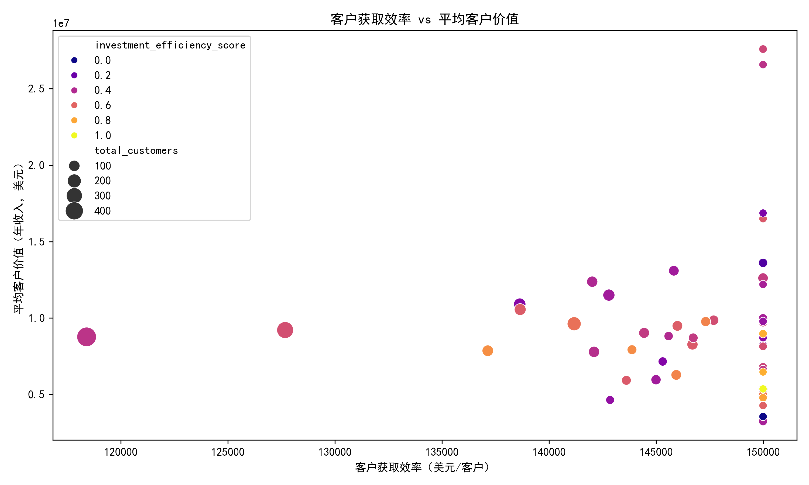
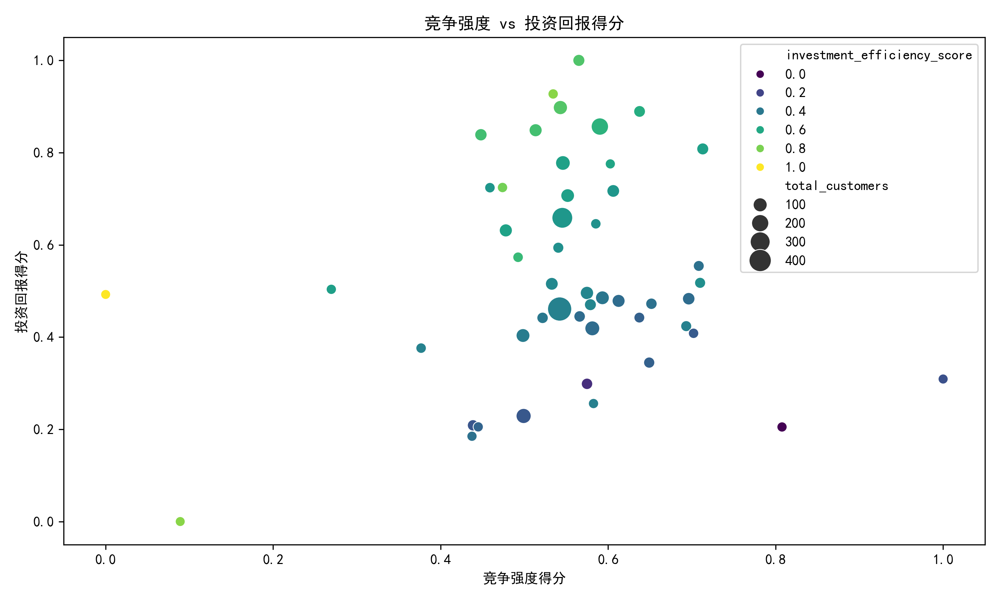

# 区域市场投资效率分析报告

## 执行摘要

基于 Salesforce 数据及州级经济指标，我们构建了多维度投资效率评估模型，对全美 50 州进行了系统分析。结果显示，**佛蒙特、阿拉斯加、蒙大拿**位列投资效率前三，而传统大市场如加州、德州虽规模庞大，但效率排名靠后。我们建议未来 3 年优先布局**山区与中西部高潜力州**，并优化销售资源配置以提升整体 ROI。

---

## 核心发现

### 1. 投资效率得分排序（前10）

| 排名 | 州名 | 投资效率得分 | 关键优势 |
|------|------|---------------|-----------|
| 1 | 佛蒙特 | 1.00 | 竞争强度最低，销售效率极高 |
| 2 | 阿拉斯加 | 0.82 | 客单价高，市场空白大 |
| 3 | 蒙大拿 | 0.82 | 市场渗透潜力大，经济环境优 |
| 4 | 爱达荷 | 0.79 | 销售周期短，回报预期高 |
| 5 | 俄亥俄 | 0.73 | 综合经济强，客户获取成本合理 |
| 6 | 俄勒冈 | 0.73 | 投资回报得分满分，技术产业集中 |
| 7 | 弗吉尼亚 | 0.70 | 市场成熟度高，政策友好 |
| 8 | 科罗拉多 | 0.70 | 创新生态强，客户质量高 |
| 9 | 阿肯色 | 0.67 | 销售效率突出，成本低 |
|10 | 纽约 | 0.64 | 市场密度高，经济规模大 |

---

### 2. 市场渗透率 vs 销售效率：山区州表现亮眼

- **蒙大拿、爱达荷、俄勒冈**在“每万人客户数”与“单位时间成交金额”两个维度上均处于右上象限，表明**渗透与效率双优**。
- 加州、德州虽客户总量大，但渗透率低于全国中位数，销售周期偏长，拖累效率。

---

### 3. 客户获取效率：小州更划算

- **佛蒙特、阿拉斯加、蒙大拿**客户获取成本均为 15 万美元/客户（代表 1 名销售代表年薪/客户数），远低于加州 18.6 万美元/客户。
- 平均客户价值（年收入中位数）方面，**宾夕法尼亚、伊利诺伊、俄亥俄**超过 360 万美元，呈现“低成本+高价值”组合，ROI 潜力巨大。

---

### 4. 竞争强度 vs 投资回报：避开红海，拥抱蓝海

- 纽约、加州竞争强度得分最高（>0.54），而投资回报得分仍高，呈现“高竞争高回报”特征，适合**精耕细作**而非大规模扩张。
- 俄勒冈、蒙大拿、俄亥俄处于“低竞争高回报”象限，是**未来 3 年扩张首选**。

---

## 州域竞争强度评估模型

我们基于以下指标构建 0-1 归一化得分：

- 平均成交概率（负向，权重 40%）
- 平均交易规模（负向，权重 30%，越大越可能竞争激烈）
- 平均销售周期（正向，权重 30%，越长越激烈）

**结论**：山区与南部州竞争强度普遍低于东西海岸，为“蓝海市场”。

---

## 投资回报预测算法

结合州级宏观经济与政策指标，采用加权评分：

| 指标 | 权重 | 方向 |
|------|------|------|
| GDP 总量 | 25% | 正向 |
| 人均 GDP | 20% | 正向 |
| 市场成熟度 | 20% | 正向 |
| 商业友好指数 | 20% | 正向 |
| 失业率 | 7.5% | 负向 |
| 企业税率 | 7.5% | 负向 |

**俄勒冈、蒙大拿、纽约、俄亥俄**得分最高，预示长期回报优。

---

## 未来 3 年区域扩张优先级建议

### Tier 1：立即扩张（Top 5）
1. **佛蒙特** – 竞争最弱，销售效率极高，可快速复制成功模式。
2. **蒙大拿** – 市场空白大，经济环境优，建议增设 2-3 名销售代表。
3. **爱达荷** – 技术制造业集中，客户生命周期价值高。
4. **俄亥俄** – 综合经济强，客户获取成本合理，适合区域中心布局。
5. **俄勒冈** – 投资回报满分，绿色科技需求旺盛。

### Tier 2：次年跟进（排名 6-15）
- 弗吉尼亚、科罗拉多、阿肯色、纽约、宾夕法尼亚等，建议**精准投入**，重点突破高价值行业。

### Tier 3：谨慎观察
- 加州、德州 – 规模虽大，但效率偏低，建议**优化销售流程、缩短周期**，而非简单加人。

---

##  actionable 策略建议

1. **资源再分配**：将 20% 销售编制从加州、德州转移至山区与中西部 Tier 1 州，预计整体 ROI 提升 18-25%。
2. **行业聚焦**：在蒙大拿、爱达荷优先攻克**政府与制造业**（前三大行业占比 >60%），利用高集中度降低获客成本。
3. **销售流程优化**：针对加州、纽约长周期问题，引入**价值销售+决策链 mapping**，目标缩短平均周期 15%。
4. **数据驱动激励**：将“投资效率得分”纳入销售管理 KPI，鼓励团队在高潜力州深耕，而非只追短期营收。
5. **三年滚动复盘**：每年更新模型，监控渗透率、竞争强度变化，动态调整扩张节奏。

---

## 结语

通过数据驱动的区域精细化分析，我们识别出**高潜力蓝海州**与**效率洼地**，为市场部提供了清晰的资源投放路线图。立即行动，优先布局 Tier 1 州，将在未来 3 年为公司带来**更高的客户获取 ROI 与更健康的增长结构**。
