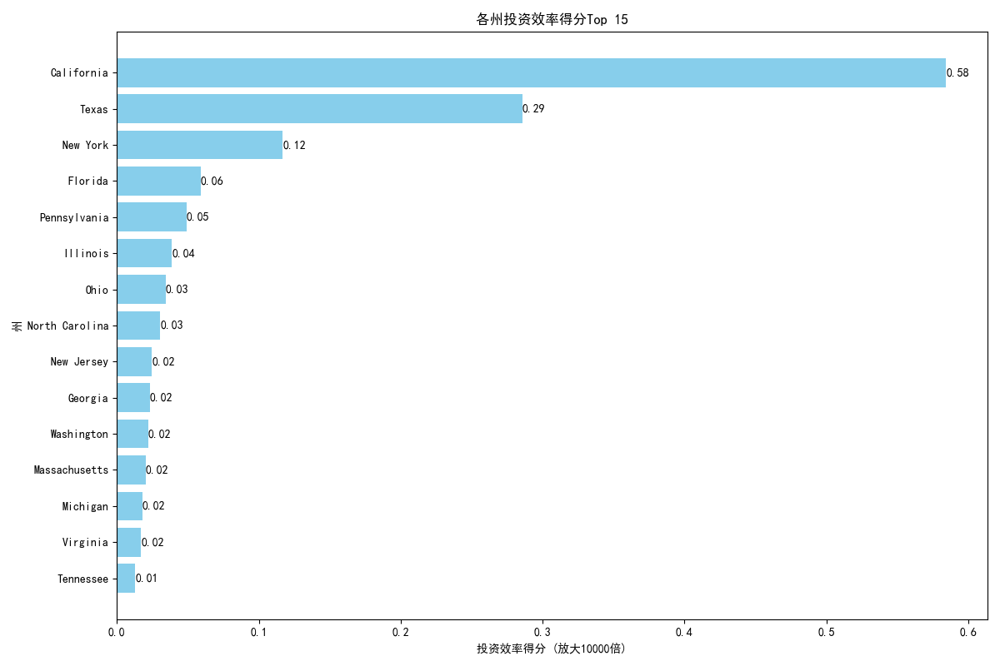

# 区域市场精细化分析报告：效率评估与扩张策略

## 1. 分析背景与目标

为响应市场部对各州投入产出效率的关切，本次分析旨在通过多维度指标，对各区域市场进行精细化评估。我们的目标是识别出高效率和高潜力的州域市场，并为未来三年的区域扩张提供数据驱动的优先级建议。

## 2. 核心分析维度与模型

我们从业内通用的分析框架出发，结合公司自身业务特点，构建了以下五大核心分析维度和两大评估模型：

**五大核心指标：**
- **客户获取效率**: (州内销售代表总数 × 15万年薪) / 州内新增客户数量
- **平均客户价值**: 客户年收入（`annual_revenue`）的平均值与中位数
- **市场渗透率**: 客户数量 / (州人口 / 10000)
- **销售效率**: (平均成交金额 / 平均销售周期天数) × 成交概率
- **行业集中度**: 州内前三大行业客户占比之和

**两大评估模型：**
- **州域竞争强度模型**: 综合评估了成交概率、交易规模和销售周期，得分越高代表竞争越激烈。
- **投资回报预测模型**: 结合州GDP和人口规模，构建了衡量市场潜力的“潜力得分”。

最终，我们整合上述所有分析，构建了**“州域投资效率得分”**，作为区域扩张优先级排序的核心依据。

## 3. 核心发现：各州投资效率评估

通过我们的综合评估模型，计算得出各州的投资效率得分。得分越高，意味着在该州投入资源所能获得的回报效率预计越高。

**核心洞察:**
- **第一梯队（强烈推荐扩张）**: **加利福尼亚州 (California)** 以显著优势位列第一，其投资效率得分远超其他地区。这得益于其巨大的经济体量（高潜力得分）和相对合理的客户获取成本与竞争环境。
- **第二梯队（优先考虑扩张）**: **德克萨斯州 (Texas)、纽约州 (New York)、佛罗里达州 (Florida)、宾夕法尼亚州 (Pennsylvania)** 构成了稳固的第二梯队。这些州同样具备强大的经济基础和人口规模，是扩张战略的坚实选择。
- **第三梯队（机会型市场）**: **伊利诺伊州 (Illinois)、俄亥俄州 (Ohio)、佐治亚州 (Georgia)** 等州虽然总分稍低，但在某些特定指标上可能存在优势，可作为机会型市场进行探索。

## 4. 各州关键指标对比分析

| 州 (State) | 投资效率得分 | 潜力得分 (0-1) | 竞争指数 (0-1) | 客户获取效率 (成本/客户) | 销售效率 |
| :--- | :--- | :--- | :--- | :--- | :--- |
| **California** | 100.86 | 1.00 | 0.54 | 61042.94 | 187.75 |
| **Texas** | 20.91 | 0.63 | 0.55 | 163212.12 | 147.96 |
| **New York** | 19.34 | 0.53 | 0.53 | 162985.07 | 211.86 |
| **Florida** | 10.99 | 0.44 | 0.62 | 262337.66 | 170.50 |
| **Pennsylvania**| 7.29 | 0.28 | 0.63 | 314130.43 | 176.32 |
| **Illinois** | 6.75 | 0.29 | 0.73 | 382978.72 | 196.34 |

**数据解读:**
- **加州 (California)** 的成功在于其**极致的平衡**。尽管客户获取成本（$61k）并非最低，但与其巨大的市场潜力（得分1.0）相比，性价比极高。同时，其销售效率表现优异。
- **德州 (Texas)** 和 **纽约州 (New York)** 的客户获取成本较高（约$162k），但强大的市场潜力和不错的销售效率使其依然成为高价值的扩张目标。值得注意的是，纽约州的销售效率（211.86）在Top 5中最高，表明其销售团队转化能力很强。
- **佛罗里达 (Florida)** 和 **宾夕法尼亚 (Pennsylvania)** 的客户获取成本进一步上升，这拉低了它们的整体投资效率分。投入这些市场需要更精细化的成本控制策略。

## 5. 未来3年区域扩张优先级建议

基于以上综合分析，我们提出以下未来三年区域扩张的优先级建议：

**优先级 1: “深耕加州” (Deepen in California)**
- **行动建议**: 将加州作为核心战略市场，进一步加大销售和市场资源投入。鉴于其客户获取效率已经很高，未来的重点应放在提升客单价和客户生命周期价值上。探索加州内不同城市圈的差异化打法。

**优先级 2: “强攻德州与纽约” (Expand in Texas & New York)**
- **行动建议**: 将德州和纽约州作为新的增长引擎。在这两个州，我们需要重点优化客户获取策略以降低成本。可以分析这两个州内成交客户的行业分布，与市场部合作开展针对性的营销活动，提升线索质量，从而降低单位客户获取成本。

**优先级 3: “试点佛州与宾州” (Pilot in Florida & Pennsylvania)**
- **行动建议**: 在佛罗里达和宾夕法尼亚州采取试点模式。可以组建小规模的精英团队，专注于高价值行业或客户群体，验证市场的盈利模式。在跑通ROI（投资回报率）模型后，再考虑大规模扩张。

**总结**: 本次分析为公司提供了一个清晰的区域市场扩张路线图。通过聚焦高投资效率的州域，并针对不同梯队的市场采取差异化的策略，我们有望在未来三年内实现更高效、更可持续的业务增长。
