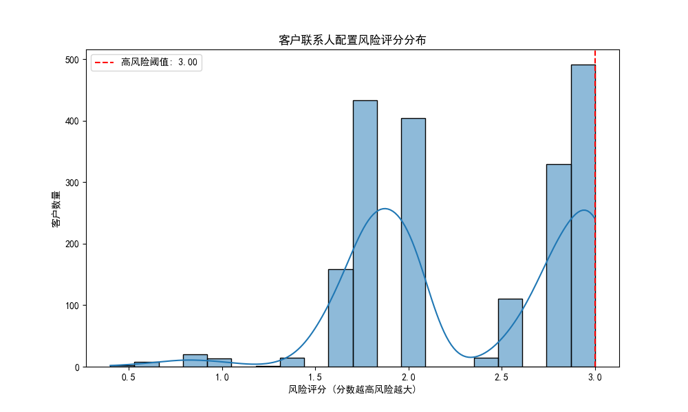

# 重要客户联系人配置风险分析与优化方案报告

## 1. 项目背景与目标

为了深化与年收入前20%重要客户的合作关系，降低因关键联系人流失或覆盖不足带来的业务风险，我们启动了本次客户联系人配置风险监控项目。

**核心目标：**
- **识别风险**：基于数据分析，识别出联系人配置存在高风险的重要客户。
- **量化评估**：通过建立“联系人密度”、“决策层占比”和“部门覆盖完整性”三大核心指标，对客户的联系人配置健康度进行量化评估。
- **制定方案**：为识别出的高风险客户设计一套包含优先级排序和具体拓展建议的优化行动方案。

---

## 2. 分析方法与风险评估模型

我们首先筛选出年收入排名前20%的2000家重要客户，并围绕以下三大指标构建了风险评估模型：

1.  **联系人密度比 (Contact Density Ratio)**：
    - **公式**： (联系人总数 / 客户员工总数) * 1000
    - **基准**：≥ 5。低于此值表明联系人覆盖面可能不足，尤其在大型企业中，易导致信息传递受阻。

2.  **决策层占比 (Decision Maker Ratio)**：
    - **公式**： (C级/VP级联系人数量 / 联系人总数)
    - **基准**：≥ 15%。低于此值意味着我们与客户高层决策者的链接薄弱，影响战略合作的推进。

3.  **部门覆盖完整性 (Department Coverage Score)**：
    - **评估**：检查是否覆盖“销售、财务、运营、IT、HR”五个关键部门。每覆盖一个计1分，满分5分。
    - **目标**：分数越高，表明我们对客户内部业务流程的渗透越深，合作关系越稳固。

基于以上指标，我们构建了一个**综合风险评分模型**：
- **联系人密度低于基准**，风险分+1。
- **决策层占比低于基准**，风险分+1。
- **部门覆盖不全**，风险分根据缺失部门的比例增加（最高+1）。

**风险评分越高，代表该客户的联系人配置风险越大。**

---

## 3. 核心发现与洞察

### 3.1. 客户风险评分整体分布

我们对2000家重要客户进行了风险评估，得分分布情况如下图所示。大部分客户的风险评分集中在1.0至3.0之间。我们定义风险评分排名前20%（即得分高于2.8）的客户为**高风险客户**，共识别出**491家**。

**洞察**：风险评分的正态分布表明，多数客户在联系人配置上存在一到两个短板。而高风险客户通常在多个维度上同时表现不佳，需要立即关注。

### 3.2. 高风险客户的行业分布

通过对491家高风险客户的行业进行分析，我们发现风险并非均匀分布在所有行业中。

**洞察与建议**：
- **零售 (Retail)、制造业 (Manufacturing)、技术 (Technology) 和金融 (Financial Services)** 是高风险客户最为集中的行业。
- **建议**：针对这些特定行业，应制定专项的联系人拓展计划。例如，对于技术行业客户，IT和研发部门的决策者至关重要；对于制造业客户，运营和供应链部门的联系人则更具价值。这种差异化的策略能使我们的资源投入更具效率。

---

## 4. 客户联系人优化行动方案

我们为识别出的491家高风险客户制定了详细的优化行动方案，并根据**风险评分**（优先处理风险最高的）和**年收入**（优先处理价值最大的）进行了优先级排序。

### 4.1. 行动方案优先级示例

以下是根据“风险评分”和“年收入”排序后的前五位高风险客户及其行动建议：

| 客户名称                 | 风险评分 | 年收入（排序依据）     | 优化行动建议                                                                                                         |
| ------------------------ | -------- | ---------------------- | -------------------------------------------------------------------------------------------------------------------- |
| Shaw Inc                 | 3.0      | 99,997,872.0           | **联系人密度低**: 增加联系人数量。 **决策层占比较低**: 拓展C级/VP级联系人。 **部门覆盖不全**: 拓展销售、财务、运营、IT、HR等部门的联系人。 |
| Gonzalez Inc             | 3.0      | 99,949,355.0           | **联系人密度低**: 增加联系人数量。 **决策层占比较低**: 拓展C级/VP级联系人。 **部门覆盖不全**: 拓展销售、财务、运营、IT、HR等部门的联系人。 |
| George, Davis and Hill   | 3.0      | 99,948,088.0           | **联系人密度低**: 增加联系人数量。 **决策层占比较低**: 拓展C级/VP级联系人。 **部门覆盖不全**: 拓展销售、财务、运营、IT、HR等部门的联系人。 |
| Shaffer-Soto             | 3.0      | 99,926,993.0           | **联系人密度低**: 增加联系人数量。 **决策层占比较低**: 拓展C级/VP级联系人。 **部门覆盖不全**: 拓展销售、财务、运营、IT、HR等部门的联系人。 |
| Castillo Ltd             | 3.0      | 99,879,933.0           | **联系人密度低**: 增加联系人数量。 **决策层占比较低**: 拓展C级/VP级联系人。 **部门覆盖不全**: 拓展销售、财务、运营、IT、HR等部门的联系人。 |

*完整的行动方案已保存在 `customer_contact_optimization_plan.csv` 文件中，供销售和客户成功团队使用。*

### 4.2. 具体拓展建议

1.  **对于“联系人密度低”的客户**：
    - **行动**：利用市场活动、线上研讨会和内容营销等方式，吸引并获取更多中基层联系人信息。
    - **目标**：建立更广泛的信息网络，确保业务信息的有效传递。

2.  **对于“决策层占比较低”的客户**：
    - **行动**：由客户经理或高层管理者发起，通过现有联系人进行引荐，或围绕战略议题（如数字化转型、降本增效）发起高层拜访。
    - **目标**：建立与关键决策者的直接联系，推动战略合作。

3.  **对于“部门覆盖不全”的客户**：
    - **行动**：分析客户业务流程，识别缺失的关键部门（如运营、财务），并有针对性地拓展这些部门的联系人。
    - **目标**：实现对客户采购决策链的全面覆盖，降低单一部门联系人流失的风险。

---

## 5. 结论

本次分析成功识别了**491家**存在联系人配置高风险的重要客户，并揭示了风险在特定行业的集中趋势。通过制定的差异化、可执行的行动方案，销售和客户成功团队可以立即着手优化客户联系人布局，从而**降低客户流失风险、增强客户粘性，并为深挖业务机会奠定坚实基础**。

建议将此风险评估模型常规化，**每季度进行一次复盘**，持续监控重要客户的联系人配置健康度。
