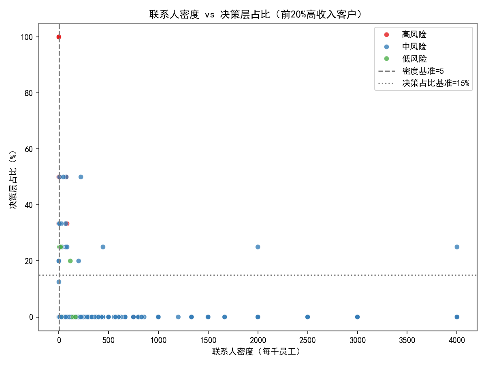
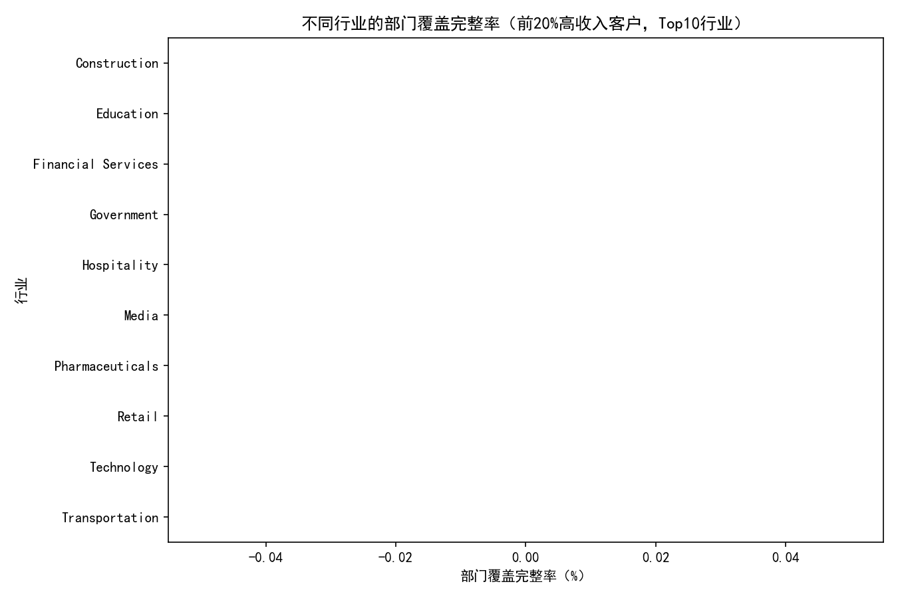

# 年收入前20%重要客户联系人配置风险监控分析报告

## 摘要
我们基于已准备的 Salesforce 客户360与联系人增强数据库，针对年收入前20%的重要客户构建联系人配置风险监控框架，重点分析三项核心指标：
- 联系人密度比（联系人数/员工数*1000，基准值≥5）
- 决策层占比（C级+VP级联系人比例，基准值≥15%）
- 部门覆盖完整性（销售、财务、运营、IT、HR五个关键部门）

关键结论（覆盖企业规模为 Enterprise 的前20%客户，共N=1408）：
- 年收入Top20%阈值：annual_revenue ≥ 79,621,808
- 基准失败率：联系人密度低于5的账户有418家（约29.7%）；决策层占比低于15%的账户有1263家（约89.7%）
- 部门覆盖：覆盖完整（5/5）的账户为0；平均覆盖仅约1.04个部门（中位数1）
- 风险分布：高风险637家（45.3%），中风险759家（54.0%），低风险12家（0.9%）
- 行业相对阈值（Q1或中位基准，反映行业内相对水平）：如教育行业相对密度阈值约5.62、酒店行业约4.41、技术约3.20、媒体约2.90；多数行业的相对决策层阈值为0，显示行业内普遍缺少高层联系人

这些证据表明：虽然在少数账户中存在高联系人密度的极端值（整体密度均值受其拉升，均值≈186.41；中位数≈14.56更具代表性），但绝大多数账户的“决策层触达”和“关键部门覆盖”存在显著不足，是成交率、扩售与续约的结构性风险源。

## 数据与方法
- 数据来源
  - salesforce__customer_360_view：包含账户收入、员工数、行业、规模段、阶段、销售结果等
  - salesforce__contact_enhanced：包含联系人部门、职级标题、所属账户等
- 样本选择
  - 采用年收入排序的分位选择：阈值为第80百分位对应的收入值（annual_revenue ≥ 79,621,808）作为Top20%客户
- 指标定义
  - 联系人密度比 = 联系人数/员工数*1000（基准≥5）
  - 决策层占比 = C级+VP级联系人比例（基准≥15%；通过联系人title中包含CEO/COO/CFO/CTO/CIO/Chief/President/VP/EVP/SVP等词识别）
  - 部门覆盖完整性 = 是否覆盖销售、财务、运营、IT、HR五个关键部门；并记录缺失部门列表
- 风险评分与优先级
  - 风险点构成：密度低于基准、决策占比低于基准、覆盖缺口（5-覆盖数）、行业/规模相对阈值（Q1）劣于同行等维度叠加
  - 优先级分：priority_score = risk_points × rev_rank_weight（收入越高权重越大，1.0→2.0线性）
  - 输出文件：top20_risk_accounts.csv（完整明细与评分）、top_risks_top15.csv（优先处理前15家）、summary.json（汇总）

绘图时使用如下代码设置中文字体：
```python
plt.rcParams['font.sans-serif'] = ['SimHei']
plt.rcParams['axes.unicode_minus'] = False
```

## 可视化与结果
- 联系人密度 vs 决策层占比（Top20%客户）
  - 图中虚线/点线分别为密度基准=5与决策占比基准=15%
  - 绝大多数点位处于低决策占比区域（靠近或低于0%），揭示高层联系人匮乏的普遍性
  - 图片：

- 不同规模段的联系人密度分布
  - 本数据的Top20%客户主要为Enterprise段，密度分布中位数约14.56，仍有29.7%低于基准
  - 图片：

- 行业维度的部门覆盖完整率（Top10行业）
  - 前20%客户几乎没有达到5/5完整覆盖，行业间存在差异，但整体覆盖表现偏弱
  - 图片：

## 诊断性分析：问题的原因
- 高层联系人缺失（决策层占比中位数为0%）
  - 可能原因：联系人title未标准化、获客主要集中在执行层/采购层、未建立高层关系通道
- 部门覆盖薄弱（覆盖平均≈1.04个部门）
  - 可能原因：销售动作聚焦单一部门（如IT或运营），缺少跨部门价值主张与联合推进路径
- 密度差异与企业规模效应
  - 大型企业员工基数大，若联系人拓展未同步增长，密度比易被拉低
  - 少量账户存在高密度极值，拉升均值但不改变多数账户低密度的事实（以中位数为更稳健代表）

## 差异化评估标准（行业特征×客户规模）
在维持统一基准（密度≥5、决策层占比≥15%、部门覆盖=5）作为红线的同时，引入行业/规模的相对阈值，用于识别“相对落后于同行”的客户：
- 统一红线（所有行业、Enterprise规模适用）
  - 密度≥5/千人
  - 决策层占比≥15%
  - 部门覆盖=5/5（Sales/Finance/Operations/IT/HR）
- 行业相对阈值（示例：以行业内Q1/中位基准识别相对滞后；用于补充红线之外的排序调优）
  - 教育：密度相对阈值≈5.62
  - 酒店：≈4.41
  - 技术：≈3.20
  - 媒体：≈2.90
  - 金融服务：≈1.63
  - 交通运输：≈1.48
  - 制造：≈（低位）0.37~0.60（多个子行业呈低密度阈值）
  - 政府：≈0.34
  - 零售：≈1.46
  - 注：相对阈值仅用于“行业内对比”；统一红线仍以5/15%/覆盖=5为最低要求
- 规模因素
  - 当前Top20%样本均为Enterprise，建议维持更高的目标线：密度目标向中位数（≈14.56）看齐；覆盖目标≥4并在关键交易前达到5

## 高风险客户识别与优先级（示例）
优先级依据priority_score（收入加权后的综合风险），前10家样例（节选）显示均为“密度<5、决策占比≈0、覆盖=0”的极高风险画像：
- Kim, Richards and Anderson（Telecom，年收≈99.36M，员工≈1864）
  - 密度≈0.54；决策占比=0%；覆盖=0；缺失：Sales, Finance, Operations, IT, HR
- Nelson Ltd（Manufacturing，年收≈99.35M，员工≈6587）
  - 密度≈0.15；决策占比=0%；覆盖=0；缺失五部门
- Meyer-Howell（Technology，年收≈99.30M，员工≈379）
  - 密度≈2.64；决策占比=0%；覆盖=0；缺失五部门
- Moreno, Moran and Ward（Healthcare，年收≈99.22M，员工≈907）
  - 密度≈1.10；决策占比=0%；覆盖=0；缺失五部门
- Peterson-Clayton（Transportation，年收≈99.16M，员工≈4054）
  - 密度≈0.74；决策占比=0%；覆盖=0；缺失五部门
（更多详见 top_risks_top15.csv 与 top20_risk_accounts.csv）

## 规范性建议：联系人优化行动方案（含优先级排序）
1) 总体策略与目标
- 目标线（红线）：密度≥5、决策≥15%、覆盖=5
- Enterprise目标线（提升版）：密度向行业中位水平（≈14.6）靠拢；覆盖先达≥4并在关键交易阶段达成5/5
- 优先级排序：先处理priority_score最高的前100家（高风险且高收入），再扩展至全部高风险、随后处理中风险

2) 具体动作（分维度）
- 提升决策层占比
  - 行动：制定高层触达计划（CEO/CFO/CIO/CHRO/VP），引入高管赞助人（Executive Sponsor），在关键行业举办私享会/圆桌
  - 目标：每账户至少新增2位决策层联系人，使决策层占比≥15%
  - 线索来源：现有客户高层网络、合作伙伴引荐、产业协会、LinkedIn/活动报名
- 扩大联系人密度
  - 行动：每账户在3个月内新增≥10名相关联系人（需求侧+影响侧），覆盖多个业务单元与地区
  - 目标：密度至少提高到≥5/千人，Enterprise向≥10-15迈进
  - 方法：ABM名单投放、现场活动采集、内容共创（白皮书/案例）引流
- 完整部门覆盖（5/5）
  - 销售（Sales）：AE/BD负责人、区域销售总监
  - 财务（Finance）：CFO/VP Finance/Controller/FP&A
  - 运营（Operations）：COO/VP Operations/供应链/制造/物流负责人
  - IT（IT）：CIO/CTO/IT Director/架构/安全负责人
  - HR（HR）：CHRO/VP People/Talent Acquisition/Comp&Ben
  - 行动：为每个缺失部门设定目标角色清单与外联脚本；先达≥4，再补齐5/5

3) 行业差异化打法（示例）
- 教育、酒店：密度相对要求较高，优先增加跨校区/连锁组织联系人，强调多部门协同；目标密度≥8-10
- 技术、媒体：强调IT与运营的深耕，并尽快建立CIO/CTO与VP级双线关系；目标决策占比≥15%-20%
- 金融服务、政府：切入合规与财务线，建立CFO/合规负责人和IT安全双锚点；目标覆盖快速达≥4
- 制造、建筑、零售：同时覆盖运营/供应链与财务线，将案例与ROI测算前置；缺HR则引入人效与培训场景作为突破

4) 执行节奏与资源安排
- 「30-60-90」计划：30天完成五部门联系人画像与缺口清单；60天补齐≥4；90天实现红线达标
- 责任分工：AE负责Sales/Operations，解决方案架构师负责IT，CSM负责HR，财务BP负责Finance开局
- 支持工具：模板化外联话术、行业案例包、活动与圆桌日历、合作伙伴转介绍机制

5) 监控与告警（运营化）
- 每月滚动监测三项核心指标；对低于红线或劣于行业相对阈值的账户发出告警
- 触发条件：
  - 密度<5或较行业Q1低≥30%
  - 决策层占比<15%或连续3个月无新增决策层联系人
  - 覆盖<3且关键部门（Finance/IT）缺失
- KPI与里程碑：高风险账户90天内红线达标率≥70%；决策层联系人新增覆盖率≥80%；覆盖完整率≥50%

## 预测性判断
如果不进行联系人结构优化：
- 成交周期将延长，跨部门审批与预算竞争增大
- 现有客户的扩售（Upsell）与续约（Renewal）概率下降，尤其在Finance/IT未触达时风险更高
结合本次的极低决策层占比（中位数为0%），可以预判：不达标账户的赢单率与扩售可能显著低于达标账户。建议将联系人优化纳入销售流程的前置门槛。

## 附：可视化与数据文件
- 图片文件：scatter_density_decision.png、box_density_by_size.png、coverage_rate_by_industry.png
- 数据文件：summary.json、top20_risk_accounts.csv、top_risks_top15.csv

## 结论
年收入前20%的重要客户中，联系人配置普遍存在“三低一缺”（密度低、决策层低、覆盖低、关键部门缺失），这将系统性抑制成交与扩售表现。建议以“统一红线+行业相对阈值”的差异化标准进行监控，并以优先级驱动的行动方案在90天内显著提升密度、决策层占比与部门覆盖，降低联系人配置风险，夯实增长与续约基础。
