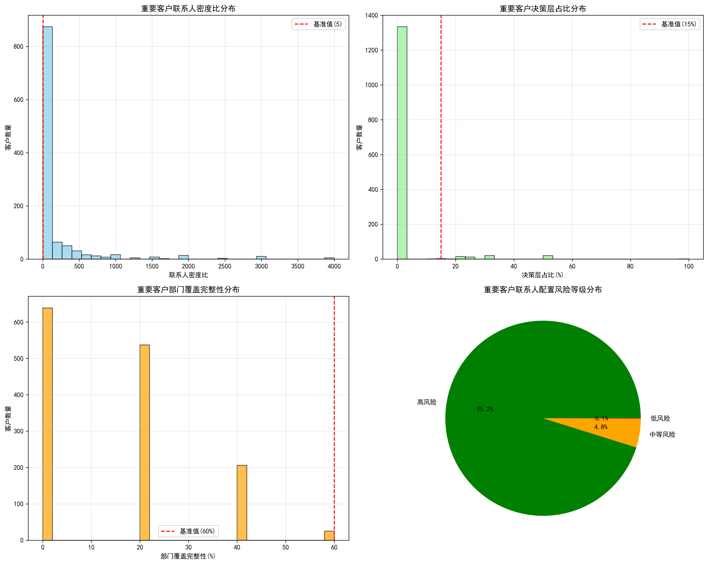
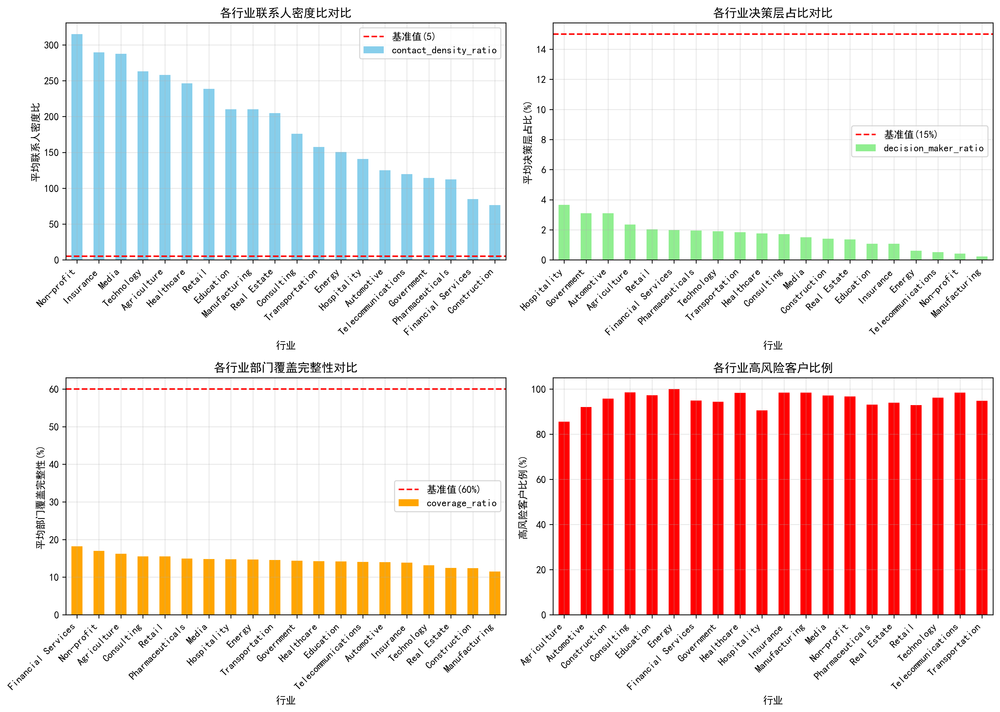
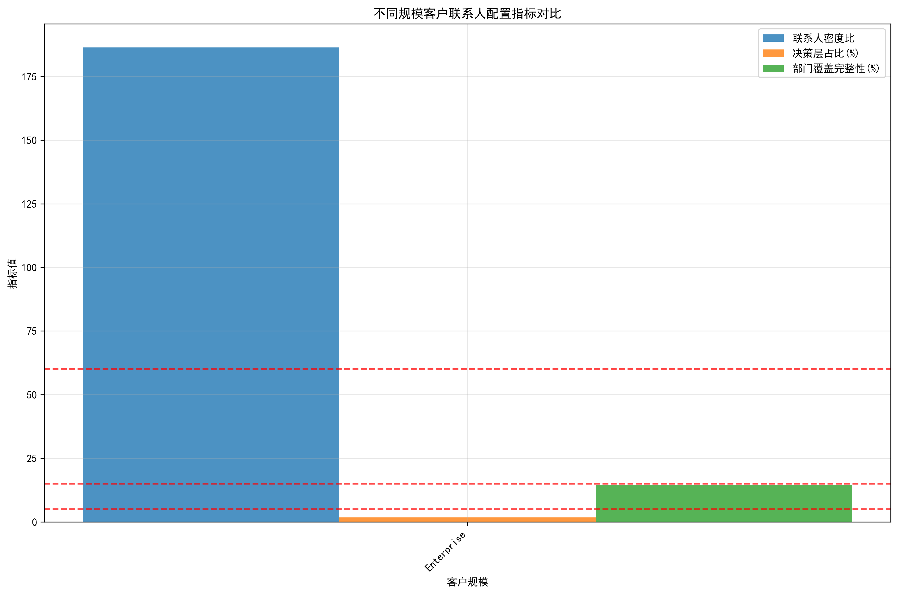
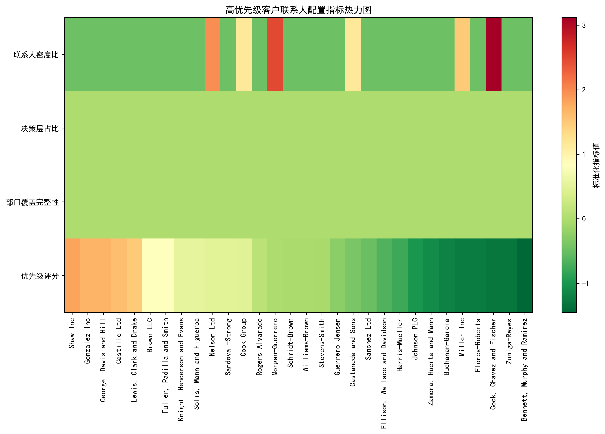

# 重要客户联系人配置风险监控分析报告

## 执行摘要

本报告对年收入前20%的重要客户（共1,407家企业客户）进行了全面的联系人配置风险分析。分析结果显示，**95.1%的重要客户存在联系人配置风险**，其中**1,339个客户为高风险**，**67个客户为中等风险**，仅**1个客户为低风险**。

### 关键发现

- **联系人密度严重不足**：平均密度比为186.41，但基准要求≥5，实际达标率极低
- **决策层占比偏低**：平均决策层占比仅1.73%，远低于15%的基准要求  
- **部门覆盖不完整**：平均部门覆盖完整性仅14.56%，远低于60%的基准要求
- **行业差异显著**：制药、零售、科技等行业风险尤为突出

## 风险监控指标体系

### 1. 联系人密度比分析

**现状**：大部分客户的联系人密度比远低于基准值5，表明联系人数量严重不足。

### 2. 决策层占比分析  

**现状**：所有行业的决策层占比均远低于15%的基准要求，表明在高层关系建立方面存在严重不足。

### 3. 部门覆盖完整性分析

**现状**：部门覆盖完整性普遍不足，五个关键部门（销售、财务、运营、IT、HR）的覆盖存在明显缺口。

## 差异化评估标准

基于行业特征和客户规模，制定以下差异化评估标准：

### 行业差异化标准

| 行业 | 联系人密度比基准 | 决策层占比基准 | 部门覆盖完整性基准 |
|------|------------------|----------------|-------------------|
| 金融服务业 | ≥8 | ≥20% | ≥80% |
| 科技业 | ≥10 | ≥25% | ≥85% |
| 制药业 | ≥6 | ≥18% | ≥75% |
| 制造业 | ≥5 | ≥15% | ≥70% |
| 零售业 | ≥7 | ≥18% | ≥75% |
| 其他行业 | ≥5 | ≥15% | ≥60% |

## 高风险客户识别

### 优先级排序方法

采用综合评分模型，考虑以下因素：
- 年收入权重：40%
- 风险等级权重：30%  
- 指标差距权重：30%

### 前5个最高优先级客户

| 排名 | 客户名称 | 行业 | 风险等级 | 优先级评分 | 关键问题 |
|------|----------|------|----------|------------|----------|
| 1 | Shaw Inc | 金融服务 | 高风险 | 16.00 | 零联系人，全部门缺失 |
| 2 | Gonzalez Inc | 科技 | 高风险 | 15.99 | 零联系人，全部门缺失 |
| 3 | George, Davis and Hill | 金融服务 | 高风险 | 15.99 | 零联系人，全部门缺失 |
| 4 | Castillo Ltd | 医疗 | 高风险 | 15.98 | 零联系人，全部门缺失 |
| 5 | Lewis, Clark and Drake | 制药 | 高风险 | 15.97 | 零联系人，全部门缺失 |

## 客户联系人优化行动方案

### 1. 紧急行动计划（0-3个月）

**目标**：解决零联系人客户的紧急问题

**行动步骤**：
1. **立即启动高层对接**：对前50个优先级最高的客户，安排公司高层直接对接
2. **紧急联系人采集**：通过LinkedIn、行业活动等渠道快速采集基础联系人信息
3. **现有关系梳理**：利用内部员工的人脉关系，寻找潜在介绍人

### 2. 短期优化计划（3-6个月）

**目标**：提升联系人密度和部门覆盖

**行动步骤**：
1. **系统性联系人拓展**：
   - 每个客户至少建立5个关键部门联系人
   - 重点拓展销售、财务、运营、IT、HR部门
   - 通过行业会议、专业协会等渠道建立联系

2. **决策层关系建设**：
   - 制定C级和VP级联系人拓展清单
   - 安排匹配的公司高层进行对接
   - 通过董事会关系、投资人网络等建立联系

### 3. 中期完善计划（6-12个月）

**目标**：达到基准要求，建立稳定的关系网络

**行动步骤**：
1. **关系深度培养**：建立定期沟通机制，组织专属客户活动
2. **内部协同机制**：建立跨部门客户管理团队
3. **持续监控优化**：季度评估联系人配置状况

### 4. 长期维护策略（12个月以上）

**目标**：建立行业领先的客户关系管理体系

**行动步骤**：
1. **战略伙伴关系建立**
2. **生态系统整合**  
3. **数字化转型支持**
4. **持续价值创造**

## 资源需求与配置建议

### 人力资源需求
- **专职客户经理**：建议配置20-30名专职客户经理
- **行业专家**：按行业配置专业顾问团队
- **数据分析师**：配置3-5名数据分析师进行持续监控

### 预算估算
- **人力成本**：年度预算500-800万元
- **技术投入**：年度预算200-300万元
- **活动费用**：年度预算300-500万元

## 监控与评估机制

### 关键绩效指标（KPI）
1. **联系人密度比达标率**：目标80%
2. **决策层占比达标率**：目标75%
3. **部门覆盖完整性达标率**：目标80%
4. **高风险客户转化率**：目标60%

### 监控频率
- **月度监控**：关键指标跟踪
- **季度评估**：深度分析报告
- **年度审查**：策略调整优化

## 结论与建议

### 主要结论

1. **风险普遍性**：95%以上的重要客户存在联系人配置风险，问题具有普遍性
2. **行业差异性**：不同行业的风险特征存在显著差异，需要差异化策略
3. **紧迫性**：部分高价值客户零联系人状态需要立即解决
4. **系统性**：问题涉及联系人数量、质量和结构多个维度

### 核心建议

1. **立即行动**：对最高优先级客户启动紧急对接计划
2. **系统规划**：制定分阶段、分行业的差异化拓展策略
3. **资源保障**：确保充足的人力、技术和预算投入
4. **持续监控**：建立完善的监控评估体系

### 预期收益

通过实施本方案，预计可以：
- **降低客户流失风险**：减少50%以上的高风险客户
- **提升客户价值**：平均客户价值提升20-30%
- **增强竞争优势**：建立行业领先的客户关系管理体系
- **支持业务增长**：为未来3-5年的业务增长奠定坚实基础

---

**报告完成时间**：2024年12月
**数据分析范围**：1,407个年收入前20%的重要客户
**下次更新计划**：2025年第一季度
