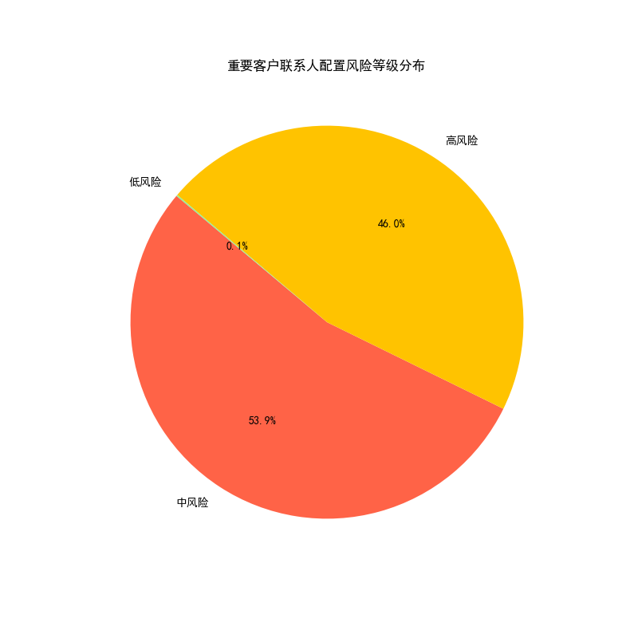

# 重要客户联系人配置风险分析与优化方案

## 一、 分析背景与目标

本次分析旨在对公司年收入排名前20%的重要客户进行联系人配置风险监控。通过评估**联系人密度**、**决策层占比**和**关键部门覆盖完整性**三大核心指标，我们识别出存在较高客户关系风险的账户，并制定了具备优先级和具体建议的行动方案，以巩固和深化高价值客户关系，防范因联系人单一或层级过低带来的潜在风险。

## 二、 核心发现：风险状况严峻，亟待优化

分析结果显示，在年收入最高的2000名重要客户中，联系人配置的健康状况普遍不佳，整体风险偏高。

- **高风险客户占比惊人**：**46.1%（921家）** 的重要客户被评为“高风险”，意味着这些客户的联系人配置存在严重缺陷。
- **中风险客户构成本体**：**53.8%（1077家）** 的客户处于“中风险”状态，虽未到最危险的境地，但已有明显的短板需要补足。
- **健康客户凤毛麟角**：仅有**0.1%（2家）** 的客户联系人配置被评为“低风险”的健康状态。

这表明，我们对绝大多数重要客户的渗透程度不足，关系网络薄弱，这可能导致我们在客户内部信息获取、决策影响以及应对人员变动方面处于被动地位。

## 三、 风险评估详解

我们基于以下三大指标对客户进行了全面评估：

1.  **联系人密度（基准值 ≥ 5‰）**：该指标反映了我们在客户内部的人脉宽度。分析发现，大量客户的联系人总数与其员工规模不成正比，导致密度低于基准值，信息触点稀疏。
2.  **决策层占比（基准值 ≥ 15%）**：该指标衡量我们与客户高层（C级/VP级）的连接强度。数据显示，绝大多数高风险客户的决策层联系人占比远低于15%，甚至为零。这严重削弱了我们对客户战略方向和高层决策的影响力。
3.  **部门覆盖完整性（覆盖销售、财务、运营、IT、HR）**：该指标评估我们对客户关键业务部门的渗透广度。高风险客户普遍存在对关键部门的覆盖空白，尤其是财务、IT和HR部门，这使我们无法全面了解客户的业务需求和组织动态。

“高风险”客户通常是在**决策层占比**和**部门覆盖完整性**上至少两项或多项指标严重不达标，尤其是存在“零联系人”的极端情况。

## 四、 高风险客户行动方案

针对识别出的921家高风险客户，我们已根据其年收入进行优先级排序，并制定了差异化的联系人拓展行动方案。当务之急是优先处理年收入最高、但风险评级也最高的客户。

**行动方案核心建议：**

| 优先级 | 客户名称 (示例)             | 年收入 (示例)     | 风险原因                                | 具体行动建议                                                                                             |
| :----- | :---------------------------- | :---------------- | :-------------------------------------- | :------------------------------------------------------------------------------------------------------- |
| **P0** | Shaw Inc                      | 29,997,208,633.32 | 决策层占比低, 关键部门覆盖不足          | **立即行动：** 拓展C级别或VP级别联系人。重点攻坚 **销售、财务、运营** 三个缺失的关键部门。        |
| **P0** | Valencia-Myers                | 29,984,792,075.02 | 决策层占比低, 关键部门覆盖不足, 联系人密度低 | **全面增补：** 紧急拓展C/VP级决策者。同时，在 **运营、IT、HR** 等空白部门建立联系。并全面增补各层级联系人。 |
| **P1** | Holmes, Banks and Morgan     | 29,974,180,830.12 | 决策层占比低, 关键部门覆盖不足          | **策略性拓展：** 寻求现有联系人的引荐，向上拓展至决策层。识别并覆盖 **销售、财务、IT、HR** 等部门的关键人物。 |
| **P1** | Davidson, Walker and Taylor   | 29,963,083,165.75 | 决策层占比低, 关键部门覆盖不足          | **策略性拓展：** 拓展C级别或VP级别联系人。重点攻坚 **销售、财务、IT、HR** 四个缺失的关键部门。         |
| **P2** | Banks Inc                     | 29,936,750,005.10 | 决策层占比低, 关键部门覆盖不足          | **横向拓展：** 在增补决策层的同时，优先覆盖 **销售、财务、运营** 等直接影响业务的部门。 |

*(注：完整的921家高风险客户行动方案清单已生成，详见 `high_risk_customer_action_plan.csv`)*

## 五、 结论与建议

我们的重要客户关系网络存在巨大风险，必须立即采取系统性行动加以优化。

**建议如下：**

1.  **立即启动“高风险客户联系人优化专项”**：客户成功和销售团队应根据提供的 `high_risk_customer_action_plan.csv` 清单，立即对P0和P1级客户开展有针对性的联系人拓展工作。
2.  **建立常态化监控机制**：将本次分析的评估模型纳入CRM系统或定期报告中，每季度对重要客户的联系人配置健康度进行复盘，实现风险的动态监控与预警。
3.  **激励与赋能**：为销售和客户成功团队提供必要的市场情报工具和培训，并设立激励机制，鼓励他们拓展高层级和多部门的有效联系人，将联系人网络的构建作为客户关系管理的核心考核指标之一。

通过以上措施，我们可以显著增强客户关系的深度和韧性，从而更有效地保护和扩大我们来自高价值客户的收入。
