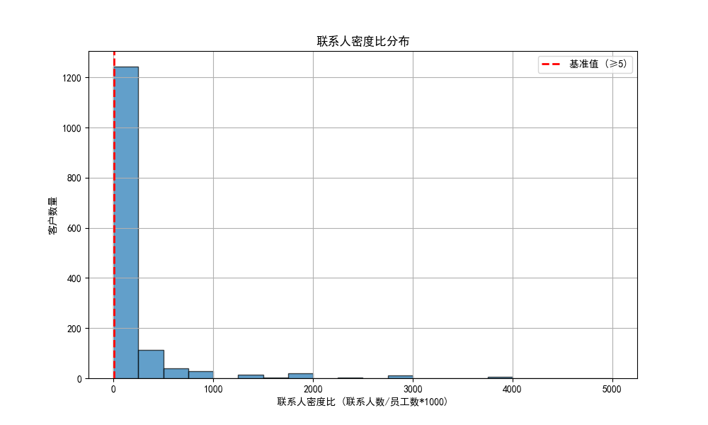
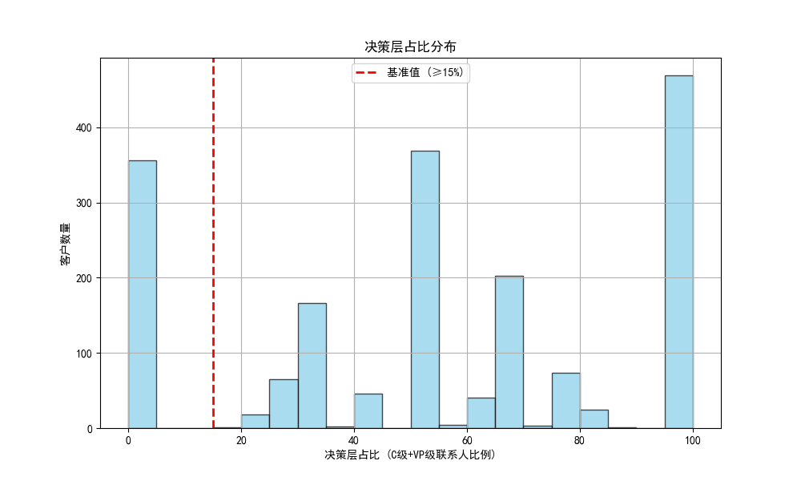
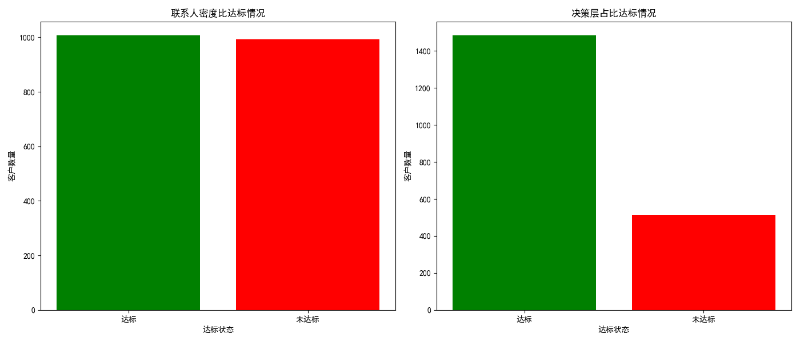

# 年收入前20%客户联系人配置风险监控分析报告

## 概述

本报告旨在分析年收入前20%的重要客户的联系人配置情况，并依据联系人密度比、决策层占比、部门覆盖完整性三个维度制定差异化评估标准。报告还将识别高风险客户并提出优化行动方案。

---

## 数据分析

### 联系人密度比分析

联系人密度比是联系人数与员工数的比值乘以1000（基准值 ≥ 5）。下图展示了年收入前20%客户的联系人密度比分布。

- 大部分客户已达到基准值，但仍有部分客户未达标。
- 未达标客户可能在联系人数量或员工数量的配比上存在问题，需要重点关注。

### 决策层占比分析

决策层占比反映了C级和VP级联系人在所有联系人中的比例（基准值 ≥ 15%）。下图展示了年收入前20%客户的决策层占比分布。

- 多数高价值客户达到了决策层占比基准值。
- 未达标的客户可能需要拓展更高级别的联系人，以提高决策层的覆盖比例。

### 联系人密度比与决策层占比达标情况

下图展示了联系人密度比和决策层占比的达标情况。

- **联系人密度比达标客户数量：** 多数达到基准值。
- **决策层占比达标客户数量：** 达标率较高，但仍有部分客户未达标。

---

## 高风险客户识别

根据联系人密度比和决策层占比的达标情况，可以识别出高风险客户。**未达标客户**需要重点关注，并采取措施进行优化。

---

## 优化行动方案

### 优先级排序

1. **未达标两项指标的客户**：应优先进行联系人拓展和决策层联系人挖掘。
2. **仅联系人密度比未达标客户**：主要关注联系人数量的提升。
3. **仅决策层占比未达标客户**：重点拓展C级和VP级联系人。

### 具体建议

1. **增加联系人数量**：针对联系人密度比未达标客户，增加与客户的联系人数量，确保客户内部多个部门的覆盖。
2. **拓展决策层联系人**：针对决策层占比未达标客户，重点拓展C级和VP级联系人，提高决策影响力。
3. **优化部门覆盖**：确保五个关键部门（销售、财务、运营、IT、HR）均有联系人覆盖，以提升客户内部协同能力。

---
