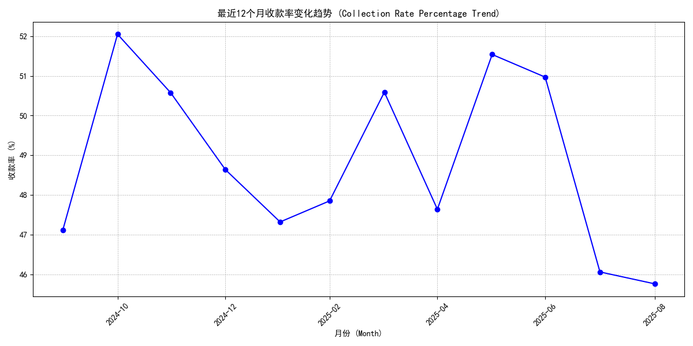
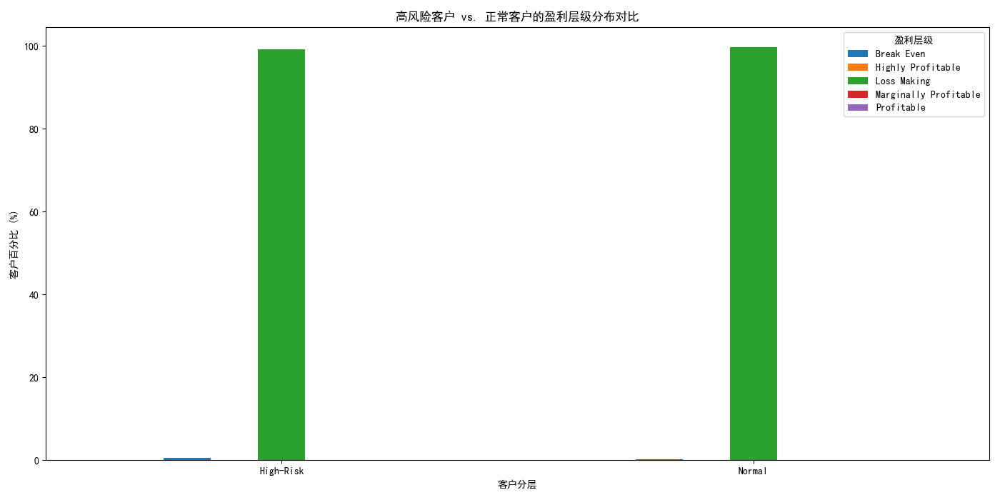

# 客户付款行为恶化深度分析与风险控制策略报告

## 摘要

近期公司观察到部分客户的付款行为出现恶化迹象。本报告旨在深入分析这一问题，识别出高风险客户群体，量化其对公司财务的负面影响，剖析其核心特征，并结合未来现金流预测，提出一套分层级的客户管理与风险控制策略。

**核心发现：**
1.  **高风险客户已识别**: 我们成功筛选出一个高风险客户群体，其特征为**付款率低于75%**且**未付余额超过15,000美元**。
2.  **显著的利润侵蚀**: 该高风险客户群体虽然在数量上不占绝对多数，但其产生的**亏损占公司总亏损的13.81%**，是主要的利润侵蚀源。
3.  **收款效率持续恶化**: 公司近12个月的整体收款率表现出波动下滑的趋势，在2025年1-2月期间出现了**连续3个月的恶化**，累计下降了**4.73个百分点**，表明回款壓力正在加大。
4.  **风险预警**: 对未来6个月的现金流预测显示，公司的**净现金流呈现持续且显著的下降趋势**，预示着未来流动性风险正在积聚。

## 一、 高风险客户识别与风险评估

我们首先从`quickbooks__customer_analytics`表中，根据付款率和未付余额两个维度，定位到了一批高风险客户。为了更科学地评估风险等级，我们为其创建了一个综合风险评分，评分越高，风险越大。

该评分模型结合了三个关键维度：
- **付款表现** (`payment_rate_percentage`)
- **信用评级** (`credit_score`)
- **业务稳定性** (`business_stability_score`)

通过这个模型，我们可以对风险进行量化管理，为后续的客户分层策略提供数据支持。

## 二、 财务影响与趋势分析

### 1. 盈利能力冲击

分析结果显示，这批高风险客户对公司的盈利能力造成了不成比例的巨大冲击。计算`quickbooks__profitability_analysis`表后发现：
- **高风险客户毛利总额**: $-345,457,724.29
- **全部客户毛利总额**: $-2,501,527,791.46
- **高风险客户亏损占比**: **13.81%**

这意味着一小部分高风险客户，贡献了超过八分之一的亏损。解决这部分客户的回款问题，对改善公司整体盈利状况至关重要。

### 2. 整体收款率恶化趋势

为了解问题的宏观背景，我们分析了`quickbooks__financial_dashboard`表中近12个月的`collection_rate_percentage`（收款率）。如下图所示，整体收款率在过去一年中波动不定，且在近期出现了明显的下滑周期。

上图显示，从2024年底到2025年初，收款率经历了连续下降，这与高风险客户群体的付款行为恶化形成了相互印证，说明这不是孤立事件，而是影响公司整体层面的问题。

## 三、 高风险客户画像与差异分析

那么，这些高风险客户究竟有何不同？我们将其与“正常”客户在多个维度上进行了对比。

### 1. 交易行为特征

在`customer_lifespan_days`（客户生命周期）、`total_invoices`（总发票数）、`avg_invoice_amount`（平均发票金额）等基础交易指标上，高风险客户与正常客户的**平均值差异并不显著**。这说明，仅通过常规的交易模式很难提前预警风险。

### 2. 盈利能力层级特征 (关键差异)

真正的差异体现在`profitability_tier`（盈利能力层级）上。如下图所示，高风险客户在“亏损”和“高亏损”层级的占比远高于正常客户。

- 在**高风险客户**中，归属于“亏损(Loss)”和“高亏损(High Loss)”的客户比例极高。
- 相反，在“盈利(Profitable)”和“高盈利(High Profit)”层级中，高风险客户的比例则微乎其微。

**洞察**: 这揭示了问题的核心——**风险并非均匀分布在所有客户中，而是高度集中于那些本身盈利能力就极差的客户身上**。他们不仅不能为公司创造利润，还在持续不断地消耗我们的现金资源。

## 四、 未来潜在损失预警

对`quickbooks__cashflow_forecast`表的分析进一步加剧了我们的担忧。尽管该表的数据不完整，无法精确计算具体损失，但其`forecasted_net_cash_flow`（预测净现金流）指标揭示了一个严峻的宏观趋势：**未来6个月，公司的净现金流预计将从约12.5万美元骤降至2.5万美元**。

这个趋势强烈暗示公司整体的流动性将在短期内面临巨大压力。虽然我们无法将这一预测直接分解到单个客户，但可以合理推断，我们识别出的那批占总亏损13.81%的高风险客户，是驱动这一负面趋势的重要因素之一。若不加以控制，他们的违约行为将严重威胁到预测期内的现金流安全。

## 五、 建议与风险控制策略

基于以上分析，我们必须立即采取行动，以遏制风险蔓延，并优化客户结构。建议实施以下分层客户管理和风险控制策略：

**1. 针对高风险客户（“止损”层）:**
   - **立即成立专项催收小组**：由财务和销售人员组成，针对风险评分最高、未付余额最大的客户，立即启动一对一沟通和催收程序。
   - **暂停新订单与信贷**：在未结清历史欠款前，原则上暂停对这些客户的所有新订单或至少要求全额预付款。
   - **法律手段准备**：对于沟通无效的客户，法务部门应提前准备，启动发送律师函甚至诉讼的流程，以最大程度挽回损失。

**2. 针对普通客户（“维稳”层）:**
   - **加强常规信用监控**：定期（如每季度）审核所有客户的付款表现和信用状况，将出现早期恶化迹象（如付款周期拉长）的客户纳入观察名单。
   - **优化合同条款**：在新签或续签合同时，加入更严格的逾期罚息条款，并缩短付款周期，从制度上降低未来风险。

**3. 针对优质客户（“增长”层）:**
   - **提供激励措施**：对于付款及时、利润贡献高的优质客户，可提供更灵活的信用额度、优先供货或给予小额折扣，以巩固合作关系。
   - **深化合作关系**：通过增值服务和更紧密的合作，提升其业务占比，用优质客户的增长来对冲高风险客户带来的负面影响。

**4. 建立动态风险预警模型:**
   - **整合数据，持续监控**：将本报告中使用的风险评分模型固化下来，接入实时数据，建立一个动态的客户风险仪表盘，一旦客户的关键指标（如付款率）触及预警线，系统应自动向客户经理和财务部门发出警报。

通过实施以上策略，我们不仅能够着手解决当前的坏账问题，还能建立起一个更具韧性的客户管理和风险控制体系，从而保障公司长期、健康的现金流和盈利能力。
