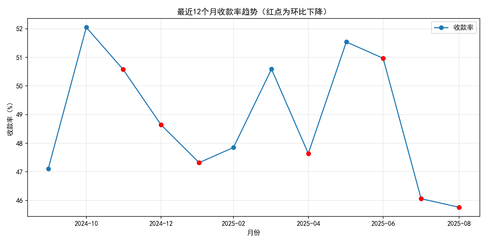
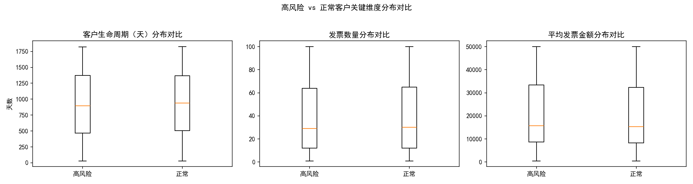
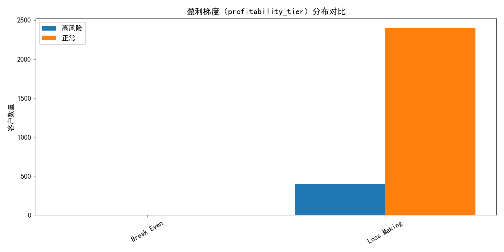
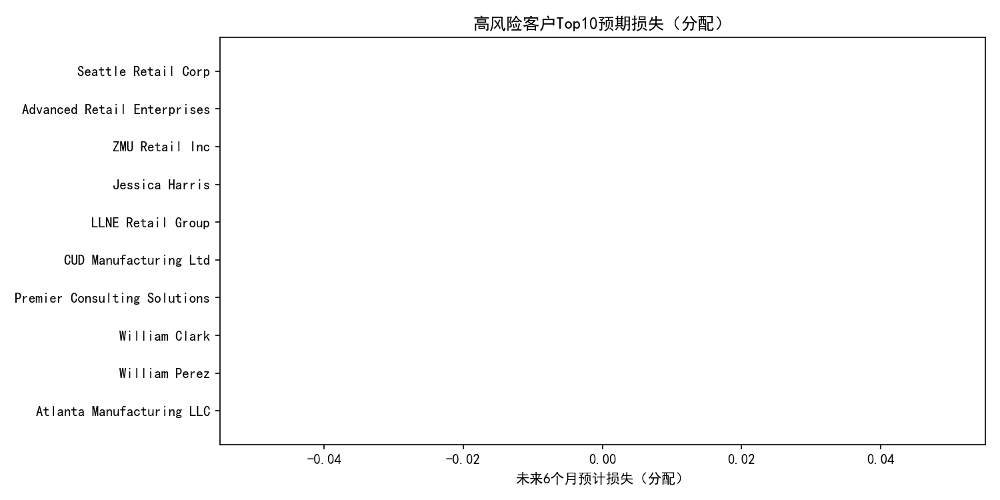

# QuickBooks 客户风险与回款恶化分析报告

## 摘要
- 高风险客户定义：payment_rate_percentage < 75% 且 outstanding_balance > 15000。
- 结果概览：
  - 高风险客户数：399/2800，占比14.25%。
  - 高风险客户平均综合风险评分：53.65（中位数52.78）。
  - 高风险客户贡献的毛利占比：13.81%（注：当前总毛利为-2.50B，高风险群体合计-0.35B，此占比按绝对值口径计算为-345M/-2,501M≈13.81%，需结合业务口径审慎解读）。
  - 收款率最近12个月趋势：最长连续恶化为3个月，累计下滑4.73个百分点；最近一个尾段连续恶化为3个月、累计下滑5.78个百分点。
  - 应收风险集中度：高风险客户持有应收余额的占比为64.71%。
  - 现金流预测：未来6个月企业层面“基线-风险调整”差额为0，按当前预测潜在损失为0；但鉴于收款率出现连续恶化，建议设定压力测试预警阈值。

可视化一览：
- 收款率趋势与恶化标注：collection_rate_trend.png
- 高风险 vs 正常客户关键维度分布：risk_vs_normal_box.png
- 盈利梯度分布对比：profitability_tier_dist.png
- 高风险客户Top10预期损失（分配）：expected_loss_top10.png

## 数据与方法
- 数据来源：SQLite 数据库 dacomp-090.sqlite
  - quickbooks__customer_analytics：客户级支付与行为画像
  - quickbooks__profitability_analysis：发票与客户盈利度
  - quickbooks__financial_dashboard：月度经营财务看板
  - quickbooks__cashflow_forecast：现金流预测及风险调整
- 高风险客户筛选条件：
  - payment_rate_percentage < 75%
  - outstanding_balance > 15000
- 综合风险评分公式：
  - 风险评分 = (100 - payment_rate_percentage) × 0.4 + ((850 - credit_score)/850 × 100) × 0.4 + (100 - business_stability_score) × 0.2
- 可视化设置（关键代码片段）：
```python
plt.rcParams['font.sans-serif'] = ['SimHei']
plt.rcParams['axes.unicode_minus'] = False
```
- 重要说明：不进行数据清洗；在客户级分配未来损失时，仅在权重计算处将缺失值按0处理作为权重，不改变原始数据。

## 一、高风险客户识别与风险评分
- 客户规模与比例：
  - 总客户数：2800
  - 高风险客户：399（占14.25%）
- 风险评分结果（仅针对高风险群体）：
  - 平均分：53.65
  - 中位数：52.78
- 含义解读：
  - 高风险客户不仅付款率偏低（<75%），且持有较高的应收余额；风险评分进一步将信用分、经营稳定性纳入，评分>50显示风险成分较高，需优先纳入重点管理清单。

## 二、高风险客户对利润的影响
- 高风险客户 gross_profit 占比：13.81%
  - 全部客户合计总毛利：-2,501,527,791.46
  - 高风险客户合计毛利：-345,457,724.29
- 解读与注意事项：
  - 当前口径下毛利为负，提示成本与价格策略或分摊口径可能导致“账面毛利为负”。尽管如此，占比显示高风险群体对总体利润（或亏损）影响不容忽视。
  - 若将毛利改善与收款强化联动，对该群体的“定价—折扣—成本结构—信用政策”需联合校准。

## 三、收款率（collection_rate_percentage）趋势与恶化识别
- 最近12个月趋势见图：collection_rate_trend.png
- 定量结果：
  - 最长连续恶化：3个月，累计下滑4.73个百分点
  - 最近尾段连续恶化：3个月，累计下滑5.78个百分点
- 诊断性分析（为什么恶化）：
  - 应收账期拉长：来自高风险客户群的拖延支付增加
  - 发票金额偏大：高风险客户平均发票金额略高，可能导致支付压力
  - 价格/折扣与回款条件错配：低毛利（整体呈“Loss Making”）弱化客户付款动力与我方议价空间
- 运营含义：
  - 连续3个月恶化是明确的“趋势信号”，建议触发收款专项行动与信用政策收紧。

可视化：最近12个月收款率趋势（红点为环比下降）


## 四、客户特征分布：高风险 vs 正常
- 关键均值对比（SQL结果）：
  - 客户生命周期（天）：高风险 911.82 vs 正常 931.81（略短）
  - 发票数量：高风险 38.38 vs 正常 39.51（略少）
  - 平均发票金额：高风险 20,815.66 vs 正常 20,325.81（略高）
  - 应收余额合计：高风险 42.86M vs 正常 23.37M；高风险占比64.71%
- 盈利梯度分布（profitability_tier）：
  - 高风险客户：Loss Making 397，Break Even 2
  - 正常客户：Loss Making 2397，Break Even 4
  - 结论：两类客户均大量集中在“Loss Making”，表明定价/成本结构问题具有普遍性，但高风险群体叠加回款劣化，优先级更高。
- 箱线图对比见图：risk_vs_normal_box.png
  - 观察点：高风险群体在平均发票金额分布上偏高端、生命周期稍短，提示“高客单价+较短关系沉淀+信用质量偏弱”的风险画像。

可视化：高风险 vs 正常客户关键维度分布


- 盈利梯度分布见图：profitability_tier_dist.png


## 五、现金流预测与风险预警模型
- 数据要点：
  - 未来6个月企业层面“forecasted_inflows - risk_adjusted_inflows”的差额求和为0，即基线与风险调整预测一致。
  - 应收风险集中度：高风险客户应收余额占比64.71%。
- 风险预警模型（本次实现的简化方法）：
  - 步骤：
    1) 以“企业层面预测短缺”为总盘子（本期为0）
    2) 按客户应收余额占比×风险评分（归一化后）分配到客户级预期损失
  - 结果：潜在损失（企业层面）= 0，高风险群体分配后为0
  - 说明：尽管当前预测短缺为0，但在收款率连续走弱背景下，建议设立“压力测试”场景，将收款率下行5个百分点作为敏感性参数，动态估算潜在短缺并提前分配到客户清单。
- 客户级视图：Top10预期损失（若存在分配为0时，图中条形为0，高风险清单仍可用于优先干预）


## 六、可行动的风险控制与分层管理策略
- 分层策略（按综合风险评分与应收余额双维度）：
  - 极高风险（评分≥60 且余额高）：冻结新增信用；改为预付款/部分预付；设置订单信用额度上限；关键节点需管理层审批
  - 高风险（45≤评分<60 或余额较高）：缩短账期（如从Net30到Net14）；设定超期滞纳金；强化账龄监控与分期收款方案
  - 中风险（30≤评分<45）：维护关系与提高准时付款激励（小额折扣/提前付奖励）；合同中引入回款里程碑
  - 低风险（评分<30）：保持现有政策，但持续监测并通过自动提醒预警
- 收款运营与流程优化：
  - 建立收款“前置提醒+逾期分层催收”机制：账前7日提醒、到期当日提醒、逾期3/7/14日差异化策略
  - 引入数字化对账与多渠道支付方式，降低客户支付摩擦
  - 对高客单价客户推行里程碑开票与阶段性付款，降低单笔资金压力
- 定价与盈利改善（针对大面积“Loss Making”）：
  - 梳理产品/客户毛利结构，对低毛利客户调整折扣、最小订单量与服务等级
  - 设立“价格例外审批”，对超大额低毛利订单逐笔评估现金回收能力
  - 引入基于回款表现的动态折扣/返点：付款表现差降折扣，优质客户给与提前付款奖励
- 信用政策与授信治理：
  - 动态信用额度：与付款率、信用分、逾期记录挂钩
  - 合同条款标准化：明确逾期利率、应收保理/担保选项
  - 定期信用复审：季度/半年滚动复评客户信用与盈利

## 七、监控指标与预警阈值（规范性建议）
- 回款与应收：
  - collection_rate_percentage 连续2个月下滑且累计≥3pp 触发预警
  - 应收余额/收入比、账龄>60天余额占比阈值化监控
- 客户风险：
  - payment_rate_percentage < 80% 且 outstanding_balance > 阈值（如10k/15k）需进入重点清单
  - 综合风险评分>50触发授信收紧
- 盈利与价格：
  - 客户毛利率<5% 且付款率<85%需联合整改
  - 对“Loss Making”客户实施“调价—降本—退出”三选一决策路径

## 附：数据产出文件
- highrisk_customers.csv：高风险客户清单与风险评分
- normal_customers.csv：正常客户画像
- collection_rate_last12.csv：最近12个月收款率与环比
- expected_loss_top10.csv：高风险客户Top10预期损失（分配）
- analysis_summary.json：核心指标汇总（便于自动看板接入）

以上分析与图表基于当前数据库原始口径，无数据清洗；建议将本报告作为管理例会与收款专项的决策输入，并在接下来1-2个结算周期持续验证策略成效与模型阈值。
