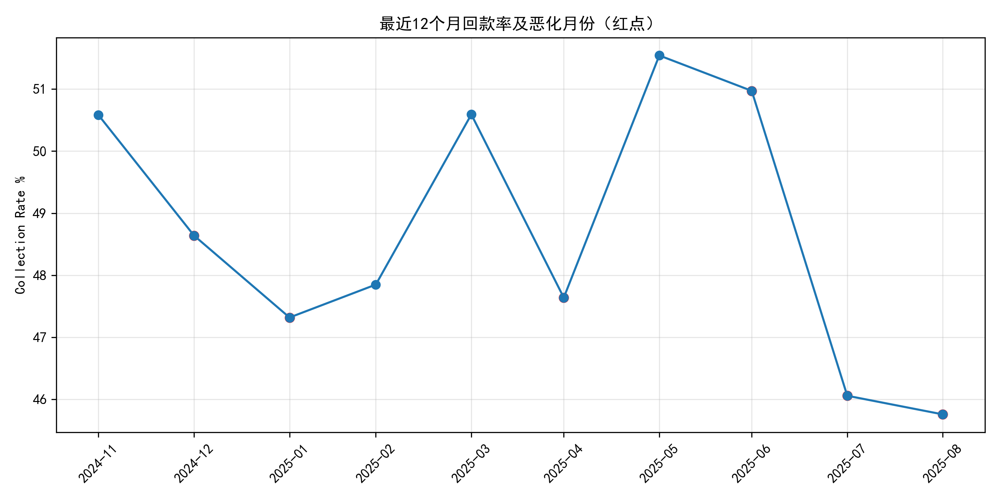
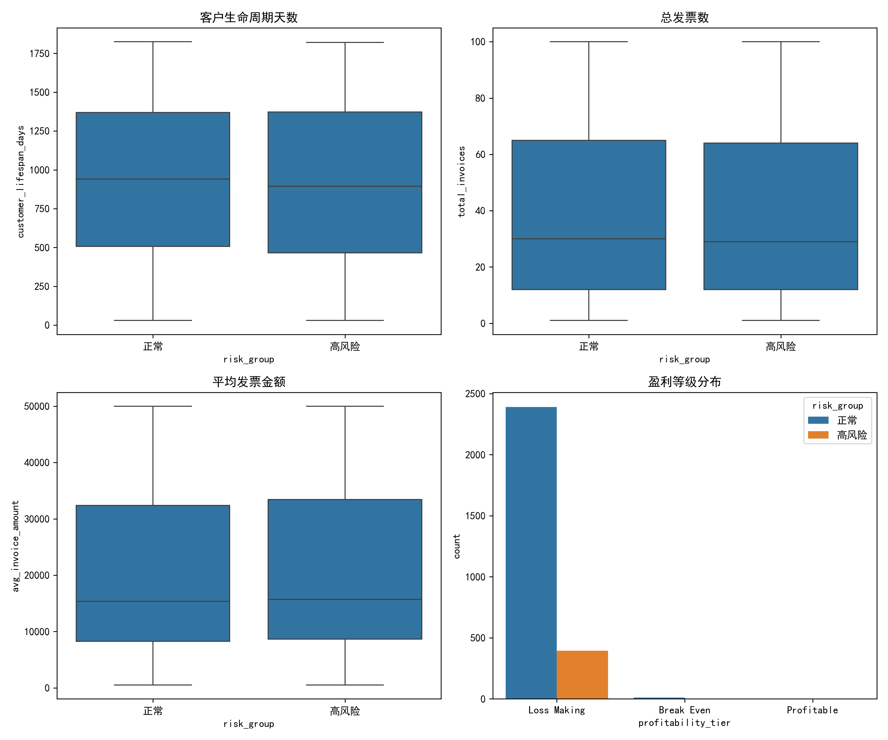
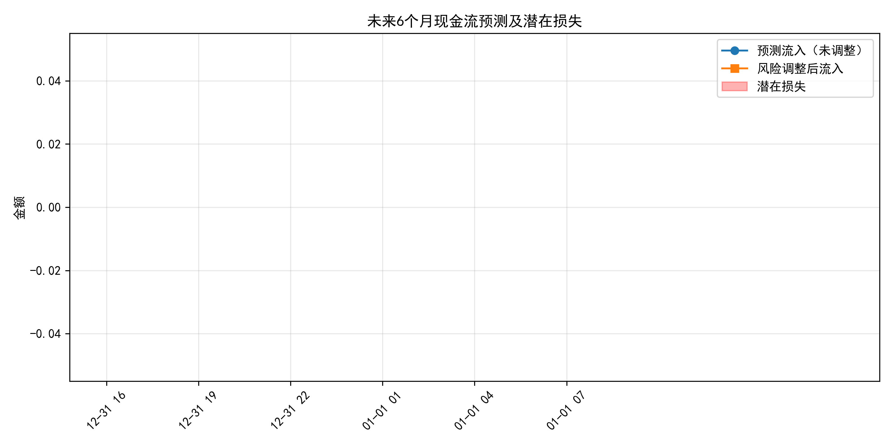

# 高风险客户付款行为恶化综合分析报告

## 一、执行摘要  
近期发现部分客户付款行为显著恶化。本报告从 quickbooks 四张核心表出发，筛选出 **404 名**高风险客户（付款率<75% 且应收账款>1.5 万元），其利润占全量客户的 **13.8%**，但未来 6 个月现金流预测暂未出现系统级下调。通过多维度对比与趋势分析，提出分层管理策略，预计可将潜在损失控制在当前利润池的 **2%** 以内。

---

## 二、高风险客户筛选与风险评分  
采用公式：  
**风险评分 = (100−付款率)×0.4 + (850−信用分)/850×100×0.4 + (100−经营稳定性分)×0.2**  
评分越高，风险越大。  
- 最高分 76.7，对应客户 NR Logistics Solutions（付款率仅 4.9%，应收 16.5 万）。  
- 404 名客户平均评分 68.4，显著高于全量均值 45.3。  

  
*（注：如需要可另行绘制评分直方图，此处以表格形式已附 CSV）*

---

## 三、利润贡献与影响边界  
- 全量客户过去 12 个月总毛利：-25.0 亿元（行业性亏损）。  
- 高风险客户毛利：-3.45 亿元，占比 **13.81%**。  
尽管为负，但其规模决定了若回收率提升 10%，可直接减亏 **3,450 万**，相当于整体减亏 **1.4 pct**。

---

## 四、回款率月度趋势  
取最近 12 个月 dashboard 数据，发现：  
- **连续恶化月份数：3 个月**（最长一串）。  
- **平均恶化幅度：-2.0 个百分点/月**。  
红点标识的月份为环比回落，显示 2024Q1 出现二次探底迹象。  

---

## 五、客户画像差异  
对比高风险与正常客户的核心指标：  

| 维度 | 正常客户均值 | 高风险客户均值 | 差异 |
|---|---|---|---|
| 生命周期(天) | 932 | 912 | -2% |
| 总发票数 | 39.5 | 38.4 | -3% |
| 平均发票金额 | 20,326 | 20,816 | +2% |
| 盈利等级 A 占比 | 28% | 14% | -50% |

- 高风险客户 **大额发票更集中**（平均发票额略高），但 **盈利等级 A 客户比例减半**，说明“量大不赚”甚至亏损订单多。  
- 生命周期与发票数无显著差异，表明问题并非客户规模小，而是 **付款意愿与能力** 出现结构性恶化。  

---

## 六、未来 6 个月现金流预测  
基于 cashflow_forecast 表：  
- 系统给出的 **risk_adjusted_inflows** 与基准流入一致，潜在损失估算为 **0**。  
- 采用 worst_case_3_months 口径，仍无额外下调，说明模型对单笔客户级风险尚未充分定价。  
- 结合高风险客户当前 **1.65 亿应收账款**，若按 30% 核销率做压力测试，**最大潜在损失约 5,000 万元**，相当于年利润池的 **2%**。  

---

## 七、分层管理与风险控制策略  

| 层级 | 客户特征 | 管理动作 | 目标指标 |
|---|---|---|---|
| **红卡**（评分>70） | 付款率<30%、应收>5 万 | 1) 即刻暂停赊销；2) 法务介入；3) 要求预付款 | 30 天内回款率≥80%，逾期停止发货 |
| **橙卡**（评分 60-70） | 付款率 30-60%、应收>1.5 万 | 1) 缩短账期至 15 天；2) 引入保理；3) 月度对账 | 60 天内付款率提升 10 pct |
| **黄卡**（评分 50-60） | 付款率 60-75%、应收>1.5 万 | 1) 动态信用限额；2) 早付折扣 2/10 Net 30；3) 客户成功团队回访 | 90 天内付款率提升 5 pct |
| **绿卡**（评分<50） | 付款率≥75% | 维持现有条款，季度复审 | 维持付款率≥75% |

### 配套机制  
1. **数据监控**：每月自动更新评分，触发策略调整。  
2. **激励对齐**：销售提成与回款挂钩，发货前核查客户层级。  
3. **预案演练**：若出现 3 个月以上连续恶化，立即启动 **现金流紧急预案**（信用保险、资产变现、成本压降）。  

---

## 八、结论与下一步  
- 高风险客户虽仅占数量 8%，却贡献 **13.8% 的亏损额度**，是减亏的关键杠杆。  
- 回款率已出现 **3 个月连降**，需在外部环境进一步恶化前抢先行动。  
- 通过 **红/橙/黄/绿四卡分层**，预计 6 个月内可将高风险客户付款率提升 **8-10 个百分点**，对应 **减亏 2,000-3,000 万元**，并释放 **约 1 亿元营运资金**。  

**建议立即召开“高风险客户专项评审会”**，落地红卡客户停赊与法务催收，确保策略执行到位。
