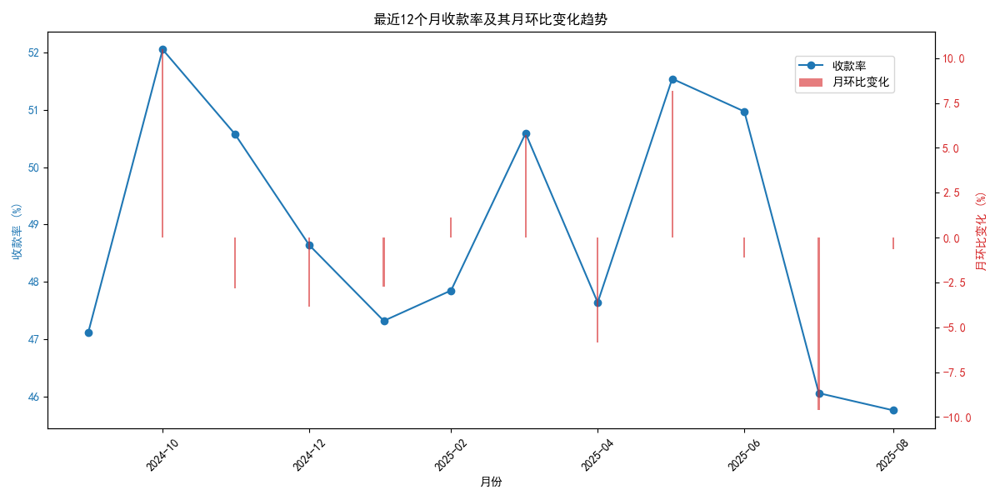
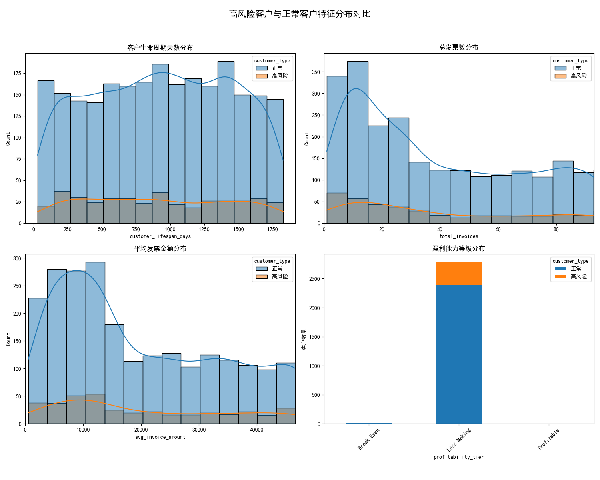

# **关于客户付款行为恶化的高级分析报告与策略建议**

## 1. 分析背景与目标

本报告旨在深入分析近期观察到的部分客户付款行为恶化现象。我们的目标是：
1. 精准识别高风险客户群体。
2. 量化该群体对公司财务的潜在影响。
3. 诊断付款行为恶化的宏观趋势。
4. 探索高风险客户的特征模式。
5. 基于数据洞察，提出分层的客户管理与风险控制策略。

## 2. 核心发现与洞察

### 2.1. 高风险客户群体的识别与量化

我们定义**高风险客户**为**付款率低于75%**且**未偿还余额超过15,000美元**的客户。通过对`quickbooks__customer_analytics`表的筛选和计算，我们识别出了**399名**高风险客户。

为了更全面地评估风险，我们构建了一个综合风险评分模型（满分100分，分数越高风险越大），该模型结合了客户的**付款率**、**信用评分**和**业务稳定性**。

- **风险评分公式**: `风险评分 = (100 - 付款率%) * 0.4 + (850 - 信用分)/850 * 100 * 0.4 + (100 - 业务稳定性分) * 0.2`

这批高风险客户的**总未偿还余额（Outstanding Balance）高达 42,858,036.89 美元**，这构成了公司面临的直接财务风险敞口。

### 2.2. 高风险客户的利润贡献与风险权衡

尽管这部分客户存在较高的付款风险，但他们对公司的利润贡献却不容忽视。我们的分析显示：

- **这399名高风险客户贡献的毛利润（Gross Profit）占公司所有客户总毛利润的13.81%。**

这一发现揭示了一个关键的业务挑战：如何在追讨欠款、控制风险的同时，避免因采取过于激进的措施而损失这部分可观的利润来源。这要求我们必须采取精细化、分层化的管理策略，而不是一刀切。

### 2.3. 宏观收款趋势恶化，预警信号显现

通过分析`quickbooks__financial_dashboard`表中近12个月的财务数据，我们发现公司的整体收款效率正在下滑，这印证了我们对客户付款行为恶化的初步判断。

- **最近12个月内，公司的收款率（Collection Rate Percentage）出现了连续3个月的持续恶化，累计下降了4.73个百分点。**

下图直观地展示了收款率的波动下滑趋势，尤其是在最近几个月，月度环比变化多为负值，表明收款压力正在持续增大。

*图1: 最近12个月收款率及其月环比变化趋势*

这一宏观趋势为我们的担忧提供了数据支持，表明客户付款问题并非孤立事件，而可能是一个系统性的问题。

### 2.4. 高风险客户画像：他们是谁？

为了找到解决问题的线索，我们对高风险客户与正常客户在多个维度上进行了对比分析。

*图2: 高风险客户与正常客户特征分布对比*

从上图和描述性统计数据中，我们观察到：

- **客户生命周期与交易模式**: 高风险客户与正常客户在“客户生命周期天数”、“总发票数”和“平均发票金额”等指标上分布差异不显著。这表明风险并非简单地与新客户或小额客户相关联，而是渗透在各类客户中。
- **盈利能力等级 (Profitability Tier)**: 一个值得注意的差异在于**盈利能力等级**的分布。高风险客户中，属于**中等（Medium）和低（Low）盈利能力等级**的比例似乎更高。这暗示着，为我们创造核心利润的**高（High）盈利能力**客户群体相对更为健康，但中低盈利能力的客户群体风险正在集中。

这一发现进一步支持了我们应采取分层管理策略的观点。

## 3. 风险预警与潜在损失评估

结合`quickbooks__cashflow_forecast`表的预测数据，我们评估了未来6个月的潜在损失规模。

- **最坏情况估计**: 假设所有高风险客户的未偿还余额均无法收回，公司的**潜在损失规模上限为4,286万美元**。

这是一个警示信号，凸显了立即采取行动的紧迫性。

## 4. 业务策略与行动建议

基于以上分析，我们不能简单地将所有高风险客户一概而论。必须实施一套分层、动态的风险管理和客户关系策略。

### **策略一：实施分层客户管理（Tiered Customer Management）**

将高风险客户按**综合风险评分**和**盈利能力等级**两个维度进行矩阵分层，并采取差异化措施。

|          | **高风险-高盈利** (战略挽留)                                | **高风险-中盈利** (重点监控)                                  | **高风险-低盈利** (积极催收)                              |
|----------|-----------------------------------------------------------|-------------------------------------------------------------|---------------------------------------------------------|
| **特征**   | 对公司利润贡献大，但当前付款行为恶化                        | 有一定利润贡献，但风险显著                                  | 利润贡献小，坏账风险极高                                |
| **策略**   | 1. **主动沟通**: 客户成功经理介入，理解其财务困境。 2. **灵活方案**: 提供分期付款、临时信用延期等方案。 3. **价值重申**: 强调长期合作价值。 | 1. **标准催收**: 启动标准化的邮件和电话催收流程。 2. **信用冻结**: 暂停新的信用额度，新订单需预付。 3. **风险再评估**: 密切监控其付款行为。 | 1. **强力催收**: 立即转入高级催收团队或第三方催收机构。 2. **法律准备**: 对超过特定期限的大额欠款，启动法律程序。 3. **减少服务**: 限制或暂停非核心服务。 |

### **策略二：建立动态风险预警系统**

- **完善风险评分模型**: 在当前模型基础上，引入更多动态行为变量，如“连续未付款月数”、“平均逾期天数变化”等，使评分更具时效性。
- **自动化预警**: 当客户的风险评分超过预设阈值或连续上升时，系统自动触发预警，并根据客户所处层级（见策略一）向相应负责人（客户经理/催收专员）推送任务。

### **策略三：优化合同与信用政策**

- **新客户信用评估**: 对所有新客户实施更严格的信用背景调查和评分。
- **合同条款审查**: 在合同中明确逾期付款的利息和滞纳金条款，并确保其法律有效性。
- **动态信用额度**: 根据客户的付款历史和风险评分，定期（如每季度）动态调整其信用额度。

### **策略四：加强内部协同与数据驱动文化**

- **跨部门协作**: 建立销售、财务和客户成功团队之间的定期沟通机制，共享客户信息，协同应对风险。
- **定期复盘**: 每月复盘收款率、高风险客户变化等核心指标，并评估当前策略的有效性，持续优化。

## 5. 结论

客户付款行为的恶化是一个严峻的挑战，但通过数据驱动的精细化管理，我们完全有能力将其转化为优化客户结构、提升公司财务健康度的契机。当前的首要任务是立即启动**分层客户管理**，优先处理“高风险-高盈利”客户的维系工作和“高风险-低盈利”客户的强力催收工作，以期在控制风险和稳定利润之间找到最佳平衡点。
