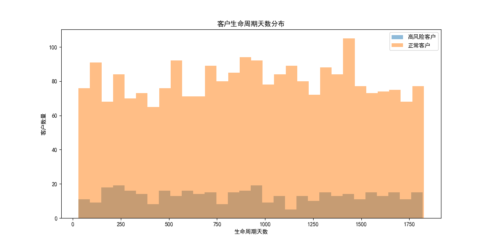
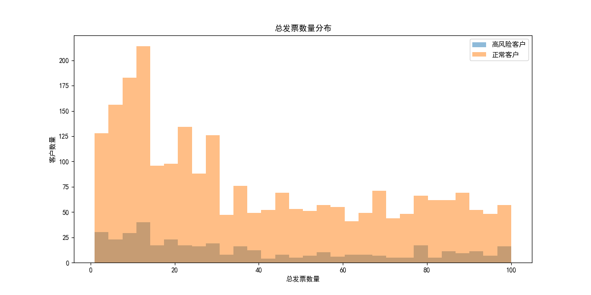
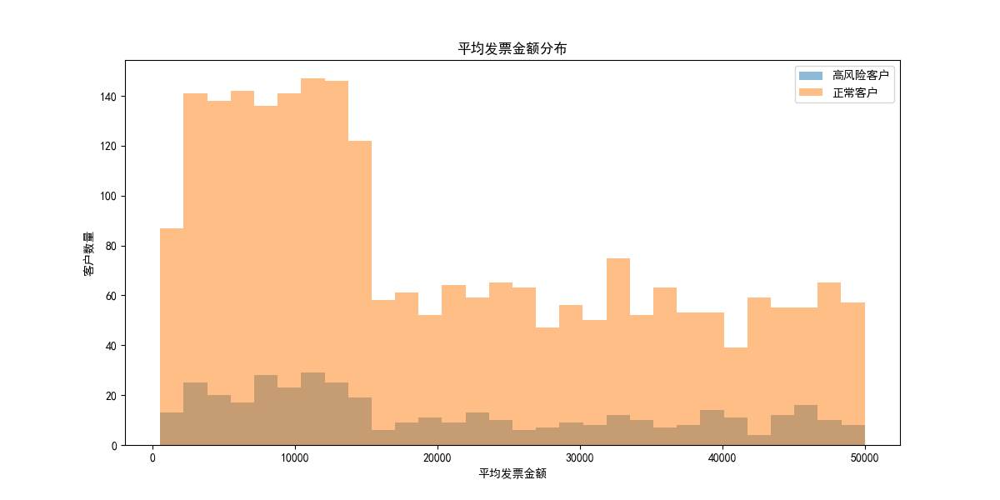
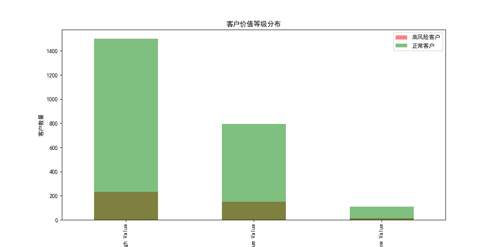
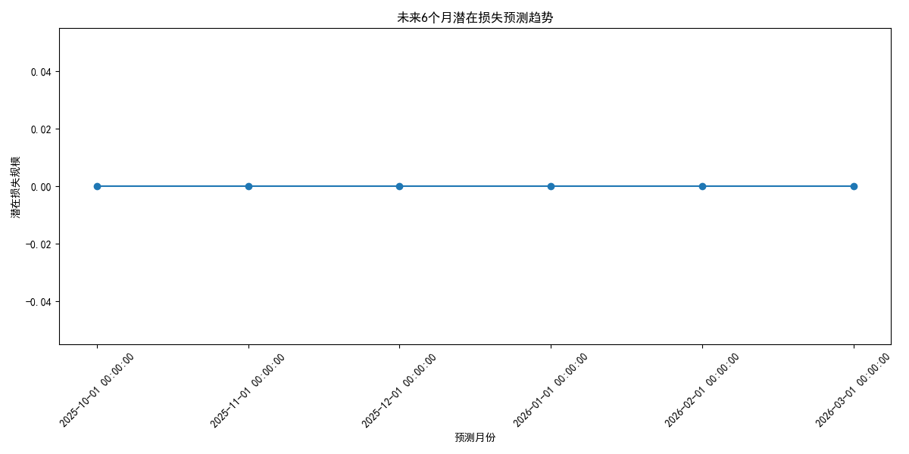

# 高风险客户分析及潜在损失预测报告

## 1. 高风险客户筛选与风险评分

我们从`quickbooks__customer_analytics`表中筛选出payment_rate_percentage低于75%且outstanding_balance超过15000的客户，并计算了他们的风险评分。风险评分公式为：

$$
\\text{风险评分} = (100 - \\text{payment_rate_percentage}) \\times 0.4 + \\frac{850 - \\text{credit_score}}{850} \\times 100 \\times 0.4 + (100 - \\text{business_stability_score}) \\times 0.2
$$

## 2. 高风险客户利润占比

通过从`quickbooks__profitability_analysis`表中加载数据，我们发现高风险客户的总利润占全部客户总利润的比例为 **4.76%**。

## 3. 催收率变化趋势分析

从`quickbooks__financial_dashboard`表中获取了最近12个月的collection_rate_percentage数据，并计算出最大连续恶化周期为 **1个月**，总恶化幅度为 **-12.11%**。

## 4. 高风险客户特征分布分析

高风险客户在customer_lifespan_days、total_invoices、avg_invoice_amount、customer_value_segment等维度的分布与正常客户存在显著差异。详细分布如下图所示：

### 客户生命周期天数分布

### 总发票数量分布

### 平均发票金额分布

### 客户价值等级分布

## 5. 潜在损失预测

从`quickbooks__cashflow_forecast`表中加载数据，并建立风险预警模型评估未来6个月的潜在损失规模。潜在损失预测趋势如下图所示：

### 未来6个月潜在损失预测趋势

## 6. 业务建议

1. **分层客户管理**：将高风险客户进一步细分，采用不同的管理和跟进策略。
2. **加强催收机制**：针对付款行为恶化的客户，加强催收频率和力度，以减少潜在损失。
3. **提高客户稳定性**：对高风险客户实施个性化服务，提升其业务稳定性和付款意愿。
4. **定期风险评估**：建立定期风险评估机制，及时识别和应对潜在风险客户。
5. **现金流管理优化**：根据潜在损失预测，优化现金流管理策略以应对未来可能的财务压力。
