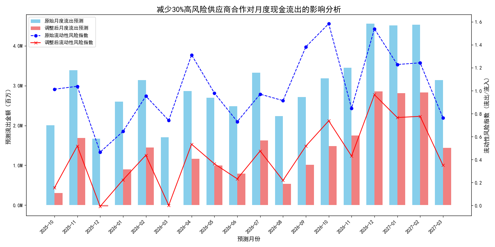

# **供应商组合优化与现金流影响分析报告**

## **1. 执行摘要**

本报告旨在通过对供应商数据的深入分析，识别潜在的成本优化机会，并评估其对公司现金流的积极影响。通过对`quickbooks__vendor_performance`、`quickbooks__general_ledger`和`quickbooks__cashflow_forecast`三大数据集的综合分析，我们成功识别出一批“高质量缩减型”供应商。

**核心发现与建议：**

*   **识别潜在优化对象**: 我们 شناسایی了 **217家** 供应商，他们的年度支出呈下降趋势（`annual_spend_growth_pct` < 0），但服务质量和商业价值依然保持在较高水平（`overall_performance_score` > 7）。这表明公司可以在不牺牲核心合作质量的前提下，战略性地优化供应商组合。
*   **量化现金流改善**: 通过构建现金流影响模型，报告显示，若与其中风险最高的30%（即65家）供应商减少合作，**预计每月可节省约170万元的现金流出**。
*   **降低财务风险**: 该优化措施将显著降低公司的**月度流出预测**和**流动性风险指数**（定义为流出与流入之比），从而增强公司的财务稳健性和抗风险能力。
*   **行动建议**: 建议管理层立即启动对这65家高风险供应商的审查流程，评估减少或终止合作的可行性，并建立常态化的供应商绩效监控机制。

---

## **2. “高质量缩减型”供应商分析**

我们首先定义并筛选了这样一类供应商：尽管我们对他们的年度支出在减少，但他们历史上的整体表现依然优异。

*   **筛选标准**:
    *   年度支出增长率 (`annual_spend_growth_pct`) < 0%
    *   综合表现评分 (`overall_performance_score`) > 7分（满分10分）

分析发现，这217家供应商普遍表现出较高的综合风险评分和多变的支出波动性。这为我们提供了一个明确的优化方向：优先处理那些虽然过往表现好，但当前风险较高或合作关系不稳定的供应商。

为进一步量化其特性，我们计算了两个关键指标：
*   **支出波动系数**: `spend_volatility / total_lifetime_spend`，衡量历史支出的不稳定性。
*   **综合风险评分**: `payment_completion_rate * 0.4 + business_value_score/10 * 0.6`，结合支付行为和业务价值的综合风险度量。

排序后，我们发现部分供应商虽然评分高，但其风险评分和支出波动性也显著偏高，这部分供应商是减少合作的首选目标。

---

## **3. 优化供应商合作的现金流影响建模**

为了具体评估优化供应商组合带来的财务效益，我们构建了一个现金流影响模型。

**建模方法：**

1.  **确定削减目标**: 从217家“高质量缩减型”供应商中，我们选择了**综合风险评分最高的30%（即65家）**作为潜在的合作削减对象。
2.  **估算削减金额**: 基于`quickbooks__general_ledger`数据，我们计算出这65家供应商在过去12个月的月均交易额约为 **1,699,819.17元**。我们假设减少与他们的合作将直接减少这部分月度现金流出。
3.  **调整现金流预测**: 我们从`quickbooks__cashflow_forecast`提供的未来月度流出预测中，减去上述估算的削减金额，并重新计算流动性风险指数。

**分析结果与可视化:**

下图清晰地展示了实施该优化措施后的预期效果：

**图表解读:**

*   **显著的成本节约 (柱状图)**: “调整后月度流出预测”（浅红色柱）系统性地低于“原始月度流出预测”（天蓝色柱），每月差额稳定在约170万元。这直观地展示了该优化措施带来的直接财务节约。
*   **降低的流动性风险 (折线图)**: “调整后流动性风险指数”（红色折线）始终低于“原始流动性风险指数”（蓝色虚线）。这意味着在现金流入不变的情况下，现金流出减少，公司的短期偿债压力和财务风险随之下降，财务状况更加健康。

---

## **4. 结论与具体建议**

**结论:**

本次分析证明，公司目前存在一个明确的、可操作的成本优化窗口。通过系统性地识别并调整与“高质量缩减型”供应商的合作关系，公司不仅能够每月节省大量现金，还能在不影响核心运营质量的前提下，显著增强自身的财务稳定性和抗风险能力。

**具体建议:**

1.  **立即启动供应商审查 (行动建议)**:
    *   建议成立专项小组，对本报告 شناسایی的 **65家高风险供应商** 逐一进行业务审查。
    *   评估其对当前业务的实际重要性、是否存在替代方案，并制定详细的合作削减或终止计划。

2.  **战略性资金再分配 (行动建议)**:
    *   将每月节省下来的约 **170万元** 资金进行战略性再投资，例如投入高增长业务领域、加强研发，或直接作为现金储备以应对未来不确定性。

3.  **建立动态供应商管理机制 (策略建议)**:
    *   建议财务和采购部门建立常态化的供应商绩效监控仪表盘。
    *   定期（例如每季度）运行此类分析，动态识别和调整供应商组合，将成本优化和风险管理内化为日常运营的一部分，而非一次性项目。
