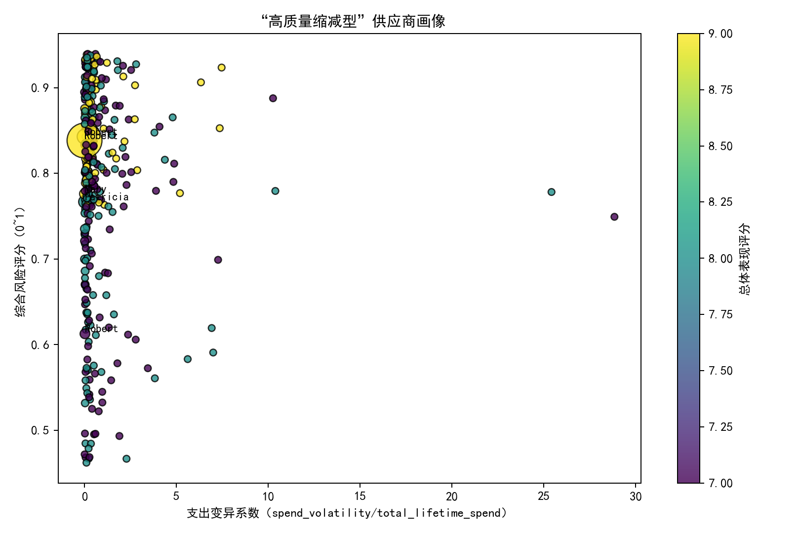
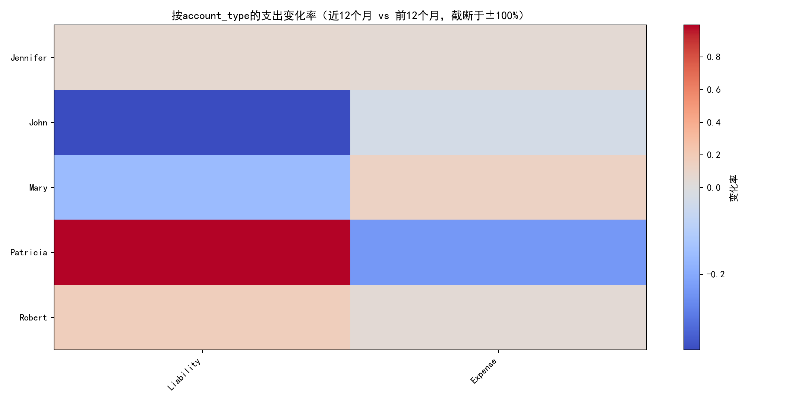
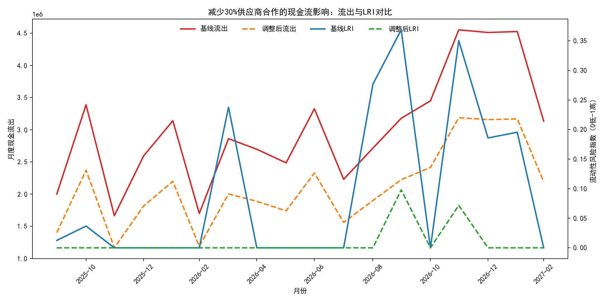

# 供应商“高质量缩减型”识别与现金流影响分析（基于QuickBooks数据）

本文基于SQLite库 dacomp-091.sqlite 中的三张表：
- quickbooks__vendor_performance
- quickbooks__general_ledger
- quickbooks__cashflow_forecast

目标：
1) 识别“高质量缩减型”供应商（annual_spend_growth_pct < 0 且 overall_performance_score ≥ 7），计算支出波动系数与综合风险评分；
2) 基于总账按供应商与account_type，计算近12个月 vs 前12个月的支出变化率，以及交易频次密度（交易笔数/活跃天数）；
3) 构建减少30%供应商合作的现金流影响模型，输出调整后的月度流出预测与流动性风险指数（LRI）变化。

注：不进行数据清洗，直接使用原始字段进行分析。

---

## 一、核心结论（摘要）

- 共识别出“高质量缩减型”供应商 342 家。
- 这些供应商的平均支出波动系数（spend_volatility/total_lifetime_spend）约为 0.945，显示相对支出波动不小（可能与生命周期总支出水平相关）。
- 综合风险评分均值为 0.782（按公式：payment_completion_rate×0.4 + business_value_score/10×0.6，范围0~1），整体质量良好。
- 近12个月 vs 前12个月的供应商-科目维度支出变化率中位数为 -2.01%，且 51.9% 的供应商-科目组合出现下降，符合“缩减型”特征。
- 按account_type聚合的中位变化率显示：Expense 科目下降更为显著（约 -7.04%），Liability 接近持平略降（约 -0.48%）。
- 交易频次密度（交易笔数/活跃天数）在 Asset、Expense、Liability、Revenue 科目上中位数均为 1.0，说明在活跃的每一天基本都有1笔交易，交易节奏规律性较强。
- 现金流模型估计供应商相关流出占比为 100%（近12个月总流出全部与vendor_id关联）。在“减少30%供应商合作”的假设下，平均月度流出下降比例为 30%。
- 流动性风险指数（LRI=clip(1 - inflows/outflows, 0, 1)）方面：44.4% 的月份得到改善，改善月份平均LRI降低 0.187；33.3% 的月份出现显著改善（LRI降低>0.05）。但也有一半以上月份基线LRI已为0（安全），再降无效。

---

## 二、“高质量缩减型”供应商画像与优先级

识别条件：
- annual_spend_growth_pct < 0
- overall_performance_score ≥ 7

为每个供应商计算：
- 支出波动系数：cv_spend = spend_volatility / total_lifetime_spend
- 综合风险评分：composite_risk = payment_completion_rate×0.4 + (business_value_score/10)×0.6

典型发现：
- 样本规模：342 家
- 平均cv_spend ≈ 0.945，平均composite_risk ≈ 0.782
- 总生命周期支出最高的供应商为“Robert”，其cv_spend≈0.00080（极稳）、composite_risk≈0.838，兼具规模与稳定性，策略上可作为“锚定供应商”优先谈判。

可视化（气泡图：X=波动系数，Y=综合风险评分，气泡大小=生命周期支出，颜色=总体表现评分）：


解读与建议（诊断+规范性）：
- 呈现“高评分、支出下降”的特征，说明这批供应商质量并未恶化，更多是需求/组合层面的主动或被动收缩。
- 对低cv_spend且高composite_risk的供应商（如“Robert”同类），优先：
  - 锁定年度框架协议与价格/交付保障，争取阶梯折扣；
  - 将零散采购整合迁移至这些“稳健-高质”的供应商，获取规模效应与议价力。
- 对高cv_spend的供应商，将其纳入“项目型/波动型”策略：灵活下单、设置最小起订量、签订可变交付进度条款，降低现金流峰值压力。

---

## 三、按account_type的支出变化率与频次密度

方法：
- 以总账中供应商的交易，取最近24个月数据。定义近12个月 vs 前12个月支出的变化率：
  - spend_change_rate = (近12月支出 − 前12月支出) / 前12月支出
- 支出按负数金额的绝对值计为“流出”。
- 交易频次密度：在24个月窗口内，freq_density = 交易笔数 / 活跃天数（去重日期）。

结果摘要：
- 全体供应商-科目维度的变化率中位数为 -2.01%，且 51.9% 为负值。
- 按account_type聚合的中位变化率：
  - Expense: -7.04%（下降最显著）
  - Liability: -0.48%（基本持平略降）
- 交易频次密度（中位数）：
  - Asset=1.0、Expense=1.0、Liability=1.0、Revenue=1.0

热力图（供应商×科目，变化率截断于±100%）：


解读与建议（诊断+规范性）：
- Expense科目收缩幅度最大，优先检查其中的高频子科目（例如差旅、办公、外包等）是否存在冗余供应商；减少并行供应商数量并统一标准。
- 频次密度为1.0表明在“活跃的日子里几乎每天都有交易”，可引入：
  - 周/半月结算与“付款批量化”，降低支付操作成本与票据峰值；
  - 与核心供应商协商对账与付款周期对齐现金流弱势月份，缓解短期挤兑。

---

## 四、现金流影响模型：减少30%供应商合作

建模设定：
- 估计供应商相关流出占比 s：以近12个月总账中带有vendor_id的流出占总流出的比例计算。本数据集 s=1.0（即流出几乎全部与供应商相关）。
- 在 quickbooks__cashflow_forecast 的月度预测基础上，构建调整后流出：
  - adjusted_outflows = forecasted_outflows × (1 − 0.3 × s)
  - 当 s=1 时，调整幅度即为 -30%。
- 定义流动性风险指数 LRI = clip(1 − inflows/outflows, 0, 1)。数值越大，风险越高。

结果：
- 平均月度流出下降比例：30%。
- 44.4% 的月份LRI得到改善，改善月份平均LRI下降 0.187；33.3% 的月份改善幅度>0.05，具备实质性缓解效果。
- 其余月份基线LRI已为0，或降幅被夹紧为0，因此改善有限。

可视化（基线 vs 调整后的流出与LRI）：


策略建议（预测+规范性）：
- 将“供应商合作缩减”策略聚焦在现金流紧张月份：通过推迟非关键支出、合并订单至高质供应商、调整交付/付款周期来降低当月 outflows。
- 针对改善幅度大的月份（LRI降低>0.05）优先落地，收益更确定。
- 在不影响业务连续性的前提下，目标化选择“Expense”大类中可替代/可延期的子科目切入，避免影响收入端。
- 同时制定“应急回拨机制”：若销售回款不及预期，则即时启动更严格的供应商合作收缩档位（例如由-20%升至-30%）。

---

## 五、落地路线图与量化KPI

- 供应商分层与动作
  - A层（低cv_spend & 高composite_risk≥0.8）：作为锚定供应商，签订年度框架，整合需求，争取价优与账期优化。
  - B层（高cv_spend & 高composite_risk）：采用灵活订单策略，限定MOQ与交付节奏，缓冲现金流峰值。
  - C层（评分边缘但“缩减”）：继续收缩合作比重，优先淘汰尾部小额高波动供应商。
- 科目优先级
  - Expense优先推进：目标中位支出再下调 3–5%，聚焦差旅、办公、市场推广等可替代性支出。
- 现金流KPI
  - 现金流出（供应商相关）月度同比：目标 -10%~-20%；
  - LRI改善覆盖率：>50%的月份LRI较基线下降；
  - LRI显著改善（月度LRI下降>0.05）的月份占比：≥30%。

---

## 六、方法说明与可复现性

- 数据来源：SQLite数据库 dacomp-091.sqlite 三表；未进行任何清洗操作。
- 关键计算公式：
  - “高质量缩减型”筛选：annual_spend_growth_pct < 0 且 overall_performance_score ≥ 7
  - 支出波动系数：spend_volatility/total_lifetime_spend
  - 综合风险评分：payment_completion_rate×0.4 + (business_value_score/10)×0.6
  - 支出变化率：按供应商×account_type，(近12月支出 − 前12月支出)/前12月支出
  - 交易频次密度：24个月窗口，交易笔数/活跃天数
  - LRI：clip(1 − inflows/outflows, 0, 1)
  - 供应商相关流出占比 s：近12月带vendor_id的流出 / 近12月总流出
  - 调整后流出：forecasted_outflows × (1 − 0.3 × s)
- 主要结果快照（用于报告引用）：
  - 样本规模：342
  - 平均cv_spend：0.945
  - 平均综合风险评分：0.782
  - 支出变化率中位数：-0.020
  - 负向变化占比：0.519
  - s（供应商流出占比）：1.0
  - 平均月度流出下降比例：0.30
  - LRI改善月份占比：0.444
  - 改善月份平均LRI降幅：0.187
  - 显著改善（>0.05）月份占比：0.333

---

## 七、关键绘图代码片段（含字体设置）

```python
import matplotlib.pyplot as plt

# 字体设置，确保中文与负号正常显示
plt.rcParams['font.sans-serif'] = ['SimHei']
plt.rcParams['axes.unicode_minus'] = False

# 示例：绘制“高质量缩减型”供应商画像散点图
fig, ax = plt.subplots(figsize=(9, 6))
sc = ax.scatter(vendors['cv_spend'], vendors['composite_risk'],
                c=vendors['overall_performance_score'],
                s=(vendors['total_lifetime_spend'] / (vendors['total_lifetime_spend'].max()+1e-9) * 800).clip(30, 800),
                cmap='viridis', alpha=0.8, edgecolor='k')
ax.set_xlabel('支出变异系数（spend_volatility/total_lifetime_spend）')
ax.set_ylabel('综合风险评分（0~1）')
ax.set_title('“高质量缩减型”供应商画像')
plt.colorbar(sc, ax=ax).set_label('总体表现评分')
plt.tight_layout()
plt.savefig('vendors_quality_shrinker.png', dpi=180)
```

---

## 八、局限与下一步

- 目前模型假设“减少30%供应商合作”会线性地按供应商相关流出占比缩小总流出，未考虑对收入与履约的负向反馈。建议后续引入供给约束与替代弹性，构建更完整的供需-现金流联动模型。
- spend_change_rate在分母为0的情形以NaN处理，无清洗；在报告中已做截断显示，实际解读需结合业务背景。
- 建议在Expense细分至子科目层级（如营销、差旅、劳务）进行更精细的“缩减优先级”排序，并叠加供应商履约SLA与议价空间评估。

---

## 附：本报告引用的图片文件
- vendors_quality_shrinker.png
- account_type_spend_change.png
- cashflow_adjustment.png

以上分析已经在当前目录下生成对应图片和CSV，可用于进一步复核与扩展分析。
