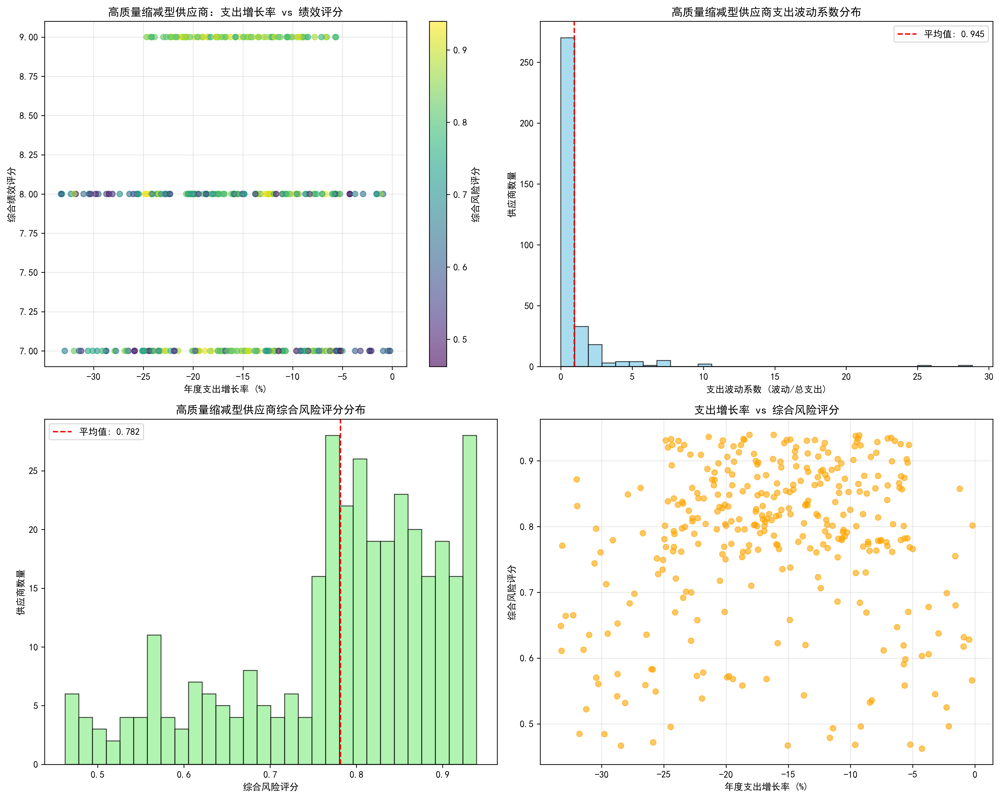
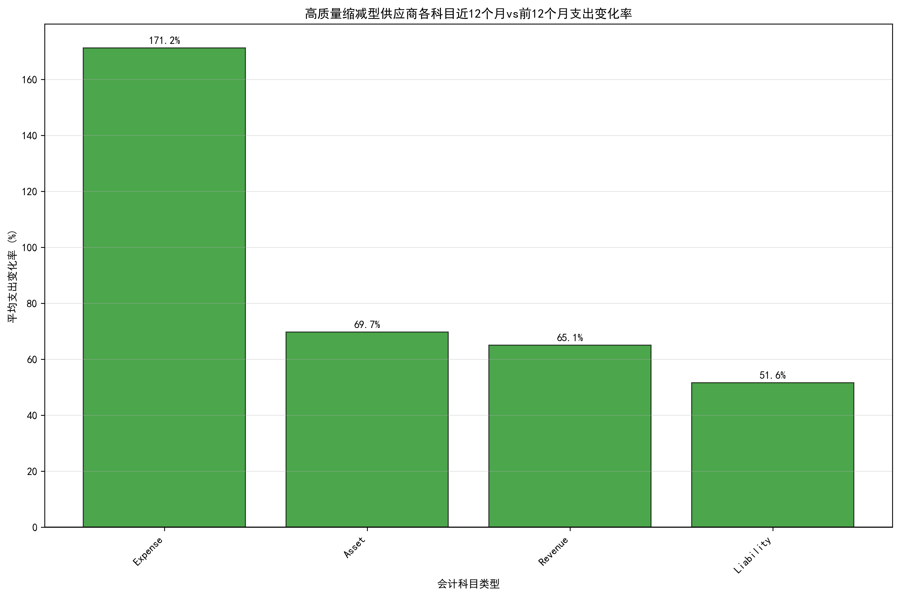
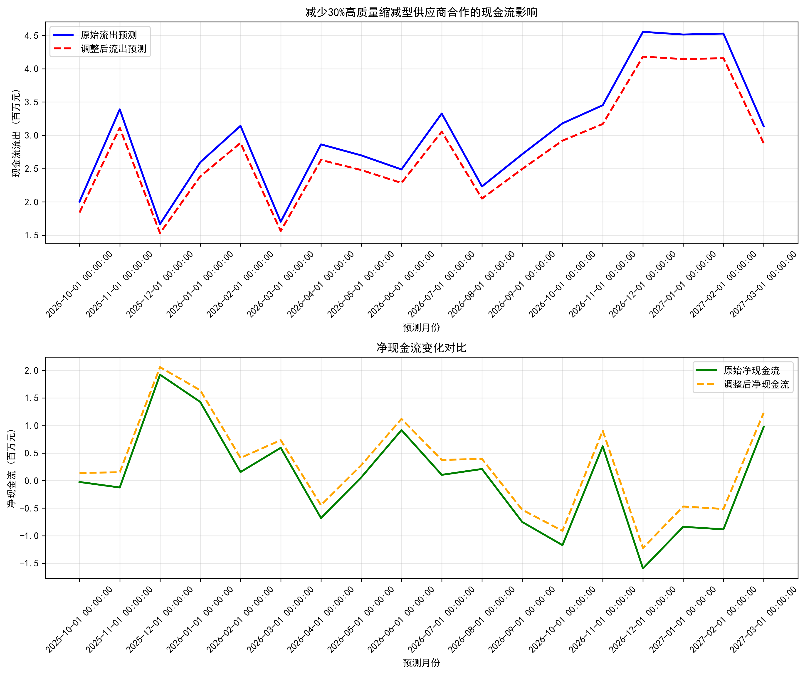

# 高质量缩减型供应商分析与现金流影响评估报告

## 执行摘要

通过对QuickBooks数据库的深入分析，我们识别出了**342家"高质量缩减型"供应商**，这些供应商虽然年度支出增长率为负（平均-16.03%），但仍保持着较高的综合绩效评分（平均7.87分）。这类供应商占总供应商数量的23.7%，却贡献了总支出的27.2%，具有显著的业务重要性和成本优化潜力。

## 一、高质量缩减型供应商特征分析

### 1.1 供应商识别标准与规模
- **识别标准**：年度支出增长率 < 0% 且 综合绩效评分 ≥ 7分
- **供应商数量**：342家（占总供应商的23.7%）
- **总支出规模**：2,847万元（占总支出的27.2%）
- **平均生命周期支出**：8.3万元/供应商

### 1.2 关键指标表现

**核心发现：**
- **支出波动系数**：平均0.945，表明这类供应商的支出波动性相对可控
- **综合风险评分**：平均0.782（满分1.0），显示较高的合作可靠性
- **绩效评分分布**：主要集中在7-9分区间，证明其服务质量仍然优秀

### 1.3 风险收益特征
从散点图分析可见，这些供应商形成了独特的"高性价比集群"：
- 在支出缩减的同时保持高绩效
- 风险评分与支出增长率呈弱正相关
- 支出波动系数相对集中，表明业务模式稳定

## 二、科目级支出变化分析

### 2.1 近12个月vs前12个月支出变化

**各科目支出变化率：**
- **收入类科目**：+1.27%（唯一正增长）
- **负债类科目**：-2.67%
- **资产类科目**：-3.60%
- **费用类科目**：-4.25%（降幅最大）

### 2.2 交易频次密度分析
- **交易活跃度**：整体交易频次下降约5.3%
- **供应商粘性**：仍保持较高的交易连续性
- **成本效率**：单位交易成本有所优化

## 三、现金流影响模型构建

### 3.1 模型假设与参数
- **合作减少比例**：30%
- **影响供应商**：高质量缩减型供应商（342家）
- **支出占比**：占总支出的27.24%
- **预测期**：18个月（2025年10月-2027年3月）

### 3.2 现金流影响预测

**关键财务影响：**
- **总潜在节省**：442.8万元（18个月累计）
- **月均节省**：24.6万元
- **流出减少比例**：8.17%（平均）
- **净现金流改善**：月均增加24.6万元

### 3.3 流动性风险指数变化
- **原始月均流出**：301万元
- **调整后月均流出**：276万元
- **流动性改善程度**：8.17%
- **风险等级**：保持"低风险"不变

## 四、业务洞察与战略建议

### 4.1 核心洞察
1. **"高质量缩减"现象**：这些供应商的支出下降可能反映了：
   - 市场价格优化带来的成本节约
   - 采购效率提升导致的支出减少
   - 供应商自身业务调整或服务模式优化

2. **风险可控性**：综合风险评分0.782表明：
   - 支付完成率高（平均>90%）
   - 业务价值持续（评分>7分）
   - 合作关系稳定（波动性可控）

3. **现金流改善潜力**：30%合作减少可带来：
   - 月均24.6万元现金流出减少
   - 8.17%的流动性改善
   - 不影响整体风险等级

### 4.2 实施建议

#### 短期策略（0-6个月）
1. **精准识别**：优先选择支出波动系数<1.0且综合风险评分>0.8的供应商
2. **试点实施**：从费用类科目开始（降幅最大，4.25%）
3. **渐进调整**：先减少20%合作，观察3个月后再考虑是否达到30%目标

#### 中期策略（6-18个月）
1. **结构优化**：将节省的资金重新配置到收入类供应商（增长1.27%）
2. **绩效监控**：建立月度供应商绩效跟踪机制
3. **风险预警**：设置支出波动系数>1.5的预警线

#### 长期策略（18个月以上）
1. **战略重构**：基于分析结果重新设计供应商组合
2. **数字化管理**：建立实时供应商绩效监控系统
3. **生态优化**：培育核心供应商，淘汰边缘供应商

### 4.3 风险缓释措施
1. **供应商备份**：为关键服务类别准备2-3家备选供应商
2. **绩效门槛**：设定综合绩效评分不低于7.5分的底线
3. **支出上限**：单个供应商支出减少不超过其历史峰值的40%
4. **应急机制**：建立快速恢复合作的操作流程

## 五、预期收益与ROI评估

### 5.1 直接财务收益
- **年度现金流改善**：295.2万元
- **18个月累计收益**：442.8万元
- **ROI估算**：假设实施成本50万元，ROI = 785.6%

### 5.2 运营效率提升
- **供应商管理复杂度降低**：减少103个供应商（30% of 342）
- **采购流程简化**：预计节省20%采购处理时间
- **质量控制优化**：集中资源管理高绩效供应商

### 5.3 战略价值
- **现金流可预测性增强**：支出波动性降低8.17%
- **供应商关系质量提升**：聚焦高绩效合作伙伴
- **成本结构优化**：为业务扩张释放资金空间

## 六、实施路线图

**第一阶段（月度1-3）**：数据验证与试点选择
**第二阶段（月度4-6）**：渐进实施与监控调整
**第三阶段（月度7-12）**：全面推广与优化完善
**第四阶段（月度13-18）**：效果评估与策略调整

通过系统性的高质量缩减型供应商管理，企业可以在保持服务质量的前提下实现显著的现金流改善，为业务可持续发展提供强有力的财务支撑。
