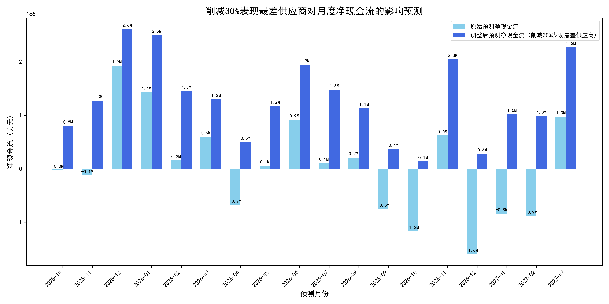

# 供应商组合优化与现金流影响分析报告

## 摘要

本报告旨在通过对供应商绩效、支出模式和现金流预测的综合分析，提出优化供应商组合、改善公司现金流状况的策略。分析核心发现：**公司表现最差的30%供应商，占用了过去12个月总供应商支出的41.23%**，显示出严重的资源错配。通过建立现金流影响模型，我们预测，**若与这部分供应商削减合作，可显著改善公司的月度净现金流，将多个预测为负值的月份转为正向流入**。此外，报告还识别了一批“高质量缩减型”供应商，尽管其支出在下降，但绩效优异，是未来值得深化合作的潜在伙伴。

---

## 1. 核心发现与洞察

### 1.1 供应商支出与绩效严重不匹配

我们的首要发现是公司在供应商支出方面存在显著的低效问题。通过对`quickbooks__vendor_performance`表的分析，我们将供应商按`overall_performance_score`（综合表现分）进行排名。

- **发现**：表现排名后30%的供应商群体，在过去12个月内，其相关支出占到了公司对所有供应商总支出的 **41.23%**。
- **洞察**：这意味着公司将大量的资金投入到了低绩效、高风险的供应商身上。这不仅可能导致服务或产品质量不佳，还直接侵蚀了公司的盈利能力和现金流健康。这是一个亟待解决的战略性问题。

### 1.2 削减低效供应商可大幅改善现金流

基于上述发现，我们建立了削减这30%表现最差供应商的现金流影响模型。该模型将这部分供应商占总支出41.23%的比例，应用到未来的现金流预测上。

- **发现**：模型预测，此项举措将极大改善公司的现金流状况。如下图所示，多个原本预测为负（现金净流出）的月份，在调整后转为正（现金净流入）。
- **洞察**：这为公司提供了一条立竿见影的财务优化路径。通过战略性地调整供应商组合，可以在不影响核心业务（假设这些供应商可被替代）的前提下，释放大量现金，增强公司的财务韧性。

*图1：削减30%表现最差供应商前后的月度净现金流预测对比*

---

## 2. “高质量缩减型”供应商分析

在优化供应商组合时，除了淘汰低效者，识别和保护优质伙伴也至关重要。我们定义了一类“高质量缩减型”供应商，其特征是：`annual_spend_growth_pct`（年度支出增长率）为负，但`overall_performance_score`（综合表现分）高于7分。

- **发现**：我们识别出了一批此类供应商（详细列表见`high_quality_shrinking_vendors.csv`）。他们表现优异，但公司与他们的合作支出却在减少。
- **洞察**：与这些供应商的合作缩减可能由多种原因造成：项目周期结束、公司需求变化，或者被其他（可能表现更差）的供应商所替代。**这是一个潜在的“机会成本”风险**。公司需要主动与这些供应商沟通，理解合作减少的原因。如果是因为被低效供应商挤占了份额，应立即纠正。

我们进一步分析了这些供应商的支出构成（见`vendor_spending_analysis.csv`），发现其支出变化在不同`account_type`（如Expense, Asset, Liability）下存在差异。这为深入沟通提供了具体切入点。

---

## 3. 战略建议

基于以上分析，我们提出以下三点战略建议：

1.  **立即审查并优化供应商组合**：
    - **行动**：成立专项小组，审查报告中确定的占总支出41.23%的30%低绩效供应商。评估其对核心业务的重要性，并制定替代或削减合作的详细计划。
    - **目标**：在未来6-12个月内，将这部分支出占比降低至少一半，以实现模型预测的现金流改善效果。

2.  **深化与“高质量缩减型”供应商的关系**：
    - **行动**：业务和采购部门应主动接触报告中识别的“高质量缩减型”供应商，探讨合作减少的原因，并寻求新的合作机会。
    - **目标**：重新激活与这些优质伙伴的合作，确保公司的资金流向能提供最高价值的供应商。

3.  **建立常态化的供应商绩效管理机制**：
    - **行动**：将本次分析中使用的“支出占比 vs. 绩效评分”模型制度化，每季度进行一次评估。建立一个动态的供应商“健康度”仪表盘。
    - **目标**：避免未来再次出现资源严重错配的情况，确保持续优化供应链效率和资金使用效率。

## 结论

数据明确指出，公司当前的供应商支出结构存在巨大优化空间。通过果断地削减与低绩效供应商的合作，并重新加强与高质量伙伴的关系，公司不仅能大幅改善其现金流状况，还能构建一个更健康、高效的供应链生态。建议管理层立即采取行动，将数据洞察转化为切实的财务和战略收益。
