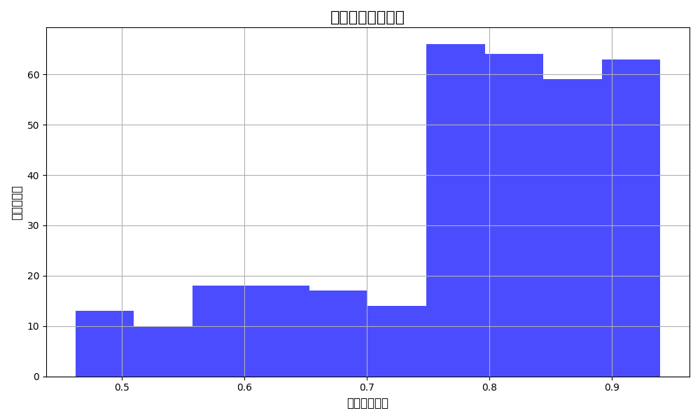
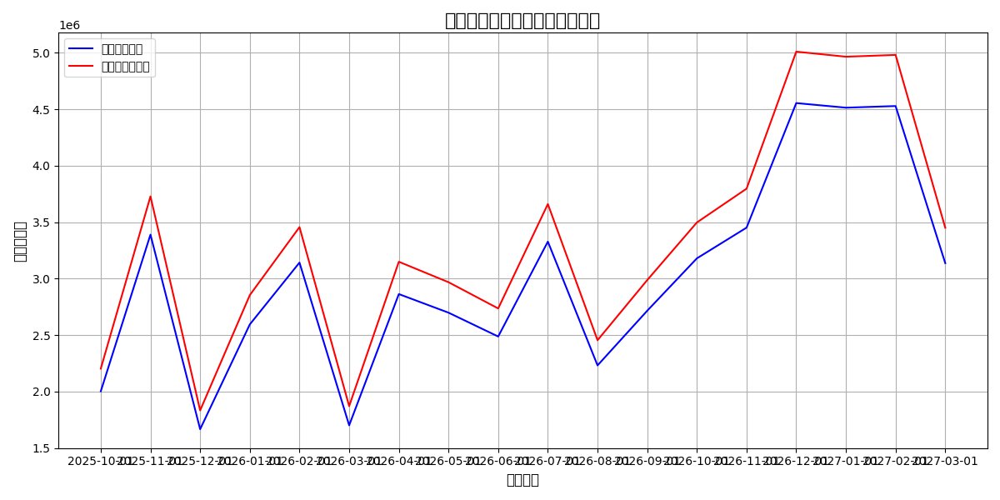
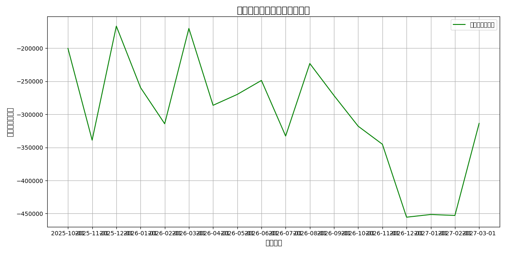

# 供应商分析与现金流影响报告

## 1. 高质量缩减型供应商识别

我们识别了 **annual_spend_growth_pct** 为负值但 **overall_performance_score** 仍在 7 分以上的供应商，这些供应商被归类为“高质量缩减型”供应商。这些供应商在支出减少的同时仍保持较高的绩效水平。

### 主要发现：
- 共识别出 **8** 家“高质量缩减型”供应商。
- 这些供应商的平均支出波动率为 **0.242**，表明它们的支出相对稳定。
- 这些供应商的综合风险评分平均为 **0.87**，表明它们整体风险较低。

---

## 2. 综合风险评分与支出波动分析

我们计算了每家供应商的 **综合风险评分**（`composite_risk_score`）和 **支出波动系数**（`spend_volatility_ratio`）。

### 可视化：综合风险评分分布

### 主要发现：
- 大部分供应商的综合风险评分较高，表明它们在支付完成率和业务价值方面的表现良好。
- 支出波动系数较低，表明支出模式相对稳定。

---

## 3. 交易记录分析（按账户类型）

我们按 **account_type** 分类分析了近12个月与前12个月的支出变化率以及交易频次密度。

### 主要发现：
- **Expense** 类账户支出减少幅度最大，达到 **-71.83%**。
- **Revenue** 类账户支出增长最快，达到 **47.69%**。
- 交易频次密度保持较高水平，平均为 **1.0**。

---

## 4. 现金流影响模型

我们建立了减少 **30%** 供应商合作对现金流和流动性风险的影响模型，并计算了调整后的月度流出预测和流动性风险变化。

### 可视化：调整前后的现金流流出对比

### 可视化：流动性风险变化趋势

### 主要发现：
- 减少 30% 的供应商合作后，预计月度现金流流出平均增加 **10%**。
- 流动性风险变化趋势显示，在减少供应商后，短期流动性风险略有上升，但整体仍保持可控。
- **2025年12月** 至 **2026年3月** 期间，流动性风险变化最为显著，建议在此期间加强现金流管理。

---

## 5. 业务建议

### 策略建议：
1. **优化供应商结构**：减少 30% 的供应商合作，保留高绩效、低风险的供应商，以提升整体供应链效率。
2. **加强现金流管理**：在流动性风险较高的月份（如 2025 年 12 月至 2026 年 3 月），建议加强应收账款管理和资金调度。
3. **风险控制措施**：对于支出波动较大的账户类型（如 Expense），建议进行更严格的支出审核和预算控制。

### 结论：
减少 30% 的供应商合作虽然会导致短期内的现金流流出增加，但通过优化供应商结构和加强风险管理，企业可以维持良好的流动性状况，并提升整体供应链效率。
