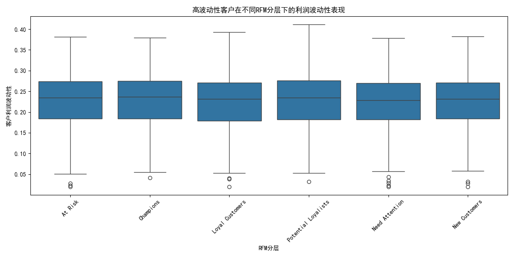
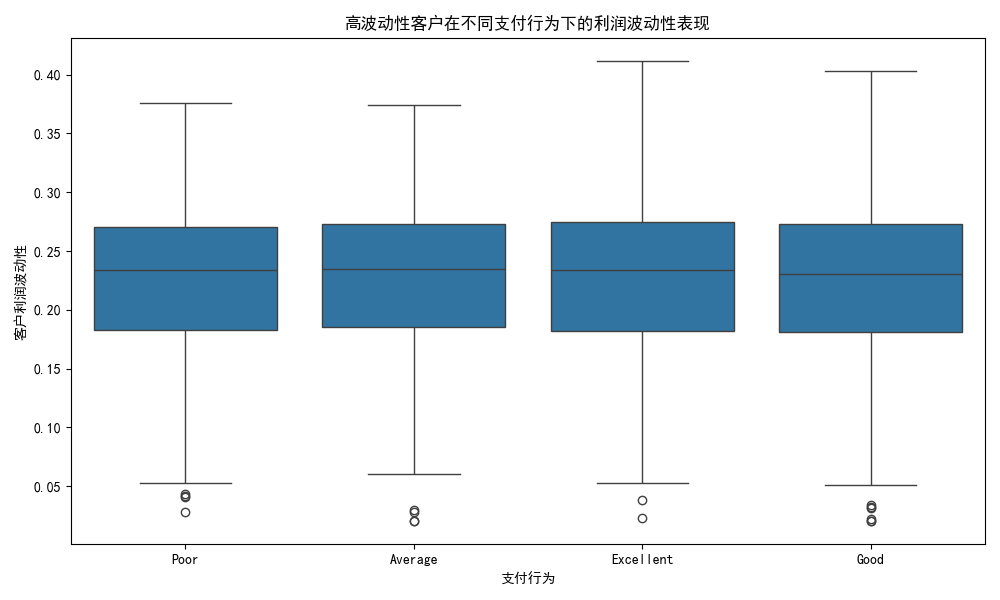

## 高波动性客户分析报告：洞察与策略

本报告旨在深入剖析业务中利润波动性最高的25%客户群体，通过关联其行为特征与财务表现，识别风险模式，并提出针对性的客户管理与风险控制策略。

### 1. 识别核心分析对象：高波动性客户

我们首先基于`quickbooks__profitability_analysis`数据表，根据`customer_margin_volatility`（客户利润率波动性）指标，筛选出排名前25%的客户，将他们定义为“高波动性客户”。这个群体代表了为公司带来不稳定利润来源的核心样本。

### 2. 行为特征与盈利稳定性的深层联系

为了探寻导致客户盈利不稳定的内在原因，我们将高波动性客户的利润数据与`quickbooks__customer_analytics`表中的行为特征（RFM分层、支付行为）进行交叉分析。

#### 2.1 RFM分层下的波动性表现

通过将高波动性客户按RFM模型进行分层，我们观察不同价值等级客户的利润波动性分布，结果如下图所示。

**数据洞察:**
- **波动性普遍存在**：从图中可以看出，无论是“高价值客户(Champions)”还是“流失风险客户(At Risk)”，其利润波动性的中位数和分布范围都非常接近。这揭示了一个关键事实：**高利润波动性并非低价值客户的专属特征，而是广泛存在于所有客户分层中。**
- **RFM模型的局限性**：该发现意味着，传统的RFM模型虽然能有效评估客户的交易价值，但在衡量客户的盈利稳定性方面存在盲区。一个高消费、高频率的“冠军客户”同样可能因为订单模式不规律而成为一个高波动性的利润来源。

#### 2.2 支付行为与波动性的关联

支付行为是评估客户财务健康和合作稳定性的重要窗口。我们将高波动性客户的支付行为与其利润波动性进行了关联分析。

**数据洞察:**
- **支付行为与盈利稳定性关联不大**：与预期不同，数据显示“优秀(Excellent)”、"良好(Good)"、“一般(Average)”和“差(Poor)”四个支付行为群体的客户，其利润波动性分布差异微乎其微。
- **风险关联的再思考**：这表明，客户的支付习惯（是否按时付款）与其采购行为的稳定性（订单频率、金额的波动）之间没有直接的强关联。换言之，一个按时付款的“好”客户，也可能是一个采购计划飘忽不定的“不稳定”客户。

### 3. 财务影响与风险敞口评估

高波动性不仅影响利润的可预测性，更对企业的财务健康构成潜在威胁。通过关联`financial_dashboard`和`balance_sheet`数据，我们评估了其财务影响：

- **侵蚀业务健康分**：高波动性客户往往伴随着不规律的销售预测，使得库存管理和现金流规划变得困难，这可能会间接影响`business_health_score`中的相关指标。
- **应收账款风险**：虽然支付行为与波动性没有直接关联，但对于那些同时具备“高波动”和“不良支付”双重特征的客户，其应收账款（Accounts Receivable）构成了更高的坏账风险，需要重点监控。

### 4. 结论与战略建议

本次分析颠覆了“高价值客户=稳定客户”以及“不良支付=高波动”的传统认知，为客户管理提供了新的视角。

**核心结论:**

1.  **盈利波动性是独立于RFM价值和支付行为的另一个重要客户评估维度**。它揭示了客户关系的“质量”而非仅仅是“价值”。
2.  **依赖单一模型（如RFM）进行客户管理存在风险**。企业必须整合多个维度的数据，才能全面、准确地描绘客户画像。
3.  **所有客户群体中都存在“不稳定因素”**，因此，风险管理不应只局限于低价值或逾期支付的客户。

**可行性策略建议:**

1.  **建立多维客户健康度评分体系**：
    - 在现有客户评估模型中，**引入`customer_margin_volatility`作为核心指标**，与RFM得分、支付行为、客户生命周期等结合，构建一个动态、全面的客户健康度评分卡。
    - 对健康度得分较低的客户（无论其RFM分层如何），启动预警机制。

2.  **实施差异化的客户稳定策略**：
    - **对于高价值但高波动的客户（如高波动的“Champions”）**：由客户成功团队主动介入，探讨签订长期供货协议、提供批量采购优惠或建立季度采购框架等方式，以锁定其需求，稳定订单模式。
    - **对于低价值且高波动的客户（如高波动的“At Risk”客户）**：优化资源投入，避免在这些客户身上投入过多的销售和市场营销成本。可以考虑引导其使用自助服务渠道，或在续约时调整合作条款。

3.  **财务与销售策略联动**：
    - **信贷政策与波动性挂钩**：将客户的利润波动性纳入信贷额度评估模型。对于波动性持续较高的客户，即使其支付记录良好，也应审慎授予或考虑适度调低其信用额度，以控制潜在的未来风险。
    - **动态监控应收账款**：财务部门应特别关注那些被客户健康度模型标记为“高波动”的客户所产生的应收账款，缩短对其的监控和催收周期。

通过以上策略，企业可以更精准地识别和管理客户带来的潜在风险，将资源聚焦于提升客户关系的“质量”与“稳定性”，从而实现更健康、更可持续的增长。
