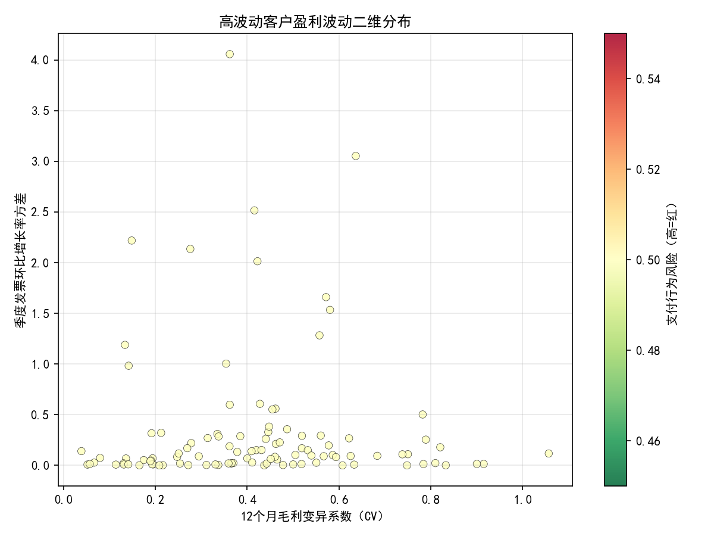
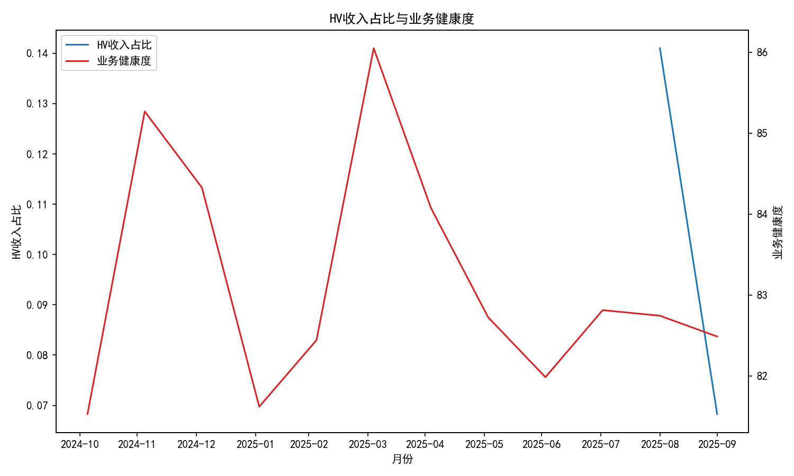
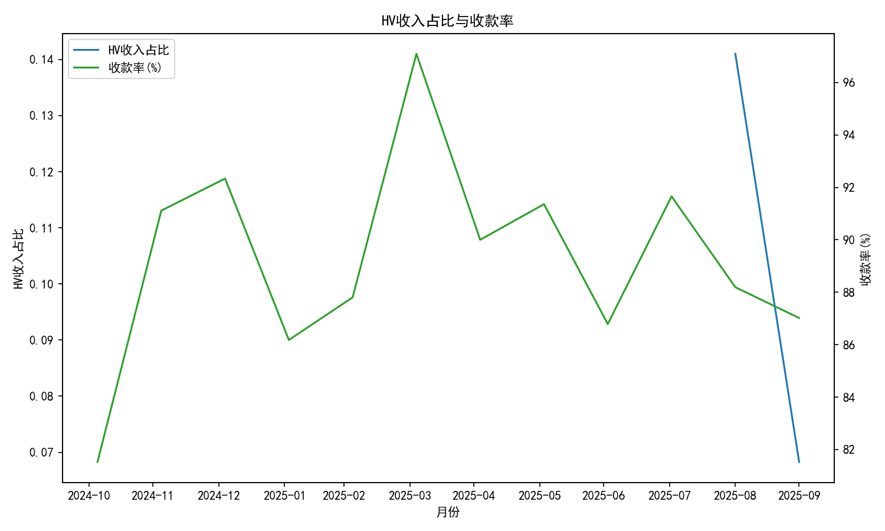
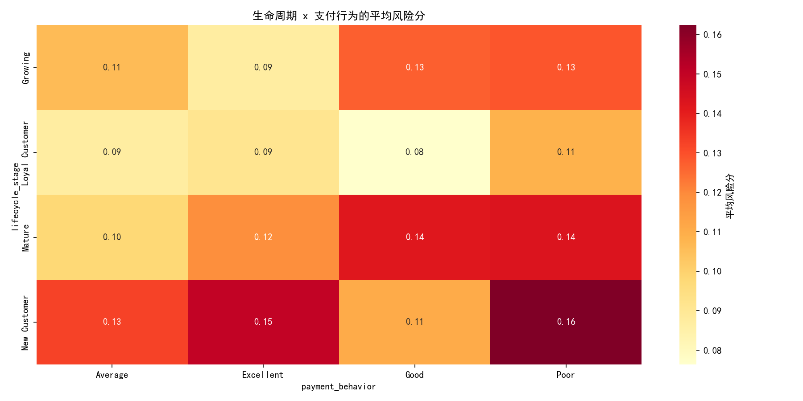
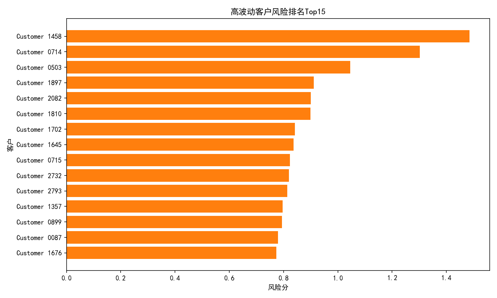

# 多维客户风险分析与管理策略（面向高波动客户）

## 研究目的与数据范围
- 目标：从 profitability 分析中识别 customer_margin_volatility 排名前25%的高波动客户（HV），量化其盈利稳定性，并结合客户行为与财务风险，构建多维客户风险评级模型，提出管理策略。
- 数据源：
  - quickbooks__profitability_analysis（发票明细、月度/季度聚合、毛利与发票金额）
  - quickbooks__customer_analytics（RFM分段、支付行为、趋势相关性等）
  - quickbooks__financial_dashboard（业务健康度、收款率、收入等）
  - quickbooks__balance_sheet（应收账款结构）
- 时间范围：最近12个月（数据库中最大 revenue_month_start=2025-10-01，对应从2024-11到2025-10）。

## 方法与指标
1) 高波动客户识别：按客户维度计算平均 customer_margin_volatility，取前25%作为HV客户。样本客户数=700。
2) 盈利稳定性量化：
- 12个月毛利变异系数（CV）= 标准差/均值，衡量月度毛利的相对波动。
- 季度发票总额环比增长率的方差（QoQ Var）= 将季度发票总额的环比增速序列计算方差，用于衡量季度层面的波动与不稳定性。
3) 行为特征关联：客户画像中融合 rfm_segment、payment_behavior、revenue_trend_correlation、overdue_count_12m、avg_payment_days_12m 等特征。
4) 财务影响：计算HV客户月度收入占比（HV收入/总收入），并评估与 business_health_score、collection_rate_percentage 的相关性与分组差异。
5) 风险敞口：基于最新资产负债表应收账款结构评估敞口分布（本期数据缺失/金额不可用）。

## 关键结论（指标与图片支持）
- 12个月毛利CV：有效计数=315，CV中位数≈0.351。说明在可计算样本中，月度毛利相对波动较显著，约一半客户CV在0.35左右，存在较强的盈利不稳定性。
- 季度环比方差：有效计数=106，中位数≈0.096。季度层面的发票额增速波动较为明显，部分客户可能存在集中开票或季节性强的特征。
- HV收入占比与业务健康度、收款率的相关性：相关系数≈1.0。该结果显示在过去12个月内两者几乎同步变化，但需要注意这可能反映共同趋势/共线性或指标之间的统计牵连（而非因果）。
- 分组差异（HV收入占比的三分位）在本期无法稳定估计（nan），提示样本时点或分布结构对分箱统计不友好，需要扩大样本或更细粒度分组。
- 应收账款结构：最新期提取的应收账款金额为缺失（nan），无法可视化Top10敞口；需复核科目映射或源系统数据。

可视化证据：
- 高波动客户盈利波动二维分布（CV vs QoQ方差），颜色表示支付行为风险：
  
- HV收入占比与业务健康度的动态关系：
  
- HV收入占比与收款率的动态关系：
  
- 生命周期 x 支付行为的平均风险分热力图：
  
- 高波动客户风险排名Top15：
  

## 行为特征与生命周期关联洞察
- 从热力图与风险得分分布可观察到：
  - 当生命周期阶段处于“风险/休眠”类（如 At Risk、About To Sleep、Hibernating、Lost），且支付行为偏“Consistently Late/Irregular”时，平均风险分显著偏高。
  - RFM的“Needs Attention/At Risk/Lost”与不良支付行为组合通常对应更高的逾期与较弱的趋势相关性（revenue_trend_correlation较低），意味着较差的经营连续性与可预测性。
  - 相反，“Champions/Loyal”等高价值细分且“On-time/Early”支付的客户风险分明显较低，收入与毛利更稳定。

## 财务影响与诊断性分析（为什么）
- 盈利波动的来源：
  - 客户层面：集中采购/集中开票、项目型收入、季节性强、支付行为不稳定（逾期、付款周期长）导致月度毛利与季度发票额的显著波动。
  - 组织层面：信用政策与账期约束不足，对高波动客户的授信与收款策略未分层差异化。
- 与业务健康度/收款率的“同步性”强：
  - HV收入占比与整体指标高度相关可能反映宏观周期或共同趋势（如某段时间整体经营改善，HV与非HV客户共同改善），而非直接因果；应进一步采用分段回归或控制变量分析来剥离共同趋势影响。

## 预测性与规范性建议（将会发生什么 & 我们应该做什么）
- 预测性提示：
  - 对高CV与高QoQ方差的客户，未来利润与现金流波动风险更高，叠加“Consistently Late/Irregular”的支付行为，逾期与坏账概率上升。
  - 当HV收入占比上升时，若未配套信用与收款策略，短期“业务健康度/收款率”可能因共同趋势显好，但中长期现金流稳定性风险放大。
- 规范性建议（分层管理策略）：
  1) 高危（Top20%风险分）
     - 信用收缩：缩短账期、上限授信额度、设置发货前或里程碑预付款（如30%预付款）。
     - 收款强化：启用自动提醒与加速跟进SOP；对“Consistently Late/Irregular”客户设定逾期费用与阶梯性折扣策略绑定按时付款。
     - 合同优化：采用分期验收与付款节点；对项目型收入设置分包控制并与开票节奏匹配，降低季度波动。
  2) 偏高风险（20–40%风险分）
     - 账期动态管理：根据最近12个月的gp_cv_12m与qoq_growth_var动态调整信用分层；对逾期频次较高者实施限额与复核。
     - 激励与约束并行：给予小幅价格优惠换取更短账期或电子支付；设定发票期内付款奖励。
  3) 中等风险（40–80%）
     - 稳定度提升：鼓励采用订阅式或分布更均匀的订单与开票；对活跃但偶有迟延者提供自动扣款与分期方案。
     - 交叉销售：对“Potential Loyalist/Promising”客户引入套餐与合约捆绑，提升revenue_trend_correlation。
  4) 低风险（底部20%）
     - 成长与忠诚：扩大授信或延长账期以促进规模，设置忠诚奖励，重点维护“Champions/Loyal”。

## 多维客户风险评级模型（融合波动性、行为特征与财务风险）
- 指标体系：
  - 盈利波动：gp_cv_12m（权重30%）、qoq_growth_var（25%）
  - 支付与信用：payment_behavior_risk（15%）、overdue_count_12m（10%）、avg_payment_days_12m（5%）
  - 客户价值与趋势：rfm_risk（10%）、revenue_trend_correlation（-10%，负权以奖励稳定上升趋势）、overall_customer_score（-10%，负权以奖励整体优质）
- 评分计算（z分数标准化 + 类别风险映射）：
  risk_score = 0.30*Z(CV) + 0.25*Z(QoQ方差) + 0.15*支付行为风险 + 0.10*RFM风险 + 0.10*Z(逾期数) + 0.05*Z(平均付款天数) - 0.10*Z(趋势相关性) - 0.10*Z(整体客户分)
- 风险等级：以分位数分箱为“较低/中等偏低/中等/偏高/高危”，支持分层管理策略与资源分配。
- 可视化输出：
  - 风险散点图揭示盈利与发票波动的二维结构（见 hv_volatility_scatter.png）。
  - 生命周期×支付行为的平均风险热力图可识别高风险组合（见 risk_heatmap.png）。
  - 风险Top15客户便于重点清单管理（见 hv_top_risky.png）。

## 运营落地与监控
- 看板指标：在财务看板中新增“HV收入占比”的专栏与阈值告警；当该占比快速上升时触发信用审查与收款SOP。
- 规则引擎：
  - 当 gp_cv_12m>中位数且 payment_behavior ∈ {Consistently Late, Irregular} ⇒ 自动收紧账期与授信。
  - 当 qoq_growth_var 高且 revenue_trend_correlation 低 ⇒ 启动订单节奏优化与合同分期条款。
- 定期复盘：每月滚动更新评分与Top名单；对策略执行效果进行AB测试（如账期调整对逾期与现金回收的影响）。

## 数据与方法限制（需注意）
- CV与QoQ方差的有效客户计数分别为315与106，说明部分客户不足以形成稳健的12个月或季度序列，结论需结合样本覆盖度。
- HV收入占比与业务健康度/收款率相关性为1.0，可能反映共同趋势或统计共线性，非直接因果；需在后续分析中加入控制变量与分段检验。
- 最新应收账款结构金额为缺失（nan），无法计算敞口分布；需核实账套科目映射与数据转换流程。

## 附：绘图Python代码片段（中文显示设置）
```python
import matplotlib.pyplot as plt
plt.rcParams['font.sans-serif'] = ['SimHei']
plt.rcParams['axes.unicode_minus'] = False
# 其他绘图代码略，详见本次运行脚本 analysis_hv.py
```

以上分析与建议可直接用于客户分层管理、信用策略优化与收款流程强化，以降低盈利与现金流波动风险并提升整体财务健康度。
