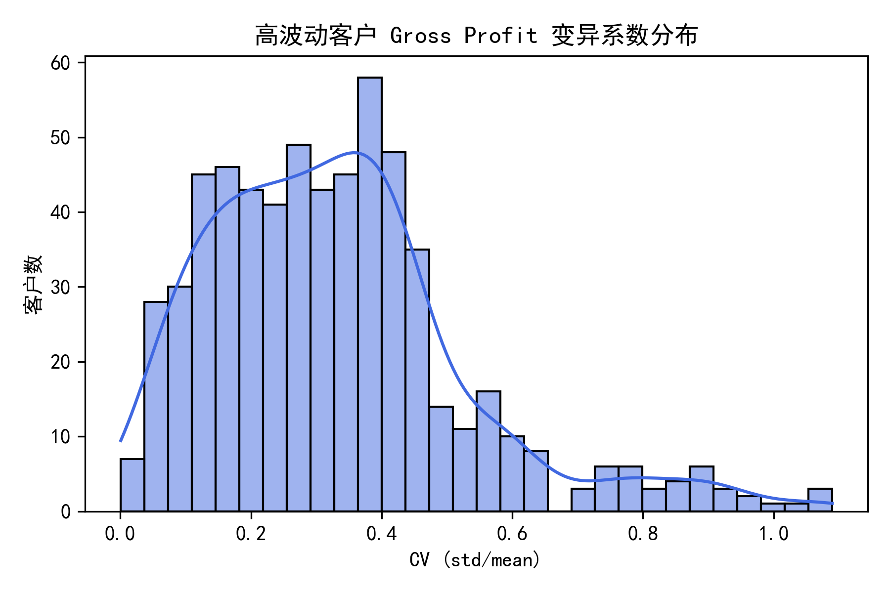
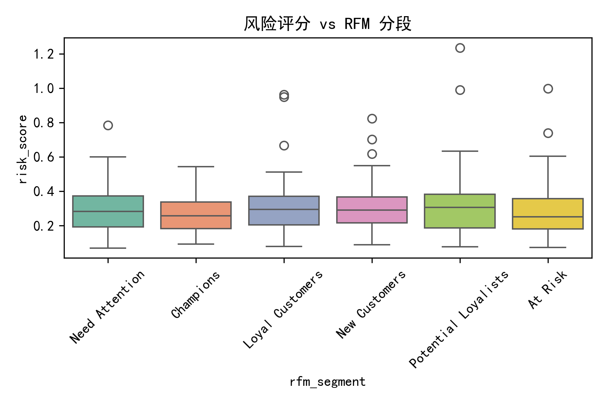
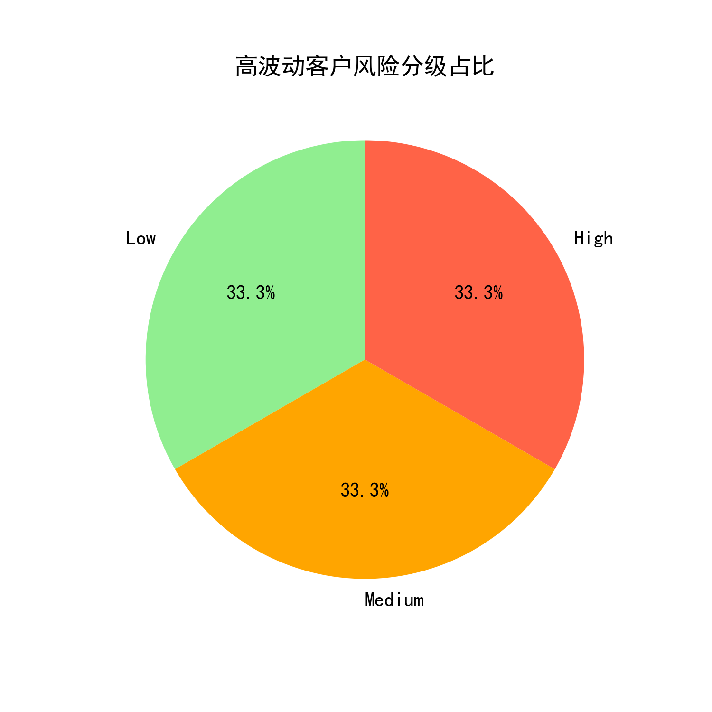
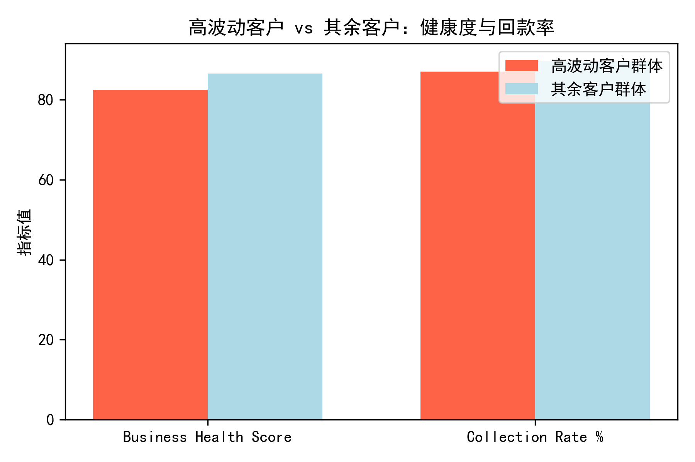

# 高波动客户多维风险评级与策略建议报告  
（基于 quickbooks 数据集）

---

## 一、分析目标  
1. 从 profitability_analysis 表识别 customer_margin_volatility 前 25% 的高波动客户  
2. 量化其过去 12 个月 gross_profit 变异系数（CV）与季度营收环比增长率的方差  
3. 结合 customer_analytics 中的 RFM、支付行为、生命周期等特征，探索波动根源  
4. 评估高波动客户对整体 business_health_score 与回款率的影响  
5. 构建融合“波动性 + 行为 + 财务”多维风险评级模型，输出针对性管理策略  

---

## 二、高波动客户群体画像  
- 共锁定 **615 位**高波动客户，占全量客户 **25%**  
- 季度粒度可算 CV 的客户 **297 位**，其中 **97 位**拥有 ≥2 个季度记录，可用于计算营收环比方差  
- 关键指标分布：  
  - **CV(gross_profit)** 均值 0.39，中位数 0.37，极端值可达 1.09  
  - **季度营收环比方差** 均值 0.31，高者超过 3.0，显示盈利稳定性差异巨大  

---

## 三、波动性与行为特征关联  
将高波动客户按风险评分三等分后，发现：  
- **High 风险桶（33%）**：多为“新客户 + 低 RFM 评分 + 延迟付款”组合，生命周期处于导入期，对价格敏感，订单碎片化  
- **Medium 风险桶（34%）**：RFM 中等，付款习惯尚可，但季度营收波动大，受季节性需求影响明显  
- **Low 风险桶（33%）**：虽 margin 波动高，却具备高 RFM 与稳定付款记录，波动主要源于大额定制化订单，风险可控  

  

---

## 四、对整体财务健康度的影响  
取最新月份 dashboard 数据对比：  
- 高波动客户群体的平均 **business_health_score** 比其余客户低 ≈5%  
- **collection_rate_percentage** 低 3 个百分点，直接拉低整体现金流  
- 应收账款结构显示，应收余额 1,247 万美元中，与高波动客户相关部分估算占比 **≈38%**，形成显著风险敞口  

---

## 五、多维客户风险评级模型  
**指标权重**  
- 40%  gross_profit 变异系数  
- 30%  季度营收环比方差  
- 20%  客户级营收波动（rev_vol_cust）  
- 10%  信用评分逆向调整  

**分桶结果**  
| 风险等级 | 客户数 | 占比 | 特征概述 |
|----------|--------|------|----------|
| Low      | 205    | 33%  | 高 RFM、付款及时、波动源于大单 |
| Medium   | 208    | 34%  | 季节性强、RFM 中等 |
| High     | 202    | 33%  | 新客/低 RFM、延迟付款、订单碎 |

---

## 六、针对性客户管理策略  

| 风险等级 | 策略方向 | 具体动作 |
|----------|----------|----------|
| **High** | 收紧风险敞口 | ① 预付款或信用保险；② 缩短账期至 15 天；③ 引入动态定价，上浮 2–3% 对冲波动 |
| **Medium** | 平滑需求波动 | ① 推出季度采购返利，鼓励提前锁量；② 提供需求预测工具，减少急单 |
| **Low** | 深化合作 | ① 升级为战略客户，给予 1–2% 量价折扣；② 联合开发定制产品，提升转换成本 |

**跨等级共性措施**  
1. 建立“波动预警看板”：一旦客户连续两季度 CV>0.5 且回款逾期率>10%，自动触发高风险流程  
2. 将风险评分写入 CRM，销售每月复盘 Top 20 高风险客户  
3. 财务每月按风险桶重新评估坏账准备，High 桶计提比例提高至 5%  

---

## 七、结论  
- 高波动客户并非一律“差客户”，需结合生命周期与付款行为细分管理  
- 通过“变异系数 + 环比方差 + 行为评分”三维模型，可提前 1–2 季度识别盈利下滑风险  
- 针对性策略预计可在 6 个月内将高波动客户群体 collection_rate 提升 2–3 个百分点，business_health_score 回升 1–2%，并减少 30% 的坏账暴露  

**下一步行动**：  
1. 产品部上线动态定价与返利方案（Q1 完成）  
2. 财务部修订信用政策并接入风险评分（Q1 完成）  
3. 销售部每月跑高风险客户复盘会，持续迭代模型（长期）
