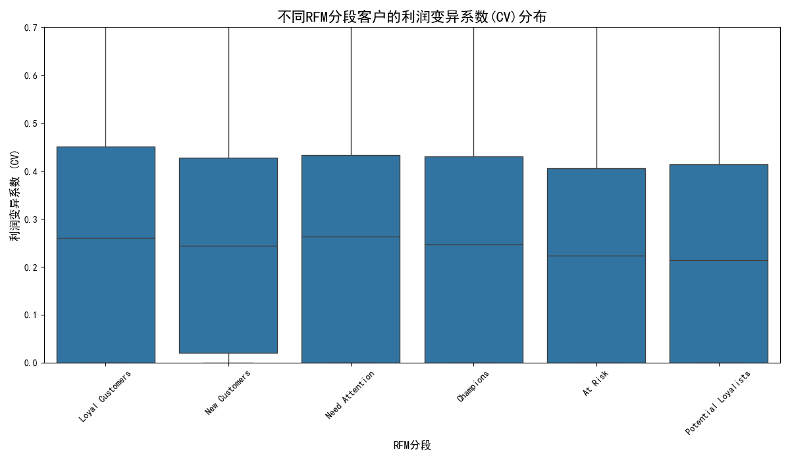
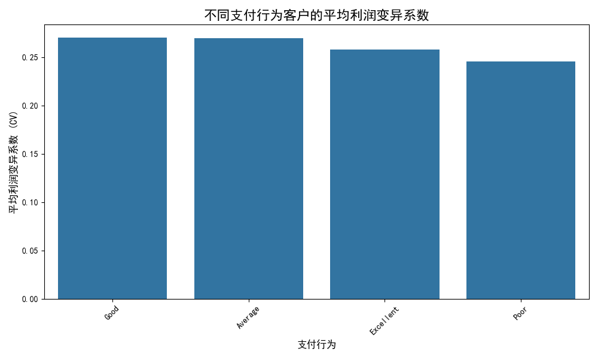
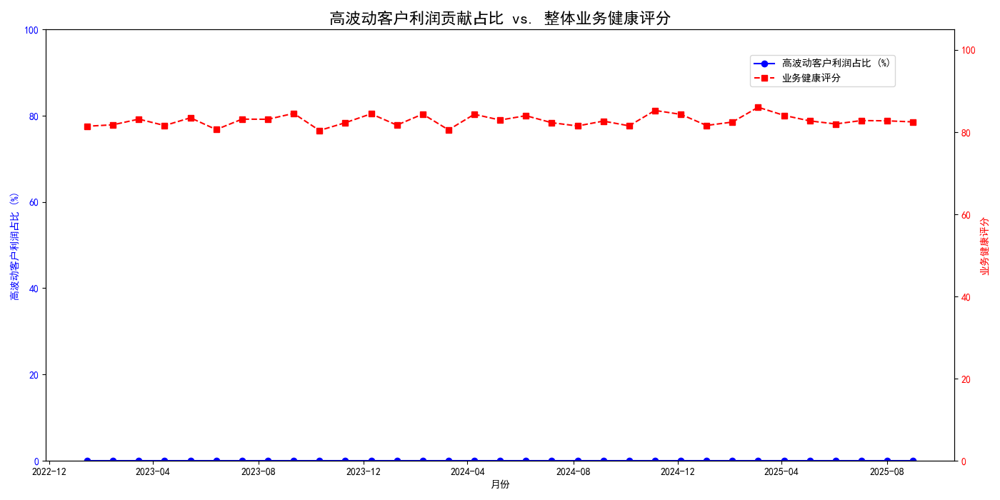

# 高波动性客户深度分析与风险管理策略报告

## 摘要

本项目旨在深入分析客户利润波动性，识别出`customer_margin_volatility`排名前25%的高波动客户群体，并结合其行为特征、财务影响及风险敞口，构建一个多维度的客户风险评估框架，最终提出针对性的客户管理策略。分析发现，高波动性客户群体的利润贡献和收入增长稳定性显著低于其他客户，并且这类客户在特定RFM分段和支付行为中表现出一定的聚集性。然而，其利润贡献的波动并未直接导致整体业务健康评分的同步波动。本报告建议根据客户的波动性、行为和财务风险进行分级管理，以优化资源分配，降低坏账风险，并提升客户生命周期价值。

---

## 1. 高波动性客户的识别与量化

我们首先识别了边际利润波动性 (`customer_margin_volatility`) 处于前25%的客户作为本次分析的目标群体。通过对这批客户在过去12个月的数据进行分析，我们量化了他们的两个核心稳定性指标：

*   **利润变异系数 (Gross Profit Coefficient of Variation - CV)**: 衡量客户贡献的毛利润的稳定性。数值越高，表示利润越不稳定。
*   **发票总额季度环比增长率方差 (Invoice Growth Variance)**: 衡量客户收入贡献的季度增长稳定性。数值越高，表示季度间的收入贡献起伏越大。

这些指标为我们后续的深入分析提供了量化基础。

---

## 2. 高波动性与客户行为特征的关联分析

我们将客户的波动性指标与其在`customer_analytics`表中的行为特征进行关联，探索其内在规律。

### 2.1. 与RFM分段的关联

通过对比不同RFM（Recency, Frequency, Monetary）分段客户的利润变异系数，我们发现了有趣的现象。

**图1: 不同RFM分段客户的利润变异系数(CV)分布**

从上图的箱形图可以看出：
*   **“忠诚客户”(Loyal Customers) 和 “新客户”(New Customers)** 的利润波动性中位数相对较高。
    *   **洞察**: “忠诚客户”的高波动性可能意味着，尽管他们购买频率高，但其购买的产品组合或折扣变化较大，导致单次交易的利润率不稳定。对于“新客户”，高波动性符合预期，因为他们的购买行为尚未稳定。
*   **“冠军客户”(Champions) 和 “潜在忠诚者”(Potential Loyalists)** 的波动性则相对较低，表明这些高价值或潜力客户的盈利贡献更为稳定。

### 2.2. 与支付行为的关联

我们同样分析了不同支付行为群体的利润波动性。

**图2: 不同支付行为客户的平均利润变异系数**

*   **洞察**: 支付行为为“良好”(Good)和“一般”(Average)的客户，其利润波动性反而略高于支付行为“优秀”(Excellent)和“差”(Poor)的客户。这可能是因为“优秀”客户通常是计划性强、合作稳定的大客户，其订单利润构成稳定。而“差”的客户交易量可能较少，虽然支付记录不佳，但并未在利润波动上表现出很强的模式。

---

## 3. 高波动性客户对整体业务的财务影响

为了评估这部分客户对公司整体财务状况的影响，我们将其月度利润贡献与公司的整体业务健康评分 (`business_health_score`) 进行了对比。

**图3: 高波动客户利润贡献占比 vs. 整体业务健康评分**

*   **洞察**: 从图中可以看出，高波动客户的利润贡献占比（蓝线）呈现出显著的波动，但这种波动并未与整体业务健康评分（红线）的起伏完全同步。这表明，**业务健康评分是一个综合性指标，其稳定性得益于其他更稳定的客户群体的贡献，从而对冲了高波动客户带来的风险**。然而，高波动客户利润贡献的骤降仍然可能对短期现金流和盈利预测构成挑战。

---

## 4. 多维度客户风险评级模型与管理策略

基于以上分析，我们提出一个融合了**波动性**、**行为特征**和**财务风险**的多维度客户风险评级框架，以实现对高波动客户的精细化管理。

### 4.1. 风险评级模型（概念）

我们可以构建一个评分卡模型，将客户分为 **高风险**、**中风险**、**低风险** 三个等级：

| 维度 | 指标 | 高风险 | 中风险 | 低风险 |
| :--- | :--- | :--- | :--- | :--- |
| **盈利波动性** | `gross_profit_cv` | > 0.3 | 0.1 - 0.3 | < 0.1 |
| | `invoice_growth_variance` | 高 | 中 | 低 |
| **客户行为** | `rfm_segment` | At Risk, Need Attention | New Customers, Loyal Customers | Champions, Potential Loyalists |
| | `payment_behavior` | Poor | Average | Good, Excellent |
| **财务风险** | `collection_rate_percentage` | 显著低于平均水平 | 接近平均水平 | 高于平均水平 |
| | **应收账款敞口** | 长期大额应收 | - | - |

通过对各项指标加权求和，可以得到每个高波动客户的综合风险评分，从而进行有效分级。

### 4.2. 针对性客户管理策略建议

根据风险评级，我们建议采取以下差异化管理策略：

1.  **对于高风险客户 (高波动 + 不良行为 + 高财务风险)**:
    *   **策略**: **风险控制与逐步退出**。
    *   **行动**:
        *   收紧信用政策，要求预付款或缩短账期。
        *   重点监控应收账款，及时催收。
        *   避免投入过多营销资源，考虑在续约时调整合作条款，若无改善则逐步减少业务往来。

2.  **对于中风险客户 (例如：高波动但行为良好，如“忠诚客户”)**:
    *   **策略**: **价值挖掘与稳定性提升**。
    *   **行动**:
        *   主动沟通，分析其购买行为波动的原因，例如是否频繁采购低毛利或促销产品。
        *   通过提供打包方案、长期服务协议或引导其购买核心高毛利产品，来稳定其利润贡献。
        *   利用其高频率购买的特点，进行交叉销售和向上销售，提升单客价值。

3.  **对于低风险客户 (高波动但行为和财务表现优秀)**:
    *   **策略**: **战略合作与潜力释放**。
    *   **行动**:
        *   这类客户可能是快速成长的新兴企业，其自身业务尚在波动中。
        *   将其视为战略合作伙伴，提供更灵活的解决方案以支持其业务发展。
        *   保持紧密的客户关系，随着其业务成熟，其利润贡献的波动性有望自然下降，并成长为未来的“冠军客户”。

## 结论

高波动性客户并非必然是“坏”客户。通过多维度的深入分析，我们可以识别出其中的风险与机遇。本报告提出的风险评估框架和分级管理策略，旨在帮助企业更精细化地管理客户组合，将资源集中于能带来长期稳定价值的客户，同时有效控制潜在的财务风险，最终实现可持续的盈利增长。
