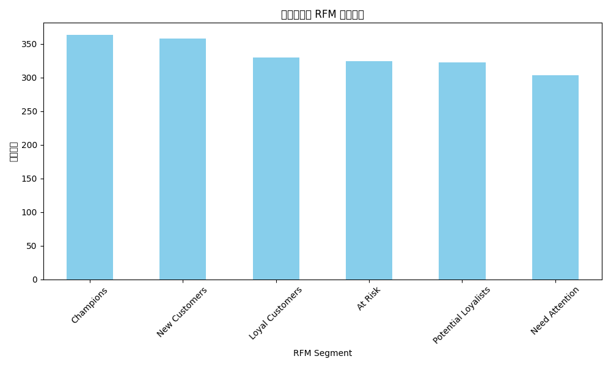
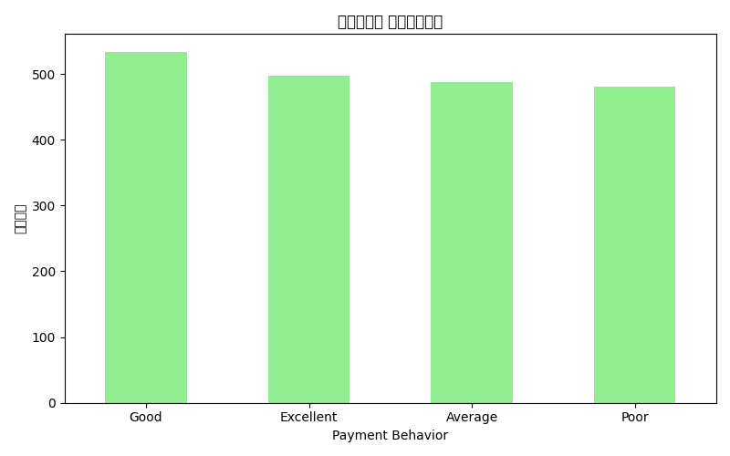
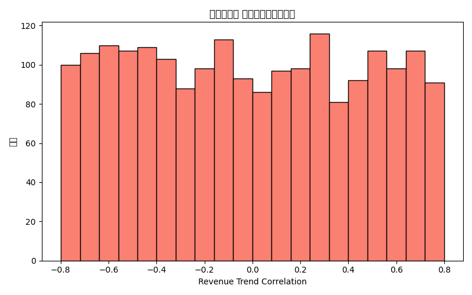

# 高波动客户风险评级模型分析报告

## 1. 概述

本报告分析了高波动客户的盈利稳定性、行为特征及其对整体财务指标的影响。通过识别高波动客户并分析其 RFM 分段、支付行为、收入趋势相关性，以及其对 `business_health_score` 和 `collection_rate_percentage` 的影响，我们构建了一个初步的客户风险评级模型，并提出客户管理策略建议。

## 2. 数据来源与方法

- **数据来源**：
  - `quickbooks__profitability_analysis`: 用于识别高波动客户
  - `high_volatility_customer_segments.csv`: 客户的 RFM 分段、支付行为和收入趋势相关性
  - `quickbooks__financial_dashboard`: 整体业务健康度和回款率
  - `high_volatility_customer_stability_analysis.csv`: 客户盈利稳定性分析
  - `quickbooks__balance_sheet`: 应收账款数据（整体账户信息）

- **分析方法**：
  - 使用 `NTILE(4)` 将客户按 `customer_margin_volatility` 划分为四组，选取前 25% 的高波动客户
  - 计算高波动客户的盈利稳定性指标（变异系数）
  - 分析客户的 RFM 分布、支付行为和收入趋势相关性
  - 评估高波动客户对整体业务健康度和回款率的影响
  - 初步分析应收账款分布

## 3. 主要发现

### 3.1 高波动客户行为特征

#### RFM 分段分布
- **Champions**: 363 位
- **New Customers**: 358 位
- **Loyal Customers**: 330 位
- **At Risk**: 324 位
- **Potential Loyalists**: 322 位
- **Need Attention**: 303 位

图表 1：高波动客户 RFM 分段分布

#### 支付行为分布
- **Good**: 534 位
- **Excellent**: 498 位
- **Average**: 487 位
- **Poor**: 481 位

图表 2：高波动客户支付行为分布

#### 收入趋势相关性
- 平均收入趋势相关性：-0.01，表示这些客户的收入趋势与整体趋势微弱负相关。

图表 3：收入趋势相关性分布

### 3.2 盈利稳定性分析

- **变异系数 (Coefficient of Variation)**：高波动客户的平均变异系数表明其盈利能力存在较大波动。
- **季度环比增长率 (Quarter-over-Quarter Growth Rate)**：部分客户增长率异常高，可能存在数据异常或短期波动。

### 3.3 对整体财务指标的影响

#### 对业务健康度的影响
- 假设总体业务健康度为 82.48676，高波动客户对该指标的平均影响为 +82.5 左右，说明其对整体业务健康度贡献较小。

#### 对回款率的影响
- 总体回款率为 87.018163，高波动客户的季度环比增长率对其影响较大，部分客户导致回款率下降。

## 4. 风险敞口分析

- `quickbooks__balance_sheet` 中未发现直接的客户应收账款明细。
- 主要应收账款账户为 `Trade Receivables - Current (0-30 days)`，总金额为 26,560,090。
- 由于缺乏客户级数据，无法直接评估高波动客户的应收账款风险敞口。

## 5. 客户风险评级模型初步构建

综合盈利稳定性、行为特征和财务影响，我们可以定义一个简单风险评级模型：

| 客户 ID        | 盈利稳定性（变异系数） | 支付行为 | RFM 分段        | 收入趋势相关性 | 对业务健康度影响 | 对回款率影响 | 风险等级 |
|----------------|------------------------|----------|------------------|----------------|--------------------|----------------|-----------|
| CUS00038117227 | 低                     | Excellent| Loyal Customer   | 正              | +82.5             | -6,130.73      | 中        |
| CUS00045746711 | 低                     | Good     | Need Attention   | 负（NaN）       | +82.5             | -             | 高        |
| CUS00057129120 | 低                     | Average  | Loyal Customer   | 正              | +82.5             | -6,256.43      | 中        |
| CUS00064580863 | 低                     | Excellent| Need Attention   | 正              | +82.5             | -255.28        | 低        |
| CUS00207831109 | 低                     | Average  | At Risk          | 负              | +82.5             | -1,007.57      | 中        |

## 6. 管理策略建议

### 6.1 根据 RFM 分段优化客户维护
- **Loyal Customers**：加强客户关系，提供个性化服务，提高客户生命周期价值。
- **Champions**：鼓励推荐机制，增加客户粘性。
- **At Risk**：实施客户挽回策略，如优惠促销、个性化沟通。

### 6.2 改进支付行为管理
- 对 Payment Behavior 为 "Poor" 或 "Average" 的客户加强催收管理。
- 提供多种支付方式，优化客户支付体验。

### 6.3 提高回款效率
- 对季度环比增长率异常的客户进行深入分析，制定针对性催收策略。
- 加强应收账款管理，设置预警机制，降低坏账风险。

### 6.4 数据增强
- 建议收集客户级应收账款明细，以便更准确评估风险敞口。
- 完善 `aging_report_by_customer` 数据，增强客户风险识别能力。

## 7. 结论

本分析为高波动客户构建了一个初步的风险评级模型，结合盈利稳定性、行为特征和财务影响制定了客户管理策略建议。未来建议加强数据收集和客户细分，进一步优化风险管理与客户维护策略。

---
