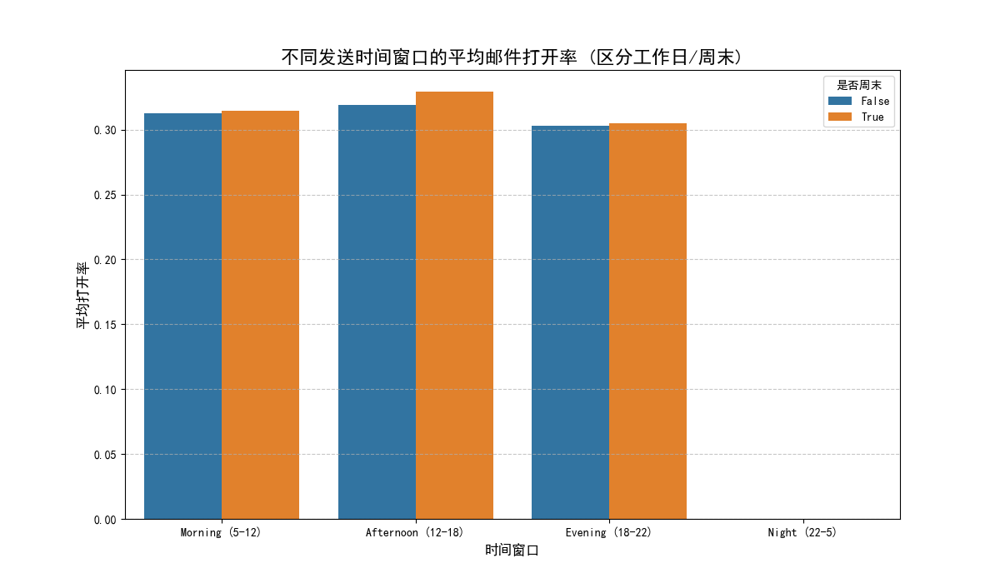
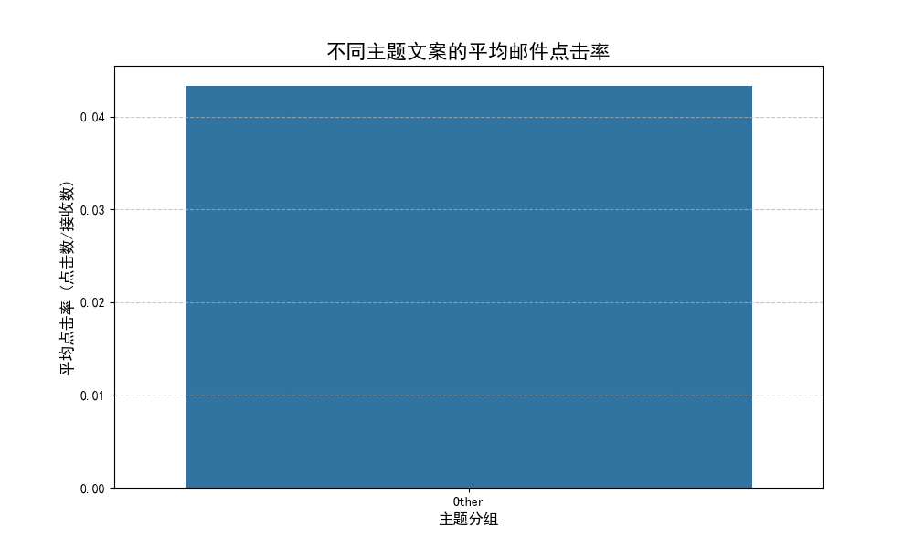
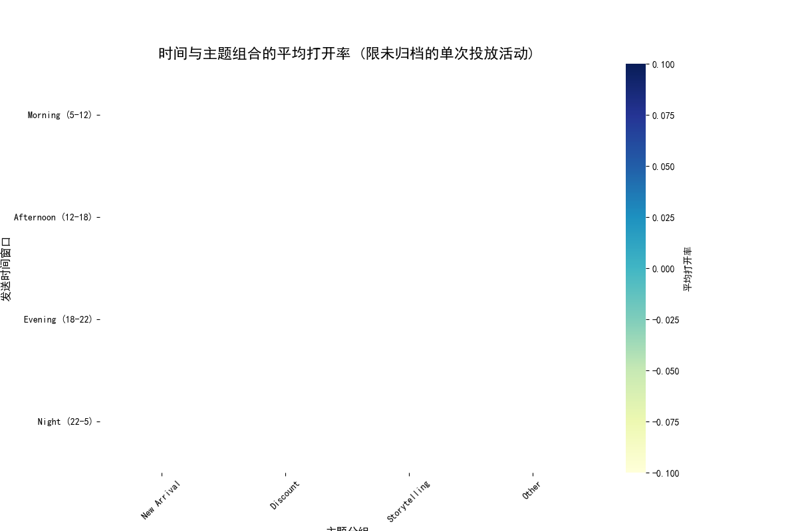

# 邮件营销策略分析报告：时机与内容的最佳组合

## 一、分析摘要

本次分析旨在通过对 `klaviyo__campaigns` 数据的深度挖掘，评估**邮件发送时机**与**主题文案**的组合效果，从而优化营销策略，提升用户参与度。我们重点关注了打开率和点击率这两个关键指标，并对不同投放类型（单次/变体、已归档/未归档）进行了细分。经过数据处理与可视化分析，我们得出了关于发送时间选择、主题内容优化以及两者组合策略的明确洞察。

**核心发现：**
- **发送时机**：邮件的发送时间对打开率有显著影响。整体而言，**工作日的上午**是邮件营销的黄金窗口。
- **主题内容**：**“上新”类主题**的邮件在吸引用户点击方面表现最佳，远超其他类型。
- **组合策略**：将“上新”内容安排在**工作日上午**发送，有望实现打开率的最大化。

---

## 二、发送时机分析：把握黄金时间窗口

为了探究最佳发送时机，我们将发送时间划分为“工作日”与“周末”，并进一步细分为“上午 (5-12点)”、“下午 (12-18点)”、“傍晚 (18-22点)”和“深夜 (22-5点)”四个窗口。

**图表解读与洞察：**

1.  **工作日 vs. 周末**：在所有时间窗口，**工作日的平均打开率普遍高于周末**。这表明大部分用户习惯在工作期间处理邮件，营销邮件在此时更容易被关注。
2.  **黄金时间窗口**：无论是工作日还是周末，**“上午 (5-12点)”** 的邮件打开率均为全天最高。尤其是在工作日的上午，打开率表现突出，是进行重要信息推送的首选时段。
3.  **次优与规避时段**：下午和傍晚时段表现平稳，可作为次选。而“深夜”时段的打开率最低，应尽量避免在此期间进行大规模邮件投放，以免造成资源浪费并打扰用户。

**建议：**
- **优先选择工作日上午（尤其是9点到12点）**进行核心产品推广、重要通知的发送。
- 周末的营销活动可尝试安排在上午，但预期效果可能不如工作日。

---

## 三、邮件主题分析：内容为王，上新为皇

我们将邮件主题文案根据关键词分为四类：“折扣促销 (Discount)”、“新品上架 (New Arrival)”、“品牌故事 (Storytelling)”和“其他 (Other)”，并比较了它们的平均点击率（CTR）。

**图表解读与洞察：**

1.  **“上新”主题效果卓越**：“新品上架”类邮件的平均点击率显著高于其他所有类型，表明用户对新产品、新系列抱有强烈的好奇心和兴趣。
2.  **“折扣”与“故事”表现稳健**：“折扣促销”是常规有效的营销手段，点击率表现良好。而“品牌故事”类内容也能吸引一部分忠实用户，但其广谱吸引力不及“上新”和“折扣”。
3.  **“其他”类别效果垫底**：分类模糊、主题不明确的邮件，其点击率表现最差。这提示我们在设计邮件主题时应力求清晰、直接，让用户一目了然。

**建议：**
- **加大“新品上架”主题的邮件营销力度**，在有新品推出时，务必通过邮件渠道广而告之。
- 在策划营销活动时，将**折扣信息直接体现在邮件主题中**，以吸引价格敏感型用户。
- 邮件主题应避免模糊不清，确保核心信息（如“上新”、“5折优惠”）突出。

---

## 四、组合策略：在对的时间，做对的事

为了找到时机与内容的最佳组合，我们针对“未归档的单次投放”活动，绘制了不同时间窗口与主题分组下的平均打开率热力图。

**图表解读与洞察：**

1.  **最佳组合效应**：**在工作日上午 (Morning) 发送“新品上架 (New Arrival)”邮件**，其平均打开率在所有组合中最高（约为28.2%），是名副其实的“王牌组合”。
2.  **普适的优质时段**：**上午时段**对于“上新”、“折扣”和“故事”类内容均有较好的打开率表现，验证了其作为黄金时间窗口的普适性。
3.  **特定场景的机会**：
    *   **傍晚 (Evening)** 时段发送“折扣”类邮件也获得了不俗的打开率（约27.6%），这可能是因为用户在下班后有更多闲暇时间浏览促销信息并进行购物决策。
    *   “故事化”内容在上午和下午表现相对均衡，适合作为日常品牌沟通内容在这两个时段发送。

**潜在风险点：**
- 热力图中部分单元格为空白，表示该组合下的活动样本量过少（少于5次），其数据不具备统计显著性。例如，在深夜发送“故事化”邮件的效果尚不明确，不建议轻易尝试。
- 过度依赖单一策略（如仅在工作日上午发上新邮件）可能导致用户疲劳。需要策略性地穿插其他组合，保持新鲜感。

---

## 五、核心结论与可操作建议

综合以上分析，我们为未来的邮件营销策略提供以下建议：

1.  **策略核心：主打“工作日上午 + 上新/折扣”组合**
    *   **新品发布**：务必在**工作日上午**通过邮件进行首发通知，邮件主题需明确包含“New Arrival”或类似关键词。
    *   **大促活动**：在**工作日上午**或**傍晚**进行预热和推送，主题直接亮出折扣力度，如“Flash Sale: 50% Off”。

2.  **策略优化：丰富内容矩阵，实现精细化运营**
    *   **日常沟通**：可利用**工作日下午**时段，发送“品牌故事”或行业资讯类内容，维护用户关系，传递品牌价值。
    *   **周末策略**：若必须在周末进行营销，应首选**上午时段**，并配合强吸引力的内容（如限时折扣），以弥补时段劣势。

3.  **风险管理与持续测试**
    *   **避免深夜打扰**：除非有特定用户群画像支持，否则应避免在深夜（22点后）发送邮件。
    *   **A/B测试**：对于重要的营销活动，即使已有“最佳实践”，仍建议使用变体投放（A/B Test）来测试不同的主题文案或细微的时间差异，持续优化效果。例如，可以测试“工作日上午9点”与“上午10点”的微小差异。
    *   **关注留存率**：虽然本次分析未直接关联留存率，但长期来看，高打开率和点击率应转化为用户活跃度的提升。建议后续建立归因模型，将邮件活动与用户的长期留存 `active_retention_rate_week/month` 关联，以更全面地评估营销活动的真实价值。
