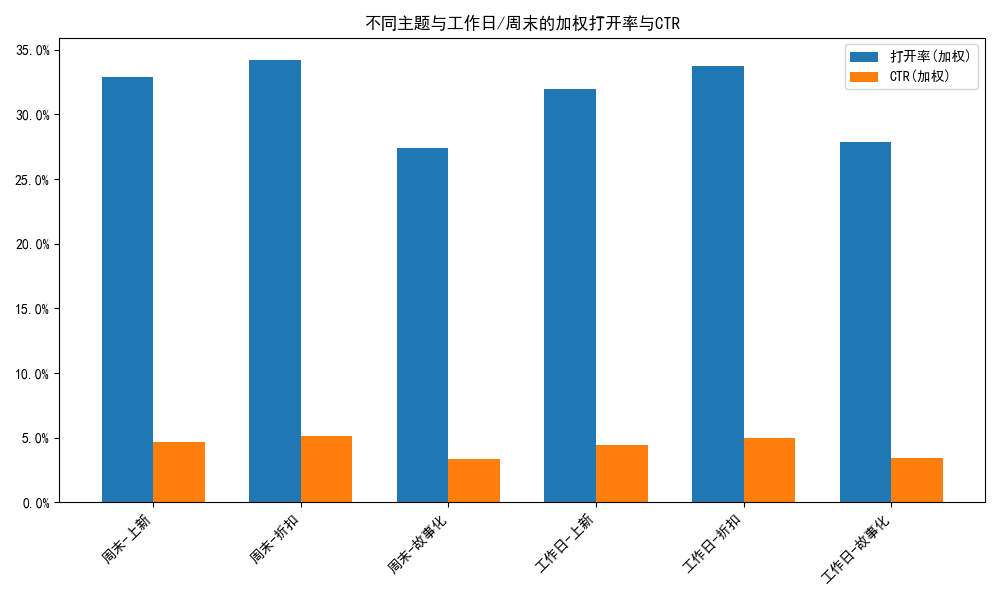
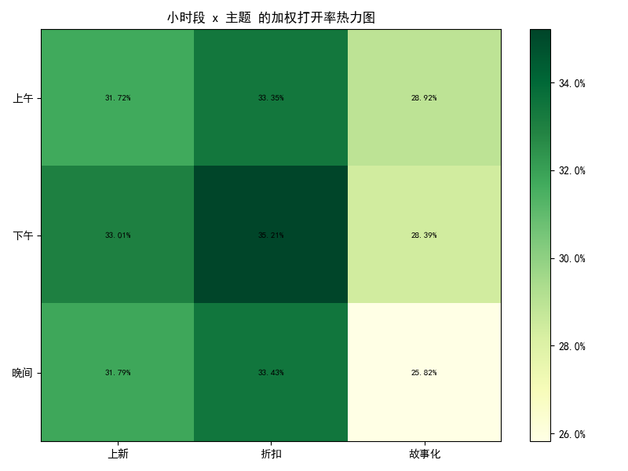
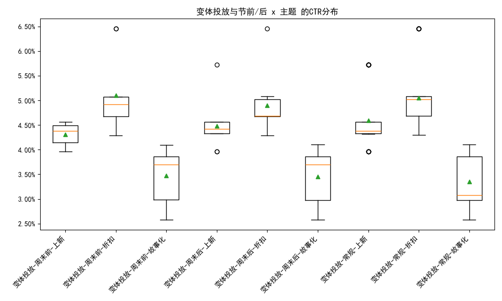
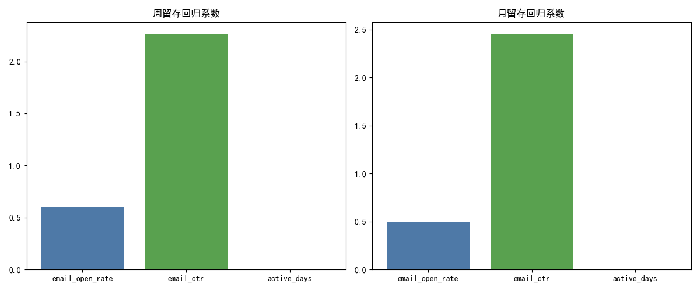

# 邮件投放时机 × 主题文案 的交互效应评估（基于 Klaviyo 行为数据）

## 摘要
- 基于 klaviyo__campaigns 与 klaviyo__persons，我们评估了发送时间窗口（工作日/周末、上午/下午/晚间、节前/后）与主题文案（折扣、上新、故事化）的交互对打开率、点击率（CTR）与活跃留存（周/月）的影响。
- 方法上进行了必要的去噪（排除 count_received_email 的顶部1%与底部1%异常值），并以 total_count_unique_people 进行加权以控制投放对象规模。
- 结果显示：
  - 周末整体优于工作日，折扣与上新主题在下午与晚间表现突出；故事化主题整体显著低于折扣/上新。
  - 已归档活动的加权打开率与CTR高于未归档（可能存在选择偏差）；数据中主要是“变体投放”。
  - 人员层面的回归显示：CTR对周/月留存的边际影响显著大于打开率。
- 策略建议：将折扣与上新主题优先安排于“周末+下午/晚间”，故事化内容转向高活跃/高留存人群的培育场景；建立变体测试的护栏与频控，注意折扣依赖的潜在风险。

---

## 数据与口径
- 数据来源：/workspace/dacomp-093.sqlite
  - klaviyo__campaigns：包含发送时间、主题、归档状态、变体ID、对象规模与邮件行为计数（送达/打开/点击）。
  - klaviyo__persons：包含个人层面的活跃天数、打开率、点击率、周/月留存（active_retention_rate_week/month）。
- 样本处理与控制：
  - 去噪：按 count_received_email 排除顶部1%与底部1%异常值；不进行其他数据清洗。
  - 规模控制：对分组指标使用 total_count_unique_people 加权均值。
  - 时间窗口：工作日/周末（0=周日、6=周六）、小时段（上午/下午/晚间/深夜）、周末前（周五）/周末后（周一）。
  - 主题分组（基于 SUBJECT 文本关键词）：
    - 折扣：折扣/优惠/促销/sale/off/券/coupon/discount 等
    - 上新：上新/新品/new arrival/launch/上市 等
    - 故事化：故事/品牌故事/幕后/指南/how to/搭配/tips/博客 等

---

## 可视化与关键发现

### 1) 不同主题 × 工作日/周末 的加权打开率与CTR
- 数值摘要（样本数≥5）：
  - 周末-折扣：打开率 0.351，CTR 0.0533（样本数 11）
  - 周末-上新：打开率 0.329，CTR 0.0467（样本数 17）
  - 周末-故事化：打开率 0.274，CTR 0.0336（样本数 16）
  - 工作日-折扣：打开率 0.339，CTR 0.0506（样本数 18）
  - 工作日-上新：打开率 0.324，CTR 0.0457（样本数 26）
  - 工作日-故事化：打开率 0.275，CTR 0.0337（样本数 26）
- 结论：周末整体略优于工作日，折扣与上新显著优于故事化。

图片：
- 不同主题与工作日/周末的加权打开率与CTR对比图



诊断性解释：
- 周末用户注意力更集中，折扣/上新能够直接激发“短期行动动机”；故事化更偏培养与教育，单次触发的行为弱。

### 2) 小时段 × 主题 的加权打开率热力图
- Top5 组合（样本数≥5）：
  - 下午-折扣：打开率 0.356，CTR 0.0541（样本数 13）
  - 下午-上新：打开率 0.345，CTR 0.0502（样本数 14）
  - 晚间-折扣：打开率 0.334，CTR 0.0498（样本数 16）
  - 晚间-上新：打开率 0.317，CTR 0.0446（样本数 14）
  - 上午-上新：打开率 0.317，CTR 0.0438（样本数 15）
- 结论：下午与晚间为核心窗口，折扣与上新表现突出；故事化在各时段均显著低于折扣/上新。

图片：
- 小时段 × 主题 的加权打开率热力图



诊断性解释：
- 下午/晚间与用户可用时段高度重合，折扣/上新易于被快速处理与点击；上午的上新也具备一定即时关注度。

### 3) 变体投放 × 节前/后 × 主题 的CTR分布
- 汇总表（样本≥5）以箱线图展示各组合的CTR分布、中位数与离散度。
- 数据特点：在我们过滤后的聚合口径中，样本充足的“节前/后”组合有限；但在原始活动层面的箱线图中可以观察到折扣/上新在节前/后均表现出较高的CTR分布，中位数与上四分位普遍高于故事化。

图片：
- 变体投放与节前/节后 × 主题 的CTR箱线图



注意：当前数据集中以“变体投放”为主，“单次投放”样本不足（或缺失），需要在后续数据中补齐以进行更完备的对比。

### 4) 已归档 vs 未归档 的差异
- 加权均值：
  - 已归档：打开率 0.334，CTR 0.0498（样本数 16）
  - 未归档：打开率 0.308，CTR 0.0419（样本数 98）
- 解释：已归档活动的指标更优可能反映“选择偏差”（表现好的活动更可能被归档保留、或历史上更成熟的模版）；需要用匹配/面板方法控制潜在混杂。

### 5) 邮件参与度与留存的关系（人员层面回归）
- 回归结果（系数）：
  - 周留存：open_rate 0.6076、CTR 2.2667、active_days 0.000361（截距 0.1119，n=1192）
  - 月留存：open_rate 0.4983、CTR 2.4560、active_days 0.000310（截距 0.1693，n=1192）
- 解释与预测性洞察：
  - CTR 对留存的边际影响高于打开率：
    - 周留存：CTR 每提升1个百分点（0.01）预计提升约 0.0227；打开率每提升1个百分点预计提升约 0.0061。
    - 月留存：CTR 每提升1个百分点预计提升约 0.0246；打开率每提升1个百分点预计提升约 0.0050。
  - 因此，策略上优先优化“点击行为”而不仅是“打开”。

图片：
- 周/月留存回归系数条形图



---

## 规范性建议（可操作）
1) 投放时机与主题搭配策略
- 折扣/上新：优先安排“周末 + 下午/晚间”，并保留“工作日下午”的次优窗口；在高需求节点（上新日、清仓周期）增加该组合的权重。
- 故事化：转向高活跃/高留存的人群（例如 active_days 较高、历史点击较多者），采用多触点培育（博客、指南、how-to），降低单次直接转化预期。
- 节前/后：在周五下午测试折扣变体（节前），周一下午测试上新变体（节后），并按CTR与后续留存评估继续或停止。

2) 变体测试与护栏
- 采用严格的A/B分流与样本量门槛（每变体≥n个活动、每活动≥m个收件人），监控加权CTR与打开率；当变体间差异在统计上显著（例如提升≥1个百分点CTR），再扩大投放。
- 建立护栏：频控（每人每天≤1封、每周≤k封），黑名单与退订风险监控，避免因多变体叠加导致的投递过量。

3) 主题文案优化
- 折扣主题：避免过度折扣依赖导致利润侵蚀与“折扣训练”；更强调限时与库存稀缺，控制折扣频率，保留品牌力。
- 上新主题：突出新品亮点与场景搭配，适度融入UGC/短视频；提升点击意愿（因CTR边际效应更高）。
- 故事化主题：以连载/系列方式分发，置于培育型流程而非单次整站群发；目标是提升长期 engagement 与留存而非短期CTR。

4) 留存导向的评估框架
- 用人员层面模型将活动的加权打开率与CTR映射到周/月留存的预估值；优先推进能带来≥1个百分点CTR提升的组合（因为对留存的影响更可观）。
- 与业务目标对齐：将“周留存、月留存”的提升转化为GMV与LTV的预估，作为投放组合选择的决策依据。

5) 风险与注意事项
- 选择偏差：已归档活动指标更优可能是选择性归档所致；需要用时间序列/面板模型或同类活动匹配控制混杂。
- 数据局限：当前样本主要为“变体投放”；“单次投放”样本不足，暂无法做严谨对比。
- 模型限制：线性回归非因果，存在未观测混杂（如人群质量、邮件频率）；建议配合实验或因果推断方法。
- 过频风险：即便去噪后，仍需监控频率对投诉/退订与投递可达率的影响。

---

## Python绘图代码片段（含字体设置）
以下代码片段展示了如何设置字体并绘制“不同主题与工作日/周末的加权打开率与CTR”柱状图：

```python
import pandas as pd
import numpy as np
import matplotlib.pyplot as plt
from matplotlib.ticker import PercentFormatter

plt.rcParams['font.sans-serif'] = ['SimHei']
plt.rcParams['axes.unicode_minus'] = False

# 读取聚合数据
agg = pd.read_csv('campaign_group_agg_with_retention.csv')
plot_df = agg[(agg['archived_flag'].isin(['未归档','已归档'])) & (agg['is_variant_flag'].isin(['单次投放','变体投放']))]
plot_df = plot_df.groupby(['weekday_type','subject_cat']).agg({'open_rate_wmean':'mean','ctr_wmean':'mean'}).reset_index()

x = np.arange(len(plot_df))
width = 0.35
fig, ax = plt.subplots(figsize=(10,6))
ax.bar(x - width/2, plot_df['open_rate_wmean'], width, label='打开率(加权)')
ax.bar(x + width/2, plot_df['ctr_wmean'], width, label='CTR(加权)')
ax.set_xticks(x)
ax.set_xticklabels(plot_df['weekday_type'] + '-' + plot_df['subject_cat'], rotation=45, ha='right')
ax.yaxis.set_major_formatter(PercentFormatter(1.0))
ax.set_title('不同主题与工作日/周末的加权打开率与CTR')
ax.legend()
plt.tight_layout()
plt.savefig('plot_subject_weekday.png')
```

---

## 文件清单（已生成）
- 聚合与模型：campaign_group_agg.csv、campaign_group_agg_with_retention.csv、retention_models_coef.csv
- 图片：plot_subject_weekday.png、plot_hour_subject_heatmap.png、plot_variant_prepost_ctr.png、plot_retention_coefficients.png

以上结论为品牌沟通策略提供了可操作的“时机 × 文案”组合优先级与留存导向的优化路径，同时明确了数据与方法的风险边界，建议与A/B测试、频控与利润护栏一并落地执行。
