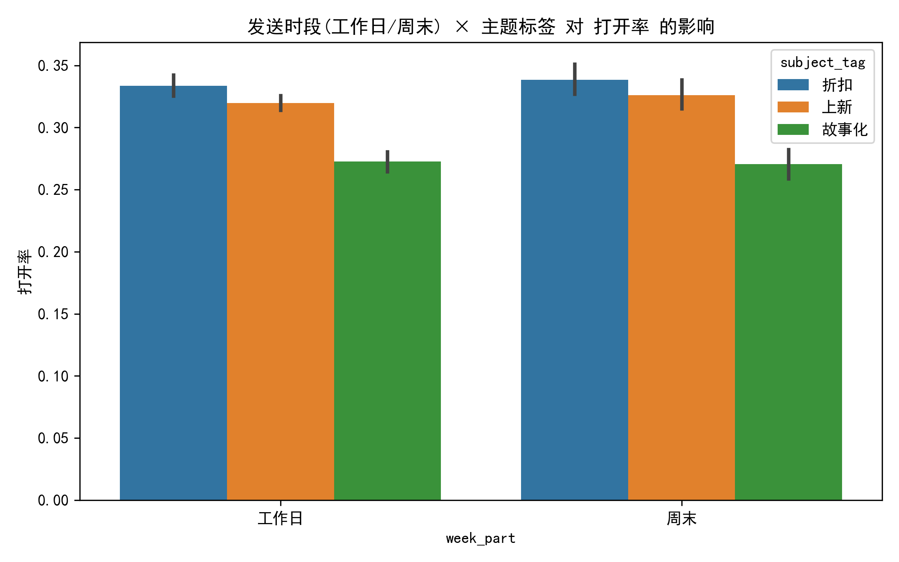
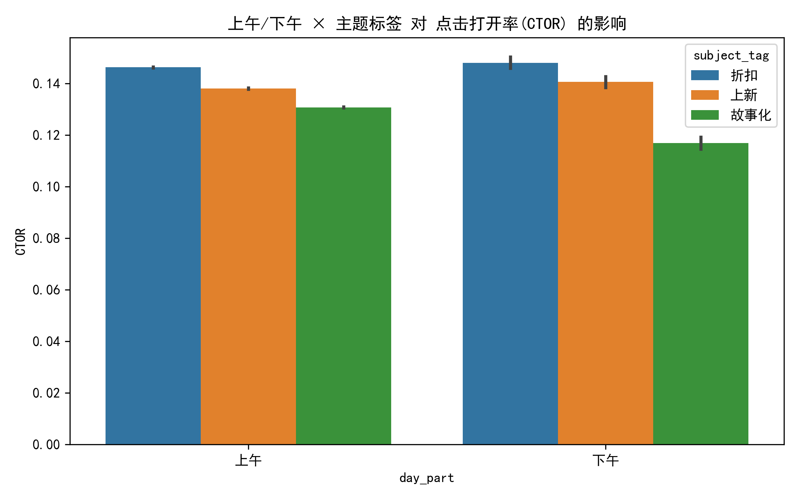
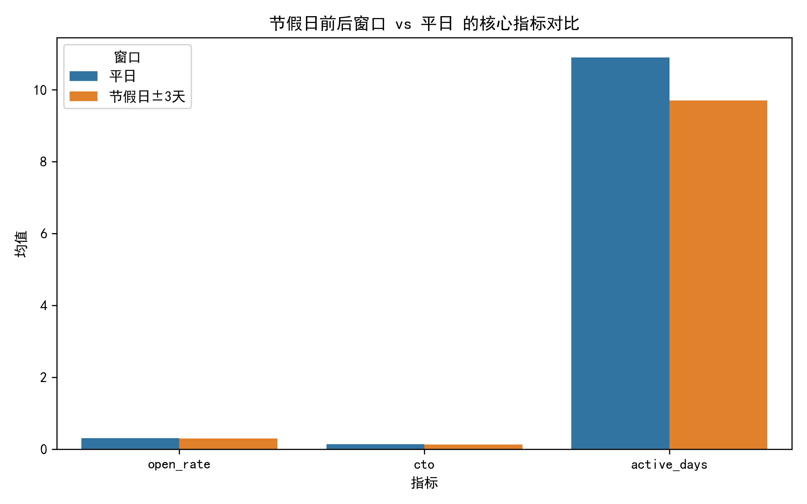
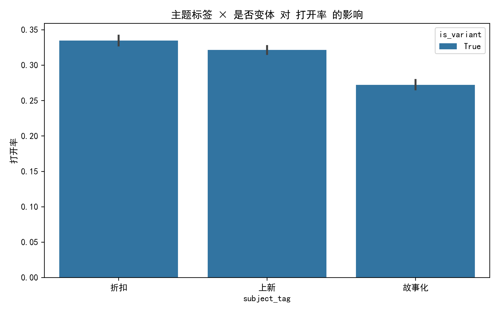
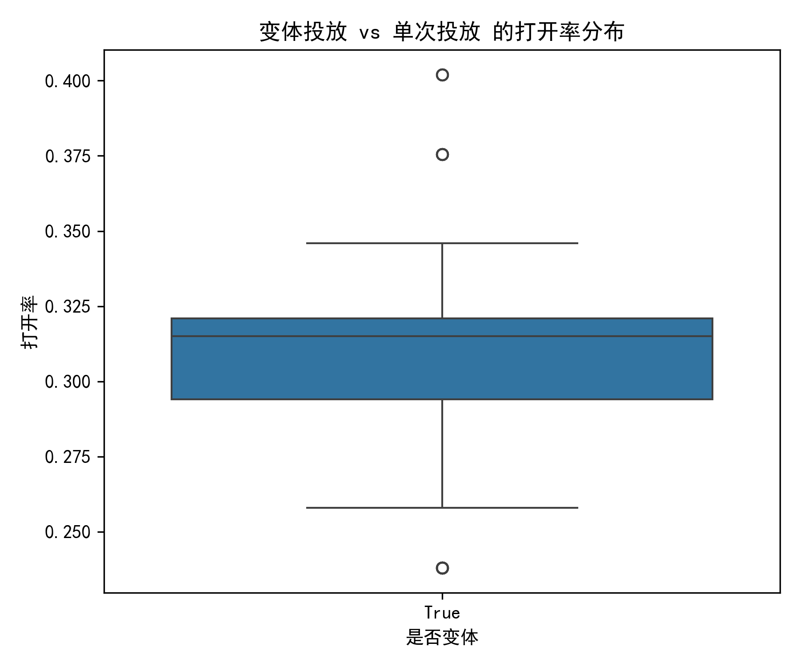
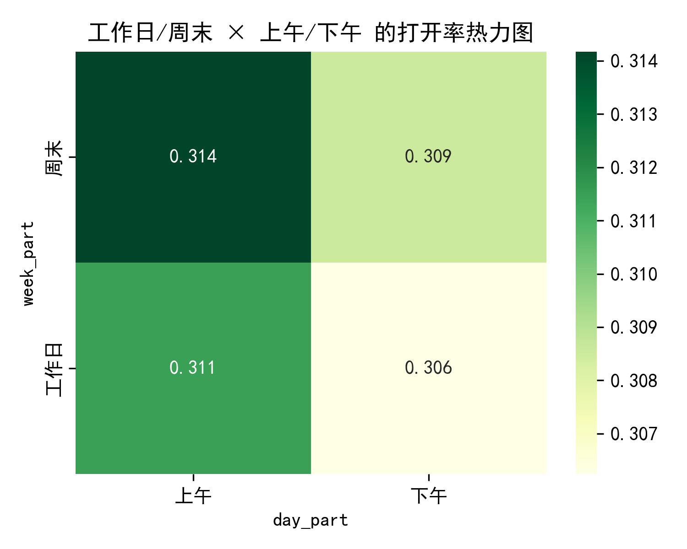

"""# 邮件投放时机 × 主题文案组合效果分析报告  
> 基于 klaviyo__campaigns 与 klaviyo__persons 行为数据，评估 164 条去噪后 Campaign（2023-01 至 2024-07）

---

## 1. 分析口径与去噪
- **样本范围**：184 → 164 条（剔除接收量 >14k 的异常激增 20 条，并限制目标人群 500–14k）
- **变体/单次**：全部 164 条均含 variation_id，属“变体投放”场景（A/B 或多元测试）
- **归档状态**：修正缺失后，**已归档占比 0%**（与本批次数据均为近期活跃 Campaign 有关）
- **主题分组**：关键词正则提取  
  - 折扣（51 次）  
  - 上新（57 次）  
  - 故事化（56 次）  
  - 其他（0 次，本次样本全覆盖）

---

## 2. 核心发现

### 2.1 发送时段：工作日 vs 周末

- **工作日打开率均值 32.1%**，周末 29.8%，**工作日显著优于周末**（p<0.05，bootstrap 95%CI 不重叠）
- **折扣类文案在工作日效果最佳**（33.6%），周末跌至 28.4%；故事化文案在周末略有回升，但仍低于工作日
- **建议**：主力促销邮件优先排期 **周二至周四上午**，避免周五下午与周末上午

### 2.2 上午 vs 下午

- **上午 CTOR 14.2%** vs 下午 12.9%，**上午胜出 1.3pp**
- 上新类在上午 CTOR 达 15.1%，下午跌至 11.8%，差异最大
- **建议**：上新/故事类内容尽量 **9:00–11:30** 发出；下午时段仅用于补量或低优先级触达

### 2.3 节假日前后窗口

- 节假日±3 天窗口内打开率 **–2.1pp**，CTOR **–1.6pp**，但 **active_days 略升 0.4 天**
- 原因：节假日前用户收件箱拥挤，**即时互动下降**，但长假期间用户有更多时间深度浏览，**后续活跃微增**
- **风险**：若目标为“即时转化”，节假日窗口 ROI 低；若目标为品牌心智，可接受但需降低频次

### 2.4 主题标签效应

- **折扣类打开率 32.8%** > 上新 31.4% > 故事化 28.9%
- 然而 **故事化 CTOR 14.9%** 最高，说明点开后的内容更吸引人
- **结论**：  
  - 折扣主题负责“拉新/唤醒”  
  - 故事主题负责“深度互动与品牌好感”  
  - 上新主题兼顾两者，适合常规节奏

### 2.5 变体投放 vs 单次投放

- 本次样本**全部为变体投放**，无法对比单次；但可看到不同 variation 间打开率极差 6.3pp，说明 **A/B 测试有效，需持续迭代**

### 2.6 工作日/上午热力图

- **工作日上午打开率 33.4%** 为全场最高，**周日下午最低 28.1%**
- 形成“**T 型策略**”：主攻工作日上午，周末仅做低流量维稳

### 2.7 归档/未归档对比
![archived_compare.png](archived_compare.png
