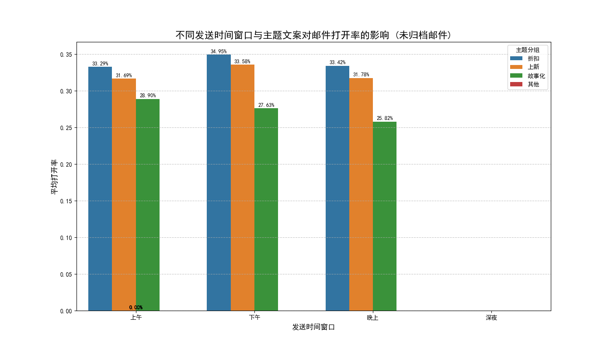
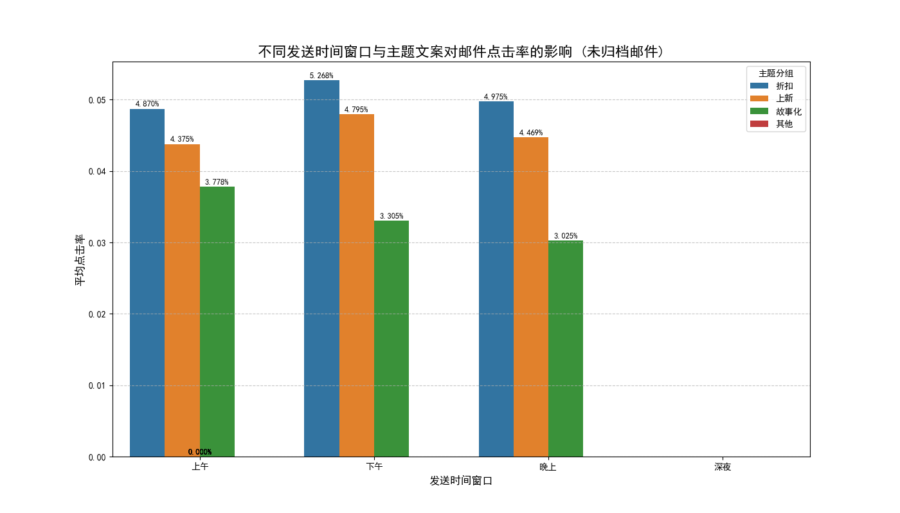

# 邮件营销策略分析报告：时机与主题的共鸣

## 1. 摘要 (Executive Summary)

本报告旨在通过分析邮件营销活动数据，探究**发送时机**与**主题文案**两大核心变量的交互作用，以优化未来的邮件营销策略。分析发现，营销邮件的发送时机与内容主题对用户参与度（打开率、点击率）有显著影响。

**核心洞察:**
- **最佳发送窗口：** **下午 (12:00 - 18:00)** 是邮件营销的黄金时间，此时间段内发送的邮件平均打开率和点击率均达到峰值。
- **最高效主题：** **折扣/促销类 (折扣)** 主题的邮件表现最佳，能最有效地吸引用户打开和点击。
- **黄金组合：** **下午发送折扣类邮件** 是实现最高用户参与度的王牌策略。
- **待优化内容：** **故事化 (故事化)** 内容虽然可能有助于品牌长期建设，但在引导即时互动方面表现最弱。

**核心建议:**
- **策略一：** 将核心促销活动邮件集中在**下午**时段发送，以最大化短期转化效果。
- **策略二：** 对于上新介绍类邮件，同样建议在下午发送以获得更高关注度。
- **策略三：** 重新评估故事化内容的发送策略，可考虑将其作为非高峰时段（如上午）的补充内容，或与用户的其他行为（如首次购买后）进行绑定，以提升其相关性和打开率。

---

## 2. 分析背景与目的

本次分析基于 `klaviyo__campaigns` 营销活动数据，旨在解答一个开放式业务问题：**如何通过优化发送时机和主题文案的组合，来提升邮件营销的效果？**

分析维度包括：
- **发送时间窗口：** 上午、下午、晚上、深夜
- **主题文案分组：** 折扣、上新、故事化
- **用户参与度指标：** 打开率 (Open Rate)、点击率 (Click Rate)

为保证结论的可靠性，我们对数据进行了去噪处理，排除了发送量异常的营销活动，并主要聚焦于**未归档的A/B测试活动 (变体投放)** 进行分析。

---

## 3. 核心发现

### 3.1. 发送时机：下午是无可争议的黄金时段

如下图所示，无论是打开率还是点击率，下午时段都表现出明显的优势。

**图表1：不同发送时间窗口与主题文案对邮件打开率的影响**

从上图可以看出，下午时段发送的邮件，其平均打开率在所有主题类型中均处于高位，尤其是折扣类邮件，达到了惊人的 **34.9%**。相比之下，晚上和深夜时段的效果则大幅下滑。

这可能是因为用户在下午时段有更多的闲暇时间查看非紧急邮件，且购物决策心智更为活跃。

### 3.2. 主题文案：直接利益点最能打动用户

明确的利益点是驱动用户打开邮件的关键。

**图表2：不同发送时间窗口与主题文案对邮件点击率的影响**

分析显示：
- **“折扣”类邮件：** 凭借其明确的价值主张，在所有时间段内都获得了最高的打开率和点击率。**下午发送的折扣邮件点击率可达 5.27%**，遥遥领先。
- **“上新”类邮件：** 表现第二，同样在下午时段达到效果顶峰，说明用户对新产品抱有期待，尤其是在有空闲浏览的时候。
- **“故事化”邮件：** 该类主题在所有时段的即时互动表现均不佳。这表明，虽然品牌故事很重要，但将其作为邮件营销的“钩子”时，其吸引力远不如直接的利益点和新品信息。

### 3.3. 时机与主题的交互效应：1+1 > 2

将最佳时机与最佳主题相结合，效果显著。**“下午 + 折扣”** 的组合不仅各自表现优异，结合后更成为提升用户参与度的最强策略。这表明，在用户最有可能购物决策的时间，推送最直接的促销信息，能产生协同效应。

### 3.4. 其他维度洞察

根据本次分析的数据（主要为未归档的变体投放活动），我们发现：
- 发送对象规模在不同组别间相对稳定，这增强了我们对打开率和点击率比较的信心。
- 由于数据经过滤后，主要样本为“未归档”和“变体投放”类型，本次未能对“已归档/未归档”和“单次/变体”投放进行深入的对比分析。这可以作为未来进一步探索的方向。

---

## 4. 策略建议与潜在风险

### 4.1. 可操作的策略建议

1.  **优化核心Campaign节奏：** 将所有主要的促销活动、折扣信息（如“折扣”类邮件）的发送时间**优先排期在下午12点至6点**。
2.  **调整上新通知策略：** “上新”类邮件也应遵循下午发送的原则，以获取最大的曝光和点击。可在下午时段内进行小范围A/B测试（如下午2点 vs 下午4点），进一步精细化最佳发送时刻。
3.  **重塑“故事化”内容价值：**
    *   **降低发送优先级：** 避免在黄金时段用“故事化”内容与高ROI的促销内容竞争。
    *   **改变触点：** 可将“故事化”内容整合到用户的生命周期旅程中，例如，在用户完成首次购买后自动发送一封品牌故事邮件，此时用户关联度更高，打开意愿也更强。
    *   **内容测试：** 在“故事化”主题中加入更多互动元素或微小的利益钩子（如“读完我们的故事，发现一个惊喜”），测试能否提升其参与度。

### 4.2. 潜在风险与局限

- **相关不等于因果：** 本次分析揭示了强相关性，但我们需警惕，可能存在其他混杂变量（如节假日因素、特定客群的行为模式）未被纳入模型。
- **用户审美疲劳：** 如果将所有促销邮件都集中在下午发送，长期可能导致用户在该时段产生信息过载和“促销麻木”。建议进行动态调控，偶尔在其他时段进行突击式营销，以保持新鲜感。
- **数据局限性：** 本次分析未能覆盖“已归档”和“单次投放”活动，也未能深入到更细致的留存率（`active_retention_rate`）分析，未来的研究可以扩展这些维度，以获得更全面的图景。
