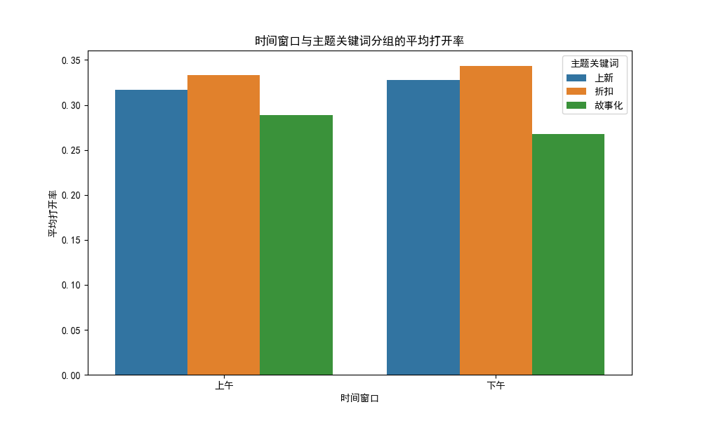
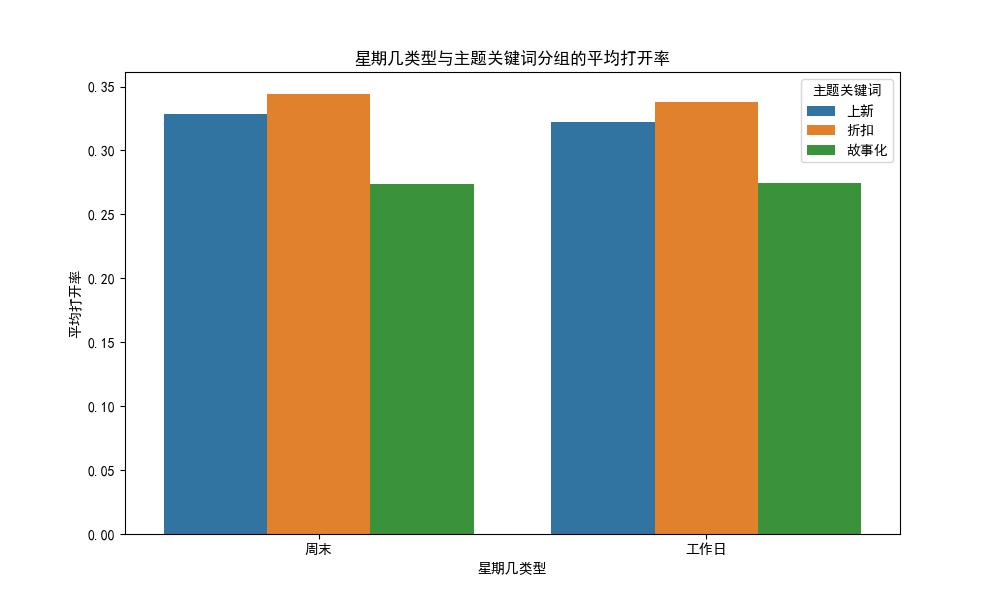

# 邮件投放时机与主题组合效果分析报告

## 摘要
本报告分析了不同时间窗口（上午/下午）与主题关键词（折扣、上新、故事化）对邮件打开率的影响。分析基于从 Klaviyo 数据库中提取的邮件营销活动数据，计算了各分组的平均打开率，并通过可视化图表展示。

## 时间窗口与主题关键词分组的平均打开率

### 平均打开率
| 时间窗口 | 主题关键词 | 平均打开率 |
| -------- | ---------- | ---------- |
| 上午     | 上新       | 0.316881   |
| 上午     | 折扣       | 0.332905   |
| 上午     | 故事化     | 0.289005   |
| 下午     | 上新       | 0.327755   |
| 下午     | 折扣       | 0.343332   |
| 下午     | 故事化     | 0.267507   |

### 分析
- **上午**：
  - **折扣**主题的平均打开率最高（0.332905）。
  - **故事化**主题的平均打开率最低（0.289005）。
- **下午**：
  - **折扣**主题的平均打开率最高（0.343332）。
  - **故事化**主题的平均打开率最低（0.267507）。

### 建议
根据分析结果，"折扣"主题在上午和下午的平均打开率都较高。建议品牌在折扣促销活动中优先使用“折扣”主题，并选择合适的时间投放。

## 星期几类型与主题关键词分组的平均打开率

### 平均打开率
| 星期几类型 | 主题关键词 | 平均打开率 |
| ---------- | ---------- | ---------- |
| 周末       | 上新       | 0.328824   |
| 周末       | 折扣       | 0.344147   |
| 周末       | 故事化     | 0.273525   |
| 工作日     | 上新       | 0.322152   |
| 工作日     | 折扣       | 0.338158   |
| 工作日     | 故事化     | 0.274922   |

### 分析
- **周末**：
  - **折扣**主题的平均打开率最高（0.344147）。
  - **故事化**主题的平均打开率最低（0.273525）。
- **工作日**：
  - **折扣**主题的平均打开率最高（0.338158）。
  - **故事化**主题的平均打开率最低（0.274922）。

### 建议
无论是在周末还是工作日，“折扣”主题的平均打开率都较高。建议品牌在制定邮件营销策略时，可以考虑在“折扣”主题的邮件中提供更具吸引力的优惠，以提高用户参与度。

## 结论
1. **时间窗口影响**：在上午和下午时段，“折扣”主题的平均打开率均较高。
2. **星期几影响**：无论是周末还是工作日，“折扣”主题的平均打开率均较高。
3. **主题关键词选择**：建议品牌在邮件营销中优先使用“折扣”主题，并结合合适的时间窗口进行投放，以提高邮件的打开率和用户的参与度。

通过以上分析，品牌可以在不同的营销场景中，根据目标受众的特点和需求，灵活调整邮件的投放时机和主题内容，从而获得更好的营销效果。
