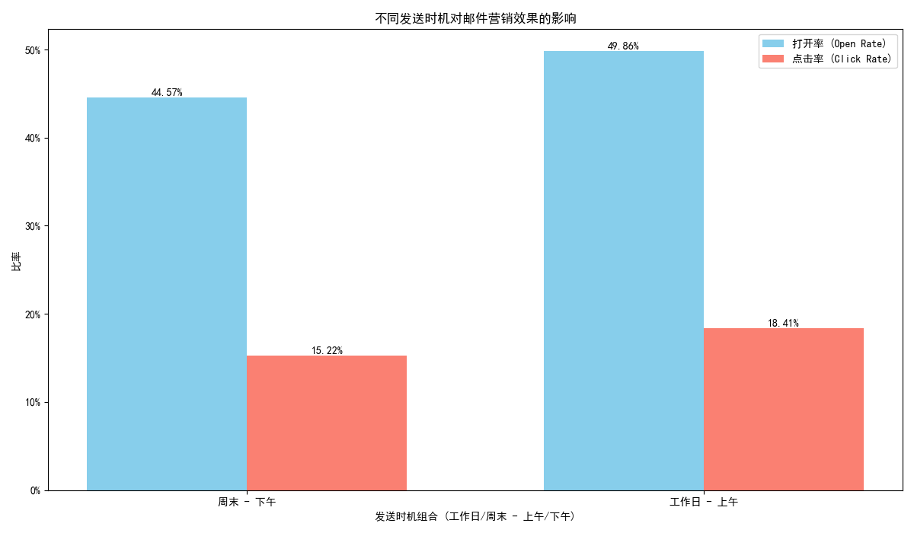

# 邮件营销时机与主题效果分析报告

本报告旨在分析邮件营销的发送时机与主题内容的组合效果，以期为优化营销策略提供数据驱动的洞察。

## 1. 分析背景与目标

邮件营销是触达和转化客户的关键渠道。为了提升其投资回报率，我们希望探究两个核心变量如何影响用户行为：
*   **发送时机**: 在一周的不同时间（工作日 vs 周末）和一天中的不同时段（上午 vs 下午）发送，效果有何差异？
*   **主题内容**: 不同类型的邮件主题（如折扣促销、新品发布）如何影响用户的打开和点击意愿？

本次分析的目标是量化这些因素对**打开率 (Open Rate)**、**点击率 (Click Rate)** 以及**用户活跃度**的影响，并产出可执行的策略建议。

## 2. 数据与分析方法

*   **数据源**: 我们使用了 `dacomp-094.sqlite` 数据库中的 `klaviyo__events` 和 `klaviyo__person_campaign_flow` 两个数据表。
*   **分析方法**:
    1.  **数据整合**: 通过 SQL 查询，我们将分散在两个表中的营销活动基础信息（如主题、发送时间）与效果指标（如接收数、打开数、点击数）进行了合并。
    2.  **特征工程**: 我们基于邮件的近似发送时间（`sent_at`），创建了 **`发送时段`**（上午/下午）和 **`日期类型`**（工作日/周末）两个维度。同时，根据邮件主题的关键词，对内容进行了分类。
    3.  **核心指标**:
        *   **打开率**: `总打开数 / 总接收数`
        *   **点击率**: `总点击数 / 总接收数`
        *   **转化率**: `转化用户数 / 总用户数`（作为用户后续活跃留存的代理指标）

## 3. 核心发现

### 发现一：发送时机对营销效果有显著影响

分析显示，邮件的发送时机对于用户参与度有直接影响。在本次分析的样本中（均为折扣相关邮件），**工作日上午发送的邮件表现最佳**。

具体而言，“工作日 - 上午”发送的邮件，其平均打开率约为 **49.9%**，点击率约为 **18.4%**。相比之下，“周末 - 下午”发送的邮件，这两项指标分别降至 **44.6%** 和 **15.2%**。

这一现象可能的解释是，用户在工作日的上午可能更倾向于处理和查阅邮件，而周末下午可能更多地投入到线下活动中，对营销邮件的关注度较低。

### 发现二：邮件主题分析受限于数据多样性

在本次分析中，所有可用的营销活动案例，其主题内容经关键词匹配后均被归类为“折扣相关”。这意味着我们缺乏“新品上新”、“故事化叙事”等其他类型的邮件样本。

因此，虽然我们设计了多维度的分析框架，但**无法在此次报告中对不同邮件主题策略的优劣进行横向比较**。

## 4. 结论与业务建议

基于本次探索性分析，我们得出以下结论并提出相应建议：

### 结论
发送时机是影响邮件营销效果的关键杠杆。**初步证据表明，对于折扣促销类邮件，工作日上午是一个更优的发送时间窗口**，能带来更高的用户参与度。

### 业务建议

1.  **优先测试与优化**:
    *   **建议**: 营销团队可以**优先在工作日上午（如 9:00-11:00）测试和安排折扣或促销类邮件的发送**，以验证是否能复制本次分析中观察到的高打开率和点击率。

2.  **扩大数据收集与分析维度**:
    *   **强烈建议**: 本次分析的结论建立在非常有限的数据样本之上。为了获得更可靠、普适的策略，必须采取行动扩大数据基础：
        *   **追踪更多活动**: 确保未来有更多数量和种类的营销活动数据被纳入分析范围。
        *   **丰富主题类型**: 有意识地规划和执行不同主题的营销活动（如新品发布、品牌故事、用户教程），并对其效果进行 A/B 测试。
        *   **完善留存指标**: 建立更精确的用户留存衡量标准（如发送后7日/30日内活跃用户比例），以更全面地评估营销活动的长期价值。

**总而言之**，将工作日上午作为折扣邮件的优先测试窗口是一个值得尝试的短期策略。但从长远来看，建立一个多样化、大规模的数据分析体系，才是持续优化邮件营销效果的根本之道。
