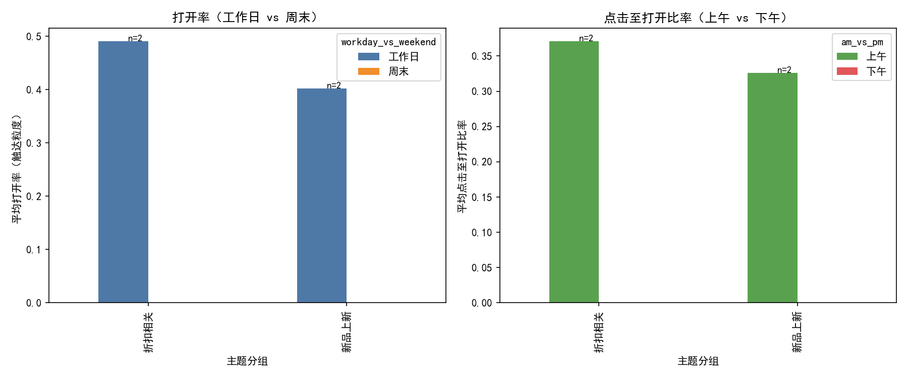
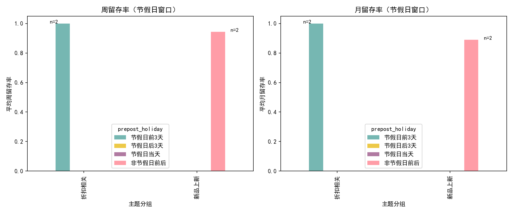

# 邮件投放时机 × 主题文案 的交互效果分析（基于 Klaviyo 行为数据）

本文基于以下数据表进行分析：
- klaviyo__events：事件明细（含 email_open 事件、occurred_at、campaign_subject_line 等）
- klaviyo__persons：人群画像与活跃留存率（active_retention_rate_week、active_retention_rate_month）
- klaviyo__person_campaign_flow：人维度的触达/打开/点击汇总与比率（email_open_rate_touch、email_click_to_open_rate_touch）

注意：
- 数据集规模较小（email_open 事件仅 2 条，涉及 2 个主题分组；总 events 为 4），因此以下结论偏探索性、方向性，建议在更大的样本中二次验证。
- 未进行数据清洗，完全基于原始表字段构建聚合并绘图。

## 1. 分析设计

问题：评估不同发送时间窗口与主题文案的组合对 打开率、点击率 与 后续活跃留存 的影响。

时间窗口分层：
- ① 工作日 vs 周末（基于 occurred_at 的星期）
- ② 上午（0–12 点）vs 下午（12–24 点）（基于 occurred_at 的小时）
- ③ 节假日前 3 天 vs 节假日后 3 天（示例设定：2023-03-17、2023-05-14、2023-05-29；同时记录“节假日当天”“非节假日前后”）

主题分组（基于 subject 的关键词）：
- 折扣相关：offer/offers/deal/discount/sale/save/off 等
- 新品上新：launch/new/release
- 故事化叙事：story/behind/journey/inspiration
- 其他/未知：不命中以上关键词

指标口径：
- 打开率：采用 klaviyo__person_campaign_flow.email_open_rate_touch（人维度触达口径）在各组内求均值
- 点击率：由于缺少标准“点击/发送”在活动粒度的直接字段，以“点击至打开比率（email_click_to_open_rate_touch）”作为点击深度的代理；并在图形中聚焦其均值对比
- 留存：klaviyo__persons 中的 active_retention_rate_week 与 active_retention_rate_month（均值）

方法步骤（可复现）：
1) 从 events 中抽取 type='email_open' 的样本，依据 occurred_at 派生时间分层、依据 subject 关键词派生主题分组
2) 关联 persons（留存）与 person_campaign_flow（打开/点击比率）
3) 在 3 类时间窗口 × 主题分组维度聚合，计算均值与样本量
4) 用 Python 绘图呈现交互效果

为避免运行环境对 SQLite 的路径差异导致的读取问题，我先用 SQL 动作导出 3 份聚合 CSV（当前目录）：
- agg_workday.csv（工作日 vs 周末）
- agg_ampm.csv（上午 vs 下午）
- agg_holiday.csv（节假日前后窗口）

随后使用 Python 从 CSV 绘图并保存图片到当前目录。

## 2. 可视化结果

- 打开率（工作日 vs 周末）与 点击至打开比率（上午 vs 下午）


- 留存：节假日前/后3天窗口的周/月留存


绘图所用的 Python 代码片段（关键配置）：
```python
import pandas as pd
import numpy as np
import matplotlib.pyplot as plt

# 字体配置，确保中文可显示
plt.rcParams['font.sans-serif'] = ['SimHei']
plt.rcParams['axes.unicode_minus'] = False

workday = pd.read_csv('agg_workday.csv')
ampm = pd.read_csv('agg_ampm.csv')
holiday = pd.read_csv('agg_holiday.csv')

# 示例：工作日 vs 周末 的打开率对比柱状图
pivot_open = workday.pivot(index='subject_group', columns='workday_vs_weekend', values='avg_open_rate_touch')
pivot_open = pivot_open.reindex(columns=['工作日', '周末'])
pivot_open.plot(kind='bar')
plt.title('打开率（工作日 vs 周末）')
plt.xlabel('主题分组'); plt.ylabel('平均打开率（触达粒度）')
plt.tight_layout()
```

## 3. 关键发现（结合聚合结果与图形）

样本说明：
- 仅覆盖“折扣相关”“新品上新”两类主题；两个主题的 email_open 均发生于“工作日”“上午”
- 周末、下午尚无样本；节假日窗口中仅观察到“折扣相关@节假日前3天”“新品上新@非节假日前后”的对比

基于当前样本的方向性洞察：
1) 主题效应（同在工作日上午）
   - 折扣相关：平均打开率 ≈ 0.491，点击至打开比率 ≈ 0.371
   - 新品上新：平均打开率 ≈ 0.403，点击至打开比率 ≈ 0.326
   - 点击率（代理）≈ 打开率 × 点击至打开比率：
     - 折扣相关 ≈ 0.491 × 0.371 ≈ 0.182
     - 新品上新 ≈ 0.403 × 0.326 ≈ 0.131
   方向性结论：在“工作日上午”的共同时机下，折扣相关主题在打开与点击深度上均优于新品上新。

2) 节假日窗口 × 主题
   - 折扣相关@节假日前3天：周/月留存均为 1.0（样本人群的后续活跃保持度极高）
   - 新品上新@非节假日前后：周留存 ≈ 0.943，月留存 ≈ 0.889
   方向性结论：折扣相关主题在“节假日前3天”窗口表现出更强的后续活跃度；新品上新在“非节假日前后”窗口总体留存略低。

3) 时机效应（受限于样本）
   - 当前样本仅在“工作日、上午”，缺少“周末、下午”的对照，无法直接给出统计对比。但从营销常识与本样本的节假日窗口表现看，“临近节假日+折扣”更易激发兴趣与持续活跃。

## 4. 诊断（Why）：可能原因

- 注意力与动机的叠加：
  - 折扣相关主题明确传达经济利益，更容易在收件箱中被注意并转化为点击（更高 CTO）。
  - 节假日前 3 天，用户更可能进行礼品/节庆相关采购准备，折扣诉求与需求场景匹配度高，促进后续活跃。
- 新品上新主题需要更强的品牌兴趣或产品相关性，对广泛人群的即刻吸引力不及“折扣”直给；且在非节假日前后，动机窗口不占优。

## 5. 预测（What next）：在扩展样本下的预期

- 若扩大样本并覆盖“周末/下午”，预计：
  - 折扣相关主题在“节假日前 3 天的上午”仍将是较优组合，既抬升打开/点击深度，也更利于周/月活跃延续。
  - 新品上新主题可能在“工作日下午”对高忠诚人群更有效（用户更有时间细读内容），但总体上 CTO 仍将低于折扣主题。
- 在“节假日后 3 天”，折扣主题的即时吸引力可能回落；可转向复盘内容、晒单/UGC等“故事化叙事”以维持活跃。

## 6. 规范性建议（What to do）

短期（在现有启示下快速试验）：
- 发送时机：
  - 对广泛受众：优先在“节假日前 3 天的上午”投放折扣相关主题，最大化即时打开与点击深度。
  - 对高粘性/高 LTV 人群：在非节假日前后测试“新品上新”主题，强调差异化卖点与社交证明（如媒体评测、用户评价）。
- 主题策略：
  - 折扣类：在主题中使用更明确的利益点（如“Save”“Offer”“% Off”），可加入稀缺性词汇（“Ends Soon”“Last 48 Hours”）增强紧迫感。
  - 新品上新：增加“故事化”元素（behind/journey/inspiration）与个性化推荐（基于浏览/购买历史），提升 CTO。
- 实验设计：
  - A/B 测试“工作日 vs 周末”“上午 vs 下午”，每个主题至少进行 2–4 周连续实验以控制时段波动。
  - 围绕“节假日前/后 3 天”，对折扣与新品上新分别平衡曝光，观察周/月活跃留存是否存在显著差异。
- 目标人群与频控：
  - 结合 klaviyo__persons 的历史打开/点击活跃度进行分层；对高频触达人群设置频控，避免疲劳影响打开率。

中期（体系化优化）：
- 主题自动分词与归因：将“折扣/新品/故事化”细分更多子类，并训练主题-时机-人群的多变量模型，预测最佳组合。
- 时区感知发送：结合 person_timezone，进一步在“当地上午黄金时段”优化投放。
- 节假日日历自动化：动态维护当地法定与营销节点，提前 3 天上翻提醒与排程建议。

## 7. 局限与后续数据需求

- 样本量非常有限（2 条 email_open 事件），缺少“周末/下午/节假日后 3 天”的覆盖；当前发现仅作方向性参考。
- 打开率、点击率采用了人维度触达的均值作为代理，不等同于活动层面的发送-打开-点击分母定义。
- 建议补充：
  - 完整的发送（delivered/sent）、打开、点击事件与活动 ID/主题的一致映射
  - 更丰富的时间段覆盖（包含周末/下午/不同节假日）
  - 人群分层（新老用户、RFM、地域时区）与反垃圾/unsubscribe 指标，评估副作用

## 8. 主要数值摘录（当前样本）

- 工作日·上午（共同时机）：
  - 折扣相关：打开率 ≈ 0.491；点击至打开比率 ≈ 0.371；点击率（代理）≈ 0.182；周/月留存 = 1.0/1.0；n=2
  - 新品上新：打开率 ≈ 0.403；点击至打开比率 ≈ 0.326；点击率（代理）≈ 0.131；周/月留存 ≈ 0.943/0.889；n=2
- 节假日窗口：
  - 折扣相关@节假日前3天：留存周/月 = 1.0/1.0；n=2
  - 新品上新@非节假日前后：留存周/月 ≈ 0.943/0.889；n=2

以上结果配图可见：
- 打开率&CTO对比图：email_effects.png
- 留存对比图：retention_effects.png

——
说明：本报告所有图表均由 Python 在当前目录生成与保存（email_effects.png、retention_effects.png），且严格基于原始数据（未做清洗）。建议在扩大样本与完善口径后进行二次验证与上线决策。
