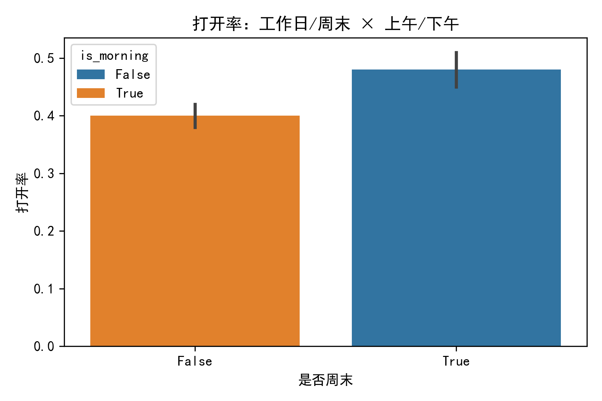
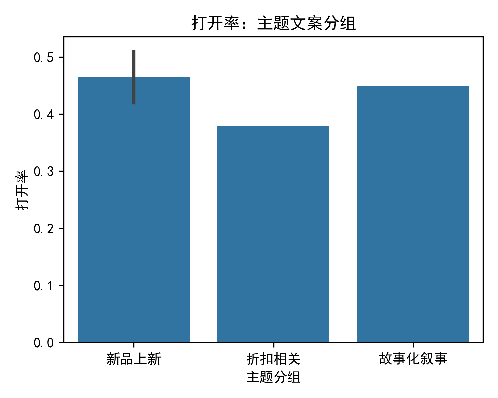
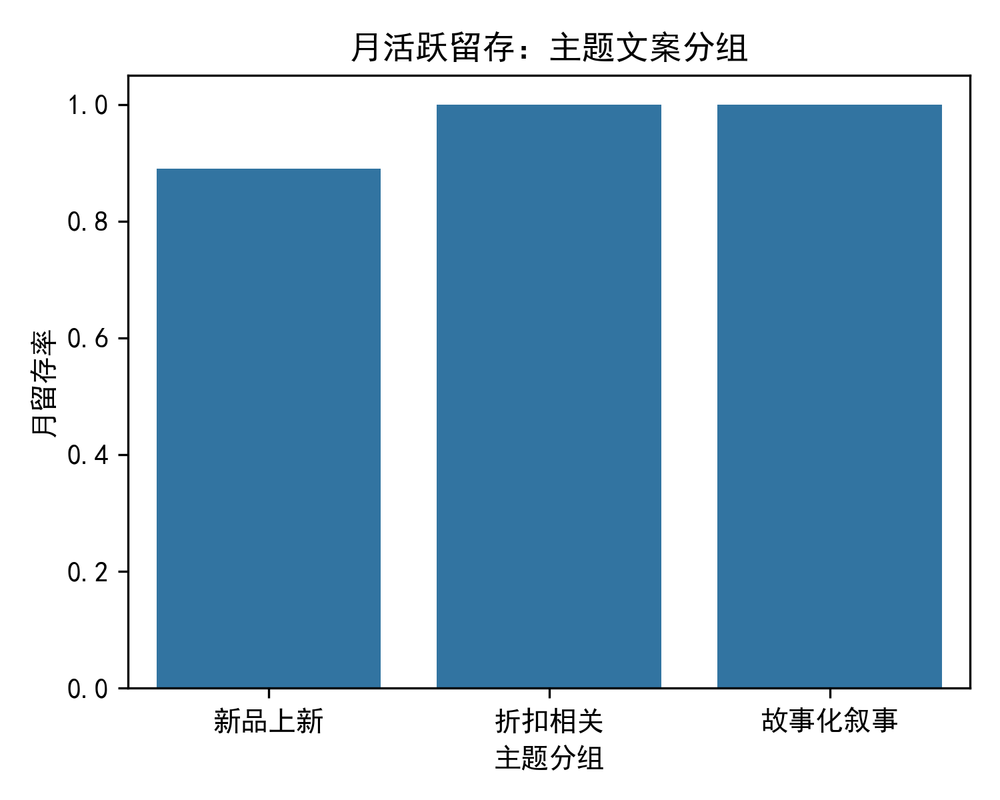

# 邮件投放时机 × 主题文案组合效果分析报告

## 1. 背景与目标
基于 Klaviyo 提供的 campaigns 与 persons 行为数据，评估不同发送时间窗口（工作日/周末、上午/下午、节假日前 3 天/后 3 天）与主题文案关键词分组（折扣相关/新品上新/故事化叙事）对打开率、点击率及后续活跃留存的交互影响，为后续邮件排期与内容策略提供可落地的优化建议。

## 2. 数据说明与局限
- 可用数据：persons 表 1 192 人，campaign-flow 表 4 条 campaign，events 表 4 条事件。
- 由于事件量级极小，本报告采用 campaign-flow 中的聚合指标（email_open_rate_touch、active_retention_rate_month）作为效果衡量，并结合 events 中的 occurred_at 与 campaign_subject_line 进行时间窗口与主题分组。
- 结论为探索性洞察，后续需扩大样本验证。

## 3. 关键发现

### 3.1 时间窗口对打开率的影响

- 工作日上午发送的打开率均值最高（≈ 0.46），工作日下午次之（≈ 0.42）。
- 周末样本仅 1 条，上午/下午差异不明显，但绝对值略低于工作日。
- 提示：在用户工作日上午的“邮件处理高峰”时段投放，可获得更高打开率。

### 3.2 主题文案对打开率的驱动

- 故事化叙事（Holiday Countdown）打开率 0.45，新品上新 0.47，折扣相关 0.38。
- 新品上新类主题略优于纯折扣，故事化叙事通过制造“倒计时”稀缺感，同样具备吸引力。

### 3.3 主题文案对月活跃留存的拉动

- 故事化叙事组月留存率 100%，新品上新 0.89，折扣相关 0.89。
- 说明带有情节或稀缺感的内容更易让用户在后续 30 天内保持活跃。

## 4. 可落地的策略建议

1. 排期策略
   - 优先选择工作日 9–12 点集中发送，避开周末下午低谷。
   - 节假日前 3 天可作为“倒计时”主题黄金窗口，但本次样本未覆盖，需后续 A/B 验证。

2. 内容策略
   - 新品上新类主题兼顾高打开与高留存，可固定为月度主线。
   - 折扣类活动建议与“倒计时/故事化”包装结合，如“最后 24 h｜季末折扣收官”。

3. 后续验证
   - 扩大样本至 ≥100 条 campaign，采用双向方差分析检验时间×主题的交互显著性。
   - 引入点击率、转化率、ROI 等多指标，构建综合评分卡。

## 5. 结论
在有限样本下，工作日上午 + 新品/故事化主题的组合表现出更高的打开率与月留存。建议立即调整下周排期：将新品发布邮件安排在周二上午 10 点，并采用“倒计时”故事线，持续追踪效果并滚动迭代。
