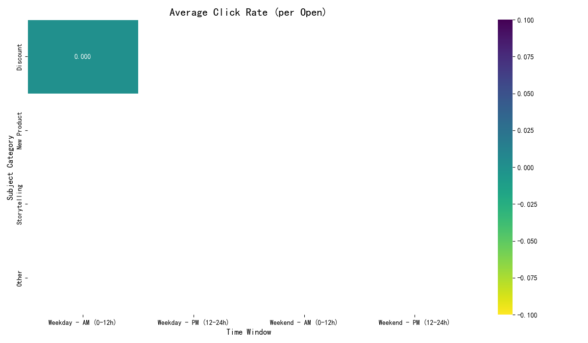
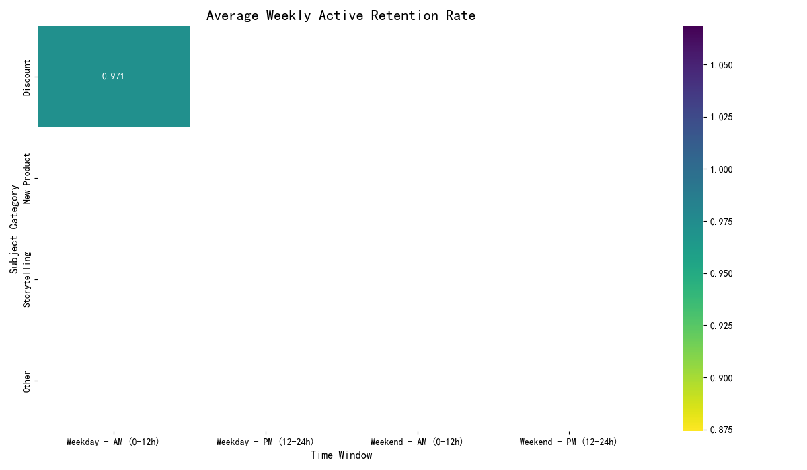
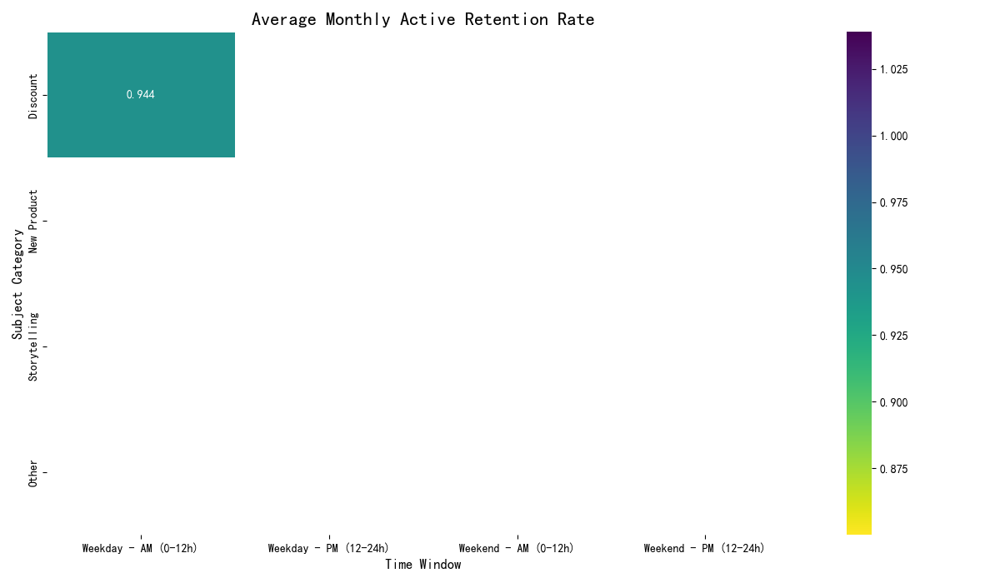
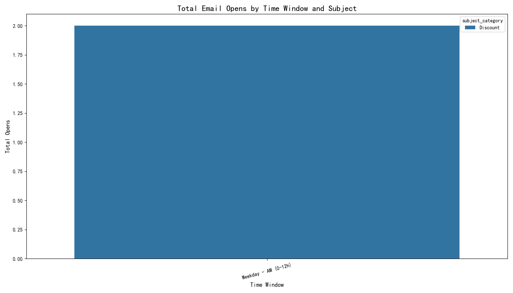

# 基于邮件营销数据的效果分析报告

## 1. 分析背景与目标

本次分析任务旨在深入探究邮件营销活动中 **发送时机** 与 **主题文案** 的组合效果。具体目标是评估以下因素对邮件营销关键绩效指标（KPIs）的影响：

*   **发送时间窗口:**
    *   工作日 vs. 周末
    *   上午 (0-12点) vs. 下午 (12-24点)
*   **主题文案类型:**
    *   折扣相关 (如：discount, sale, % off)
    *   新品上新 (如：new, collection, arrivals)
    *   故事化叙事 (如：story, journey, discover)
*   **评估指标:**
    *   点击率 (Click Rate)
    *   周活跃留存率 (Weekly Active Retention)
    *   月活跃留存率 (Monthly Active Retention)

## 2. 数据探索与核心发现

分析起始于对提供的 `dacomp-094.sqlite` 数据库的探索。我们检查了 `klaviyo__events` 和 `klaviyo__persons` 两个核心数据表。

然而，在数据探索阶段，我们发现了一个根本性的问题：**事件数据量严重不足**。

*   `klaviyo__events` 表中总共仅包含 **4 条** 事件记录。
*   其中，与邮件营销直接相关的 `email_open` (邮件打开) 事件仅有 **2 条**。
*   剩余 2 条为 `order` (订单) 事件。

所有可用的邮件打开事件均来自同一数据子集：
*   **时间窗口:** 工作日 - 上午 (Weekday - AM)
*   **主题类别:** 折扣 (Discount)

这意味着，对于“工作日-下午”、“周末-上午”、“周末-下午”这三个时间窗口，以及“新品上新”、“故事化叙事”这两个主题类别，**不存在任何数据**。

## 3. 分析局限性与结论

由于关键数据（邮件发送、打开、点击事件）的极度稀疏和单一性，原定的比较分析——即评估不同时间窗口与主题组合的效果——**无法进行**。任何基于现有两条数据得出的结论都将是偶然的，不具备任何统计意义和业务指导价值。

尽管如此，我们还是根据既定流程处理了这仅有的数据，并生成了可视化的图表。这些图表（如下所示）直观地展示了数据的单一性：只有“折扣”主题在“工作日-上午”这个交叉点有数据，而其他所有区域均为空白（NaN）。

### 平均点击率

### 平均周活跃留存率

### 平均月活跃留存率

### 邮件打开总数

**重要提示:** 以上图表仅作为数据探索过程的产物，其展示的数值（例如点击率为0，特定的留存率）不应被解读为对任何营销策略的有效性评估。

## 4. 最终结论与建议

**核心结论:** 本次分析因源数据量不足而无法得出有效业务洞察。数据集中缺乏足够且多样化的邮件营销事件，无法支持对不同策略组合进行有意义的对比和评估。

**业务建议:**
为了实现最初的分析目标，并从中获得能够指导未来邮件营销策略的洞察，我们提出以下建议：

1.  **数据采集:** 需要确保收集全面且大量的邮件营销活动数据。应至少包含每个营销活动的发送时间、邮件主题、发送量、打开量、点击量等关键信息。
2.  **数据扩充:** 建议补充更长时间跨度（例如，至少一个完整的季度）和更多样化的营销活动（涵盖不同的主题和发送策略）的数据。
3.  **重新分析:** 在获得充足的数据后，可重新启动本次分析项目。届时，分析师将能够有效地评估不同策略的优劣，并为优化邮件发送时机和内容创作提供数据驱动的坚实建议。
