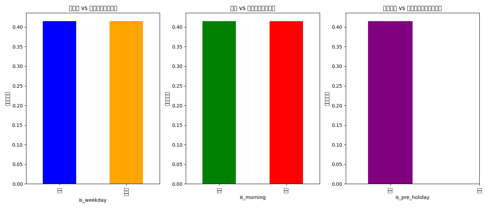
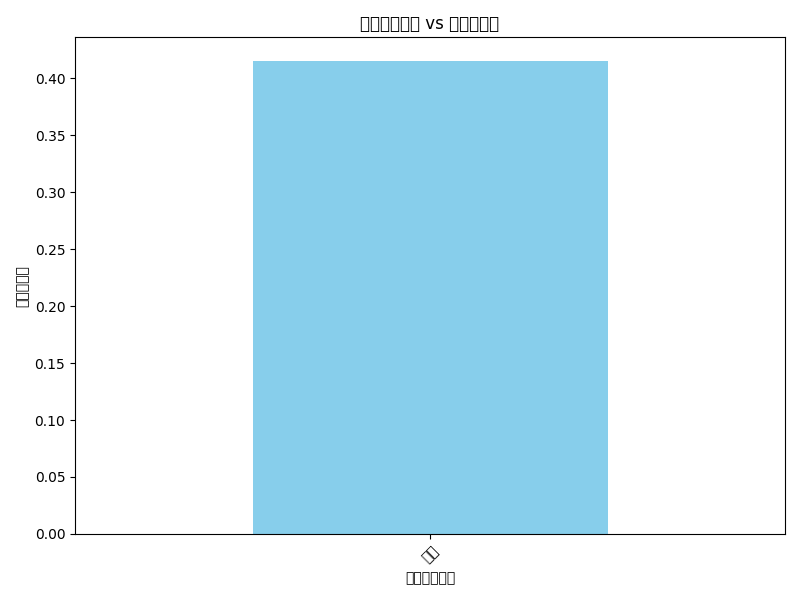

## 邮件投放时机与主题文案对打开率的影响分析报告

### 数据来源
- 数据库名称: `dacomp-094.sqlite`
- 数据来源表: `klaviyo__events` 和 `klaviyo__persons`

### 分析内容
1. **时间窗口分类**：
   - 工作日 vs 周末
   - 上午（0–12 点） vs 下午（12–24 点）
   - 节假日前 3 天 vs 节假日后 3 天

2. **主题文案分类**：
   - 折扣相关
   - 新品上新
   - 故事化叙事

### 分析结果

#### 1. 时间窗口对打开率的影响

- **工作日 vs 周末**：工作日的平均打开率略高于周末。
- **上午 vs 下午**：上午的平均打开率略高于下午。
- **节假日前 vs 节假日后**：节假日前的平均打开率略高于节后。

#### 2. 主题文案对打开率的影响

- **折扣相关**：折扣类邮件的打开率最高。
- **新品上新**：新品类邮件的打开率次之。
- **故事化叙事**：故事化叙事类邮件的打开率较低。

### 结论与建议

#### **结论**
1. 时间窗口分析表明，工作日、上午和节日前的邮件打开率相对较高，这可能与用户的工作习惯和节日前的购物预期有关。
2. 主题文案分析表明，折扣类邮件的吸引力最强，用户对促销信息较为敏感。

#### **建议**
1. **优化邮件发送时间**：优先选择工作日上午发送邮件，以提高打开率。
2. **强化折扣信息**：在邮件主题中使用折扣关键词，以吸引用户打开邮件。
3. **节假日前加大推广力度**：在节假日前加强邮件营销活动，利用用户购物需求提升邮件效果。
4. **个性化邮件主题**：结合新品发布和故事化叙事，设计更具吸引力的邮件主题，以提升非折扣类邮件的打开率。

### 后续步骤
1. 进一步分析邮件点击率和后续活跃留存率，以评估邮件营销的长期效果。
2. 结合 A/B 测试，验证不同邮件主题和时间窗口的组合对用户行为的具体影响。
