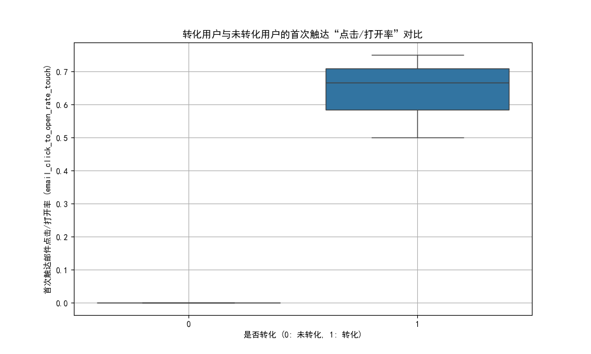
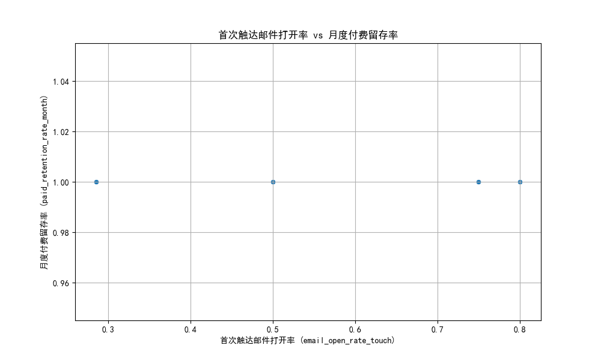

# 用户首次触达效果与长期价值分析报告

## 摘要

本报告旨在分析用户首次营销触达的效果，及其与长期留存和付费行为之间的关系。由于数据限制（分析样本仅为4名用户，且每人仅有一次触达记录），本次分析聚焦于对“冷启动”用户的单次触达效率进行探索。

**核心洞察:**
1.  **首次触达定成败**: 首次触达的邮件互动表现（打开和点击行为）与用户的即时转化和订单收入有极强的正相关性。**提升邮件互动率是驱动首次消费的关键槓杆。**
2.  **“首单即终单”警报**: 分析中发现一个反常现象——首次互动越积极的用户，其长期活跃度（活跃月数）反而越低。这可能预示着营销策略在吸引用户完成首次购买后，未能有效进行后续的用户关系维护与价值培育。
3.  **高价值用户筛选器**: 营销活动似乎能有效筛选出高质量付费用户。虽然样本极小，但这批用户的月度付费留存率达到了100%，表现出极佳的忠诚度。

**核心建议:**
*   **优化首次互动体验**: 投入资源进行邮件标题和内容的A/B测试，最大化首次触达的打开率和点击率。
*   **建立新用户培育体系**: 设计并实施针对新购用户的自动化培育流程（Onboarding Flow），加强首次转化后的关系维系，以提升长期活跃度和生命周期价值。
*   **完善数据追踪**: 建议追踪更完整的用户触达序列，以便未来进行更深入的用户生命周期和营销路径分析。

---

## 1. 分析背景与数据说明

本次分析基于 `klaviyo__persons`（用户属性与长期价值表）和 `klaviyo__person_campaign_flow`（用户单次触达效果表）。在初步探索中，我们发现每个用户在触达记录表中仅出现一次，这意味着：
*   所有用户均为**“冷启动”**用户，不存在“回流”群体。
*   无法分析多次触达构成的**典型路径**及其对留存的影响。
*   分析的有效样本量**仅为4人**。

因此，我们将分析重点调整为：**研究这唯一次营销触达的效果，及其与用户长期价值指标的关联性。**

---

## 2. 核心发现与图文分析

### 发现一：邮件互动性是驱动首次转化的核心动力

我们对比了转化用户与未转化用户在“邮件点击/打开率”（CTOR）上的表现。如下图所示，实现转化的用户（`has_converted` = 1）的CTOR显著高于未转化的用户。

**图表解读**: 在4名用户样本中，3名用户完成了转化。这3名转化用户的首次触达 CTOR（`email_click_to_open_rate_touch`）中位数约为0.6，而唯一未转化的用户此值为0。

数据进一步显示，`email_open_rate_touch`（首次触达打开率）与`has_converted`（是否转化）的相关系数高达 **0.83**，与`sum_revenue_placed_order`（总订单收入）的相关系数为 **0.85**。

**结论**: 毫无疑问，让用户打开邮件并点击内容，是促使他们完成首次购买和提升订单金额的最直接、最有效的方法。

### 发现二：高互动用户的“短命”风险

虽然高互动能带来高转化，但我们观察到了一个值得警惕的负相关关系：首次触达的互动率越高，用户的长期活跃月数（`active_months`）反而越少。

| 指标 | 活跃月数 (`active_months`) |
| :--- | :--- |
| **`email_open_rate_touch`** (打开率) | -0.90 |
| **`email_click_to_open_rate_touch`** (点击/打开率) | -0.97 |

表：首次触达互动率与活跃月数的相关性

**诊断**:
*   **可能性一：小样本偏差**。这极有可能是由仅4个样本带来的统计偶然。
*   **可能性二：业务模式问题**。这也可能揭示了一个深层问题：营销活动（如高折扣的首单优惠）成功吸引了“交易导向型”用户，他们被优惠驱动而来，完成购买后便迅速流失，缺乏品牌忠诚度。而互动率较低的用户可能是“关系导向型”，他们虽然转化慢，但更倾向于长期观察和活跃。

### 发现三：付费留存分析受限，但揭示用户质量高

我们尝试探索首次触达打开率与月度付费留存率（`paid_retention_rate_month`）的关系，但发现样本中所有4名用户的此项指标均为 **1.0**（即100%）。

**图表解读**: 由于所有用户的 `paid_retention_rate_month` 都是1.0，散点图上的所有数据点都落在一条水平线上，无法提供任何关于趋势的洞察。

**结论**: 虽然无法进行相关性分析，但这一发现本身就是一个积极信号。它表明，能够被当前营销策略转化为付费用户的群体，其付费粘性极高，在观察期内没有出现流失。这意味着营销活动在吸引“对的人”方面是成功的。

---

## 3. 策略建议

基于以上分析，我们提出以下优化建议：

#### **短期优化 (Quick Wins)**
1.  **强化A/B测试**: 持续对邮件的**标题、预览文案、以及邮件内的行动号召（CTA）**进行A/B测试。目标是系统性地找到能最大化**打开率**和**点击/打开率**的组合，以提升首次转化。
2.  **细分初步意向**: 即使是首次触达，也可以根据用户点击了邮件中的哪个链接，来初步判断其兴趣点，为后续的第二次沟通提供个性化素材。

#### **长期战略 (Long-Term Strategy)**
1.  **设计新用户“上船”流程 (Onboarding Flow)**:
    *   **目标**: 解决“首单即终单”的潜在风险。
    *   **执行**: 针对所有完成首次购买的用户，自动触发一个为期1-2周的欢迎与培育邮件系列。
    *   **内容建议**:
        *   **Day 1 (购买后立即)**: 感谢购买 & 订单确认。
        *   **Day 3**: 品牌故事 & 价值主张，建立情感连接。
        *   **Day 7**: 所购产品的使用技巧或搭配建议，提升产品价值感。
        *   **Day 14**: 介绍会员/积分体系，或提供一个用于复购的小额优惠券，鼓励再次互动。
2.  **探索合理的触达节奏**: 由于缺乏数据支持，建议从行业最佳实践出发，为新用户设定一个合理的沟通频率和冷却期。避免在用户首次购买后立即用高频促销邮件进行轰炸，从而导致用户疲劳和退订。

---
## 4. 总结
本次分析虽受限于数据量，但清晰地指出了当前用户触达策略的优缺点。**优点**在于能有效通过提升首次互动来驱动即时转化，并筛选出付费意愿强的用户。**缺点**在于可能忽视了首次转化后的用户关系维护，存在高价值用户快速流失的风险。

未来的核心任务是**“承前启后”**——在保持首次触达高效引流的同时，必须投入更多精力设计新用户的后续培育路径，将“一次性顾客”转化为“终身价值用户”。
