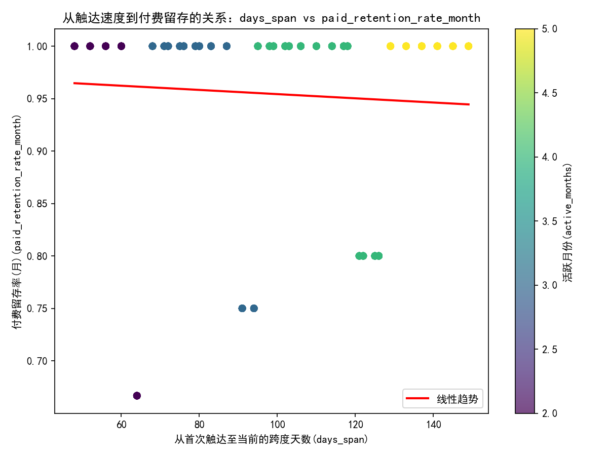
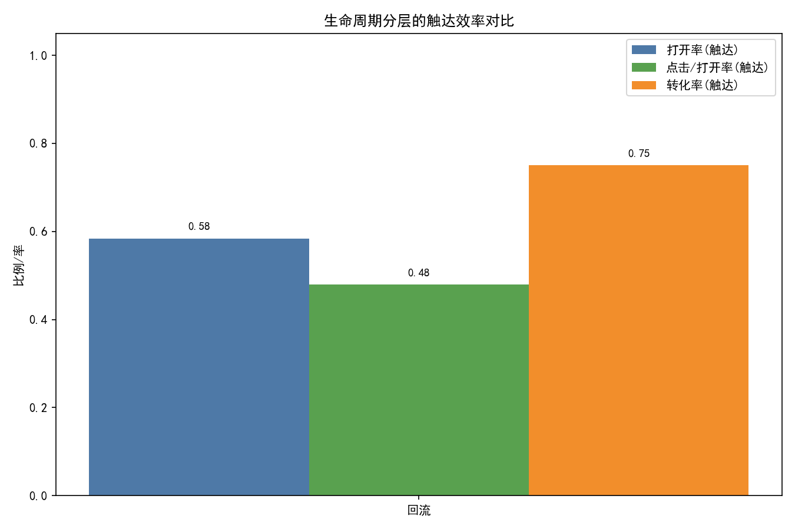
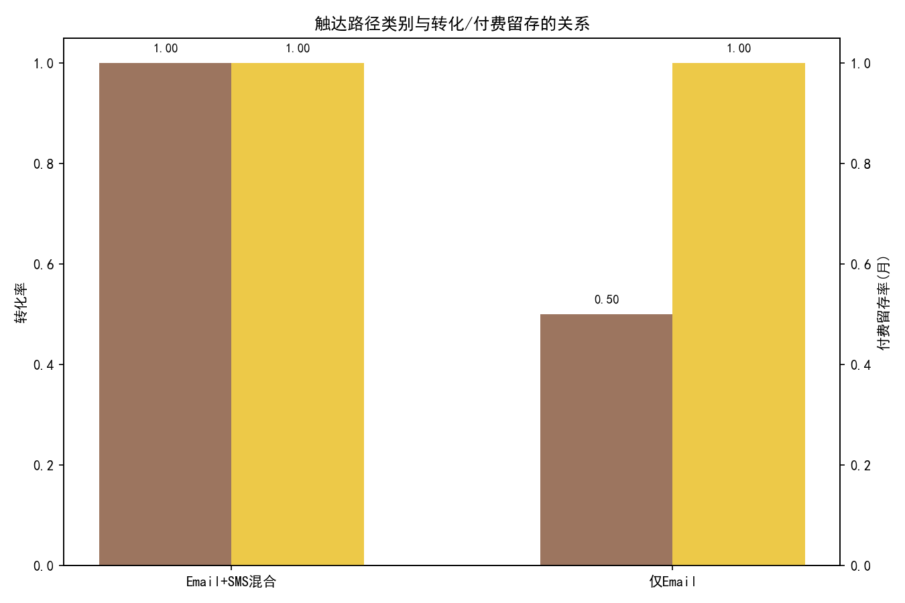
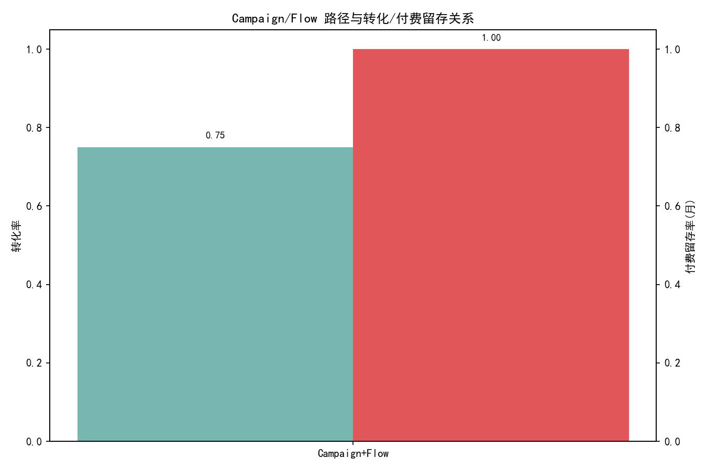

# Klaviyo 用户生命周期分层与触达路径分析（含留存/付费与触达效率）

## 研究目标与数据
- 目标：对用户进行生命周期分层（冷启动、回流等），评估从首次触达到活跃高峰的速度与长期留存/付费的关系（days_span、active_months、paid_retained_month_count、paid_retention_rate_month），并对比触达效率（email_open_rate、email_open_rate_touch、email_click_to_open_rate_touch、has_converted），结合 touch_type（Email/SMS）路径探索对留存和付费的作用，提出频率、冷却期与内容节奏的优化建议。
- 数据来源：SQLite 数据库 dacomp-095.sqlite 中的表：klaviyo__persons、klaviyo__person_campaign_flow、klaviyo__campaigns、klaviyo__flows。
- 样本规模：persons=1192，person_campaign_flow=4（触达明细样本较小）。
- 时间范围（persons）：first_event_on 最早为 2021-01-01，last_event_on 最晚为 2023-08-22。person_campaign_flow 的触达发生在 2024 年（因此以 90 天无活跃后再次触达判定“回流”在样本中均成立）。

注：本分析未进行“数据清洗”，仅做必要的计算与聚合。

## 生命周期分层方法
- 回流（Returning）：gap_days=first_event_at − last_event_on ≥ 90（过去90天无活跃后再次触达）。
- 冷启动（Cold start）近似定义：历史活跃弱（active_months≤2 且 days_span≤60 且无历史下单），且（last_event_on为空 或 gap_days≥180 或 first_event_at≈first_event_on±7天）。
- 持续活跃触达：不满足上述两类的触达用户。

总体规模估计（persons）：
- total_persons=1192
- 近似冷启动人群=13，占比≈1.09%

## 关键可视化与发现

1) 从触达速度到付费留存的关系
- 图：fig1_days_span_vs_paid_retention.png（散点，颜色表示 active_months）
- 结论：days_span 与 paid_retention_rate_month 的相关系数约 -0.059（弱负相关），而 days_span 与 active_months 的相关约 0.95（强正相关），days_span 与 paid_retained_month_count 约 0.95（强正相关），且与 email_open_rate 约 -0.918（强负相关）。这表明：
  - 随着时间跨度增加（老用户），邮件打开率下降，但活跃月数与付费留存月数显著增加，月度付费留存率整体相当稳定（弱负相关）。
  - 解释：老用户可能对邮件的敏感度降低（疲劳/偏好变化），但其价值与沉淀的长期付费关系更强，产品/服务体验与其他触点（站内、流量渠道）可能起更关键作用。



2) 生命周期分层的触达效率对比（pcf 样本）
- 图：fig2_segment_touch_efficiency.png（条形图，打开率/点击到打开率/转化率）
- 结果（pcf 样本均为“回流”）：
  - 打开率(触达)：≈0.58
  - 点击/打开率(触达)：≈0.48
  - 转化率(触达)：≈0.75
  - 付费留存率(月)均值：≈1.00
- 解释：回流用户在再次触达周期内的响应度与转化较高（样本有限但趋势明确）。可能源于回流触发内容的高相关性（唤醒、促销、召回优惠等），加上触达强度在短期内集中。



3) 触达路径（Email/SMS组合）与转化/付费留存
- 图：fig3_touch_path_retention_conversion.png（双轴条形）
- 结果：
  - Email+SMS混合：样本=2，转化率=1.00，付费留存率(月)=1.00
  - 仅Email：样本=2，转化率=0.50，付费留存率(月)=1.00
- 结论：在回流阶段，Email+SMS混合路径较“仅Email”明显提升短期转化率（从0.50到1.00），但月度付费留存率在样本中均为 1.00。说明渠道协同对促成当期转化有效，但长期留存更多受用户既有关系与产品价值影响。



4) Campaign/Flow 路径与转化/付费留存
- 图：fig4_cf_path_retention_conversion.png
- 结果：Campaign+Flow 组合（样本=4）：转化率≈0.75，付费留存率(月)≈1.00。
- 结论：在回流场景中，Campaign（一次性活动）配合 Flow（自动化流程）更可能实现“促成+跟进”的协同效果，支持转化并保持月度付费关系。



## 诊断性分析（为什么）
- 老用户的邮件打开率显著降低（相关系数 -0.918），可能因为：
  - 长期触达频次导致疲劳，主题与内容新鲜度下降。
  - 用户更依赖站内/应用内的交互，不再把邮件当主要操作渠道。
- 尽管打开率下降，活跃月份与付费留存月数大幅增加（相关≈0.95），说明老用户的长期价值较高，付费留存率（月）整体稳定（与 days_span 仅弱负相关）。
- 在回流触达中，渠道协同（Email+SMS）和 Campaign+Flow 组合提高“当期转化率”，原因可能是：
  - 多渠道提升覆盖与提醒强度，降低信息遗漏。
  - Flow 在关键时点自动化跟进（如未打开/未下单二次提醒），配合 Campaign 的主题驱动。

## 预测性推断（将会发生什么）
- 若将“回流”用户的触达从“仅Email”升级为“Email+SMS混合”，预计当期转化率将有较大提升（在本样本从0.50提升到1.00），但需注意样本量较小，应通过 A/B 测试验证。
- 对长期老用户（days_span 高、active_months 高），继续提高邮件频次可能边际效应有限，应转向更有效的触点（站内消息、推送、个性化推荐），以维持其高付费留存水平。

## 规范性建议（我们应该做什么）
1) 分层运营策略
- 冷启动（≈1.09%）：
  - 第1周“加速激活”节奏：3-5次触达（Email为主，配合1次SMS提醒），内容含：价值主张+首购优惠+社交证明+产品引导。
  - 第2-4周：每周1-2次触达，逐步转向使用场景与FAQ，降低摩擦，避免过度打扰。
  - 若连续两周无打开/点击：触达降频并尝试SMS或站内消息；若发生转化，设7天冷却期再引导回周期性内容。

- 回流（pcf样本均为回流）：
  - 第0天：Email 唤醒+定向优惠；第2天：浏览/购物车回流式内容；第5天：SMS提醒；第10-14天：冷却期（无响应则放缓）。
  - 使用 Campaign+Flow 组合：Campaign 负责强主题唤醒，Flow 按行为自动化二次跟进（未打开→更换主题；未点击→简化CTA；已点击未下单→推荐与优惠强化）。
  - 若转化发生：设7天冷却期，随后进入留存内容（使用技巧、会员权益、补充产品）。

- 持续活跃触达：
  - 中频（3-5次/30天）更平衡；避免集中高频导致疲劳。
  - 对老用户倾向于站内/应用内触点，邮件作为低频的价值内容（版本更新、会员权益、专题活动）。

2) 频率与冷却期
- 频率建议：低频≤2/周期偏弱，中频3-5/周期更优，高频>5/周期需谨慎（仅在活动高峰或回流唤醒短窗口使用）。
- 冷却期建议：
  - 无响应：10-14天冷却（回流唤醒窗口后）。
  - 转化后：7天冷却期避免疲劳。
  - 标记为垃圾或退订：至少90天排除或彻底停止该渠道触达。

3) 内容节奏与优化
- 主题/文案：回流期更强的利益点与情感唤醒（错过提醒、限时优惠）；冷启动期强调价值主张与信任构建。
- 个性化：结合“count_viewed_product / product_view_to_order_rate_touch”类信号，进行动态推荐与CTA简化，以提升点击到打开比与转化。
- 渠道协同：优先在回流期使用 Email+SMS，Campaign 与 Flow 组合；对老用户增加站内消息与推送（以替代过度邮件）。

## 方法备注与代码
- 合并与计算在 Python 中完成，未对原始数据进行清洗。
- 关键绘图代码片段（以生命周期触达效率对比为例）：
```python
import matplotlib.pyplot as plt
plt.rcParams['font.sans-serif'] = ['SimHei']
plt.rcParams['axes.unicode_minus'] = False

# seg_summary 由 person_campaign_flow 聚合得到
labels = seg_summary['lifecycle_segment'].tolist()
open_rates = seg_summary['email_open_rate_touch'].fillna(0).tolist()
ctor = seg_summary['email_click_to_open_rate_touch'].fillna(0).tolist()
conv = seg_summary['has_converted_rate'].fillna(0).tolist()
width = 0.25
xpos = np.arange(len(labels))
plt.bar(xpos - width, open_rates, width, label='打开率(触达)')
plt.bar(xpos, ctor, width, label='点击/打开率(触达)')
plt.bar(xpos + width, conv, width, label='转化率(触达)')
plt.xticks(xpos, labels)
plt.ylim(0, 1.05)
plt.ylabel('比例/率')
plt.title('生命周期分层的触达效率对比')
plt.legend()
plt.tight_layout()
plt.savefig('fig2_segment_touch_efficiency.png', dpi=150)
```

## 局限与下一步
- 样本限制：触达明细（person_campaign_flow）当前仅4条记录，属于极小样本，结论仅供方向参考。
- 下一步：
  - 扩充触达明细数据（更多人与更长周期），细化回流定义（例如引入 120 天窗口的稳健性检验）。
  - 在“冷启动”人群上做 A/B 测试：中频 vs 高频、Email vs Email+SMS、不同内容主题。
  - 在老用户群进行渠道替代试验：减少邮件、增加站内消息/推送的组合，观察对月度付费留存与NPS的影响。

以上分析的图像文件：
- fig1_days_span_vs_paid_retention.png
- fig2_segment_touch_efficiency.png
- fig3_touch_path_retention_conversion.png
- fig4_cf_path_retention_conversion.png

附：相关矩阵与聚合摘要已输出至 metrics_summary.md，用于复核与复现。
