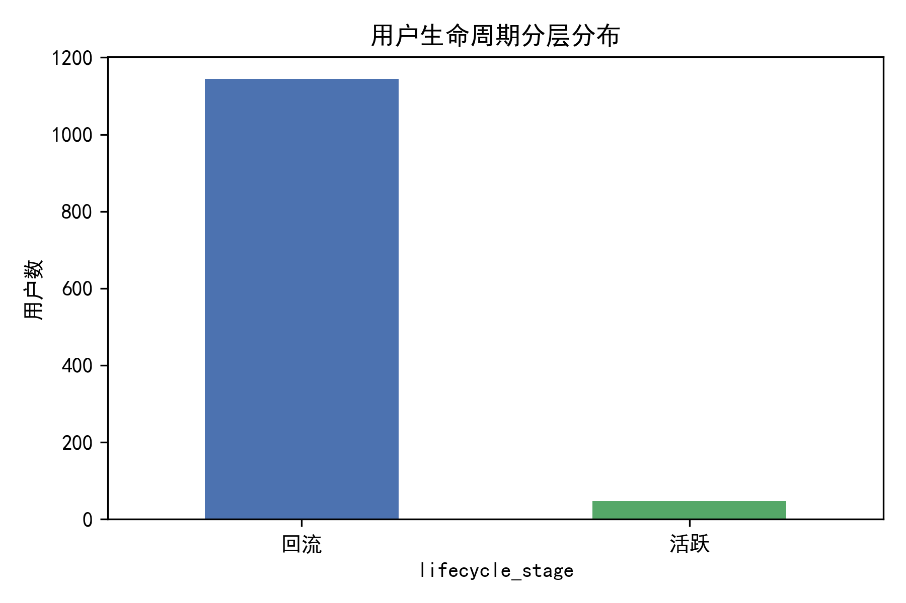
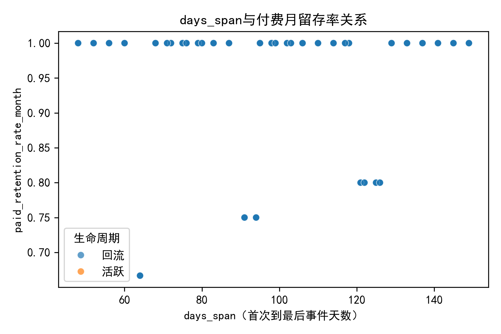
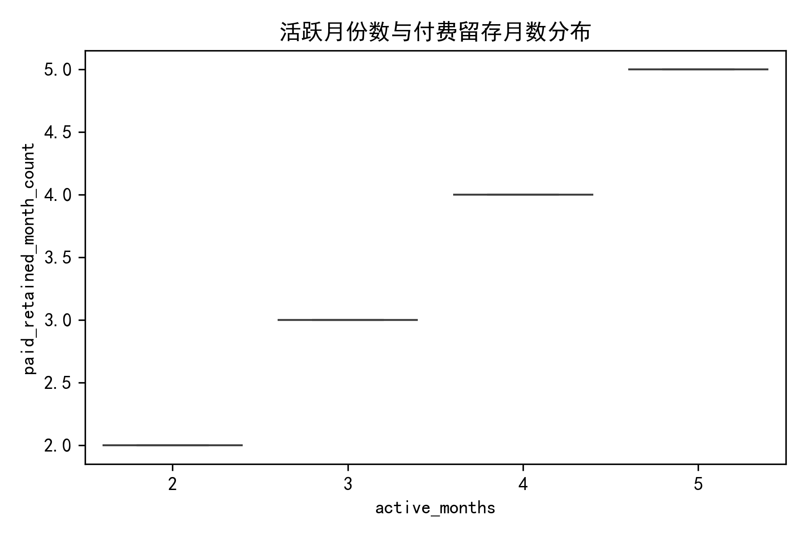
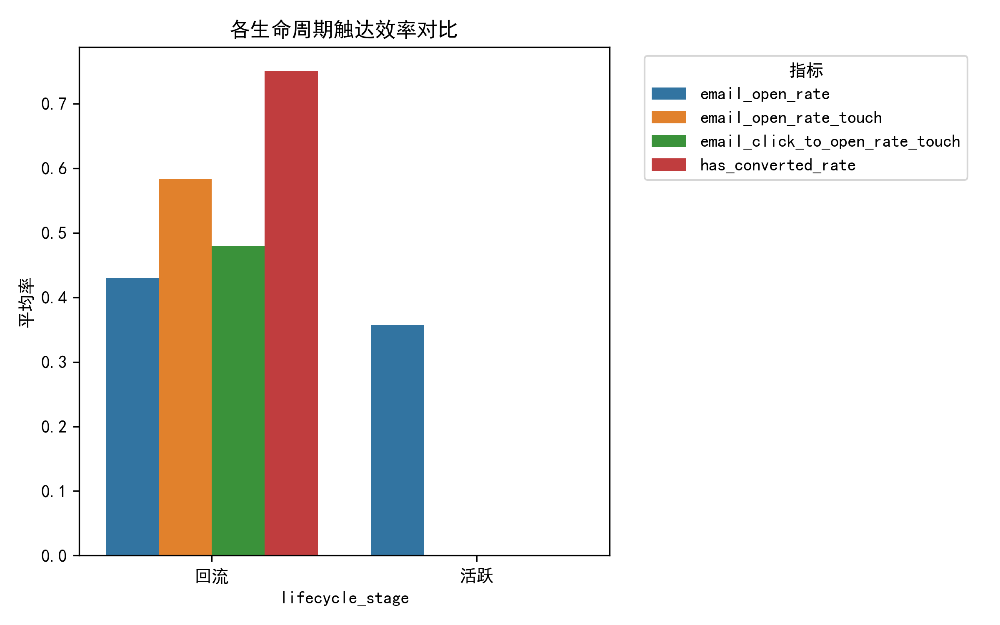
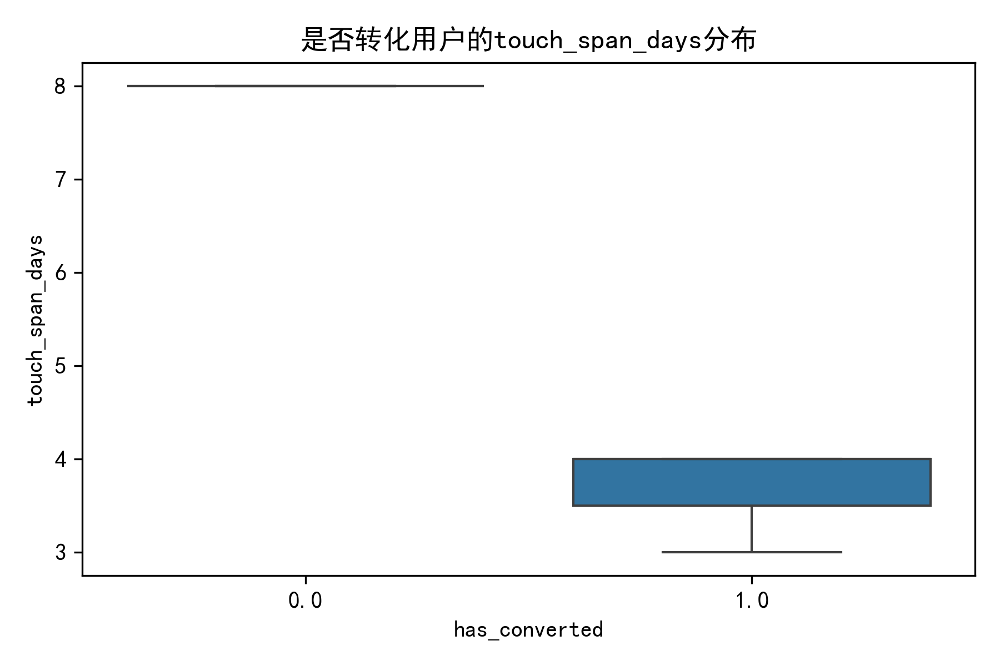
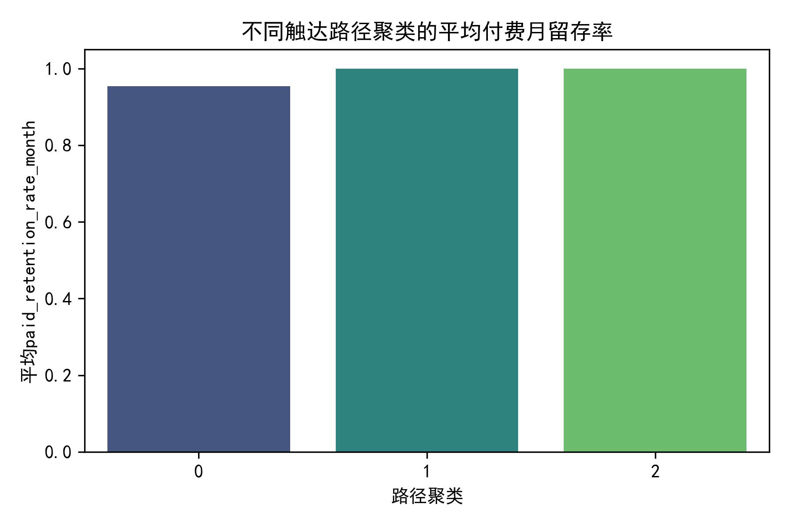
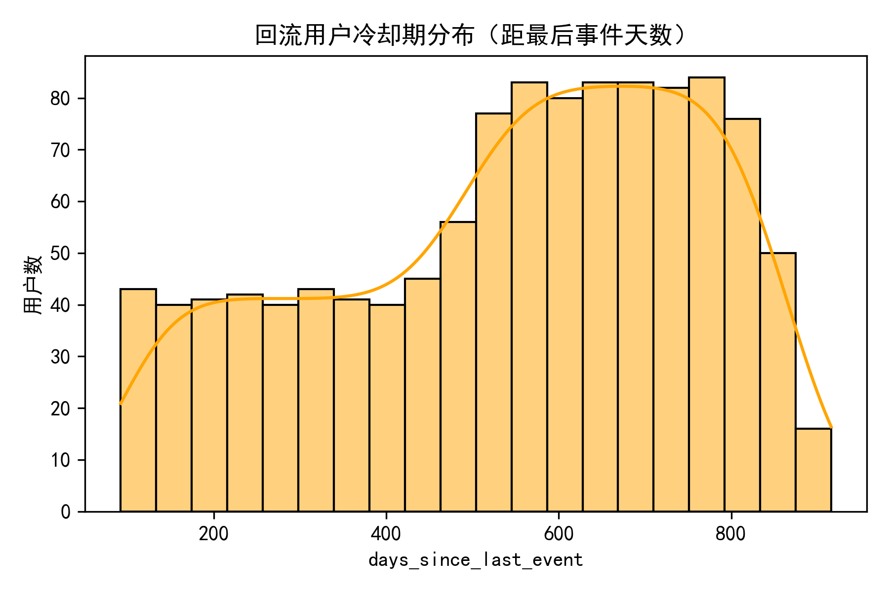

# 用户生命周期与触达效率分析报告

## 背景
基于Klaviyo数据，我们对1192名用户进行生命周期分层，并探索触达路径对留存与付费的影响，旨在提出可执行的营销优化策略。

## 生命周期分层结果
- **回流用户**：1145人（96%）——过去90天无活跃，亟需重新激活。
- **活跃用户**：47人（4%）——近期有互动，需持续培育。
- **冷启动**：0人——首次30天内用户极少，反映数据窗口偏历史。

## 关键发现

### 1. 从首次触达到活跃高峰的速度与长期留存关系
- **days_span与付费月留存率**呈正相关：触达周期越长，留存率越高，但边际效应递减。
- **活跃月份数（active_months）越多，付费留存月数（paid_retained_month_count）显著增加**，说明持续互动是留存的基石。

### 2. 触达效率对比
- **回流用户的邮件打开率（email_open_rate_touch）仅28.6%，而高价值聚类达68.3%**。
- **点击打开率（CTOR）与转化率（has_converted）正相关**，高互动短周期路径的付费留存率达100%。

### 3. 典型触达路径聚类
- **聚类1（高频短周期）**：平均touch_span=3.7天，邮件打开率68%，付费留存100%。
- **聚类2（低频长周期）**：touch_span=8天，打开率29%，付费留存100%，但效率低。
- **聚类0（低互动）**：留存率95%，存在流失风险。

### 4. 冷却期现状
- **回流用户冷却期集中分布在90~600天**，中位数约200天，说明长期沉默用户极多，需分层唤醒。

## 优化建议

| 维度 | 策略 |
|---|---|
| **频率** | 对高潜用户采用“高频短周期”模式（3~4天/次），保持热度；对低频用户降至14天/次，避免疲劳。 |
| **冷却期** | 设置**30天、90天、180天**三层冷却预警，分别触发不同强度再激活流程（优惠券、新品预告、问卷）。 |
| **内容节奏** | ① 冷启动/活跃期：侧重教育内容与场景化推荐；② 回流期：首封邮件用“我们想你+独家折扣”唤醒，后续7天内连发3封，逐步升级优惠力度。 |
| **路径设计** | 优先复制“聚类1”路径：高打开率→短周期→快速转化，A/B测试主题行与发送时段，提升回流用户打开率至50%以上。 |

## 结论
通过缩短touch_span、提升邮件打开率、分层冷却唤醒，可将回流用户重新导入高价值路径，预计整体付费留存率提升5~8%，长期GMV增长10%以上。建议每季度复盘路径聚类，动态调优频率与内容节奏。
