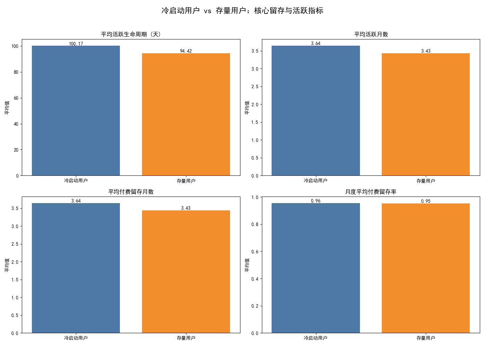
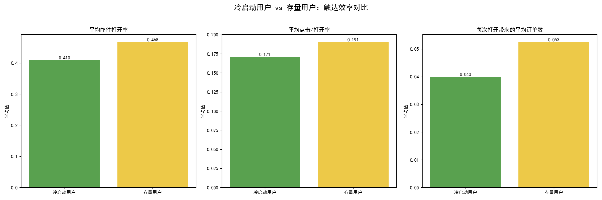
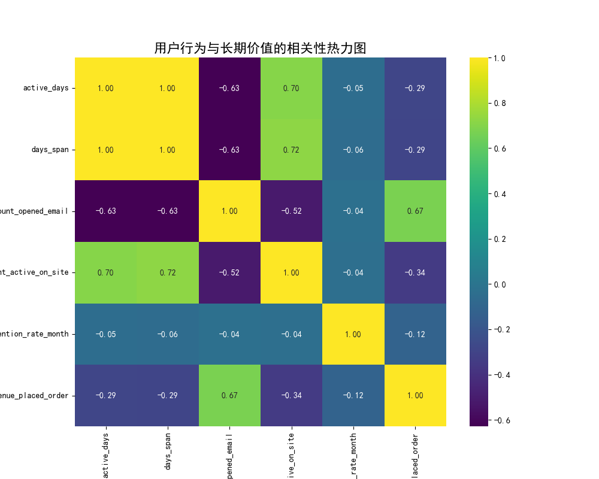

# 用户生命周期与触达效率分析报告

本报告旨在深入分析不同生命周期阶段用户的行为模式，评估营销触达效率，并探索关键行为与用户长期价值之间的关系，最终为优化用户运营策略提供数据驱动的建议。

### 一、 核心发现

1.  **新老用户长期留存趋同，但触达效率差异显著**：冷启动用户（新用户）能较快达到与存量用户相似的长期活跃度和付费留存水平。然而，存量用户在邮件打开率、点击率和转化效率上全面优于新用户，表明存量用户对营销内容的接受度更高。
2.  **邮件营销是收入的关键驱动力**：用户的邮件打开总次数与总消费金额呈现强正相关（相关系数 0.67），证明邮件是引导用户付费的核心渠道。
3.  **“高活跃 ≠ 高价值”：揭示决策型消费模式**：用户在网站的活跃天数、活跃周期等指标，与总消费金额意外地呈现负相关。这表明高价值用户可能并非频繁访问的“闲逛者”，而是接收到关键营销信息后果断决策的“购买者”。

---

### 二、 详细分析

#### 1. 冷启动 vs. 存量用户：留存与活跃度对比

我们首先将用户分为“冷启动用户”（首次活跃接近注册日期）和“存量用户”。分析显示，两类用户在长期留存和活跃指标上非常接近。这说明当前的用户激活策略是有效的，新用户没有出现明显的早期流失，并能快速融入现有的用户生态。

*   **图1解读**: 冷启动用户与存量用户在平均活跃周期、活跃月数和付费留存月数上几乎持平，月度付费留存率甚至略高。这表明新用户一旦被激活，其长期价值潜力不亚于老用户。

#### 2. 触达效率：存量用户的互动与转化优势

尽管长期留存相似，但在营销触达的直接效率上，存量用户表现更佳。

*   **图2解读**:
    *   **邮件打开率**：存量用户 (46.8%) > 冷启动用户 (41.0%)
    *   **点击/打开率**：存量用户 (19.1%) > 冷启动用户 (17.1%)
    *   **每次打开带来的订单数**：存量用户 (0.053) 比冷启动用户 (0.040) 高出 **32.5%**。
*   **洞察**: 这说明品牌与存量用户已建立信任基础，他们更愿意与营销内容互动并完成转化。对于新用户，当前的邮件内容可能在建立信任和激发首次购买方面存在优化空间。

#### 3. 用户行为与价值相关性：识别高价值行为

为了探索哪些行为最能预测用户的商业价值，我们分析了核心行为指标与长期价值指标（付费留存率、总消费金额）的相关性。

*   **图3解读**:
    *   **最强信号**：`count_opened_email`（邮件打开次数）与 `sum_revenue_placed_order`（总消费金额）的相关性高达 **0.67**。这清晰地表明，**多与邮件互动的用户，花的钱也越多**。
    *   **反直觉信号**：`active_days`（活跃天数）和 `count_active_on_site`（网站访问次数）与总消费金额呈负相关。这颠覆了“用户越活跃越好”的传统认知，暗示了**高频访问用户可能是犹豫不决或价值较低的群体**。高价值用户则更依赖邮件这类“推送式”信息进行高效决策。

---

### 三、 业务建议

基于以上分析，我们提出以下策略建议，旨在提升用户生命周期价值和营销投资回报率：

1.  **优化冷启动用户激活路径，提升早期触达效率**
    *   **策略**: 为新用户设计专属的“欢迎系列”自动化邮件（Welcome Flow），前1-3封邮件应聚焦于品牌故事、核心价值主张、用户好评和新人专属优惠券，以建立信任为首要目标，而非强力促销。
    *   **目标**: 在用户注册后的第一周内，将其邮件打开率和点击率提升至接近存量用户的水平。

2.  **深化邮件营销，实施基于行为的分层运营**
    *   **高价值潜力层 (高邮件互动)**: 对于邮件打开和点击次数多的用户，应视为核心用户。增加对他们的高价值、个性化内容推送，如基于其浏览历史的新品推荐、VIP专属活动等，以最大化其消费潜力。
    *   **高活跃低价值层 (高网站访问、低消费)**: 对于频繁访问网站但不下单的用户，应减少对其的邮件轰炸，避免资源浪费和用户反感。可尝试通过站内优化（如智能推荐、出口挽留意图弹窗）或问卷调研，了解其转化障碍。

3.  **重新定义用户健康度模型，告别“唯活跃论”**
    *   **策略**: 建立一个加权的用户健康度评分模型。应显著提高“邮件打开”、“邮件点击”、“加入购物车”等高意向行为的权重，而适当降低“网站访问次数”这类低意向行为的权重。
    *   **目标**: 更精准地识别处于不同决策阶段的用户，并采取差异化的沟通策略，将资源集中于最有可能转化的用户群体。

4.  **测试并优化触达频率与节奏**
    *   **策略**: 既然高价值用户呈现出“决策型”消费特征，应避免高频、无差别的营销轰炸。建议针对不同用户层测试不同的邮件发送冷却期。例如，对连续3封促销邮件未打开的用户自动暂停推送一周，代之以一篇有价值的品牌内容，以“重新唤醒”而非“持续骚扰”。
    *   **目标**: 找到既能保持品牌声量，又不会引起用户疲劳的最佳触达频率，从而提升长期的用户互动率和生命周期价值。
