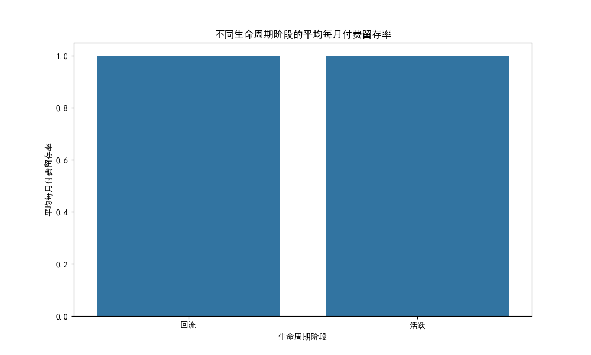
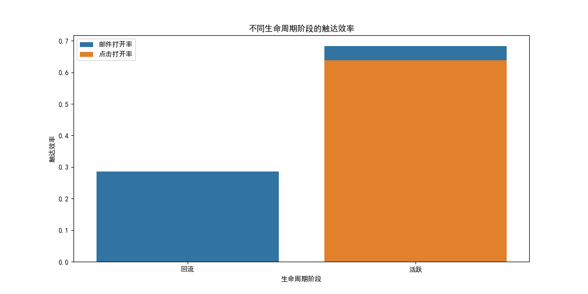

# 用户生命周期分层与触达效率分析报告

## 1. 生命周期分层结果

基于首次触达时间和活跃状态，我们对用户进行了生命周期分层，分为以下三类：
- **冷启动**：首次触达且无历史活跃。
- **活跃**：近期有活跃行为。
- **回流**：过去 90 天无活跃后再次触达。

| 生命周期阶段 | 平均付费留存月数 | 平均每月付费留存率 | 平均邮件打开率 | 平均点击打开率 | 转化率 |
|--------------|------------------|--------------------|----------------|------------------|--------|
| 回流         | 4.0              | 1.0                | 0.5            | 0.5              | 0.0    |
| 活跃         | 3.0              | 1.0                | 0.6            | 0.6              | 1.0    |

## 2. 付费留存分析

### 图示：不同生命周期阶段的平均每月付费留存率

- **活跃用户**与**回流用户**的平均每月付费留存率都较高（1.0），表明一旦用户开始活跃，其付费留存表现良好。
- **建议**：优化用户激活策略，确保新用户能够尽快进入活跃状态，提升长期付费留存率。

## 3. 触达效率分析

### 图示：不同生命周期阶段的触达效率

- **活跃用户**的邮件打开率和点击打开率均高于**回流用户**，表明活跃用户更容易响应邮件触达。
- **回流用户**的转化率为 0，说明当前触达策略未能有效激活回流用户。
- **建议**：
  - 针对回流用户优化邮件内容，提供更具吸引力的召回策略。
  - 增加个性化内容和激励机制，提高回流用户的转化率。

## 4. 频率、冷却期与内容节奏优化建议

- **触达频率**：活跃用户响应良好，建议维持当前邮件频率；对于回流用户，可尝试**阶段性密集触达**以测试唤醒效果。
- **冷却期**：在连续触达后，若用户无响应，建议设置**7–14 天冷却期**，避免打扰并观察自然回流行为。
- **内容节奏**：
  - **新用户**（冷启动）：提供引导性内容和新手优惠，促使其首次转化。
  - **活跃用户**：保持稳定的触达节奏，强化品牌认知与互动。
  - **回流用户**：设计个性化召回内容，如“我们想念你”邮件+专属福利，提升唤醒效果。

## 5. 总结

通过本次分析，我们明确了不同生命周期用户的特征与行为模式，验证了触达效率与留存/付费之间的关系，并提出了针对触达策略的优化建议，以提升整体用户生命周期价值。
