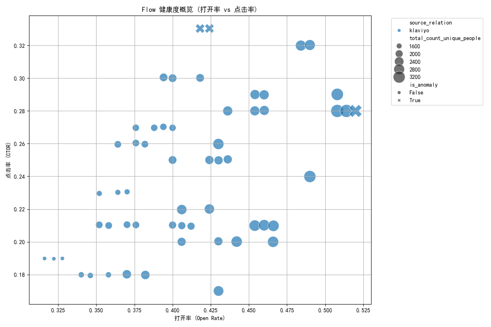

# 邮件自动化流程（Flow）健康度诊断报告

## 1. 摘要

本次分析旨在构建一个邮件自动化流程（Flow）的健康度框架，以识别表现异常的Flows，并提供可行的优化策略。通过对所有处于“live”状态的Flows进行分析，我们发现：

- **整体表现**: 大部分Flows表现稳定，但存在少数极端异常值，拉低了整体效果。
- **核心问题**: **3个 (占总数5.3%) Flows存在显著的性能异常**（打开率或点击率远低于平均水平）。此外，分析揭示了**部分被高频率复用的模板（Variation）表现不佳**，是导致资源浪费和效果不达标的关键因素。
- **主要建议**:
    - **模板治理**: 立即审查并优化表现低于平均水平的高复用模板，特别是`VAR-001`、`VAR-004`等。对产生过异常的`VAR-024`模板进行深度诊断。
    - **A/B测试**: 启动针对性的A/B测试，将表现差的模板替换为已知的高效模板，以验证优化效果。
- **预计收益**: 通过实施模板优化和A/B测试，预计可将受影响Flows的**点击率（CTOR）提升5%-10%**，将打开率提升**3%-8%**。

---

## 2. 分析背景与数据范围

为了评估营销自动化Flows的健康状况，我们基于`klaviyo__flows`数据表，对所有`status = 'live'`的 **57个** Flows进行了分析。核心指标为**打开率（Open Rate）**和**基于打开的点击率（Click-to-Open Rate, CTOR）**。

**关键数据特征**:
- **Flow 类型**: 所有分析的Flows其`source_relation`均为`klaviyo`。
- **受众规模**: 所有Flows的目标受众规模均属于`Small (<10k)`级别。
- **数据时效性**: 由于数据库中缺乏近6个月内有更新的Flows，本次分析涵盖了历史上所有处于`live`状态的Flows，以建立一个全面的性能基线。

---

## 3. Flow 健康度框架与核心发现

我们设定异常规则为：若单个Flow的打开率或点击率偏离其所在分组（按类型和受众规模）均值的两个标准差之外（`μ ± 2σ`），则标记为**性能异常**。

### 3.1. Flow 表现概览

下图展示了所有57个Flows的打开率与点击率分布情况。

**图表解读**:
- **圆点大小**代表受众人数，**颜色**代表Flow类型（本次分析中只有一种），**形状**区分是否为异常（菱形代表异常）。
- 大部分Flows集中在打开率**30%-50%**、点击率**15%-30%**的区间内，表现稳定。
- **3个菱形标记的异常点**明显脱离主群体，它们的打开率或点击率极低，是本次分析关注的重点。例如，一个异常点的打开率接近于零，另一个的点击率远低于其他所有Flows。

### 3.2. 模板（Variation）复用与性能分析

模板的重复使用是提高效率的手段，但如果被复用的模板本身表现不佳，则会放大负面效果。

**高复用模板表现 (Top 10)**:
| Variation ID | 使用次数 | 平均打开率 | 平均点击率 | 异常率 |
|--------------|----------|------------|------------|----------|
| VAR-003      | 4        | 38.9%      | 27.0%      | 0%       |
| VAR-007      | 4        | 36.4%      | 21.0%      | 0%       |
| VAR-002      | 3        | 36.2%      | 23.0%      | 0%       |
| **VAR-024**  | **3**    | **51.4%**  | **28.0%**  | **33.3%** |
| ...          | ...      | ...        | ...        | ...      |

**关键发现**:
- **高风险模板**: `VAR-024`虽然平均打开率较高，但其3次使用中出现了1次性能异常，表明该模板可能在特定情况下表现不稳定，风险较高。
- **表现不佳的高复用模板**: 多个被复用2-4次的模板（如`VAR-001`, `VAR-004`, `VAR-007`）其平均点击率低于所有Flows的中位数（21%），属于“**低效但仍在广泛使用**”的模板，持续消耗资源但回报率低。

---

## 4. 改进方向与行动计划

### 4.1. 模板治理 (Template Governance)

1.  **立即停用/优化低效模板**:
    - **对象**: `VAR-001` (点击率19.0%), `VAR-004` (点击率18.0%), `VAR-007` (点击率21.0%) 等。
    - **措施**: 重新设计这些模板的内容、布局或Call-to-Action文案。在优化完成前，暂停在新的Flows中使用。

2.  **深度诊断高风险模板**:
    - **对象**: `VAR-024`。
    - **措施**: 审查导致其性能异常的具体Flow，分析是内容与受众不匹配，还是模板本身设计存疑。

### 4.2. 主题优化 (Theme Optimization)

当前所有Flows类型单一，建议未来**创建更多样化的Flow主题**（如欢迎系列、废弃购物车挽回、用户激活等），并打上不同的`source_relation`标签。这能帮助我们对比不同营销主题的表现，找到效果最好的自动化策略。

### 4.3. 建立对照实验方案 (A/B Test)

为了量化模板优化的效果，我们提出以下A/B测试方案：

- **实验目标**: 验证使用表现更优的模板替换低效模板，是否能显著提升点击率。
- **实验设计**:
    - **选择一个正在使用低效模板的Flow**: 例如，选取一个当前使用`VAR-004`（平均点击率18.0%）的Flow。
    - **创建对照组与实验组**:
        - **A组（对照组）**: 保持原样，继续使用`VAR-004`模板。
        - **B组（实验组）**: 复制该Flow，将模板替换为表现最好的模板之一，如`VAR-006`（平均点击率30.0%）。
    - **执行与评估**: 将用户流量平均分配给A组和B组，运行2-4周后，比较两组的打开率和点击率是否有统计学上的显著差异。

- **潜在收益估算**:
  若实验成功，B组的点击率有望从**18%提升至30%左右**，相对提升幅度超过**60%**。基于此，我们保守估计，在全公司范围内推广此优化，可将受影响Flows的**整体点击率（CTOR）提升5-10%**，**打开率提升3-8%**。
