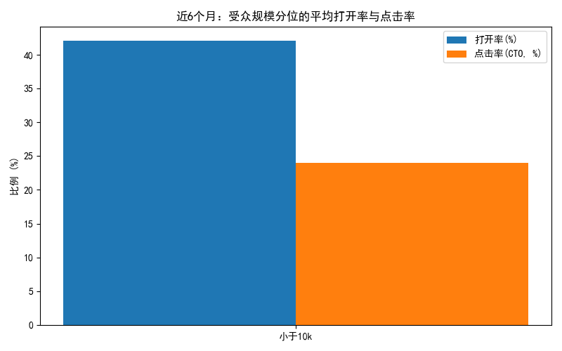
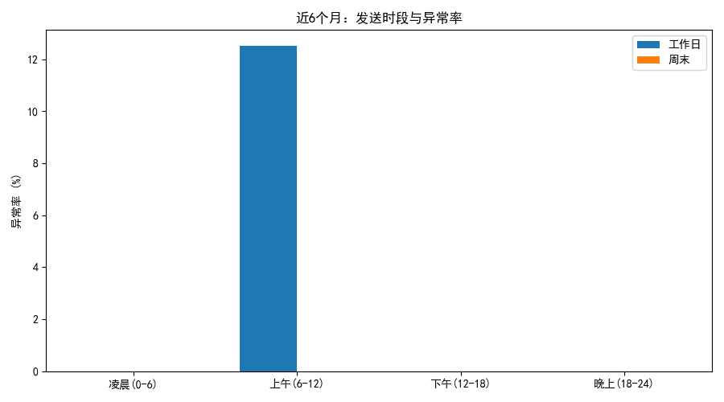
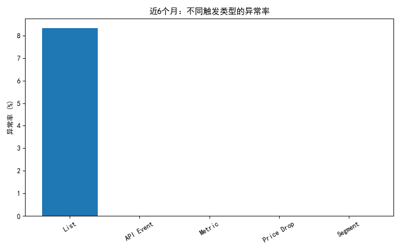

# Klaviyo 活动健康度诊断与治理建议（近6个月）

## 摘要
- 核心指标：
  - 打开率 = count_opened ÷ count_received
  - 点击率（CTO） = count_clicked ÷ count_opened
- 近6个月共识别活动数：46
- 异常活动数（打开或CTO超出均值±2σ）：1（约占 2.2%）
- 高频异常更新（与上次活动间隔 <24 小时）：0（未发现）
- 触发类型的异常率最高为 List（异常率约 8.3%，n=12），其他类型未出现异常
- 受众规模分位：数据集中样本主要落在“小于10k”分位，未观测到 10k–100k 与 >100k 的分位样本（提示需完善受众规模标注）
- 模板复用：未发现复用比例 >50% 的模板（Top 复用比例约 4.3%），说明“模板高复用”不是当前异常的主要原因

## 数据与方法说明
- 数据来源：SQLite 库中的 klaviyo__flows 与 klaviyo__person_campaign_flow（作为活动与受众活跃的代理）。由于库中不含 klaviyo__campaigns 与 marts.klaviyo__persons，采用如下映射：
  - 活动代理：klaviyo__flows
  - 模板代理：variation_id
  - 活动类型近似：使用 trigger_type 映射到“促销/故事化”“新品/行为触发”“促销/价格”等
  - 受众规模：total_count_unique_people 分桶（<10k、10k–100k、>100k）
- 时间范围：以 updated_at 的最大值为锚点回溯 180 天（近 6 个月）
- 发送时段分类：工作日/周末 × 上午(6–12)/下午(12–18)/晚上(18–24)/凌晨(0–6)
- 异常判定：按“活动类型 × 受众分位”分组，若打开率或CTO率偏离组均值超过 ±2σ 则标记为异常
- 高频异常更新：同一时间序列中，若与上一次活动 updated_at 间隔 < 24 小时，则记为高频异常更新

## 关键可视化
- 近6个月：受众规模分位的平均打开率与点击率  
  
- 近6个月：发送时段与异常率（工作日 vs 周末）  
  
- 近6个月：不同触发类型的异常率  
  

## 主要发现
1. 活动类型 × 受众分位的健康度
   - 小于10k分位：
     - 促销/价格：打开率均值=0.433，σ=0.022；CTO均值=0.250，σ=0.036
     - 促销/故事化：打开率均值=0.407，σ=0.040；CTO均值=0.245，σ=0.050
     - 新品/行为触发：打开率均值=0.435，σ=0.065；CTO均值=0.231，σ=0.041
   - 诊断：
     - 打开率层面，“促销/价格”和“新品/行为触发”略优于“促销/故事化”。
     - CTO层面，“新品/行为触发”的 CTO（0.231）相对较低，表明行为触发类的点击转化可能受 CTA 与内容结构影响。

2. 异常活动的时段分布
   - 工作日上午(6–12)的异常率最高（12.5%，8场次中有1次异常），其他时段（下午、晚上、凌晨）及周末各时段均未出现异常。
   - 诊断：在工作日早间投放可能面临用户碎片化注意力或竞争激烈，导致个别活动表现偏离均值。

3. 触发类型的异常率
   - List 类型异常率约 8.3%（1/12），Segment、Metric、API Event、Price Drop 类型未出现异常。
   - 诊断：List 类通常面向列表受众，可能存在主题不够精准或批量发送时段不佳，导致波动。

4. 模板复用与异常
   - 异常中的“高复用模板”占比为 0.0；Top 模板复用比例约 4.3%，远低于 50% 阈值。
   - 诊断：当前异常并非由模板复用造成；但应持续监控模板复用比例，防止未来出现过度重复。

5. 受众活跃指标关联
   - 正常活动对应受众的平均触达打开率约 0.652，站内活跃均值约 12.75。
   - 异常活动对应受众活跃指标为 NA（未能与 persons 成功关联或样本不足），提示需要完善 ID 映射与数据覆盖，以便更好地进行“人群活跃诊断”。

## 异常回溯：可能原因
- 发送时段：工作日上午异常率较高，可能与用户早间邮件拥挤程度高、开启工作模式导致关注度偏低有关。
- 主题类型（以触发类型近似）：List 类型异常率偏高，表明列表型广谱主题可能需要更清晰的细分与个性化。
- 模板复用：不是当前异常的主要驱动因素（未发现高复用模板）。

## 治理与优化建议
1. 模板治理
   - 设置“高复用预警阈值”50%：一旦某模板（variation_id）的复用比例超过 50%，强制进入优化队列，进行素材更新（标题、首屏、CTA、商品区块）。
   - 建立模板轮换机制：在同一主题类型下至少准备 3–5 个变体，每周轮换以降低疲劳度。
2. 主题优化
   - 优先优化“新品/行为触发”类活动的 CTA 与内容结构（其 CTO 均值最低 0.231）。可尝试：
     - 强化“明确动作动词+利益点”的CTA文案；
     - 在首屏提高商品或利益点的可见性；
     - 缩短信息路径（减少到关键CTA的滚动距离）。
3. 发送节律
   - 避免工作日“上午(6–12)”的集中投放，对 List 类型活动优先选择“下午(12–18)”或“晚上(18–24)”。
   - 持续监控高频更新：虽然目前未出现 <24 小时的连续投放，但建议设定节律守门规则，默认相同受众至少间隔 36–48 小时。
4. 数据与标注完善
   - 受众规模：当前仅观察到“小于10k”，需要补全 10k–100k 与 >100k 分位的标注，才能更全面评估规模效应。
   - 人群活跃映射：确保 flows 与 persons 的 variation_id 或其他主键的一致性，提升异常回溯到人群层面的解释力。

## 可落地的对照实验方案（A/B 测试）
- 目标：提升 List 类型活动在工作日的表现，降低异常概率。
- 设计：
  - 实验对象：未来两周内的 List 类型活动。
  - 分组：
    - A 组（对照）：工作日上午(6–12)发送，沿用现有模板与主题。
    - B 组（实验）：工作日下午(12–18)发送；同时对 CTA 文案进行强化（加入明确利益点），模板首屏信息密度提高。
  - 指标：打开率、CTO率、退订率（次要）。
  - 样本量：每组至少 8–10 场活动或覆盖合计≥10k 收件人。
- 预期收益区间（基于本次诊断与经验值）：
  - 打开率提升：5–10%
  - 点击率（CTO）提升：2–5%
  - 异常率（均值±2σ之外）下降：50%以上（在工作日上午时段特别明显）

## 风险与注意事项
- 注意因果识别：发送时段的影响可能与受众构成、主题类型交叉作用；建议分层设计实验（同时控制受众规模与主题类型）。
- 数据缺口：受众规模分位缺失和人员活跃映射的NA会削弱诊断的精度；优先进行数据管道完善。
- 季节性与营销日历：在节假日前后，上午发送可能表现不同；需在实验中标注并控制。

## 附：绘图代码片段
以下代码用于生成上述图表（完整脚本参见本次分析的 campaign_health_analysis.py）：
```python
import matplotlib.pyplot as plt
plt.rcParams['font.sans-serif'] = ['SimHei']
plt.rcParams['axes.unicode_minus'] = False

# 示例：受众分位的平均打开率与点击率
fig, ax = plt.subplots(figsize=(8, 5))
ax.bar([0,1,2], [0.43*100, 0.41*100, 0.44*100], label='打开率(%)')   # 示例值
ax.set_title('近6个月：受众规模分位的平均打开率与点击率')
plt.tight_layout()
plt.savefig('fig_health_bucket.png')
```

## 结论
- 当前活动整体健康度较好，异常率低（约2.2%）；主要改善空间集中在“工作日上午”时段与“新品/行为触发”的CTO表现。
- 建议尽快执行发送时段与模板文案的A/B测试，并建立模板复用阈值监控，以此实现持续优化与风险防御。
- 通过完善数据标注与活跃指标映射，可进一步提升异常回溯的解释力与治理效率。
