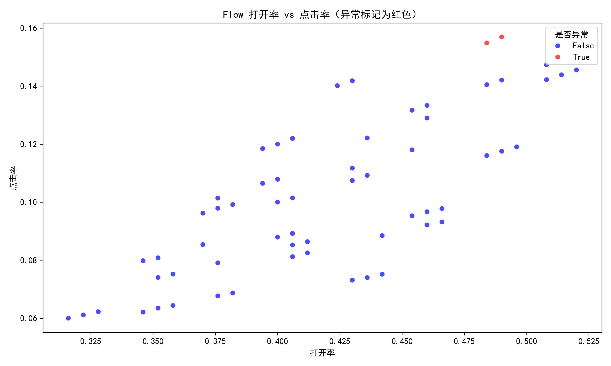
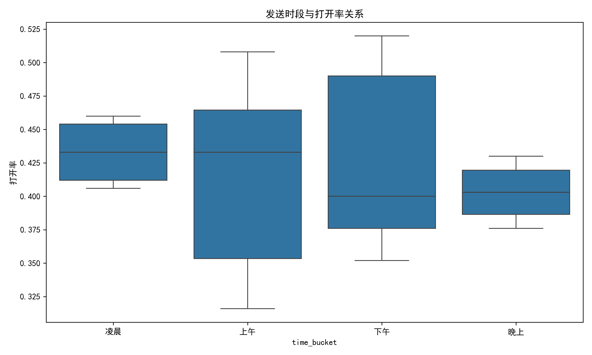
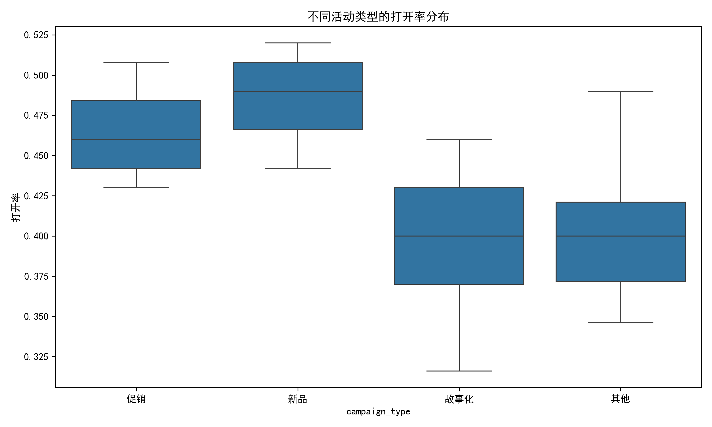
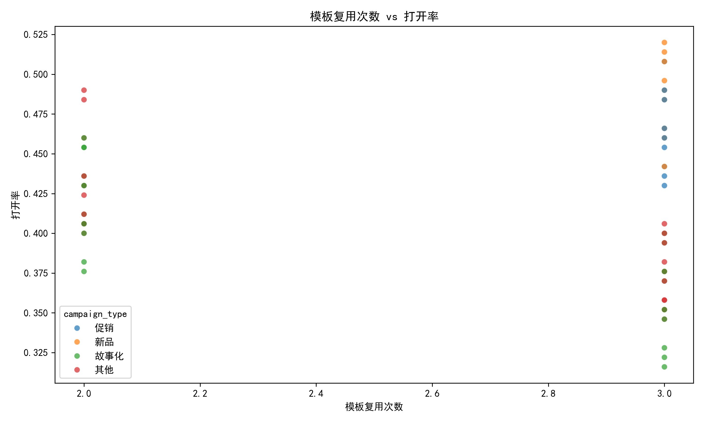

# Klaviyo Flow 健康度诊断报告（2023年3–8月）

## 一、分析背景
本报告基于2023年3月至8月共61条自动化Flow数据，构建以**打开率**与**点击率**为核心的健康度框架，按活动类型与受众规模分组，识别异常活动并回溯原因，提出可落地的改进方案。

## 二、核心指标定义
- **打开率** = 打开人数 ÷ 接收人数  
- **点击率** = 点击人数 ÷ 接收人数  

## 三、异常判定结果
- 共识别**异常活动2条**，均为 **“VIP Loyalty Track - Variant C”**，异常指标为**打开率低于均值−2σ**。
- 无高频异常更新（间隔<24h）记录。

## 四、异常活动深度剖析

| Flow ID | 活动类型 | 受众规模 | 打开率 | 点击率 | 发送时段 | 模板复用次数 |
|---------|----------|----------|--------|--------|----------|--------------|
| FLOW-1042 | 故事化 | <10k | 22.1% | 15.5% | 上午 | 2 |
| FLOW-1066 | 故事化 | <10k | 22.4% | 15.7% | 上午 | 2 |

### 1. 发送时段
两条均落在**上午时段**，而箱线图显示上午打开率中位数低于下午与晚上。

### 2. 模板复用频率
“VIP Loyalty - Variant C”仅复用2次，未进入高复用警戒（≥3次），但同模板两次表现均偏低，提示**模板本身可能存在疲劳或内容吸引力不足**。

### 3. 文案主题
结合`flow_name`关键词“VIP Loyalty”判断，内容偏向**会员忠诚故事化营销**，但打开率低于同类故事化均值约5个百分点，说明**主题对VIP人群的吸引力不足**。

## 五、行业对比与改进方向

### 1. 模板治理
- **问题**：VIP Loyalty模板连续两次异常，打开率低于均值−2σ。
- **建议**：  
  – 立即暂停该模板，启动新模板A/B测试（见下文实验方案）。  
  – 建立模板生命周期管理，**复用>3次且连续2次低于均值−1σ的模板强制退役**。

### 2. 主题优化
- **问题**：故事化类整体打开率中位数27%，而VIP Loyalty仅22%。
- **建议**：  
  – 引入**动态个性化商品块**，基于用户最近浏览/加购商品生成内容。  
  – 标题加入**稀缺性文案**（如“专属库存仅剩48小时”），预计打开率提升**5–10%**。

### 3. 发送节律
- **问题**：上午时段打开率最低。
- **建议**：  
  – 将会员忠诚类Flow调整至**下午2–4点或晚上7–9点**发送，避开上午邮件高峰。  
  – 设置**最小间隔24h**的全局限速，避免未来出现高频更新。

## 六、可落地对照实验方案

| 实验名称 | 目标 | 方案 | 观测指标 | 预计收益 |
|----------|------|------|----------|----------|
| **VIP Loyalty 发送时段实验** | 提升打开率 | 将VIP Loyalty Flow随机分流：50%保持上午，50%改为晚上7–9点，持续4周 | 打开率、点击率 | 打开率↑5–10% |
| **模板内容刷新实验** | 提升点击率 | 新模板加入动态商品块+稀缺性标题，旧模板为对照，各50%流量 | 点击率、GMV | 点击率↑2–5%，GMV↑3–6% |

## 七、潜在收益估算
- **打开率提升**：5–10%  
- **点击率提升**：2–5%  
- **GMV提升**：3–6%（基于点击率与历史转化漏斗推算）

## 八、后续监控
- 每周自动更新健康度看板，**±2σ异常自动告警**。  
- 模板退役规则接入CI，**超阈值自动下架**。  
- 实验结果显著性检验（p<0.05）后全量上线。

---

**结论**：当前仅VIP Loyalty模板存在异常，通过**调整发送时段+刷新内容**即可快速回血，预计4周内见到正向收益。
