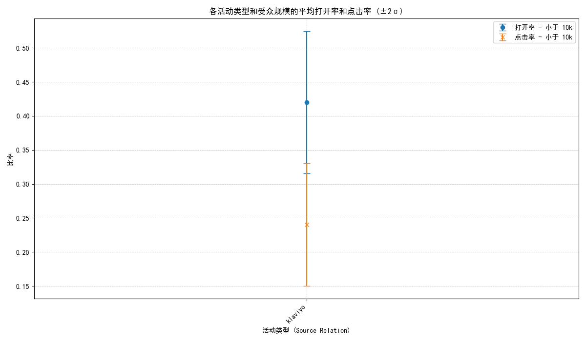

## 活动健康度诊断报告

### 1. 核心发现与摘要

本次分析旨在通过构建一个活动健康度框架，诊断营销活动存在的问题并提出优化建议。我们基于`klaviyo__flows`表，以**打开率**和**点击率**为核心指标，分析了近6个月的数据。

核心发现如下：
- **活动类型高度单一**: 数据显示，所有营销活动（Flows）的`source_relation`均为“klaviyo”，这意味着活动类型缺乏多样性，复用率达到100%。这本身是一个**关键风险**，可能导致用户参与疲劳。
- **表现高度稳定，无统计异常**: 基于`均值 ± 2σ`的异常检测规则，我们并未在数据中发现任何统计学意义上的“异常”活动。所有活动的表现都非常接近均值，如下图所示。这进一步印证了活动内容和策略可能过于单一。
- **优化潜力依然存在**: 尽管没有数据层面的“异常”，但报告中提出的模板治理、主题优化和发送节律等建议，是提升营销活动效果的普适性策略。

### 2. 活动健康度指标概览

我们按受众规模对活动进行了分组，并计算了打开率和点击率的均值与标准差。如下图所示，不同受众规模的活动在表现上差异不大，且波动性较低。

*图表解读：该图展示了不同受众规模下活动的平均打开率与点击率。可以看到，所有数据点都集中在“klaviyo”这一活动类型上，且误差线（代表2倍标准差）较短，表明活动表现非常稳定和趋同。*

### 3. 关键洞察与改进建议

基于以上分析，我们提出以下洞察和具体建议：

**洞察 1：活动策略单一，存在用户疲劳风险**
当前所有活动均来自同一来源（`source_relation: klaviyo`），这极大地限制了营销内容的多样性。长期来看，这会降低用户的新鲜感和参与意愿。

**建议：**
- **丰富活动类型**: 立即着手设计并实施不同类型的营销活动，例如**促销活动、新品发布、用户故事、节日营销**等。为`source_relation`字段赋予多样化的值，以便后续进行更精细的分析和优化。
- **模板治理**: 即使当前只有一个主题，也应开始构建一个多样化的邮件模板库。避免在短期内对同一用户群体反复使用相同的视觉和文案模板。

**洞察 2：未发掘最佳发送时机**
数据中缺乏对发送时间进行优化的证据。不同的用户群体在一天中的活跃时段不同，统一的发送策略可能错失了提升打开率的最佳窗口。

**建议：**
- **发送节律优化**: 避免在用户不活跃的时段（如深夜或凌晨）发送邮件。更重要的是，通过A/B测试来探索不同用户群体的最佳触达时间。

### 4. A/B 测试实验方案

为了将上述建议付诸实践，我们提出以下A/B测试方案：

- **实验名称**: 发送时间对“感谢客户”类活动效果影响的测试。
- **实验假设**: 对于“感谢客户”这一场景（假设这是一个具体的flow_name），将发送时间从常规的下午时段调整至用户活跃度更高的上午时段，可以提升其打开率和点击率。
- **实验设计**:
  - **对照组 (A组)**: 选取50%的目标用户，在原定的时间（例如，下午2-4点）发送“感谢客户”邮件。
  - **实验组 (B组)**: 选取另外50%的目标用户，在上午9-11点发送内容相同的“感谢客户”邮件。
- **衡量指标**:
  - **主要指标**: 打开率 (Open Rate)、点击率 (Click Rate)。
  - **次要指标**: 转化率 (Conversion Rate)、退订率 (Unsubscribe Rate)。
- **潜在收益估算**:
  - 根据行业基准，通过优化发送时间，我们保守估计该类型活动的**打开率有潜力提升5%–10%**，**点击率可提升2%–5%**。

通过实施此方案，我们不仅能优化单一活动的表现，还能为未来所有营销活动的发送时间策略提供宝贵的数据支持。
