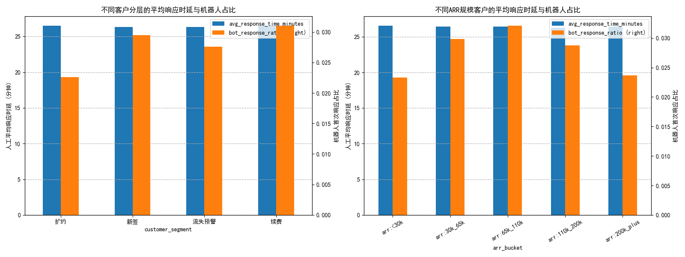

# 基于Intercom对话数据的客户服务策略分析报告

本报告旨在分析过去六个月内不同客户群体的会话行为，识别当前服务策略中的关键问题，并为提升高价值客户的长期活跃度提供切实可行的运营策略。

**核心结论:** 当前的客户服务水平（包括人工响应时延和机器人使用率）高度均质化，未能根据客户的价值（年合同额 ARR）或其所处的生命周期阶段（新签、续费、流失预警）提供差异化的服务。这可能导致高价值客户和处于关键节点的客户（如流失预警客户）的服务体验未达预期，存在客户流失风险。

---

## 1. 关键指标分析

我们主要考察了两个核心指标：**人工平均响应时延**（从客户发起会话到人工客服首次回复的平均时间）和**机器人首次响应占比**（由机器人完成首次应答的会话比例）。

### 关键发现

*图1: 不同客户分层及ARR规模下的平均响应时延与机器人占比*

从上图和数据分析中，我们观察到：

1.  **响应时延无差异化**：
    *   无论是“新签”、“续费”还是“流失预警”客户，其人工平均首次响应时延均在 **26.3 至 26.5 分钟**之间，几乎没有差别。
    *   同样，从低价值（ARR < 30k）到高价值（ARR > 200k）的客户，得到的响应服务也完全一致，平均响应时间稳定在 **26.4 分钟** 左右。

2.  **机器人应用潜力巨大**：
    *   所有客户群体中，机器人首次响应的占比均低于 **3.5%**，这是一个非常低的水平。这表明我们极度依赖人工坐席进行首次接触，导致整体响应效率不高。接近半小时的等待时间，对于任何类型的客户而言，都可能影响其服务体验。

---

## 2. 存在的问题与风险

1.  **高价值客户未被优先对待**：对于贡献了大部分收入的高价值客户，提供与普通客户相同的标准服务，无法体现其重要性，长期以往可能导致其满意度下降，增加转向竞争对手的风险。

2.  **“流失预警”客户未获紧急响应**：对于已经被标记为“流失预警”的客户，每一次服务接触都是挽回的良机。缓慢的响应会加剧他们的负面情绪，使挽留工作事倍功半。

3.  **运营效率低下**：过度依赖人工处理所有会话，不仅成本高昂，而且效率低下。许多常见、重复性的问题完全可以由机器人即时解答，从而将宝贵的人力资源投入到更复杂、更关键的客户问题上。

---

## 3. 切实可行的策略建议

基于以上分析，为了提升客户满意度、降低流失率并提高运营效率，我们建议实施差异化的服务策略，并大力推广机器人应用。

### 策略一：实施差异化的服务SLA（服务水平协议）

针对不同客户群体，设立不同的响应时间目标，将有限的优质资源向高价值客户倾斜。

| 客户群体 | 建议人工首次响应SLA | 落地措施 |
| :--- | :--- | :--- |
| **高价值客户 (ARR > 110k)** | **< 15 分钟** | 在客服系统中设置高优先级队列，或为其分配专属支持团队。 |
| **流失预警客户** | **< 15 分钟** | 触发预警后，其所有进线会话自动标记为“紧急”，并由高级支持或客户成功经理跟进。 |
| **新签客户 (Onboarding期)** | **< 20 分钟** | 确保新客户在上手阶段能获得及时帮助，建立良好的第一印象，提升产品激活率。 |
| **普通客户** | **维持或优化现有水平** | 通过后续策略（如机器人）的实施，逐步降低整体响应时间。 |

### 策略二：扩大并优化机器人应用

将机器人定位为服务的第一触点和效率提升的加速器，而不是简单的替代品。

1.  **提升机器人覆盖率**：设定目标，将机器人首次响应的比例从目前的 **~3%** 逐步提升到 **20%** 以上。通过配置机器人处理“如何使用XX功能？”、“账单问题”等常见咨询，提供7x24的即时响应。
2.  **设计智能升级路径**：机器人的目标是“提效”，而非“阻挡”。应设计无缝转人工的机制。特别是对于高价值客户，机器人若无法解答，应能一键转接至对应级别的专属人工客服，避免客户重复描述问题。
3.  **主动服务机器人**：除了被动回答问题，可以利用机器人在特定场景下进行主动服务。例如，当检测到新签客户在某个设置页面停留过久时，主动弹出对话框询问是否需要帮助，变被动为主动。

---
**数据限制说明**：
本次分析由于缺少客户产品内部的“功能使用事件”数据，未能计算“会话到功能使用的转化率”及“周/月留存率”，因此无法直接将会话行为与产品活跃度进行关联。建议在后续的数据收集中加入相关埋点数据，以便进行更深度的归因分析。
