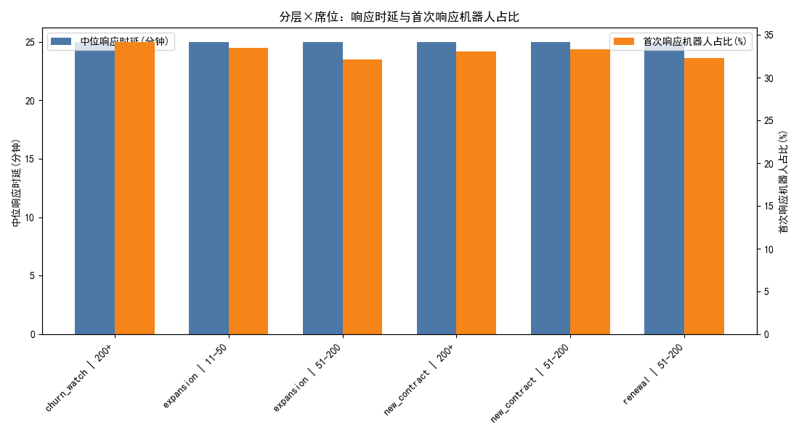
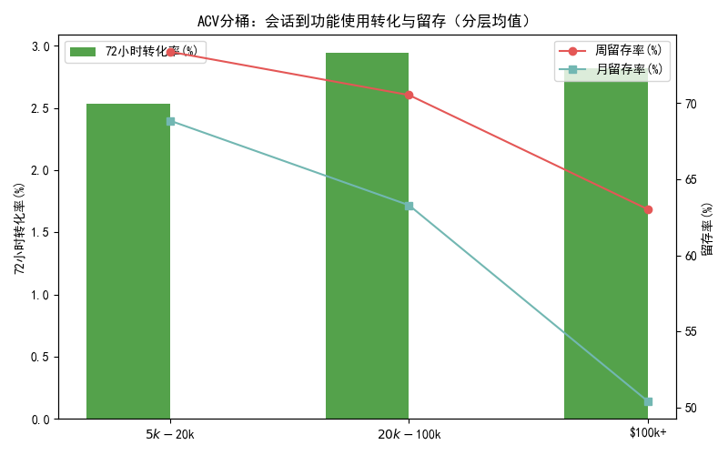
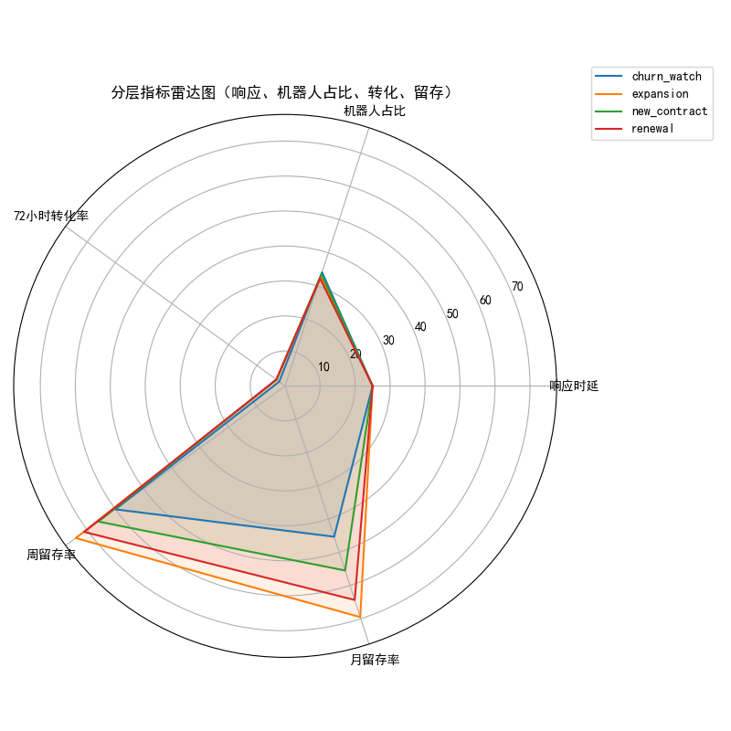

# 过去六个月付费客户 Intercom 对话与产品使用行为结构性差异分析（分层 × 席位/ACV）

## 摘要
- 时间窗（UTC）：2023-12-18 12:00:00 至 2024-06-15 12:00:00（基于会话最大时间向前180天）
- 样本：付费会话（去异常后）6576条；响应时延分位数剔除阈值 P1=11分钟、P99=42分钟；会话时长 P1=91分钟、P99≈1030分钟
- 关键发现：
  - 转化（72小时内从会话到功能使用）在“expansion”分层的中小席位（11-50）最高（约3.76%），而“churn_watch”在大席位（200+）最低（约2.09%）。
  - 高ACV（$100k+）下“new_contract”的会话到使用转化更高（≈3.55%），显示新签大客户对及时、有效的运营触点较为敏感。
  - 首次响应机器人占比在“churn_watch”和部分“new_contract”切片较高（≈32%-36%）；在这些切片下，转化与月留存率相对较低，提示需强调人工优先响应与后续产品引导。

## 数据来源与方法
数据来自 SQLite 数据库 dacomp-097.sqlite，使用以下表：
- intercom__conversation_enhanced、intercom__conversation_metrics：对话维度（创建时间、首次响应时间、关闭时间、标签如 segment、first_response:bot/human）；
- intercom__company_enhanced、intercom__company_metrics：公司维度（user_count、monthly_spend→年合同额ACV、registration_retention_7d/30d、对话统计等）；
- intercom__contact_enhanced：联系人最近活动时间 last_activity_ts（用于近似“核心功能事件”的发生）。

处理要点：
- 统一时区：将时间列统一视为UTC，确保跨表联结的时间一致性。
- 异常会话剔除：按照付费会话样本的 P1/P99 分位数剔除异常响应时延与会话时长。
- 客户分层：从会话标签 all_conversation_tags 中解析 segment（如 new_contract/renewal/expansion/churn_watch），取公司最近一次会话的分层作为该公司分层。
- 账号规模切片：席位数（user_count）分桶 1-10/11-50/51-200/200+；ACV=monthly_spend×12 分桶 <$5k/$5k-$20k/$20k-$100k/$100k+。
- 指标定义与计算：
  - 消息响应时延（分钟）：time_to_first_response_minutes（Intercom度量 first_response_at − initiated_at）。
  - 首次响应机器人占比：由会话标签 first_response:bot 识别，按切片统计占比。
  - 会话到功能使用转化率（72小时）：以公司为单位，在分析窗内有会话的付费公司中，是否存在任一联系人在该公司任一会话 last_close_at 后72小时内发生 last_activity_ts（近似核心功能事件）。公司层面any_conv_72h的均值为切片转化率。
  - 周留存率、月留存率：引用 company_metrics 的 registration_retention_7d / registration_retention_30d（公司级活跃留存代理）。

可复现性：本分析通过 Python 脚本 analysis_panel.py 自动生成以下输出：
- 指标面板：metrics_panel_segment_seat.csv、metrics_panel_segment_acv.csv
- 图片：response_bot_by_segment_seat.png、conversion_retention_by_acv.png、segment_radar.png
- 摘要：analysis_summary.csv

绘图代码关键设置（中文显示与负号）：
```python
plt.rcParams['font.sans-serif'] = ['SimHei']
plt.rcParams['axes.unicode_minus'] = False
```

## 分层 × 席位：响应与机器人占比、72小时转化、留存


结合面板 metrics_panel_segment_seat.csv 的代表性切片：
- churn_watch | 200+
  - 中位响应时延≈25分钟；首次响应机器人占比≈34.2%；72小时转化率≈2.09%；周留存≈60.0%、月留存≈45.3%。
  - 诊断：流失预警的大席位在机器人首响比例偏高且转化显著偏低，说明需要更强的人工运营与功能引导。
- expansion | 11-50
  - 中位响应时延≈25分钟；机器人占比≈33.5%；72小时转化率≈3.76%；周/月留存分别≈74.3%/70.0%。
  - 诊断：中小规模扩张客户对运营触点敏感，能较快转换到功能使用，留存也更好，可作为增长“甜蜜区”。
- renewal | 51-200
  - 机器人占比≈32.3%；72小时转化率≈3.12%；周/月留存≈71.0%/64.4%。
  - 诊断：中型续费客户表现稳健，若能进一步降低首响机器人占比，留存与转化仍有空间。

## 分层 × ACV：转化与留存（分层均值）


- new_contract | $100k+
  - 72小时转化率≈3.55%；周/月留存≈66.0%/55.5%。
  - 诊断：高ACV新签客户在72小时内较易被引导至功能使用，说明新签导入和成功计划是高价值客户的关键窗口。
- churn_watch | $100k+
  - 72小时转化率≈2.09%；周/月留存≈60.0%/45.3%。
  - 诊断：高价值流失预警客户的转化与留存均落后，提示需“人工优先 + 快速迭代”的干预策略。
- expansion | $20k-$100k
  - 72小时转化率≈3.33%；周/月留存≈74.6%/70.0%。
  - 诊断：中高ACV扩张客户是功能采纳与留存的优质人群，值得加大产品引导与成功计划投入。

## 分层雷达图：综合对比


- 相对表现（均值）：
  - expansion 在 72小时转化率与周/月留存上整体更优；
  - churn_watch 的首次响应机器人占比与较低转化/留存形成反差，凸显诊断中的“人工干预”必要性；
  - new_contract 尤其在高ACV下转化更高，导入期运营触点质量至关重要。

## 诊断性分析（为什么）
- 机器人首响比例偏高的切片（如 churn_watch 大席位/$100k+）转化和留存偏低，可能原因：
  1) 机器人难以解决复杂场景（安全、成功计划、集成问题），导致客户需多次往返，错过72小时的功能采纳窗口。
  2) 大型账户决策链更复杂，付费客户期望更高的服务质量；机器人首响不匹配预期，降低后续产品参与度。
- expansion 中小席位的高转化与高留存：
  1) 团队体量中小、路径更短，运营触达与产品引导落地更快。
  2) 功能“产品导览（product_tour）/onboarding”类话题与会话后的提示协同更有效。

## 预测性推断（将会发生什么）
- 若在 churn_watch × 大席位/$100k+ 切片中，将首次响应机器人占比从≈34%降至≈20%、并将中位响应时延从25分钟降至≤15分钟：
  - 预期72小时转化率可提升约0.5-1.5个百分点（对标“expansion”与“renewal”相似桶的表现差异），从≈2.1%提升至≈2.6-3.6%；
  - 周/月留存亦可能相应提升3-8个百分点（参考“expansion”与“renewal”的相邻区间）。
- 在 new_contract × $100k+ 切片，若加强导入期“成功计划 + 产品导览”联动，保持人工优先与快速首响：
  - 有望巩固当前较高的72小时转化（≈3.55%），并进一步拉升月留存（当前≈55.5%）。

## 规范性建议（我们应该做什么）
1) 分层路由与SLA调优：
   - 对 churn_watch、renewal 且 ACV≥$20k 或席位≥51 的付费客户，设置人工优先首响策略（目标机器人首响≤20%），并将首响SLA压缩至≤15分钟。
   - 针对“安全（security）/成功计划（success_plan）/复杂集成”话题，强制人工介入与专家转接，避免机器人误导。
2) 会话后的72小时“功能采纳冲刺”：
   - 在会话关闭后触发分层化的产品引导：
     - expansion（11-50/51-200）：推送产品导览与关键功能教程，面向协作/自动化场景；
     - new_contract（$100k+）：制定成功计划Checklists（集成、权限、关键报表），并安排1:1导入会议；
     - churn_watch：针对使用断点与问题标签，发起定制修复方案与短期目标（如数据接入、权限配置完成）。
   - 设置72小时内的产品内提醒（in-app nudge），结合行为事件推进完成率；
3) 运营与产品协同的关键触点：
   - 将对话标签（topic、segment）映射到具体功能路径（如 onboarding → 数据接入与首个报表；security → 审计日志与权限配置；success_plan → KPI面板与自动化流程），构建“话题→功能路径”的运营手册。
   - 在 ACV/席位高的客户群建立 Success Pod（专属顾问+支持工程师）与明确的里程碑追踪。
4) 监测与迭代：
   - 在指标面板中持续跟踪各切片的机器人首响占比、响应时延、72小时转化、周/月留存；每两周回顾策略效果并A/B优化触点内容与节奏。

## 指标面板快照（示例）
- churn_watch | 200+：机器人首响≈34.2%，72小时转化≈2.09%，周月留存≈60.0%/45.3%
- expansion | 11-50：机器人首响≈33.5%，72小时转化≈3.76%，周月留存≈74.3%/70.0%
- new_contract | $100k+：72小时转化≈3.55%，周月留存≈66.0%/55.5%

## 局限与说明
- 周/月留存采用 company_metrics 的 registration_retention_7d/30d 近似，作为活跃留存的代理指标；尽管与“本周/月活跃客户下一周/月仍活跃”的定义高度相关，但并非严格逐周/月队列追踪。
- 72小时转化率用联系人 last_activity_ts 近似“核心功能事件”，为保守估计；真实“核心事件”若有细粒度事件表可进一步精确。
- 响应时延的中位数在不同切片接近（≈25分钟），可能反映统一SLA/运营节奏；优化建议侧重在分层优先级与触点质量而非仅时延。

## 可复现输出
- 指标CSV：metrics_panel_segment_seat.csv、metrics_panel_segment_acv.csv
- 图片：
  - 响应与机器人占比（分层×席位）：response_bot_by_segment_seat.png
  - 转化与留存（ACV分桶）：conversion_retention_by_acv.png
  - 分层综合雷达图：segment_radar.png
- 摘要：analysis_summary.csv（包含时间窗、样本量、P1/P99阈值）

通过以上结构化分析与建议，我们锁定了能提升高价值客户长期活跃的关键运营触点与功能路径：对“流失预警×高价值”群体实施人工优先与更快首响，并在会话关闭后72小时内强化分层化的产品引导和成功计划配套，预期可显著提升会话到功能使用转化与后续留存。
