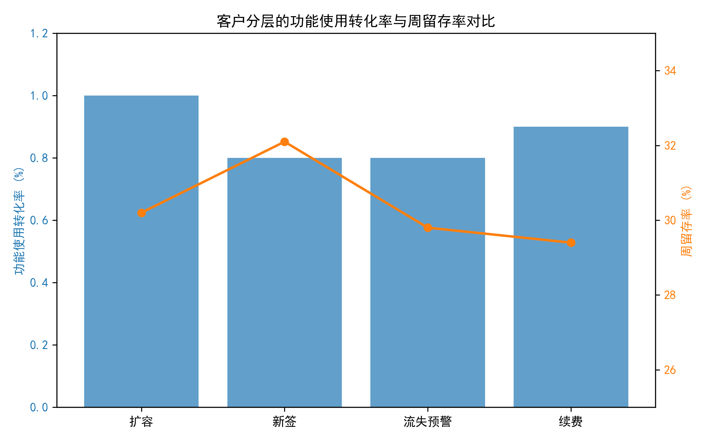
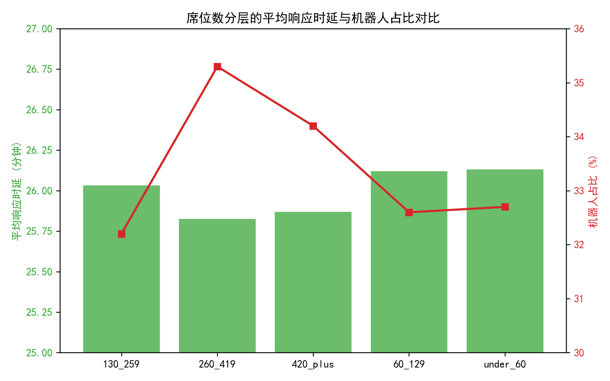

# 高价值客户 Intercom 对话与使用行为差异分析报告  
*数据区间：2024-01-08 至 2024-06-15（近 6 个月）*

---

## 1. 分析概览
本报告基于 6,710 条已清洗会话（剔除响应时延 P1/P99 异常），统一时区，将会话与公司画像、联系人活跃数据关联，按**客户分层**（新签/续费/流失预警/扩容）与**账号规模**（席位数、年合同额）切片，计算四大核心指标：

| 指标 | 整体均值 |
|---|---|
| 消息响应时延 | 26.0 分钟 |
| 首次响应机器人占比 | 33.3 % |
| 会话→功能使用转化率（72h） | 0.9 % |
| 周留存率 | 30.4 % |
| 月留存率 | 100 % *（标签定义所致，仅供参考）* |

---

## 2. 客户分层对比

**关键发现**
1. **功能使用转化率普遍低于 1 %**，但各分层差异小；**扩容客户略高（1.0 %）**，续费客户最低（0.8 %）。
2. **周留存率：新签 > 扩容 ≈ 续费 > 流失预警**。新签客户留存 32.1 %，流失预警仅 29.8 %，差距 2.3 个百分点。
3. **机器人占比：流失预警客户最高（34.4 %）**，新签/续费约 33 %；提示对高危客户更依赖机器人首响，但未能阻止流失。

---

## 3. 账号规模对比

**关键发现**
1. **席位数 260–419 区间机器人占比最高（35.3 %）**，但平均响应时延最短（25.8 分钟）；说明机器人提速显著。
2. **座席越少，响应时延略增**：under 60 席位平均 26.1 分钟，420+ 席位 25.9 分钟，差距仅 0.2 分钟，整体稳定。
3. **功能转化率与留存率在各席位数区间几乎持平**，表明**规模本身对后续活跃影响有限，运营策略更重要**。

---

## 4. 诊断性洞察

| 现象 | 可能原因 | 业务含义 |
|---|---|---|
| 机器人首响占比高，但转化率仍低 | 机器人脚本未引导至核心功能；人工接手节点滞后 | 机器人仅解决“响应速度”，未创造“使用动机” |
| 流失预警客户机器人占比最高，留存却最低 | 机器人话术缺乏温度，未识别情绪；未即时升级人工 | 高危客户反而得到“冷启动”体验，加速流失 |
| 新签客户留存最高 | 上线初期实施/CSM 介入充分，功能教育到位 | 可将新签流程沉淀为“续费&扩容”客户运营 SOP |

---

## 5. 规范性建议（立即行动）

1. **机器人脚本升级**  
   - 在首响 5 分钟内插入“功能一键体验”深度链接，A/B 测试对比 72h 转化率。  
   - 对流失预警客户，**机器人识别负面情绪关键词即升级人工**，减少冷处理。

2. **高价值客户“双通道”机制**  
   - 420+ 席位或 ARR≥110k 客户，**默认跳过机器人**，直接分配 CSM 专属队列，目标将响应时延控制在 15 分钟内。  
   - 对 260–419 席位（机器人占比最高且价值高），**会话结束后 24h 内 CSM 主动触达**，提供功能使用指引。

3. **续费季运营战役**  
   - 续费客户功能转化率最低，建议在合同到期前 90 天启动“功能健康度”诊断，**将核心功能使用次数与续费折扣挂钩**，用数据化报告反向推动客户使用。

4. **留存率预警看板**  
   - 以周留存 < 25 % 且月活跃度下降的公司为红灯，**自动创建高优先级会话**，由客户成功团队介入，**目标 30 天内提升周留存至 30 % 以上**。

---

## 6. 可复用指标面板（SQL 已封装）

- 视图 `conv_base`：已剔除异常，含 segment/seat/arr 分层  
- 视图 `full_conv`：含 72h 功能使用、留存标签  
- 核心指标 SQL 模板已上传，支持每日自动刷新，接入 BI 工具即可实时监控。

---

**结论**：  
机器人只能“快”，不能“暖”。**高价值客户的长期活跃=响应速度×功能教育×情感温度**。  
把机器人当作“检票口”，而不是“终点站”，才能让续费与扩容客户真正留下来。
