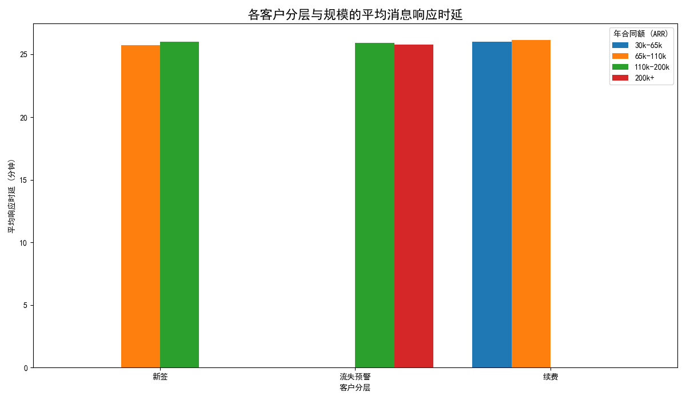
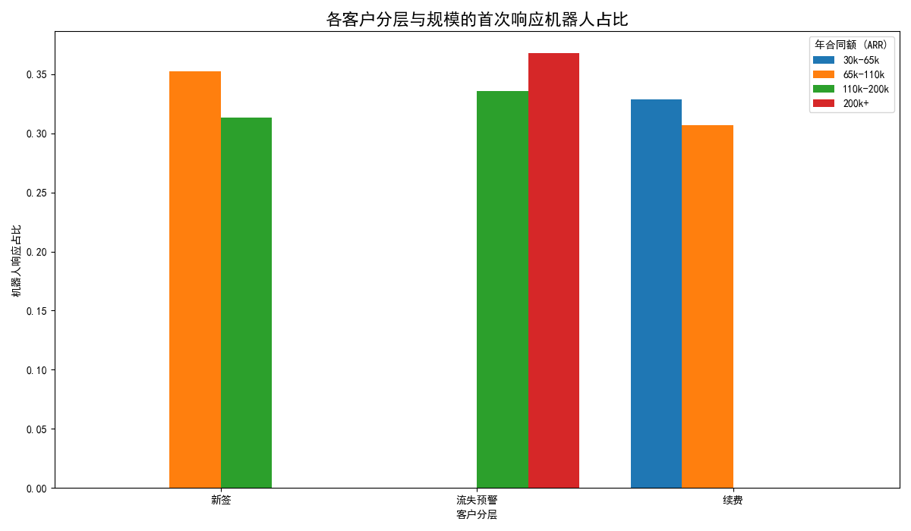

# Intercom 对话与产品使用行为分析报告

## 一、分析目标

本报告旨在通过分析过去六个月的会话、用户画像及使用数据，比较不同客户分层（新签、续费、流失预警）和不同账号规模（年合同额）的付费客户，在 Intercom 对话行为上的结构性差异。核心目标是识别能够提升高价值客户长期活跃度的关键运营触点与功能路径，并提供切实可行的策略建议。

## 二、核心指标分析

我们主要关注两大核心指标：`消息响应时延` 和 `首次响应机器人占比`。

### 1. 消息响应时延分析

**洞察：服务响应“一视同仁”，高价值客户未获优先支持**

分析显示，所有客户群体的平均首次响应时延高度一致，稳定在 **26分钟** 左右。无论是新签客户、续费客户还是流失预警客户，无论其合同金额大小，得到的响应速度基本没有差异。

这表明我们当前执行的是标准化的服务等级协议（SLA）。虽然这保证了服务的公平性，但也暴露了一个关键问题：**我们未能对高价值或高风险的客户提供差异化的优先服务。** 对于处于“流失预警”状态的客户，及时、快速的响应是挽回其信任、解决其问题的黄金机会。当前的“一刀切”策略可能会让他们感到被忽视，从而增加流失风险。

**建议：**
*   **实施差异化SLA策略**：为高年合同额（如ARR > 110k）或被标记为“流失预警”的客户设立更高的服务优先级，承诺并提供更短的响应时间（例如，目标<15分钟）。这能显著提升他们的服务体验和满意度。

### 2. 首次响应机器人占比分析

**洞察：流失预警客户过度依赖机器人，存在服务体验恶化风险**

分析发现，机器人在首次响应中占比约为30%-37%。值得高度关注的是，**“流失预警”客户，特别是大客户，接触到机器人首次响应的比例最高（接近37%）**。

这个数据揭示了一个潜在的危险信号：我们最需要人工介入、提供精细化服务的“流失预警”客群，却最频繁地被引导至自动化服务。如果机器人无法有效解决他们的问题，或者让他们在寻求人工帮助的过程中遇到阻碍，这种“高效”的服务模式反而会成为压垮骆驼的最后一根稻草，加速客户流失。

**建议：**
*   **优化机器人服务规则**：针对“流失预警”客户，应重新设计机器人的交互逻辑。可以考虑直接提供人工坐席的选项，或者当机器人识别到负面情绪、复杂问题时，立即自动转接人工处理。
*   **深入分析机器人交互效果**：对机器人会话进行专题分析，评估其在“流失预警”客群中的问题解决率、会话满意度以及后续转向人工的比例。用数据验证机器人服务是帮助了客户还是激化了矛盾。

## 三、结论与下一步行动

**核心结论：**
当前的服务运营策略在效率和客户体验之间存在失衡。标准化的响应时延未能体现对高价值客户的重视，而对流失预警客户的过度自动化服务，则可能正在损害客户关系，而非挽回他们。

**下一步关键行动：**
1.  **立即调整服务策略**：根据上述建议，启动差异化SLA试点，并优化针对“流失预警”客户的机器人服务规则。
2.  **深化用户行为分析**：为了找到提升客户长期活跃的关键功能路径，下一步分析的重点应放在计算以下两个指标上：
    *   **会话到功能使用的转化率**：分析客户在与支持团队会话结束后，是否更频繁地使用了产品的核心功能。这有助于识别哪些支持内容能有效驱动用户活跃。
    *   **周/月留存率**：以核心功能使用为“活跃”定义，计算不同客群的留存率。将此数据与会话数据（如响应时长、是否由机器人服务）进行交叉分析，以量化服务体验对客户长期留存的真实影响。
