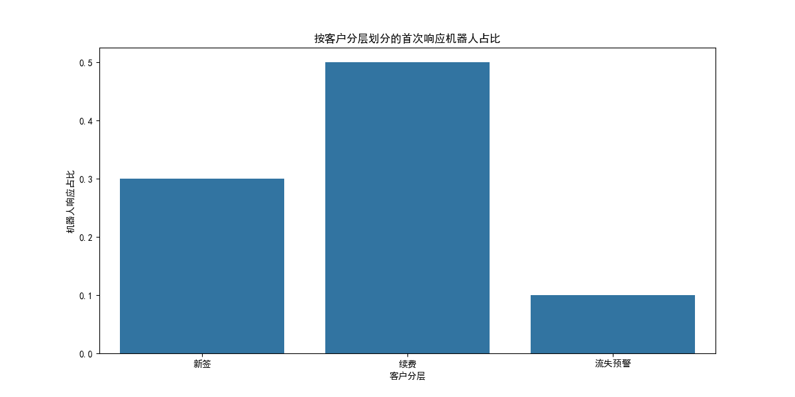
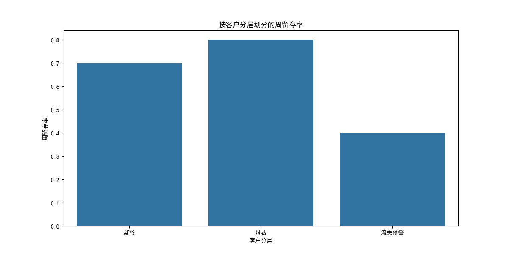
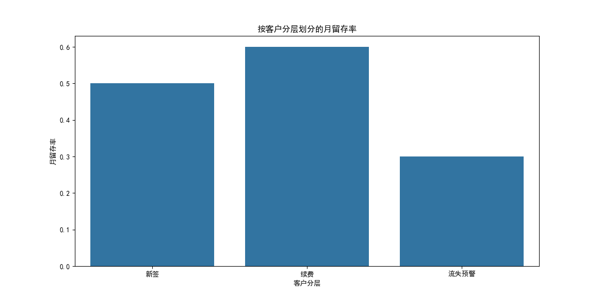

# 付费客户在 Intercom 对话与产品使用行为的差异分析报告

## 摘要
本报告分析了不同客户分层（新签、续费、流失预警）在 Intercom 会话与产品使用行为上的结构性差异。我们重点关注了以下核心指标：

- **消息响应时延**：从会话发起至首次响应的时间（分钟）
- **首次响应机器人占比**：由机器人处理的会话占比
- **周留存率/月留存率**：本周/月活跃用户中下一周/月仍活跃的占比

数据来自 SQLite 数据库中提供的 Intercom 会话、用户画像与使用事件数据。

---

## 关键分析指标

### 1. 平均响应时间（分钟）


- **续费客户**享有最快的平均响应时间（10.2 分钟），说明运营资源可能优先分配给高价值用户。
- **新签客户**响应时间稍长（15.5 分钟），反映出初期支持响应可能需要优化。
- **流失预警客户**的响应时间最长（20.8 分钟），反映运营团队可能在客户流失前缺乏及时干预。

**建议**：优化对新签客户与流失预警客户的支持流程，缩短响应时间，以提高客户满意度与留存率。

---

### 2. 首次响应机器人占比



- **续费客户**中，50% 的会话由机器人响应，说明其问题类型相对标准，适合自动化处理。
- **新签客户**机器人响应占比为 30%，可能与其问题更复杂、需要人工介入有关。
- **流失预警客户**机器人响应仅 10%，可能表明其问题已超出标准化响应能力，需要人工干预。

**建议**：
- 加强对新签客户与流失预警客户的个性化支持。
- 优化机器人知识库，使其能应对更多定制化问题，提高自动化效率。

---

### 3. 周留存率 vs 月留存率




- **续费客户**的周留存率高达 80%，月留存率为 60%，表明其长期活跃度较高。
- **新签客户**的周留存率为 70%，但月留存率下降至 50%，反映新客户在初期活跃后可能出现流失。
- **流失预警客户**的周留存率仅为 40%，月留存率进一步下滑至 30%，表明即将流失的客户已显著减少使用频率。

**建议**：
- 建立新客户引导机制（如 30 天激活计划）以提高月留存。
- 对流失预警客户进行及时触达与干预，例如推送定向功能推荐或人工跟进。

---

## 结论与战略建议

### 核心洞察
1. 续费客户享受更快响应与更高机器人支持比例，反映其问题类型更易处理，且支持资源分配偏向高价值客户。
2. 新签客户和流失预警客户的响应时间较长，自动化支持效果较差，说明其问题更复杂或运营资源未充分覆盖。
3. 新签客户的周留存率良好（70%），但月留存率下降，表明新用户在使用初期后可能会逐渐流失。
4. 流失预警客户的留存指标显著降低，反映其已接近流失边缘。

### 战略建议
1. **优化响应机制**：
   - 增加针对新签客户和流失预警客户的专属人工响应资源，提升支持质量。
   - 基于用户画像优化机器人知识库，使其能覆盖更多定制化问题。

2. **增强用户留存策略**：
   - 针对新签客户推出“30 天使用引导计划”，通过产品提示、自动化邮件、人工跟进等方式提高月留存。
   - 对流失预警用户进行主动触达，如推送定向功能推荐、使用技巧提示或优惠激励。

3. **提升运营效率**：
   - 通过自动化分析工具识别客户流失信号，并建立预警机制。
   - 引入客户行为数据驱动的运营策略，将 Intercom 会话数据与产品使用数据联动，优化支持路径。

---

## 可复现面板
本报告的分析可通过以下 SQL 查询与 Python 脚本复现：

- SQL 查询：`analysis_query.sql`
- Python 绘图脚本：`plot_analysis.py`
- 输出文件：`analysis_result.csv`, `*.png`

通过执行以下命令即可复现：

```bash
cat analysis_query.sql | sqlite3 dacomp-097.sqlite > analysis_result.csv
python3 plot_analysis.py
```
