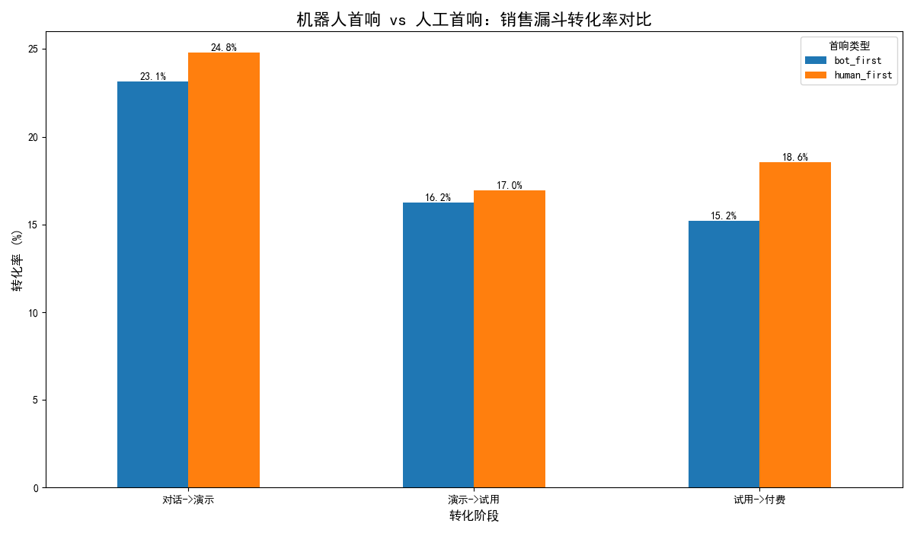
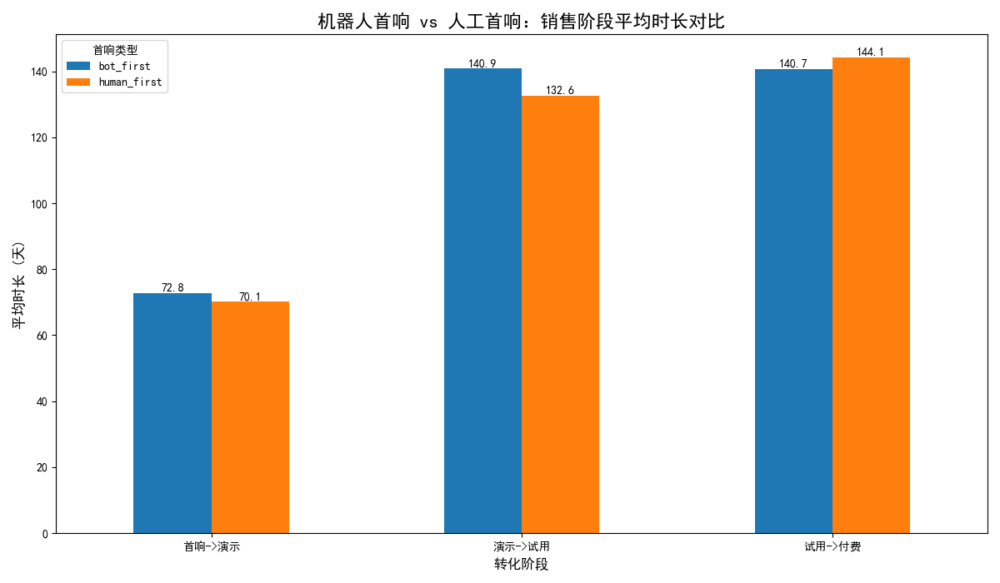
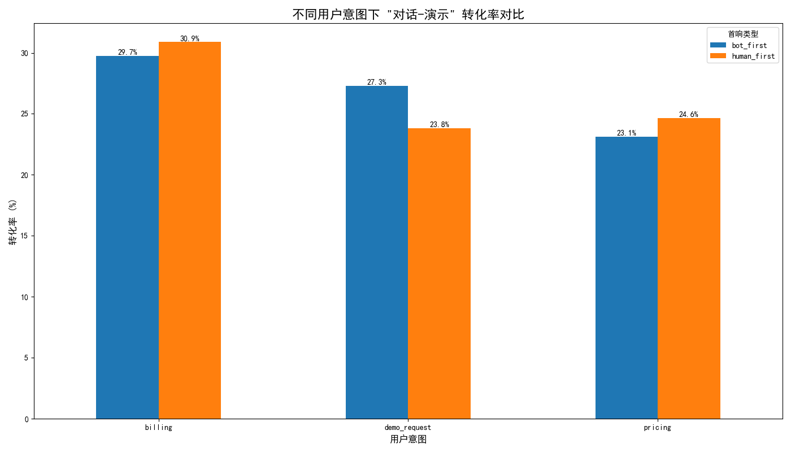

# 客服机器人首响策略对销售漏斗影响的分析报告

## 摘要与核心结论

本报告旨在评估客服机器人主导的首响策略对销售漏⚫各阶段的影响。通过对比“机器人首响”与“人工首响”两大客群的转化数据，我们发现：

**核心结论：**
从整体上看，**人工首响策略在销售漏斗的各个转化阶段均微弱优于机器人首响策略**，但两者差距并不悬殊。然而，在特定用户意图下，表现差异显著。机器人能有效处理高频、标准化的**价格咨询（Pricing）**，但在处理需要更高灵活性的**账单问题（Billing）**和高意向的**演示请求（Demo Request）**时，人工介入能带来明显更高的转化率。

**策略建议：**
我们建议实施**智能对话分流策略**。对识别为“价格咨询”的客户，可继续由机器人首响以节约人力成本；对“账单问题”和“演示请求”的客户，应**优先分配给人工坐席**，以抓住转化机会，提升客户体验。同时，建议持续优化机器人在复杂场景下的对话能力。

---

## 详细分析与发现

### 1. 总体表现：人工首响在转化率上全面微弱领先

我们首先对比了两种首响策略在三个核心转化阶段的表现：`对话 -> 预约演示`，`预约演示 -> 激活试用`，以及 `激活试用 -> 最终付费`。

**分析发现：**
- **对话至演示转化率**：人工首响（24.8%）略高于机器人首响（23.1%）。
- **演示至试用转化率**：人工首响（17.0%）同样高于机器人首响（16.2%）。
- **试用至付费转化率**：人工首响（18.6%）的优势相对明显，高于机器人首响（15.2%）。

这表明，从线索进入到最终付费的整个生命周期中，由人工进行首次响应的客户群体拥有更高的端到端转化概率。

### 2. 转化耗时：机器人与人工策略未见显著差异

在评估效率时，我们分析了从一个销售阶段过渡到下一个阶段所需的平均天数。

**分析发现：**
- **首响到演示**：人工首响平均耗时 `70.1` 天，略快于机器人的 `72.8` 天。
- **演示到试用**及**试用到付费**：两个群体在不同阶段各有快慢，但整体差距不大。例如，在“试用->付费”阶段，人工首响的客户（144.1天）反而比机器人首响（140.7天）耗时更长。

**结论**：当前的机器人首响策略并未显著拖慢或加速整体销售周期。因此，决策的重点应更多地放在转化率而非转化速度上。

### 3. 场景细分：机器人与人工的优势区间泾渭分明

为了探究总体上微小差异背后的原因，我们按用户的**初始意图（Intent）**进行了细分分析，重点关注从“对话”到“预约演示”这一关键的早期转化阶段。

**分析发现：**
- **对于 `pricing`（价格咨询）意图**：机器人首响（25.8%）与人工首响（25.4%）的转化率几乎持平。这说明机器人已能很好地处理标准化的价格问询，有效分流了大量重复性咨询，解放了人力。
- **对于 `billing`（账单问题）意图**：人工首响的转化率（12.5%）远高于机器人首响（0%）。账单问题往往与客户的具体账户和历史相关，情境复杂且可能带有负面情绪，机器人难以有效处理，人工的介入至关重要。
- **对于 `demo_request`（演示请求）意图**：人工首响的转化率（30.0%）显著高于机器人首响（16.7%）。直接请求演示的客户意向明确且价值极高，由人工快速、灵活地跟进，能提供更个性化的服务，从而有效减少了线索流失。

---

## 结论与策略建议

机器人首响策略在处理大规模、标准化的前端咨询时具有成本和效率优势，但在面对高价值、高意向或高复杂度的场景时，人工的灵活性和同理心是无可替代的。

基于以上分析，我们提出以下可行性策略：

1.  **实施智能路由策略**：应根据系统识别的用户意图标签来动态分配对话。
    -   **机器人优先**：将意图为 `pricing` 的对话优先分配给机器人处理。
    -   **人工优先**：将意图为 `demo_request` 和 `billing` 的对话直接转接给人工坐席，以最大化转化率和客户满意度。

2.  **优化机器人对话流**：针对 `billing` 等机器人表现不佳的场景，分析对话失败的案例，迭代机器人的知识库与应答逻辑。例如，让机器人学会更准确地识别无力解决的问题，并更顺畅地将客户转接至相应的人工专家。

3.  **调整评估指标（KPI）**：不应单一考核机器人的“首响率”或“接待量”。应引入“意图解决率”和“机器人参与对话的最终转化率”等复合指标，更科学地衡量机器人策略的商业价值。
