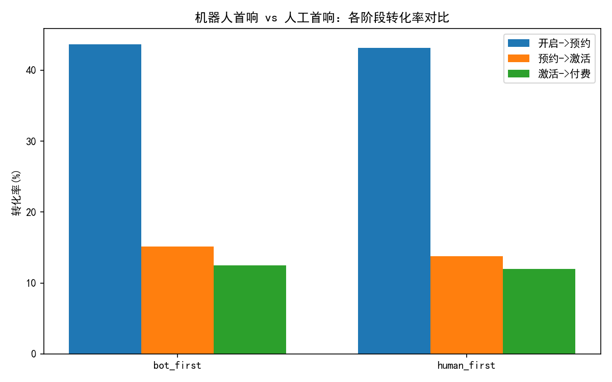
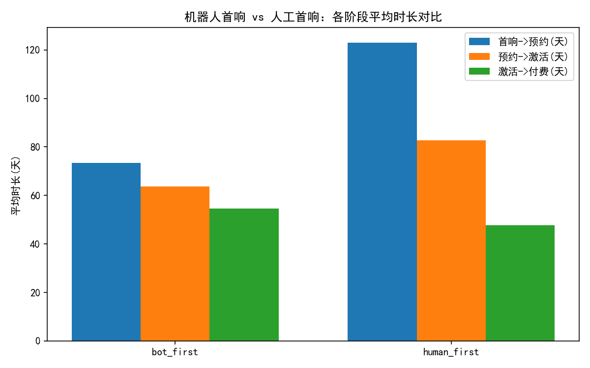
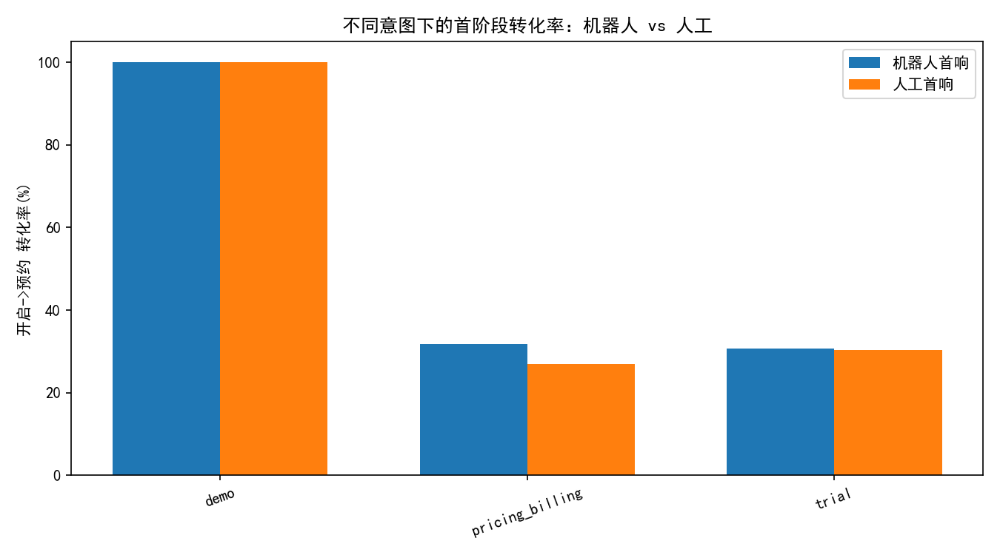
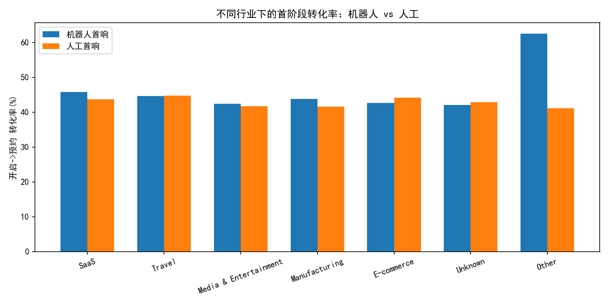

# 评估客服机器人首响策略对销售漏斗的影响（基于 Intercom mart 数据）

## 摘要结论
- 漏斗转化率整体上，机器人首响略优于人工首响：
  - 开启对话→预约演示（S1）：机器人 43.68%，人工 43.17%
  - 预约演示→试用激活（S2）：机器人 15.14%，人工 13.77%
  - 试用激活→付费（S3）：机器人 12.51%，人工 11.95%
- 阶段时长方面，机器人在前两个阶段显著更快，但在试用激活→付费阶段更慢：
  - 首响→预约（D1）：机器人 73.34 天，人工 123.07 天
  - 预约→激活（D2）：机器人 63.69 天，人工 82.72 天
  - 激活→付费（D3）：机器人 54.54 天，人工 47.62 天
- 按意图与行业细分可见差异：
  - 定价/账单（pricing_billing）意图下，机器人在首阶段转化率上更优（31.70% vs 26.97%）。
  - 试用（trial）意图下，两者接近，机器人略胜（30.58% vs 30.36%）。
  - 行业层面：SaaS、Manufacturing 中机器人更优；Travel、E-commerce 中人工更优或相近。
- 战略建议：机器人适合在“预约演示/试用/价格咨询”等标准化意图场景中做首响与分流；在“试用激活→付费”阶段以及“Travel、E-commerce”等需要更细腻咨询与谈判的场景，建议更早介入人工。

## 数据与方法
- 数据来源：
  - 对话：intercom__conversation_enhanced（含 conversation_initiated_type、subject、tags 等）
  - 对话指标：intercom__conversation_metrics（含 first_admin_response_at、contact 关联等）
  - 潜客与公司：intercom__contact_enhanced、intercom__company_enhanced（用于行业与标签）
- 关键口径与定义：
  - 首响类型：conversation_initiated_type ∈ {bot_first, human_first}
  - 转化阶段：
    - S1：开启对话→预约演示（通过对话 subject/tags 中 “demo” 关键词识别）
    - S2：预约演示→试用激活（通过 “trial” 关键词识别）
    - S3：试用激活→付费（通过 “billing” 关键词作为付费代理事件）
  - 阶段时长（天）：
    - D1：从首响到预约（机器人首响用 initiated_at 作为首响时间；人工首响用 first_admin_response_at）
    - D2：预约到激活；D3：激活到付费
- 内容特征代理：
  - 虽未直接提供 conversation_template_id、intent_label，本分析以首个对话的 subject/tags 关键词对意图进行归类（demo、trial、pricing_billing、technical_support 等）。

## 结果概览（整体）
- 总体漏斗转化率与时长对比（机器人 vs 人工）
  - 请参见图片：funnel_conversion.png
  - 请参见图片：stage_duration.png





- 关键数值（样本量：机器人 n=851，人工 n=1856）
  - S1 转化率：机器人 43.68%，人工 43.17%
  - S2 转化率：机器人 15.14%，人工 13.78%
  - S3 转化率：机器人 12.51%，人工 11.95%
  - D1 平均时长：机器人 73.34 天，人工 123.07 天
  - D2 平均时长：机器人 63.69 天，人工 82.72 天
  - D3 平均时长：机器人 54.54 天，人工 47.62 天

解读：
- 机器人在前两阶段既“更快”又“略更高转化”，体现出自动化在预约与试用推进上的效率和一致性（如快速发送日程链接、引导试用开通路径）。
- 在最终付费阶段，机器人更慢，可能因价格谈判、方案定制、采购流程合规等需要人工沟通与信任建立，导致自动化流程推进受限。

## 按意图拆分的首阶段（开启→预约）对比
- 请参见图片：intent_conversion.png



- 主要洞察：
  - demo 意图：两者均为 100%（首个对话直奔预约，模板效率高）
  - pricing_billing 意图：机器人更优（31.70% vs 26.97%），说明标准化的价格/账单答复与预约导流有效
  - trial 意图：机器人略优（30.58% vs 30.36%），自动化指引试用开通路径有效

诊断解释：
- pricing_billing 与 trial 属于FAQ型/流程型意图，机器人可以快速提供结构化解答与行动指引（如预约链接、试用开通说明），提高首阶段转化。
- demo 意图天然高，可能由“请求演示”的入口或模板触发所致，该类模板对机器人与人工均适用。

## 不同行业的首阶段（开启→预约）对比
- 请参见图片：industry_conversion.png



- 主要洞察（示例）：
  - SaaS：机器人 45.79% vs 人工 43.73%（机器人更优）
  - Manufacturing：机器人 43.79% vs 人工 41.57%（机器人更优）
  - E-commerce：机器人 42.61% vs 人工 44.17%（人工更优）
  - Travel：机器人 44.59% vs 人工 44.81%（相近，人工略优）
  - Unknown：人工更优（42.94% vs 42.07%）
  - Other：机器人显著更优（62.50% vs 41.18%，但需谨慎，可能样本较少）

诊断解释：
- SaaS、Manufacturing 的需求较标准化、技术接受度高，机器人首响带来更快的预约引导与流程推进。
- E-commerce、Travel 更强调个性化咨询与方案匹配，用户更偏好倾听与定制回答，人类销售/客服在建立信任方面更具优势。

## 预测性与规范性建议
- 预测性推断：
  - 若保持机器人首响策略，预计整体预约与试用激活转化率将继续小幅领先人工首响，但在试用到付费的推进速度可能落后，影响最终营收节奏。
- 规范性策略：
  1) 分意图分行业动态分流
     - demo、trial、pricing_billing 意图：采用机器人首响与模板化分流；在定价/账单问题上配置清晰的FAQ与预约 CTA。
     - Travel、E-commerce 行业或涉及定制方案与复杂合规：在首响后设置更快的人为介入阈值（如用户表达“比较/谈判/采购流程”关键词时自动转人工）。
  2) 试用激活→付费阶段提前人工介入
     - 监控 D3 时长与停滞信号（漫游、重复询问价格），触发人工跟进（报价、折扣策略、采购流程辅助）。
  3) 模板与机器人意图识别优化
     - 针对 pricing_billing 与 trial 提升意图识别精准度与话术（清晰行动指引、预约链接、成功案例），缩短 D1/D2。
     - 针对信任与谈判场景加入“立即转人工”软文案与显著入口。
  4) 运营节奏与考核
     - 设定 SLA：机器人首响后 X 小时内若用户未确认预约/激活，自动派单至人工；试用期第 Y 天未付费，触发人工回访。
  5) 实验与监控
     - 按行业与意图细分开展 A/B 测试（机器人首响比例、模板文案、转人工阈值），以 S1/S2/S3 转化与 D1/D2/D3 时长为核心指标迭代。

## 局限与注意
- paid_at 使用 “billing” 标签代理，可能低估付费事件或遗漏“invoice/payment”等非显性标签场景；建议后续接入交易系统或 CRM 的真实付费时间。
- 行业“Other/Unknown”可能样本有限，结果需结合样本量与置信区间谨慎解读。
- 本分析不做数据清洗，保留了原始标签与时间戳的偏差与缺失的影响。

## 复现用的绘图代码片段
以下为生成可视化时使用的 matplotlib 字体设置与示例绘图片段（完整脚本见 analyze_funnel.py）：
```python
import matplotlib.pyplot as plt

plt.rcParams['font.sans-serif'] = ['SimHei']
plt.rcParams['axes.unicode_minus'] = False

# 示例：绘制各阶段转化率对比（labels/s1/s2/s3 为预先计算好的序列）
x = np.arange(len(labels))
width = 0.25
fig, ax = plt.subplots(figsize=(8,5))
ax.bar(x - width, s1_rates, width, label="开启->预约")
ax.bar(x,          s2_rates, width, label="预约->激活")
ax.bar(x + width,  s3_rates, width, label="激活->付费")
ax.set_xticks(x); ax.set_xticklabels(labels)
ax.set_ylabel("转化率(%)")
ax.set_title("机器人首响 vs 人工首响：各阶段转化率对比")
ax.legend()
fig.savefig("funnel_conversion.png", dpi=150)
```

## 图片索引
- 漏斗转化率对比：funnel_conversion.png
- 各阶段平均时长对比：stage_duration.png
- 不同意图下的首阶段转化率：intent_conversion.png
- 不同行业下的首阶段转化率：industry_conversion.png

以上分析为基于现有 mart 的证据性结论。结合实际业务目标（预约演示与试用激活的规模、付费节奏与客单价），建议采用“机器人优先 + 人工及时接入”的混合首响策略，并按意图与行业进行精细化运营与实验迭代。
