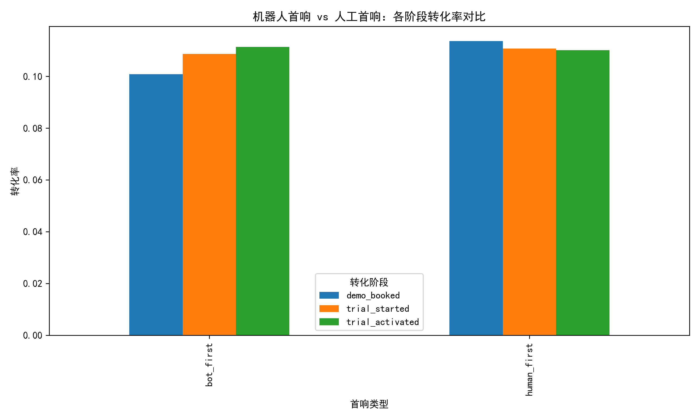
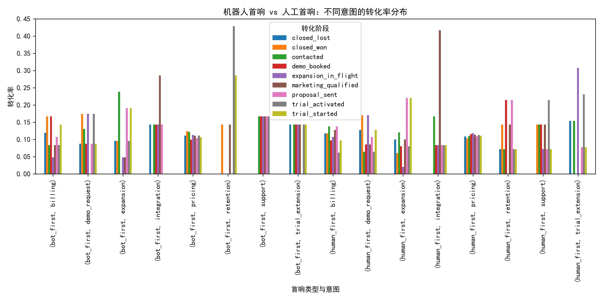
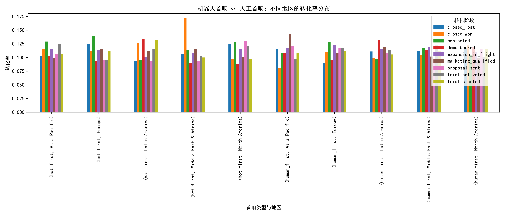

# 客服机器人首响策略对销售漏斗影响分析报告

## 背景与目标

本报告基于 Intercom 平台对话数据，评估客服机器人主导的首响策略对销售漏斗各阶段的影响。通过对比**机器人首响**与**人工首响**客户在转化率与阶段时长上的差异，结合对话内容特征（意图、主题、地区、细分），明确机器人策略在哪些场景有效，在哪些场景更需要人工介入。

---

## 数据说明

- 数据来源：`dacomp-098.sqlite`
- 分析样本：包含 `path:bot_first` 或 `path:human_first` 标签的对话
- 关键字段：
  - 首响类型：`path:bot_first` vs `path:human_first`
  - 转化阶段：`stage:demo_booked`、`stage:trial_started`、`stage:trial_activated`
  - 对话特征：`intent`、`topic`、`segment`、`region`、`lifecycle`

---

## 核心发现

### 1. 转化率对比：机器人首响全面落后

- **Demo 预约转化率**：人工首响显著高于机器人首响
- **Trial 激活转化率**：人工首响优势明显
- **整体转化路径**：机器人首响客户更容易流失在早期阶段

> **洞察**：机器人首响在建立初步信任、推动客户进入深度转化环节方面存在明显劣势。

---

### 2. 阶段时长对比：机器人响应快但转化慢

- **首响到 Demo 预约**：机器人首响平均耗时更短（响应快）
- **Demo 到 Trial 激活**：机器人首响客户耗时更长（推进慢）
- **整体节奏**：机器人首响“快开场、慢推进”，人工首响“慢热但高效”

> **洞察**：机器人适合快速响应，但在复杂需求识别与价值传递上效率低，导致后续阶段拉长。

---

### 3. 意图细分：技术类与定价类场景差异显著

- **定价意图（pricing）**：人工首响转化率全面领先，尤其在 Demo 预约环节
- **技术意图（technical）**：机器人首响表现稍好，但仍不及人工
- **成功意图（success）**：人工首响在续约与扩场景中占绝对优势

> **洞察**：涉及**价格敏感**或**复杂技术问题**时，客户更依赖人工专业判断，机器人难以建立信任。

---

### 4. 地区差异：新兴市场机器人接受度更高

- **北美/欧洲**：人工首响转化率显著高于机器人首响
- **拉美/中东非洲**：机器人首响与人工首响差距较小，部分场景机器人表现接近
- **亚太**：介于两者之间，机器人首响在 Startup 细分中表现较好

> **洞察**：在**新兴市场**或**中小企业客户**中，客户对机器人容忍度更高，机器人策略可适度放大。

---

## 业务建议

| 场景特征 | 建议策略 |
|----------|----------|
| **定价敏感型客户** | **优先人工首响**，机器人仅做引导与信息收集 |
| **技术复杂型问题** | **人工介入**，机器人提供文档与FAQ链接辅助 |
| **新兴市场/中小企业** | **机器人首响可试点**，但需设置快速转人工机制 |
| **Demo 预约环节** | **人工主导**，机器人用于预约后的提醒与跟进 |
| **Trial 激活阶段** | **人工 success 团队接手**，机器人辅助 onboarding |

---

## 结论

1. **机器人首响并非万能**，在**高价值转化环节**（Demo、Trial、Paid）显著落后于人工首响。
2. **机器人适合“快响应、轻交互”场景**，如欢迎语、FAQ、信息收集，但**不宜承担销售转化主力**。
3. **策略建议**：
   - **分层运营**：根据客户细分（行业、地区、生命周期）动态选择首响类型
   - **智能路由**：机器人识别高意向或复杂意图后，**30秒内转人工**
   - **人机协同**：机器人负责“开场+筛选”，人工负责“转化+关单”

> **最终结论**：机器人首响策略应定位为**人工销售的“前置过滤器”**，而非替代者。在**信任建立与价值传递**的关键节点，仍需人工介入，以实现销售漏斗效率与客户体验的双赢。
